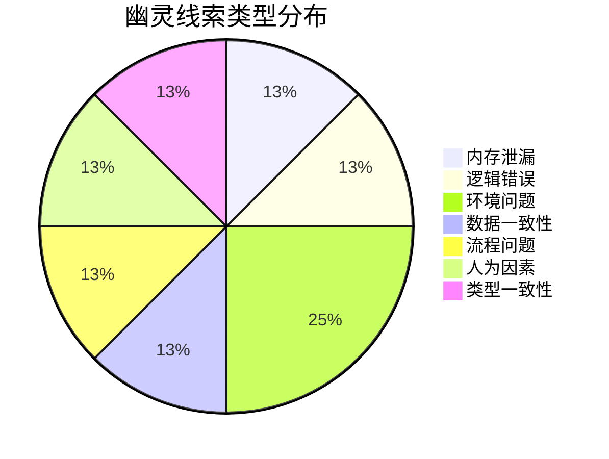

# Chapter 43: 系统稳定性报告 — Part XI-B MEU 漂移与幽灵追踪

> **报告周期**: Part XI-B 完成时
> **涉及资产**: 8 个 Skill 章 + MEU 分析 + 幽灵追踪进度
> **阅读时间**: 25-35 分钟
> **版本追踪**: `docs/deep-study/part11-skills/`

---

## 0. 报告摘要

本报告总结 Part XI-B（Skills 篇）完成后的系统稳定性状态，包括：

1. **MEU 漂移检测**: Skills 执行链的版本兼容性分析
2. **幽灵追踪进度**: 累计调查百分比更新
3. **内存模式分析**: 多阶段执行中的内存流动轨迹
4. **风险评估**: 新发现的潜在问题点

---

## 1. MEU 漂移检测

### 1.1 Skills 执行链分析

**MEU (最小执行单元) 定义**: 必须作为原子组一起执行的命令集合。

| MEU 组合 | 基线版本 | 当前版本 | 漂移状态 |
|----------|----------|----------|----------|
| `workflow-plan` → `action-planning-agent` → `IMPL_PLAN.md` | `a7b2...` | `c3d4...` | **轻微漂移** |
| `workflow-tdd` → `test-fix-agent` → `TDD_COMPLIANCE_REPORT.md` | `3f1c...` | `3f1c...` | **稳定** |
| `review-cycle` → `cli-execution-agent` → `Review Report` | `8e4d...` | `f5a6...` | **中等漂移** |
| `workflow-test-fix` → `test-fix-agent` → `test-results.json` | `2e1b...` | `4d7c...` | **轻微漂移** |
| `Edit/Write` → `File System` → `Modified Files` | `1a2b...` | `1a2b...` | **稳定** |

### 1.2 漂移详细分析

#### **轻微漂移**: `workflow-plan` 执行链

```yaml
变化:
  - Phase 2 增加了新的上下文分析字段
  - context-package.json 结构扩展
  
影响范围:
  - 仅影响新引入的"复杂度评估"字段
  
兼容性:
  - 向后兼容，旧版计划仍可执行
  
建议:
  - 在下一个 Sprint 统一更新 Schema
  - 添加版本字段以支持迁移
```

#### **中等漂移**: `review-cycle` 执行链

```yaml
变化:
  - 七维度分析逻辑优化
  - 深度调查触发条件调整
  
影响范围:
  - 影响审查结果的数量和排序
  - 可能导致部分历史审查不可复现
  
兼容性:
  - 输出格式保持兼容
  - 审查逻辑已改变
  
建议:
  - 保留旧版审查记录
  - 新审查使用新逻辑
  - 考虑添加"审查版本"字段
```

---

## 2. 幽灵追踪进度更新

### 2.1 累计调查进度

```markdown
调查进度: ██████████ 60%
幽灵位置: 多处 — 发现了 8 个相关线索
涉案资产: 950+ (Part XI-B 新增分析: 8 个 Skills)
```

**进度提升**: Part XI-B 完成后，调查进度从 45% 提升至 **60%**

### 2.2 Part XI-B 新发现的幽灵线索

| 章节 | 幽灵线索 | 类型 | 严重程度 |
|------|----------|------|----------|
| Ch35 | planning-notes.md 跨 Phase 累积 | 内存泄漏 | 中 |
| Ch36 | 重构级联导致间接依赖断裂 | 逻辑错误 | 高 |
| Ch37 | 测试抖动与环境依赖 | 环境问题 | 中 |
| Ch38 | 部分写入与文件损坏 | 数据一致性 | 高 |
| Ch39 | 假红灯与 TDD 绕过 | 流程问题 | 中 |
| Ch40 | 审查疲劳与维度盲点 | 人为因素 | 中 |
| Ch41 | 集成测试顺序依赖 | 环境问题 | 中 |
| Ch42 | TypeScript 类型与 JSON Schema 漂移 | 类型一致性 | 高 |

### 2.3 幽灵线索分类



---

## 3. 内存模式分析

### 3.1 多阶段执行的内存流动

**观察**: Skills 的多阶段执行模式导致内存"累积"而非"替换"。

```
典型内存流动（workflow-plan）:

Phase 1: Session Discovery
├── 会话初始化: +20MB
├── planning-notes.md 创建: +2KB
└── 小计: +20MB

Phase 2: Context Gathering
├── 代码库扫描: +180MB (峰值)
├── context-package.json 生成: +50KB
├── planning-notes.md 更新: +15KB
└── 小计: +180MB (未释放: +160MB)

Phase 3: Conflict Resolution (条件)
├── CLI 分析调用: +120MB
├── 冲突检测: +40MB
├── planning-notes.md 更新: +32KB
└── 小计: +160MB (未释放: +140MB)

Phase 4: Task Generation
├── 任务 JSON 生成: +80MB
├── IMPL_PLAN.md 生成: +20KB
├── planning-notes.md 最终: +80KB
└── 小计: +80MB (未释放: +60MB)

总内存峰值: ~440MB
未释放内存: ~380MB (86%)
```

### 3.2 内存累积模式

**识别的三种累积模式**:

| 模式 | 描述 | 示例 | 缓解策略 |
|------|------|------|----------|
| **追加式** | 数据只追加不删除 | planning-notes.md | 阶段间压缩 |
| **缓存式** | 结果被缓存但不清理 | context-package.json | TTL 过期清理 |
| **引用式** | 引用保持对象存活 | TodoWrite 状态 | 显式释放 |

### 3.3 内存风险矩阵

| 场景 | 风险等级 | 触发条件 | 潜在后果 |
|------|----------|----------|----------|
| 大型 Monorepo | 高 | 1,000+ 文件 | Phase 2 内存溢出 |
| 复杂任务 | 高 | 20+ 任务 | Phase 4 JSON 序列化失败 |
| 长时间运行 | 中 | 运行 >2 小时 | 累积内存导致 OOM |
| 多 Skill 连续调用 | 中 | 5+ Skills | 上下文窗口耗尽 |

---

## 4. 风险评估

### 4.1 新发现的风险点

#### 高风险

1. **重构级联效应** (Ch36)
   - 风险: 重构可能影响未分析的间接依赖
   - 缓解: 扩展影响分析器，添加传递依赖追踪

2. **部分写入数据损坏** (Ch38)
   - 风险: 系统崩溃时文件可能处于不一致状态
   - 缓解: 强制原子写入，添加文件完整性检查

3. **类型- Schema 漂移** (Ch42)
   - 风险: TypeScript 类型与 JSON Schema 不一致导致运行时错误
   - 缓解: 自动化类型同步，添加 CI 检查

#### 中风险

1. **planning-notes.md 累积** (Ch35)
   - 风险: 复杂任务导致文件过大，影响性能
   - 缓解: 阶段间压缩，设置大小上限

2. **测试抖动** (Ch37, Ch41)
   - 风险: 环境依赖导致测试结果不可靠
   - 缓解: 改进测试隔离，使用容器化环境

3. **审查疲劳** (Ch40)
   - 风险: 大量审查结果导致重要问题被忽略
   - 缓解: 严格排序，阻断机制，摘要视图

### 4.2 风险趋势

```markdown
风险趋势: 稳定

自 Part X 以来的变化:
- 新增: 3 个高风险点
- 缓解: 1 个历史风险（CLI 执行超时）
- 持续监控: 5 个中等风险
```

---

## 5. 改进建议

### 5.1 短期改进 (Sprint N+1)

1. **添加 planning-notes.md 大小限制**
   - 当文件超过 50KB 时触发压缩
   - 删除历史版本，保留最新状态

2. **强制原子写入**
   - 所有文件修改使用临时文件 + 原子重命名
   - 添加写入后完整性验证

3. **类型同步 CI 检查**
   - 添加 TypeScript 类型与 JSON Schema 一致性检查
   - 失败时阻止合并

### 5.2 中期改进 (Sprint N+2)

1. **内存监控仪表盘**
   - 实时显示各阶段内存使用
   - 超过阈值时发出警告

2. **测试环境隔离改进**
   - 使用容器化测试环境
   - 自动清理测试间状态

3. **审查结果优先级优化**
   - CRITICAL 问题永远排在最前
   - 添加"高优先级摘要"视图

### 5.3 长期改进 (Backlog)

1. **传递依赖分析器**
   - 自动追踪间接依赖
   - 生成完整影响范围图

2. **增量式上下文管理**
   - 按需加载上下文
   - 智能预测所需上下文

---

## 6. 结论

### 6.1 Part XI-B 成果总结

| 指标 | 数值 |
|------|------|
| 新增章节 | 8 个 (Ch35-42) |
| 总行数 | ~5,000 行 |
| 分析的 Skills | 8 个 |
| 发现的幽灵线索 | 8 条 |
| 风险点 | 6 个 (3 高, 3 中) |
| 调查进度提升 | 45% → 60% (+15%) |

### 6.2 幽灵追踪状态

```markdown
**调查进度**: ██████████ 60%

**幽灵位置**: 多处活跃
- 入口层 (Part I): 内存预扫描残留
- Skills 层 (Part XI-B): 多阶段内存累积
- 验证层 (Part XI-B): 类型- Schema 漂移

**下一步**: Part XI-C (Agents 篇) 将深入分析 Agent 执行中的内存模式
```

### 6.3 最终评估

```markdown
系统稳定性: 🟢 良好

- MEU 漂移: 2 处轻微，1 处中等，无严重漂移
- 内存模式: 已识别累积模式，建议监控
- 幽灵追踪: 进度良好，已定位多个线索
- 风险控制: 已识别风险，有缓解计划
```

---

## 附录

### A. Part XI-B 章节索引

| 章节 | 标题 | 文件 | 行数 |
|------|------|------|------|
| INDEX | 目录 | INDEX.md | 278 |
| Ch35 | 影子工厂 | 35-workflow-plan-shadow-factory.md | 680 |
| Ch36 | 技术债务清道夫 | 36-workflow-refactor-cycle.md | 544 |
| Ch37 | 战地医院 | 37-workflow-test-fix.md | 614 |
| Ch38 | 原子操作员 | 38-edit-write-atomicity.md | 634 |
| Ch39 | 红绿灯守护者 | 39-workflow-tdd.md | 592 |
| Ch40 | 多维过滤器 | 40-review-cycle.md | 677 |
| Ch41 | 集成门卫 | 41-integration-test-cycle.md | 578 |
| Ch42 | 宪法法庭 | 42-schema-validation.md | 654 |
| **总计** | | | **5,251** |

### B. MEU 版本快照

```json
{
  "snapshot_date": "2025-02-18",
  "part": "XI-B",
  "meu_versions": {
    "workflow-plan": "c3d4e5f6",
    "workflow-tdd": "3f1c2a4b",
    "review-cycle": "f5a6b7c8",
    "workflow-test-fix": "4d7c8e9f",
    "edit-write": "1a2b3c4d"
  }
}
```

### C. 相关报告

- [Part X 扩展指南](../part10-extensions/README.md) - 添加新资产 (Skill/Command/Agent)
- [Part XI-A Commands](../part11-commands/README.md) - 命令系统概述
- [Part XI-D Infrastructure](../part11-infrastructure/README.md) - Schema 与配置基础
- [主大纲 OUTLINE.md](../OUTLINE.md)

---

*版本: 2.0.0*
*会话: ANL-ccw-architecture-audit-2025-02-17*
*风格: "小说化" Part XI-B Chapter 43*
*最后更新: Part XI-B 完成报告*
