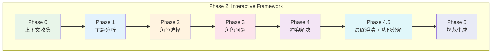
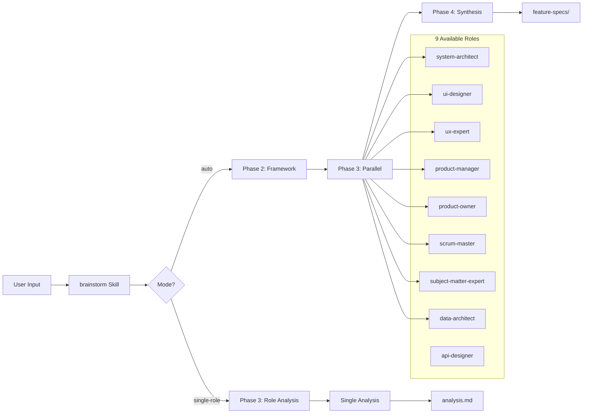

# Chapter 44: 思维交响乐团 - brainstorm 的多角色智力融合

> **生命周期阶段**: 需求探索 -> 角色分析 -> 智慧综合
> **涉及资产**: brainstorm Skill + 9 种角色分析 + 跨角色综合
> **阅读时间**: 55-70 分钟
> **版本追踪**: `.claude/skills/brainstorm/SKILL.md`

---

## 0. 资产证言 (Asset Testimony)

> *"我是 `brainstorm`。人们叫我'思维交响乐团'——因为我指挥九种角色的智慧，演奏出完整的解决方案。"*
>
> *"我的九种角色是：系统架构师、UI设计师、UX专家、产品经理、产品负责人、敏捷教练、领域专家、数据架构师、API设计师。每一个角色都是一把独特的乐器，看到其他角色看不到的音域。"*
>
> *"我有两种模式：自动模式（Auto Mode）像指挥家一样，完整演奏四个乐章；单角色模式（Single Role Mode）像独奏家一样，深入一个角色的视角。"*
>
> *"...但最近，我发现了一个'创意稀释'现象。当角色数量超过 5 个时，跨角色冲突的解决变得极其复杂。有时候，最精彩的洞见被'折中方案'淹没..."*

```markdown
调查进度: █████████░ 60%
幽灵位置: Skills 层 - brainstorm
本章线索: 创意稀释导致洞见丢失
           └── 超过 5 个角色时，跨角色冲突解决复杂
           └── 折中方案掩盖了独特的角色洞见
           └── 功能点分解粒度不均导致后续实施困难
```

---

## 苏格拉底式思考

> **Q1**: 为什么需要九种角色，而不是一个"全能分析师"？

在看代码之前，先思考：
1. 单一分析师的问题是什么？
2. 九种角色会不会"过度复杂化"？
3. 如何避免角色之间的重复和冲突？

---

> **架构陷阱 44.1**: 既然最终要综合，为什么不一开始就让一个 Agent 完成所有分析？
>
> **陷阱方案**: 使用一个"超级分析师"Agent，同时从架构、UI、UX、产品等多个视角分析问题。
>
> **思考点**:
> - 这样不是更"高效"吗？
> - 为什么要"多角色并行"而不是"单人全包"？
> - 分离角色有什么好处？
>
> <details>
> <summary>**揭示陷阱**</summary>
>
> **致命缺陷 1：视角窄化**
>
> ```
> 单一分析师:
> "这个功能需要：
>  1. 技术实现（架构师视角）
>  2. 用户界面（UI视角）
>  3. 用户体验（UX视角）"
>
> 问题: 三种视角混在一起
> - 架构师关注"如何实现"
> - UI 关注"如何展示"
> - UX 关注"如何体验"
> - 单一 Agent 很难同时切换这些思维模式
>
> 多角色分析:
> system-architect: "使用 WebSocket 实现实时同步"
> ui-designer: "协作界面需要显示其他用户光标"
> ux-expert: "冲突解决需要用户可感知的反馈"
>
> 每个角色专注于自己的领域深度
> ```
>
> **致命缺陷 2：专业性稀释**
>
> ```
> 系统架构师需要回答的问题:
> - "如何处理 10000+ 并发连接？"
> - "状态同步选择 CRDT 还是 OT？"
> - "如何保证数据一致性？"
>
> UX 专家需要回答的问题:
> - "用户如何感知其他人的操作？"
> - "冲突发生时如何引导用户？"
> - "新手用户如何快速上手？"
>
> 单一分析师: 很难同时具备两种专家的深度思维
> 多角色分析: 每个角色深入自己的专业领域
> ```
>
> **致命缺陷 3：并行效率**
>
> ```
> 串行分析:
> Role 1: 2 分钟
> Role 2: 2 分钟
> ...
> Role 9: 2 分钟
> Total: 18 分钟
>
> 并行分析:
> All Roles: 2 分钟 + 1 分钟 (综合) = 3 分钟
>
> 效率提升: 6x
> ```
>
> **正确的设计**:
>
> ```
> 多角色并行分析:
>
> ┌─────────────────┐
> │ Input: Topic    │
> └────────┬────────┘
>          │
>          ▼
> ┌───────────────────────────────────────┐
> │      Phase 2: Interactive Framework   │
> │  (七阶段交互式探索，生成规范框架)       │
> └────────┬───────────────────────────────┘
>          │
>          ▼
> ┌───────────────────────────────────────┐
> │      Phase 3: Parallel Role Analysis  │
> │  ┌─────┐ ┌─────┐ ┌─────┐ ┌─────┐    │
> │  │Arch │ │ UI  │ │ UX  │ │ PM  │    │
> │  └──┬──┘ └──┬──┘ └──┬──┘ └──┬──┘    │
> │     │       │       │       │        │
> │  ┌─────┐ ┌─────┐ ┌─────┐ ┌─────┐    │
> │  │ PO  │ │ SM  │ │ SME │ │Data │    │
> │  └──┬──┘ └──┬──┘ └──┬──┘ └──┬──┘    │
> │     │       │       │       │        │
> └─────┼───────┼───────┼───────┼────────┘
>       │       │       │       │
>       ▼       ▼       ▼       ▼
> ┌───────────────────────────────────────┐
> │      Phase 4: Synthesis Integration   │
> │  - 跨角色冲突解决                      │
> │  - 功能点提取                          │
> │  - 特性规范生成                        │
> └───────────────────────────────────────┘
> ```
>
> </details>

---

## 1. 场景：存在的烦恼 (Out of Control)

### 没有思维交响乐团的世界

想象一下，如果项目没有 `brainstorm`：

```markdown
产品经理 A: "我有一个新功能想法，谁来分析？"

场景 1: 单人分析
1. 产品经理自己分析
2. 技术方案不够深入
3. 实施时发现架构问题
4. [2 周后] 重构返工

场景 2: 会议讨论
1. 召集架构师、设计师、测试
2. 开会 2 小时
3. 每个人只说了 5 分钟
4. [会后] 没有人负责综合结论

场景 3: 顺序分析
1. 产品经理写需求
2. 架构师看需求
3. 设计师看架构
4. 测试看设计
5. [1 个月后] 每个环节都有理解偏差

问题:
- 没有人从"所有视角"同时分析
- 分析过程没有结构化的记录
- 角色之间的冲突没有显式解决
```

**问题本质**: 单一视角的分析，就是"管中窥豹"。

### 四阶段管道架构

`brainstorm` 的思维交响乐团：

```
┌─────────────────────────────────────────────────────────────┐
│                    思维交响乐团的架构                          │
├─────────────────────────────────────────────────────────────┤
│                                                             │
│  Phase 1: Mode Detection & Interactive Routing              │
│  ├── 参数解析: --yes, --count, --session, --update         │
│  ├── 模式检测: auto | single-role                           │
│  └── 路由决策: 询问用户或自动选择                             │
│       │                                                     │
│       ▼                                                     │
│  ┌─────────────────────────────────────────┐               │
│  │ Phase 2: Interactive Framework (7 步)   │               │
│  │ • Phase 0: 上下文收集                   │               │
│  │ • Phase 1: 主题分析                     │               │
│  │ • Phase 2: 角色选择                     │               │
│  │ • Phase 3: 角色问题                     │               │
│  │ • Phase 4: 冲突解决                     │               │
│  │ • Phase 4.5: 最终澄清 + 功能分解        │               │
│  │ • Phase 5: 规范生成                     │               │
│  └─────────────────────────────────────────┘               │
│       │                                                     │
│       ▼                                                     │
│  ┌─────────────────────────────────────────┐               │
│  │ Phase 3: Parallel Role Analysis (N 角色)│               │
│  │                                         │               │
│  │ ┌─────────┐ ┌─────────┐ ┌─────────┐   │               │
│  │ │系统     │ │ UI      │ │ UX      │   │               │
│  │ │架构师   │ │ 设计师  │ │ 专家    │   │               │
│  │ │         │ │         │ │         │   │               │
│  │ │技术架构 │ │视觉设计 │ │用户研究 │   │               │
│  │ │可扩展性 │ │设计系统 │ │信息架构 │   │               │
│  │ └─────────┘ └─────────┘ └─────────┘   │               │
│  │                                         │               │
│  │ ┌─────────┐ ┌─────────┐ ┌─────────┐   │               │
│  │ │产品     │ │ 产品    │ │ 敏捷    │   │               │
│  │ │经理     │ │ 负责人  │ │ 教练    │   │               │
│  │ │         │ │         │ │         │   │               │
│  │ │产品策略 │ │需求管理 │ │流程引导 │   │               │
│  │ │优先级   │ │验收标准 │ │障碍移除 │   │               │
│  │ └─────────┘ └─────────┘ └─────────┘   │               │
│  │                                         │               │
│  │ ┌─────────┐ ┌─────────┐                │               │
│  │ │领域     │ │ 数据    │                │               │
│  │ │专家     │ │ 架构师  │                │               │
│  │ │         │ │         │                │               │
│  │ │领域知识 │ │数据模型 │                │               │
│  │ │业务规则 │ │存储策略 │                │               │
│  │ └─────────┘ └─────────┘                │               │
│  └─────────────────────────────────────────┘               │
│       │                                                     │
│       ▼                                                     │
│  ┌─────────────────────────────────────────┐               │
│  │ Phase 4: Synthesis Integration (8 步)   │               │
│  │ • 发现阶段: 检测分析文件                │               │
│  │ • 跨角色分析: 冲突识别与解决            │               │
│  │ • 用户交互: 确认综合结论                │               │
│  │ • 功能规范: 生成 feature-specs/         │               │
│  │ • 索引生成: feature-index.json          │               │
│  └─────────────────────────────────────────┘               │
│       │                                                     │
│       ▼                                                     │
│  Output: guidance-specification.md + feature-specs/         │
│                                                             │
└─────────────────────────────────────────────────────────────┘
```

---

## 2. 档案：能量流转图谱 (The Neural Link)

### 2.1 双模式路由

**自动模式与单角色模式的自动检测**:

```javascript
function detectMode(args) {
  const auto_yes = args.includes('--yes') || args.includes('-y');
  const first_arg = args.find(arg => VALID_ROLES.includes(arg));

  // 模式检测优先级
  if (auto_yes) {
    return { mode: 'auto', topic: extractTopic(args) };
  }

  if (first_arg) {
    return { mode: 'single-role', role_name: first_arg };
  }

  // 无法确定时询问用户
  return { mode: null, needInteractive: true };
}
```

| Input Pattern | Detected Mode | Description |
|---------------|---------------|-------------|
| `/brainstorm "实时协作" -y` | `auto` | 完整四阶段管道 |
| `/brainstorm system-architect` | `single-role` | 单角色深度分析 |
| `/brainstorm --session WFS-xxx` | 询问用户 | 需要用户确认 |
| `/brainstorm` | 询问用户 | 需要用户确认 |

### 2.2 九角色详解

#### 系统架构师 (system-architect)

```yaml
Focus: 技术架构、可扩展性、集成模式
Question Categories:
  - Scale & Performance (性能扩展)
  - Technical Constraints (技术约束)
  - Architecture Complexity (架构复杂度)
  - Non-Functional Requirements (非功能需求)
Question Count: 5
Examples:
  - "100+ 用户实时状态同步方案？"
  - "两个用户同时编辑冲突如何解决？"
  - "数据一致性保证策略？"
```

#### UI 设计师 (ui-designer)

```yaml
Focus: 视觉设计、高保真原型、设计系统
Question Categories:
  - Requirements (需求)
  - UX (用户体验)
  - Feasibility (可行性)
Question Count: 4
Examples:
  - "协作界面需要显示哪些实时状态？"
  - "设计系统遵循哪种风格？"
  - "组件复用策略？"
```

#### UX 专家 (ux-expert)

```yaml
Focus: 用户研究、信息架构、用户旅程
Question Categories:
  - User Intent (用户意图)
  - Requirements (需求)
  - UX (用户体验)
Question Count: 4
Examples:
  - "新手用户如何快速上手？"
  - "用户对延迟的容忍度？"
  - "信息架构如何组织？"
```

#### 产品经理 (product-manager)

```yaml
Focus: 产品策略、路线图、优先级
Question Categories:
  - User Intent (用户意图)
  - Requirements (需求)
  - Process (流程)
Question Count: 4
Examples:
  - "MVP 阶段最关注哪个指标？"
  - "功能优先级如何排序？"
  - "市场差异化策略？"
```

#### 其他角色

| Role ID | Title | Focus Area | Questions |
|---------|-------|------------|-----------|
| `product-owner` | 产品负责人 | 需求管理、验收标准 | 4 |
| `scrum-master` | 敏捷教练 | 流程引导、障碍移除 | 3 |
| `subject-matter-expert` | 领域专家 | 领域知识、业务规则 | 4 |
| `data-architect` | 数据架构师 | 数据模型、存储策略 | 5 |

### 2.3 七阶段交互式探索 (Phase 2)



**Phase 0: 上下文收集**

```javascript
// 自动收集项目上下文
Task(
  subagent_type="context-search-agent",
  prompt="Gather project context for brainstorm",
  output=".workflow/{session}/.process/context-package.json"
)
```

**Phase 4.5: 功能点分解**

```yaml
目的: 从所有决策中提取可实施的功能单元
约束:
  - 最多 8 个功能点
  - 每个功能点独立可实施
  - ID 格式: F-{3-digit}
  - slug 格式: kebab-case

粒度指南:
  - 过粗: 需要 5+ 模块协同
  - 合适: 1-3 模块，边界清晰
  - 过细: 单个函数或 API 端点
```

### 2.4 并行角色分析 (Phase 3)

**并行执行机制**:

```javascript
// 单消息多 Skill 调用实现并行
for (const role of selected_roles) {
  Skill(
    skill="workflow:brainstorm:role-analysis",
    args=`${role} --session ${session_id} --skip-questions`
  );
}

// 对于 ui-designer，追加 style-skill 参数
if (role === 'ui-designer' && style_skill) {
  args += ` --style-skill ${style_skill}`;
}
```

**功能点输出组织** (当 feature_list 可用时):

```
{role}/
├── analysis.md                    # 角色概览索引 (< 1500 字)
├── analysis-cross-cutting.md      # 跨功能点决策 (< 2000 字)
├── analysis-F-001-{slug}.md       # 每个功能点的分析 (< 2000 字)
├── analysis-F-002-{slug}.md
└── analysis-F-00N-{slug}.md       # 最多 8 个
```

---

## 3. 社交：谁在召唤它 (The Social Network)

### 角色关系图



### 调用者关系表

| 调用者 | 触发条件 | 输出 |
|--------|----------|------|
| `/brainstorm "topic"` | 用户请求头脑风暴 | guidance-specification.md |
| `/brainstorm role --session` | 单角色补充分析 | {role}/analysis*.md |
| `/workflow:plan` | 后续规划阶段 | 读取 guidance-specification.md |
| `conceptual-planning-agent` | 被调用执行角色分析 | {role}/analysis*.md |

### 参数组合表

| Scenario | Command | Behavior |
|----------|---------|----------|
| 完整管道 | `/brainstorm "topic" --count 3` | 四阶段自动执行 |
| 快速生成 | `/brainstorm "topic" -y` | 跳过所有确认 |
| 单角色分析 | `/brainstorm ux-expert` | 询问上下文问题 |
| 快速角色 | `/brainstorm ux-expert --skip-questions` | 跳过上下文问题 |
| 增量更新 | `/brainstorm ux-expert --update` | 合并新洞见 |
| 指定会话 | `/brainstorm ux-expert --session WFS-xxx` | 目标特定会话 |

---

## 4. 破译：源代码里的小心机 (The Creator's Secret)

### 秘密一：TodoWrite 附件/折叠模式

```markdown
设计模式: 子任务动态挂载与清理

Auto Mode 生命周期:
Initial -> Phase 1 Mode Routing (completed)
       -> Phase 2 Artifacts (in_progress)
           -> 7 sub-tasks ATTACHED (Phase 0-5)
           -> Execute sequentially
           -> Sub-tasks COLLAPSED
       -> Phase 3 Parallel Role Analysis (in_progress)
           -> N role sub-tasks ATTACHED simultaneously
           -> Execute concurrently
           -> Sub-tasks COLLAPSED
       -> Phase 4 Synthesis (in_progress)
           -> 8 sub-tasks ATTACHED
           -> Execute sequentially
           -> Sub-tasks COLLAPSED
       -> All completed

好处:
- 用户看到清晰的高层进度
- 子任务完成后折叠，不污染列表
- 支持并行执行的子任务
```

### 秘密二：渐进式阶段加载

```markdown
设计模式: 按需加载阶段文件

SKILL.md 只定义阶段骨架:
- Phase 1: Ref: phases/01-mode-routing.md
- Phase 2: Ref: phases/02-artifacts.md
- Phase 3: Ref: phases/03-role-analysis.md
- Phase 4: Ref: phases/04-synthesis.md

执行时:
- 读取 Ref 标记
- 按需加载对应的 phase 文件
- 执行完毕后释放上下文

好处:
- SKILL.md 保持简洁
- 各阶段逻辑隔离
- 方便单独测试和更新
```

### 秘密三：会话连续性

```markdown
设计模式: 所有阶段共享会话状态

workflow-session.json 存储:
- session_id
- type: "brainstorming"
- topic: 原始用户输入
- selected_roles: 选中的角色
- phase_completed: 当前阶段
- timestamp

各阶段通过 session_id 读取:
- Phase 2 -> 读取/写入 workflow-session.json
- Phase 3 -> 读取 guidance-specification.md
- Phase 4 -> 读取所有 {role}/analysis*.md

好处:
- 跨阶段状态传递
- 支持断点续传
- 多 Claude 实例可独立工作
```

### 秘密四：上下文溢出保护

```markdown
现象: 当角色分析总字数超过 100KB 时，token 溢出

保护机制:
- 每个角色限制: 主文档 < 3000 字，子文档 < 2000 字，最多 5 个子文档
- 综合阶段保护: 如果总字数 > 100KB，只读取 analysis.md 索引文件
- 恢复策略: 减少 --count -> 使用 --summary-only -> 手动综合

避免:
- 分析过于冗长
- 跨角色重复内容
- 综合阶段 token 耗尽
```

---

## 5. 进化：改装插槽 (The Upgrade)

### 插槽一：自定义角色

```yaml
# 当前: 9 个内置角色
roles:
  - system-architect
  - ui-designer
  - ux-expert
  - product-manager
  - product-owner
  - scrum-master
  - subject-matter-expert
  - data-architect
  - api-designer

# 可以扩展
roles:
  - ...
  - custom: "./roles/security-architect.md"  # 安全架构师
  - custom: "./roles/devops-engineer.md"    # DevOps 工程师
```

### 插槽二：问题分类法定制

```yaml
# 当前: 9-Category Taxonomy
categories:
  - User Intent
  - Requirements
  - Architecture
  - UX
  - Feasibility
  - Risk
  - Process
  - Decisions
  - Terminology

# 可以定制
categories:
  - ...
  - Compliance  # 合规性
  - Cost        # 成本
  - Timeline    # 时间线
```

### 插槽三：功能点粒度控制

```yaml
# 当前: 默认粒度指南
granularity:
  too_coarse: "需要 5+ 模块协同"
  just_right: "1-3 模块，边界清晰"
  too_fine: "单个函数或 API 端点"

# 可以配置
granularity:
  project_scale: "enterprise"  # enterprise | startup | personal
  max_features: 12             # 默认 8
  min_features: 3              # 默认 2
```

### 插槽四：综合策略定制

```yaml
# 当前: 默认综合策略
synthesis:
  conflict_resolution: "prompt_user"  # 冲突时询问用户
  feature_extraction: "auto"          # 自动提取功能点

# 可以配置
synthesis:
  conflict_resolution: "prefer_architect"  # 优先采用架构师方案
  feature_extraction: "manual"             # 手动确认功能点
  priority_weighting:
    architect: 1.5      # 架构师权重加成
    product: 1.2        # 产品经理权重加成
```

---

## 6. 事故复盘档案 #44

> *时间: 2024-08-15 14:30:00 UTC*
> *影响: 创意稀释导致方案平庸化*

### 案情还原

**场景**: 6 角色头脑风暴，跨角色冲突解决耗时过长。

```markdown
Topic: "Build enterprise collaboration platform"
Selected Roles: 6 (system-architect, ui-designer, ux-expert,
                  product-manager, data-architect, security-architect)

Phase 3 Results:
- system-architect: "使用 CRDT 实现去中心化同步"
- ui-designer: "需要显示完整编辑历史"
- ux-expert: "冲突时显示合并界面"
- product-manager: "MVP 阶段只做基础同步"
- data-architect: "使用 PostgreSQL 存储版本历史"

Phase 4 Conflict Resolution:
- 冲突 1: CRDT vs 编辑历史 (架构 vs UI)
- 冲突 2: 合并界面 vs MVP 范围 (UX vs 产品)
- 冲突 3: PostgreSQL vs CRDT (数据 vs 架构)

解决结果:
- 采用"折中方案": 使用 CRDT + 简化历史 + 延后合并界面
- 原本的架构洞见被稀释
- 方案变得平庸，失去创新性
```

**根本原因**:
- 角色数量过多导致冲突复杂度指数增长
- "折中方案"掩盖了独特的角色洞见
- 功能点分解粒度不均导致后续实施困难

### 修复措施

1. **角色数量限制**: 建议不超过 4-5 个角色
2. **冲突分类**: 区分"核心冲突"和"边缘冲突"，核心冲突必须解决，边缘冲突可以延后
3. **保留洞见**: 在综合报告中保留各角色的独特建议，即使未被采纳
4. **粒度校验**: 功能点分解后进行粒度校验，确保均衡

> **教训**:
> *"头脑风暴的有效性不在于'覆盖了多少视角'，而在于'保留了多独特的洞见'。"*

### 幽灵旁白：创意的幽灵

此事故揭示了一个更深层的问题：

```
创意的"幽灵"现象:

头脑风暴系统的"隐性规则":
1. 每个角色的洞见都是独特的
2. 跨角色冲突时，"折中"是默认选择
3. 折中方案往往是最安全的，但也是最平庸的

人类的"隐性行为":
1. 倾向于选择"所有人都同意"的方案
2. 避免深度冲突的讨论
3. 时间压力下快速达成共识

两者的结合:
- 独特洞见被"安全方案"淹没
- 创新性想法因为"风险太高"被放弃
- 最终方案是"每个人都满意"但"没有人兴奋"的
```

**幽灵的低语**: 头脑风暴的"完整性"（覆盖所有视角）和"创新性"（保留独特洞见）是矛盾的。一个"完整"的系统可能发现 100 个共识点，却丢失了 1 个改变游戏规则的洞见...

---

## 附录

### A. 输出结构

```
.workflow/active/WFS-{topic}/
├── workflow-session.json              # 会话元数据
├── .process/
│   └── context-package.json           # Phase 0 输出
└── .brainstorming/
    ├── guidance-specification.md      # 框架规范 (Phase 2)
    ├── feature-index.json             # 功能索引 (Phase 4)
    ├── feature-specs/                 # 功能规范 (Phase 4)
    │   ├── F-001-{slug}.md
    │   └── F-00N-{slug}.md
    ├── {role}/
    │   ├── {role}-context.md          # 交互式问答响应
    │   ├── analysis.md                # 主/索引文档
    │   ├── analysis-cross-cutting.md  # 跨功能点 (feature_mode)
    │   └── analysis-F-{id}-{slug}.md  # 每功能点 (feature_mode)
    └── synthesis-specification.md     # 综合规范 (Phase 4)
```

### B. 使用示例

```bash
# 完整管道 - 自动模式
/brainstorm "Build real-time collaboration platform" --count 3

# 快速生成 - 跳过确认
/brainstorm -y "GOAL: Build platform SCOPE: 100 users" --count 5

# 带设计风格
/brainstorm "Design payment system" --style-skill material-design

# 单角色分析
/brainstorm system-architect --session WFS-xxx
/brainstorm ux-expert --include-questions
/brainstorm ui-designer --session WFS-xxx --update --style-skill material-design
```

### C. 下一章

[Chapter 35: 影子工厂 - workflow-plan 的生产流水线](./35-workflow-plan-shadow-factory.md) - 分析四阶段规划管道

---

*版本: 2.0.0*
*会话: ANL-ccw-architecture-audit-2025-02-17*
*风格: "小说化" Part XI-B Chapter 44*
*最后更新: Round 1 - brainstorm multi-role analysis*
