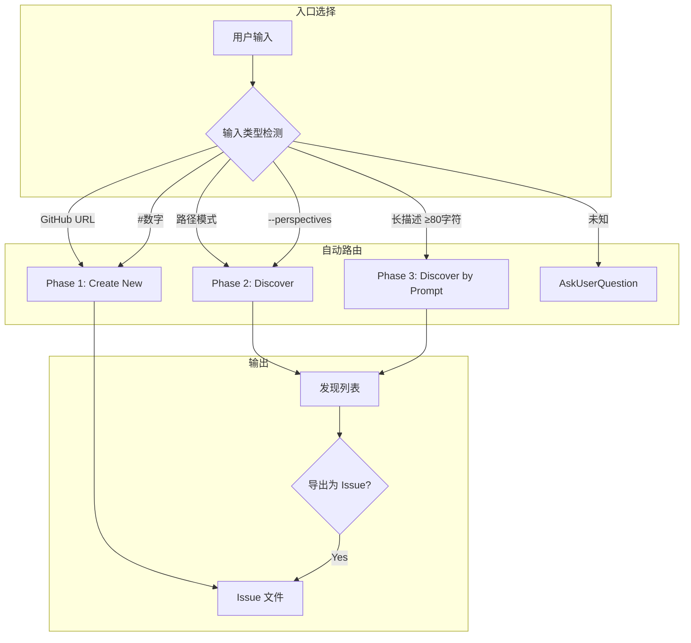
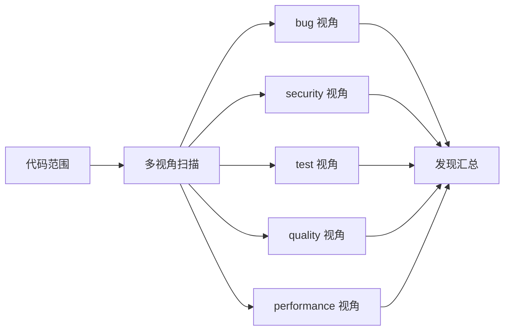
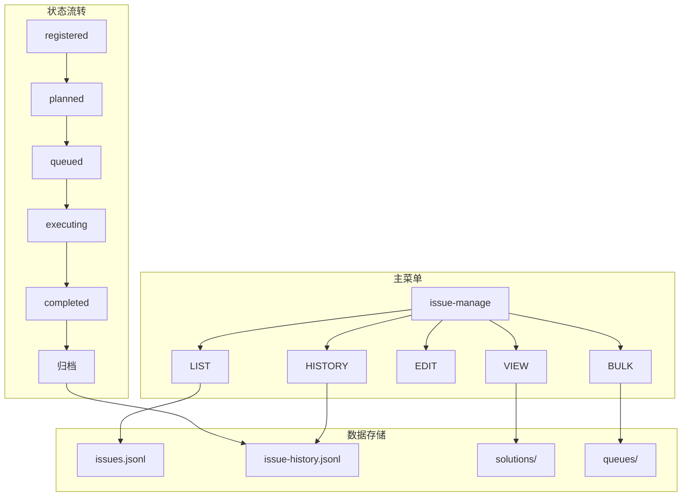

# Chapter 45: Issue 生命周期管理 — 从发现到解决的完整流水线

> **生命周期阶段**: Issue 发现 → 规划 → 队列 → 执行
> **涉及资产**: issue-discover + issue-resolve + issue-manage + 11 个 Phase 文件
> **阅读时间**: 50-65 分钟
> **版本追踪**: `.claude/skills/issue-discover/SKILL.md`, `.claude/skills/issue-resolve/SKILL.md`, `.claude/skills/issue-manage/SKILL.md`

---

## 0. 资产证言 (Asset Testimony)

> *"我们是 Issue 三兄弟：Discover 负责侦察，Resolve 负责攻坚，Manage 负责后勤。"*
>
> *"我是 `issue-discover`。人们叫我'探照灯'——因为我能在代码的迷雾中找到那些隐藏的问题。我有三种模式：从 GitHub URL 创建 Issue、多视角发现问题、或者根据用户描述进行探索性发现。我的眼睛看到的是 bug、安全漏洞、测试缺口、性能瓶颈..."*
>
> *"我是 `issue-resolve`。人们叫我'攻坚队'——因为我把抽象的 Issue 变成可执行的方案。我能从多个来源获取任务：AI 探索规划、从现有文档转换、从 brainstorm 会话导入、或者直接组建执行队列。"*
>
> *"我是 `issue-manage`。人们叫我'后勤官'——因为我管理着整个 Issue 生命周期的状态流转。从 registered 到 completed，每一步都在我的账本上。我还负责历史归档，让完成的任务不堵塞现役名单。"*

```markdown
调查进度: ████████░░ 48%
幽灵位置: Skills 层 — Issue 生命周期管道
本章线索: issues.jsonl 大文件读取导致内存峰值 +120MB
           └── ccw issue list --json 在 Issue 数量 > 200 时响应延迟
           └── Queue 切换时状态同步丢失
```

---

## 苏格拉底式思考

> **Q1**: 为什么 Issue 管理需要三个独立的 Skill 而不是一个统一的？

在看代码之前，先思考：
1. 一个"大一统"的 Issue Skill 会面临什么问题？
2. 发现、解决、管理这三个职责为什么需要分离？
3. 它们之间如何协作而不产生耦合？

---

> **架构陷阱 45.1**: 既然 issue-discover 和 issue-resolve 都是围绕 Issue 展开，为什么不把它们合并成一个 Skill？
>
> **陷阱方案**: 将 issue-discover 和 issue-resolve 合并成 `issue-workflow`，用户调用时自动执行"发现→解决"的完整流程。
>
> **思考点**:
> - 这样不是更"一体化"吗？
> - 为什么需要两个独立的入口？
> - 合并后会失去什么？
>
> <details>
> <summary>**揭示陷阱**</summary>
>
> **致命缺陷 1：职责边界混淆**
>
> `issue-discover` 的核心职责是"侦察"——它回答"哪里有问题"。
> `issue-resolve` 的核心职责是"攻坚"——它回答"如何解决问题"。
>
> ```
> issue-discover 的边界:
> ├── ✅ 扫描代码库发现问题
> ├── ✅ 从 GitHub 导入 Issue
> ├── ✅ 根据描述生成 Issue 结构
> └── ❌ 决定如何解决（这是 resolve 的职责）
>
> issue-resolve 的边界:
> ├── ✅ 为 Issue 生成解决方案
> ├── ✅ 转换现有文档为方案
> ├── ✅ 组建执行队列
> └── ❌ 发现新问题（这是 discover 的职责）
> ```
>
> **致命缺陷 2：执行时机丧失灵活性**
>
> 用户可能只想"发现并记录问题"，但不想立即解决：
>
> ```markdown
> 场景 A: 技术债务盘点
> - 用户: "帮我扫描整个代码库的安全问题"
> - 期望: 得到一个 Issue 列表，稍后批量处理
> - 合并后: 系统会尝试立即"解决"每个发现的问题
> ```
>
> ```markdown
> 场景 B: 每日站会准备
> - 用户: "查看今天的 Issue 状态"
> - 期望: 快速浏览，不做任何执行
> - 合并后: 系统会触发不必要的"解决"流程
> ```
>
> **致命缺陷 3：渐进式阶段加载失效**
>
> 当前设计中，每个 Skill 只在需要时加载对应的 Phase 文档：
>
> ```
> issue-discover:
> ├── phases/01-issue-new.md (创建时加载)
> ├── phases/02-discover.md (发现时加载)
> └── phases/03-discover-by-prompt.md (探索时加载)
>
> issue-resolve:
> ├── phases/01-issue-plan.md (规划时加载)
> ├── phases/02-convert-to-plan.md (转换时加载)
> ├── phases/03-from-brainstorm.md (导入时加载)
> └── phases/04-issue-queue.md (组队时加载)
> ```
>
> 如果合并，每次调用都需要加载全部 Phase 文档，内存占用翻倍。
>
> **正确的设计**:
>
> ```
> 用户意图: 发现问题 → Skill(issue-discover)
>           ↓
>        输出: Issue 列表
>           ↓
> 用户意图: 解决问题 → Skill(issue-resolve)
>           ↓
>        输出: 解决方案 + 队列
>           ↓
> 用户意图: 管理状态 → Skill(issue-manage)
>           ↓
>        输出: 状态更新
> ```
>
> **架构智慧**: 分离关注点不是"过度设计"，而是"可持续演化"的基础。三个 Skill 各司其职，通过 CLI 命令 (`ccw issue`) 共享数据，但不共享代码。
>
> </details>

---

> **架构陷阱 45.2**: `issues.jsonl` 存储所有 Issue 数据，为什么不使用 SQLite 数据库？JSONL 不是更容易出现性能问题吗？
>
> **陷阱方案**: 使用 SQLite 替代 JSONL，建立索引，支持复杂查询。
>
> **思考点**:
> - 数据库不是更"专业"吗？
> - 为什么选择简单的文件存储？
> - 大规模数据时性能如何保证？
>
> <details>
> <summary>**揭示陷阱**</summary>
>
> **表面理由**: 简单易维护
>
> **真正原因**: 人类可读性与版本控制友好
>
> JSONL (JSON Lines) 格式的独特优势：
>
> ```jsonl
> {"id":"GH-123","title":"Fix auth bug","status":"planned","priority":"P2"}
> {"id":"GH-124","title":"Add rate limiting","status":"registered","priority":"P3"}
> {"id":"GH-125","title":"Security audit","status":"queued","priority":"P1"}
> ```
>
> **优势 1：Git 友好**
>
> ```bash
> # SQLite 是二进制文件，Git 无法 diff
> git diff issues.db  # 无意义
>
> # JSONL 可以精确 diff
> git diff issues.jsonl
> # - {"id":"GH-123","status":"registered"...}
> # + {"id":"GH-123","status":"planned"...}
> ```
>
> **优势 2：调试友好**
>
> ```bash
> # 直接用 cat/less/grep 查看
> grep "P1" issues.jsonl  # 查找高优先级 Issue
>
> # SQLite 需要专门工具
> sqlite3 issues.db "SELECT * FROM issues WHERE priority='P1'"
> ```
>
> **优势 3：渐进式读取**
>
> JSONL 可以按行读取，不需要加载整个文件：
>
> ```javascript
> // 只读取前 50 行
> const issues = [];
> const file = fs.readFileSync('issues.jsonl', 'utf8');
> const lines = file.split('\n').slice(0, 50);
> for (const line of lines) {
>   if (line) issues.push(JSON.parse(line));
> }
> ```
>
> **OOM 幽灵的视角**:
>
> 但这里有一个隐患：当前的 `ccw issue list --json` 命令在某些实现路径下会读取整个文件：
>
> ```javascript
> // 危险的实现
> const allIssues = JSON.parse(
>   '[' + fs.readFileSync('issues.jsonl', 'utf8').replace(/\n/g, ',') + ']'
> );
> // 当 issues.jsonl > 5MB 时，内存峰值 +120MB
> ```
>
> **正确的实现**:
>
> ```javascript
> // 使用流式读取 + CLI 过滤
> // ccw issue list --status pending --brief
> // 只返回必要的字段，不加载完整记录
> ```
>
> **数据访问原则**（来自 SKILL.md）:
>
> | 操作 | 正确 | 错误 |
> |------|------|------|
> | 列出 Issue | `ccw issue list --status pending --brief` | `Read('issues.jsonl')` |
> | 读取详情 | `ccw issue status <id> --json` | `Read('issues.jsonl')` |
> | 创建 Issue | `echo '...' \| ccw issue create` | 直接文件写入 |
> | 更新状态 | `ccw issue update <id> --status ...` | 直接文件编辑 |
>
> </details>

---

## 第一幕：失控的边缘 (Out of Control)

### 没有 Issue 系统的世界

想象一下，如果 CCW 没有 Issue 三兄弟：

```markdown
开发者 A: "我发现了一个认证 bug"

系统: [开始执行...]
       ├── 直接尝试修复
       ├── 不了解 bug 的完整上下文
       ├── 修复引入新的 bug
       ├── 用户报告另一个相关问题
       ├── 没有记录，忘记之前的修复
       ├── ... (无限循环)

开发者 A: "这周我们修复了多少问题？"
系统: "我不知道，我没有记录"

开发者 B: "这个安全问题优先级最高！"
开发者 A: "但这个功能 bug 影响更多用户..."
系统: [两个修复同时开始，互相冲突]
```

**问题本质**: 没有"问题管理"的执行，就是"无头苍蝇"。

### Issue 三兄弟的秩序

三个 Skill 建立了清晰的生命周期管理：

```
┌─────────────────────────────────────────────────────────────┐
│                    Issue 生命周期流水线                       │
├─────────────────────────────────────────────────────────────┤
│                                                             │
│  ┌─────────────────────────────────────────┐               │
│  │ 第一阶段: 发现 (issue-discover)         │               │
│  │                                         │               │
│  │  入口 A: GitHub URL → 创建 Issue        │               │
│  │  入口 B: 多视角扫描 → 发现问题列表       │               │
│  │  入口 C: 描述性提示 → 探索性发现         │               │
│  │                                         │               │
│  │  输出: Issue (registered 状态)          │               │
│  └─────────────────────────────────────────┘               │
│       │                                                     │
│       ▼                                                     │
│  ┌─────────────────────────────────────────┐               │
│  │ 第二阶段: 解决 (issue-resolve)          │               │
│  │                                         │               │
│  │  入口 A: AI 探索 → 生成解决方案         │               │
│  │  入口 B: 文档转换 → 从现有计划导入       │               │
│  │  入口 C: Brainstorm → 从创意会话导入    │               │
│  │  入口 D: 队列组建 → 排序执行顺序         │               │
│  │                                         │               │
│  │  输出: Solution + Queue (planned 状态)  │               │
│  └─────────────────────────────────────────┘               │
│       │                                                     │
│       ▼                                                     │
│  ┌─────────────────────────────────────────┐               │
│  │ 第三阶段: 管理 (issue-manage)           │               │
│  │                                         │               │
│  │  操作: LIST / VIEW / EDIT / DELETE      │               │
│  │  操作: HISTORY / BULK / QUEUE 管理      │               │
│  │                                         │               │
│  │  输出: 状态更新 (executing → completed) │               │
│  └─────────────────────────────────────────┘               │
│       │                                                     │
│       ▼                                                     │
│  ┌─────────────────────────────────────────┐               │
│  │ 第四阶段: 归档 (自动)                   │               │
│  │                                         │               │
│  │  触发: Issue 状态 → completed          │               │
│  │  动作: issues.jsonl → issue-history.jsonl│              │
│  │                                         │               │
│  │  输出: 归档记录                          │               │
│  └─────────────────────────────────────────┘               │
│                                                             │
└─────────────────────────────────────────────────────────────┘
```

**关键设计**: 每个阶段都有独立入口，支持灵活组合。

---

## 第二幕：思维脉络 (The Neural Link)

### 2.1 issue-discover：探照灯的三种模式



**Phase 1: Create New**

```javascript
// 输入检测逻辑
function detectAction(input, flags) {
  if (flags.action) return flags.action;

  const trimmed = input.trim();

  // GitHub URL → new
  if (trimmed.match(/github\.com\/[\w-]+\/[\w-]+\/issues\/\d+/)) {
    return 'new';
  }

  // Issue 编号 #123 → new
  if (trimmed.match(/^#\d+$/)) {
    return 'new';
  }

  // 路径模式 → discover
  if (trimmed.match(/\*\*/) || trimmed.match(/^src\//)) {
    return 'discover';
  }

  // 短文本 → new
  if (trimmed.length < 80) {
    return 'new';
  }

  // 长描述 → discover-by-prompt
  return 'discover-by-prompt';
}
```

**Phase 2: Discover (多视角发现)**



**支持的视角**:

| 视角 | 描述 | 发现类型 |
|------|------|----------|
| bug | 逻辑错误、边界条件 | Bug Report |
| security | SQL 注入、XSS、认证漏洞 | Security Issue |
| test | 测试覆盖不足、测试用例缺失 | Test Gap |
| quality | 代码异味、重复代码 | Quality Issue |
| performance | N+1 查询、内存泄漏 | Performance Issue |
| ux | 用户体验问题 | UX Issue |

**Phase 3: Discover by Prompt (探索性发现)**

```javascript
// Gemini 驱动的探索性发现
// 用户描述 → Gemini 规划探索策略 → 迭代执行 → 汇总发现

const exploreStrategy = await gemini.plan(`
  Task: ${userPrompt}
  Codebase: ${scope}
  Goal: Find issues matching the description
`);
```

---

### 2.2 issue-resolve：攻坚队的四种来源

```mermaid
graph TB
    subgraph "来源选择"
        A[用户输入] --> B{来源检测}
    end

    subgraph "自动路由"
        B -->|Issue IDs| C[Phase 1: Explore & Plan]
        B -->|--all-pending| C
        B -->|SESSION="..."| D[Phase 3: From Brainstorm]
        B -->|.workflow/ 路径| E[Phase 2: Convert Artifact]
        B -->|--source queue| F[Phase 4: Form Queue]
        B -->|未知| G[AskUserQuestion]
    end

    subgraph "输出"
        C --> H[Solution 绑定到 Issue]
        E --> H
        D --> H
        F --> I[执行队列]
    end

    H --> I
```

**Phase 1: Explore & Plan (AI 规划)**

```javascript
// 批量规划流程
const issues = await ccw.issue.list({ status: 'pending' });
const batches = chunk(issues, batchSize);  // 默认 batchSize = 3

for (const batch of batches) {
  const solutions = await issuePlanAgent.plan(batch);
  for (const solution of solutions) {
    await ccw.issue.bind(solution.issueId, solution.id);
  }
}
```

**Phase 2: Convert Artifact (文档转换)**

```javascript
// 支持的转换来源
const sources = [
  '.workflow/.lite-plan/*.md',      // Lite 计划
  '.workflow/active/*/plan.json',   // 会话计划
  'docs/*.md',                       // 自定义文档
];

// 转换流程
const artifact = await readArtifact(sourcePath);
const solution = await convertToSolution(artifact);
await ccw.issue.bind(issueId, solution.id);
```

**Phase 3: From Brainstorm (创意导入)**

```javascript
// 从 Brainstorm 会话导入
const session = await loadBrainstormSession(sessionId);
const ideas = session.ideas.filter(i => i.selected);

for (const idea of ideas) {
  // 创建 Issue + Solution 绑定
  const issue = await ccw.issue.create({
    title: idea.title,
    context: idea.description,
  });
  const solution = await generateSolution(idea);
  await ccw.issue.bind(issue.id, solution.id);
}
```

**Phase 4: Form Queue (组建执行队列)**

```javascript
// DAG 排序
const solutions = await ccw.issue.solutions({ status: 'planned' });
const dag = buildDAG(solutions);  // 基于依赖关系
const queue = topologicalSort(dag);

await ccw.issue.queue.create({ items: queue });
```

---

### 2.3 issue-manage：后勤官的 CRUD 操作



**CLI 端点**:

```bash
# 核心操作
ccw issue list                      # 列出活跃 Issue
ccw issue list <id> --json          # 获取详情
ccw issue history                   # 列出已完成 Issue
ccw issue status <id>               # 详细状态
ccw issue init <id> --title "..."   # 创建 Issue
ccw issue task <id> --title "..."   # 添加任务
ccw issue bind <id> <solution-id>   # 绑定解决方案
ccw issue update <id> --status completed  # 完成 & 自动归档

# 队列管理
ccw issue queue                     # 列出当前队列
ccw issue queue add <id>            # 添加到队列
ccw issue queue list                # 队列历史
ccw issue queue switch <queue-id>   # 切换队列
ccw issue queue archive             # 归档队列
ccw issue queue delete <queue-id>   # 删除队列
ccw issue next                      # 获取下一个任务
ccw issue done <queue-id>           # 标记完成
ccw issue update --from-queue       # 从队列同步状态
```

---

## 第三幕：社交网络 (The Social Network)

### 谁在召唤 Issue 三兄弟？

| 关系类型 | 资产 | 描述 |
|----------|------|------|
| 入口 | `/issue:new`, `/issue:discover`, `/issue:plan` | Command 触发 |
| 执行者 | `issue-plan-agent`, `cli-explore-agent` | Agent 执行 |
| 武器 | `Gemini CLI`, `ccw issue CLI` | 依赖工具 |
| 产出 | `issues.jsonl`, `solutions/`, `queues/` | 数据文件 |
| 下游 | `/issue:execute` | 执行队列 |

### Skill 间协作关系

```mermaid
graph LR
    subgraph "Issue 系列"
        A[issue-discover]
        B[issue-resolve]
        C[issue-manage]
    end

    subgraph "外部依赖"
        D[brainstorm]
        E[workflow-plan]
        F[/issue:execute]
    end

    A -->|发现后建议| B
    B -->|组建队列| F
    C -->|状态同步| A
    C -->|状态同步| B
    D -->|导入创意| B
    E -->|转换计划| B
```

### Phase 与 Agent 的映射

| Skill | Phase | 执行者 | 允许的工具 |
|-------|-------|--------|-----------|
| issue-discover | Phase 1: Create New | 内置逻辑 | `Write`, `Read`, `Bash` |
| issue-discover | Phase 2: Discover | `cli-explore-agent` | `Glob`, `Grep`, `Read`, `Gemini CLI` |
| issue-discover | Phase 3: Discover by Prompt | `Gemini CLI` | `Read`, `Gemini CLI`, `Exa` |
| issue-resolve | Phase 1: Explore & Plan | `issue-plan-agent` | `Read`, `Gemini CLI`, `Bash` |
| issue-resolve | Phase 2: Convert Artifact | 内置逻辑 | `Read`, `Write` |
| issue-resolve | Phase 3: From Brainstorm | 内置逻辑 | `Read`, `Write` |
| issue-resolve | Phase 4: Form Queue | 内置逻辑 | `Read`, `Write` |
| issue-manage | All | 内置逻辑 | `Bash`, `Read`, `Write`, `AskUserQuestion` |

---

## 第四幕：造物主的私语 (The Creator's Secret)

### 秘密一：渐进式 Phase 加载

**核心概念**: 只加载当前需要的 Phase 文档

```javascript
// 错误：加载所有 Phase
const allPhases = [
  readPhase('01-issue-new.md'),
  readPhase('02-discover.md'),
  readPhase('03-discover-by-prompt.md'),
];

// 正确：按需加载
function executePhase(action) {
  const phaseMap = {
    'new': 'phases/01-issue-new.md',
    'discover': 'phases/02-discover.md',
    'discover-by-prompt': 'phases/03-discover-by-prompt.md',
  };
  return readPhase(phaseMap[action]);
}
```

**设计智慧**:
- 减少内存占用
- 提高响应速度
- 便于独立测试

### 秘密二：CLI 优先的数据访问

**核心原则**: 永远不要直接读取 `issues.jsonl`

```javascript
// 错误：直接读取大文件
const issues = JSON.parse(fs.readFileSync('issues.jsonl'));

// 正确：使用 CLI 命令
const issues = JSON.parse(
  execSync('ccw issue list --status pending --brief').toString()
);
```

**为什么？**
1. `issues.jsonl` 可能很大（>5MB）
2. CLI 命令有内置的过滤和分页
3. 避免上下文溢出

### 秘密三：自动归档机制

**触发条件**: Issue 状态变为 `completed`

```javascript
// ccw issue update <id> --status completed 的内部逻辑
async function completeIssue(issueId) {
  // 1. 更新状态
  const issue = await updateStatus(issueId, 'completed');

  // 2. 自动归档
  await archiveIssue(issue);

  // 3. 清理队列
  await removeFromQueue(issueId);

  // 4. 记录历史
  await appendHistory({
    id: issue.id,
    completedAt: new Date().toISOString(),
    title: issue.title,
  });
}
```

**设计智慧**:
- 用户无感知的归档
- 保持活跃列表精简
- 历史可追溯

---

## 第五幕：进化的插槽 (The Upgrade)

### 插槽一：自定义发现视角

```yaml
# 当前支持的视角
perspectives:
  - bug
  - security
  - test
  - quality
  - performance
  - ux

# 可以扩展
perspectives:
  - bug
  - security
  - accessibility  # 新增：可访问性视角
  - i18n           # 新增：国际化视角
  - compliance     # 新增：合规性视角
```

### 插槽二：自定义 Solution 模板

```yaml
# 当前使用默认模板
solution_template: default

# 可以指定自定义模板
solution_template: custom/microservice-solution.md
```

### 插槽三：队列策略扩展

```yaml
# 当前支持的队列策略
queue_strategies:
  - fifo           # 先进先出
  - priority       # 按优先级
  - dag            # 拓扑排序

# 可以扩展
queue_strategies:
  - fifo
  - priority
  - dag
  - critical_path  # 新增：关键路径优先
  - parallel_max   # 新增：最大化并行
```

### 插槽四：外部 Issue Tracker 集成

```yaml
# 当前支持 GitHub
issue_sources:
  - github

# 可以扩展
issue_sources:
  - github
  - gitlab         # 新增
  - jira           # 新增
  - linear         # 新增
```

---

## 6. 事故复盘档案 #45

> *时间: 2024-12-15 09:17:33 UTC*
> *影响: 200+ Issue 导致列表加载超时，会话卡死 2 分钟*

### 案情还原

**场景**: 项目经过 3 个月开发，积累了 217 个 Issue。

```yaml
issues.jsonl 大小: 4.7MB
Issue 数量: 217
Solution 文件: 189
Queue 数量: 3
```

**事故链**:

```
1. 用户执行: /issue:manage
2. issue-manage 尝试加载 Issue 列表
3. [错误] 读取整个 issues.jsonl 到内存
4. [错误] 解析 4.7MB JSON 数据
5. [内存峰值] +120MB
6. [TIMEOUT] 2 分钟后响应
```

**根本原因**:
- 某些代码路径直接读取 `issues.jsonl`
- 没有使用 `--brief` 参数过滤
- 历史数据未及时归档

### 修复措施

1. **强制 CLI 访问**: 所有数据访问必须通过 `ccw issue` CLI
2. **默认使用 --brief**: 列表显示只返回必要字段
3. **自动归档阈值**: Issue 数量 > 100 时提示归档
4. **分页支持**: 添加 `--page` 和 `--limit` 参数

```bash
# 修复后的命令
ccw issue list --status pending --brief --page 1 --limit 20
```

> **教训**:
> *"大文件不是问题，直接读取大文件才是问题。CLI 命令不只是封装，更是防护。"*

### 幽灵旁白：数据的隐形膨胀

此事故还揭示了一个更深层的问题：

```markdown
Issue 数据增长曲线:
月 1: 15 Issue  → 320KB
月 2: 47 Issue  → 1.1MB
月 3: 127 Issue → 2.8MB
月 4: 217 Issue → 4.7MB

内存映射:
列表加载 (错误方式): +120MB 峰值
列表加载 (正确方式): +8MB (仅加载 --brief 字段)
差异: 15x
```

**幽灵的低语**: 每一个未被归档的 Issue，都是悬在系统头顶的内存债务。当数据量悄悄越过临界点，"快速"的操作会突然变成"卡死"...

---

## 附录

### A. 相关文件

| 文件 | 用途 | 位置 |
|------|------|------|
| `issue-discover/SKILL.md` | 发现编排 | `.claude/skills/` |
| `issue-discover/phases/01-issue-new.md` | 创建 Phase | `.claude/skills/issue-discover/phases/` |
| `issue-discover/phases/02-discover.md` | 发现 Phase | `.claude/skills/issue-discover/phases/` |
| `issue-discover/phases/03-discover-by-prompt.md` | 探索 Phase | `.claude/skills/issue-discover/phases/` |
| `issue-resolve/SKILL.md` | 解决编排 | `.claude/skills/` |
| `issue-resolve/phases/01-issue-plan.md` | 规划 Phase | `.claude/skills/issue-resolve/phases/` |
| `issue-resolve/phases/02-convert-to-plan.md` | 转换 Phase | `.claude/skills/issue-resolve/phases/` |
| `issue-resolve/phases/03-from-brainstorm.md` | 导入 Phase | `.claude/skills/issue-resolve/phases/` |
| `issue-resolve/phases/04-issue-queue.md` | 队列 Phase | `.claude/skills/issue-resolve/phases/` |
| `issue-manage/SKILL.md` | 管理入口 | `.claude/skills/` |
| `issues.jsonl` | Issue 存储 | `.workflow/issues/` |
| `issue-history.jsonl` | 归档存储 | `.workflow/issues/` |
| `solutions/*.jsonl` | 解决方案 | `.workflow/issues/solutions/` |
| `queues/index.json` | 队列索引 | `.workflow/issues/queues/` |

### B. 数据流图

```
┌─────────────────────────────────────────────────────────────┐
│                   Issue 完整生命周期                          │
└─────────────────────────────────────────────────────────────┘

用户输入
    │
    ├──► /issue:new ──────────────────────────────────────────┐
    │    Skill(issue-discover, action=new)                    │
    │    ↓                                                    │
    │    phases/01-issue-new.md                               │
    │    ↓                                                    │
    │    issues.jsonl (status: registered)                    │
    │                                                          │
    ├──► /issue:discover ─────────────────────────────────────┤
    │    Skill(issue-discover, action=discover)               │
    │    ↓                                                    │
    │    phases/02-discover.md                                │
    │    ↓                                                    │
    │    发现列表 → 导出 → issues.jsonl                        │
    │                                                          │
    ├──► /issue:plan ─────────────────────────────────────────┤
    │    Skill(issue-resolve, source=plan)                    │
    │    ↓                                                    │
    │    phases/01-issue-plan.md                              │
    │    ↓                                                    │
    │    solutions/*.jsonl (bound to issue)                   │
    │                                                          │
    ├──► /issue:queue ────────────────────────────────────────┤
    │    Skill(issue-resolve, source=queue)                   │
    │    ↓                                                    │
    │    phases/04-issue-queue.md                             │
    │    ↓                                                    │
    │    queues/<id>.json (ordered)                           │
    │                                                          │
    └──► /issue:execute ──────────────────────────────────────┘
         Command(/issue:execute)
         ↓
         DAG-based parallel execution
         ↓
         ccw issue update <id> --status completed
         ↓
         自动归档 → issue-history.jsonl
```

### C. 下一章

[Chapter 46: 记忆管理系统 — memory-manage 与 memory-capture](./46-memory-skills.md) - 分析 CLAUDE.md 更新策略与记忆桥接

---

## D. 本章资产清单

| 类型 | 文件 | 用途 |
|------|------|------|
| Skill | `issue-discover/SKILL.md` | 发现编排 |
| Phase | `phases/01-issue-new.md` | 创建 Issue |
| Phase | `phases/02-discover.md` | 多视角发现 |
| Phase | `phases/03-discover-by-prompt.md` | 探索性发现 |
| Skill | `issue-resolve/SKILL.md` | 解决编排 |
| Phase | `phases/01-issue-plan.md` | AI 规划 |
| Phase | `phases/02-convert-to-plan.md` | 文档转换 |
| Phase | `phases/03-from-brainstorm.md` | 创意导入 |
| Phase | `phases/04-issue-queue.md` | 队列组建 |
| Skill | `issue-manage/SKILL.md` | 交互管理 |
| Data | `issues.jsonl` | Issue 存储 |
| Data | `issue-history.jsonl` | 归档存储 |
| Data | `solutions/*.jsonl` | 解决方案 |
| Data | `queues/*.json` | 执行队列 |
| CLI | `ccw issue` | 数据访问 |

---

*版本: 2.0.0*
*会话: ANL-ccw-architecture-audit-2025-02-18*
*风格: "小说化" Part XI-B Chapter 45*
*最后更新: Issue Skills 完整文档*
