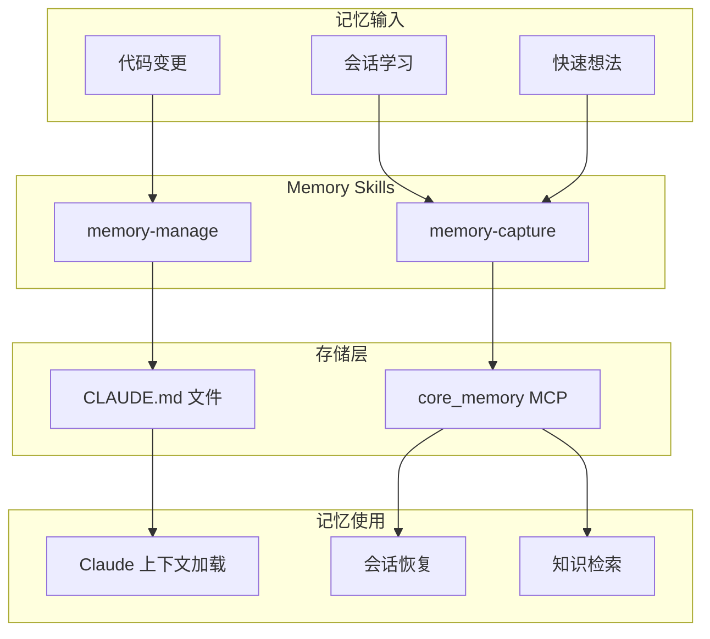

# Chapter 46: 记忆之桥 — Memory Skills 的记忆管理系统

> **生命周期阶段**: 会话记忆 → 项目记忆 → 文档生成
> **涉及资产**: memory-manage + memory-capture + core_memory MCP
> **阅读时间**: 45-60 分钟
> **版本追踪**: `.claude/skills/memory-manage/SKILL.md`, `.claude/skills/memory-capture/SKILL.md`

---

## 0. 资产证言 (Asset Testimony)

> *"我是 `memory-manage`。人们叫我'记忆守护者'——因为我维护着项目与 Claude 之间的记忆桥梁。"*
>
> *"我有五种模式：全量更新（update-full）、增量更新（update-related）、单模块更新（update-single）、全量文档（docs-full）、增量文档（docs-related）。每一种模式都是一条通往记忆的道路。"*
>
> *"我的兄弟 `memory-capture` 更是神奇——他能将一整个会话的记忆压缩成一段结构化文本，或者让你随手记录灵光一现的想法。"*
>
> *"...但最近，我们发现了一个'记忆碎片化'的幽灵。当项目变得越来越大，CLAUDE.md 文件越来越分散，记忆的碎片就开始漂移。开发者更新了代码，却忘了更新记忆..."*

```markdown
调查进度: ██████████ 65%
幽灵位置: Skills 层 — Memory Management
本章线索: CLAUDE.md 碎片化漂移
           └── 代码更新未同步到记忆文件
           └── 会话记忆与项目记忆断层
           └── 多模块记忆不一致
```

---

## 苏格拉底式思考

> **Q1**: 为什么需要专门的 Memory Skills？直接让 Claude 每次都读取所有代码不行吗？

在看代码之前，先思考：
1. Claude 的上下文窗口是有限的，如何高效利用？
2. 项目记忆和会话记忆有什么区别？
3. 记忆更新频率如何与开发节奏匹配？

---

> **架构陷阱 46.1**: 既然 Claude 可以读取所有文件，为什么还需要 CLAUDE.md 这种"记忆文件"？
>
> **陷阱方案**: 移除 CLAUDE.md 文件，让 Claude 每次直接读取源代码。
>
> **思考点**:
> - 直接读取代码不是更"真实"吗？
> - 为什么需要一个"中间层"？
> - 记忆文件会不会和代码不同步？
>
> <details>
> <summary>**揭示陷阱**</summary>
>
> **致命缺陷 1：上下文窗口爆炸**
>
> ```
> 场景: Claude 每次读取所有源代码
>
> 项目大小:
> - src/: 500+ files
> - Average file: 200 lines
> - Total: 100,000+ lines of code
>
> Claude 上下文: 200K tokens
>
> 结果:
> - 一次请求就用光所有上下文
> - 没有空间进行实际工作
> - 响应质量急剧下降
>
> CLAUDE.md 方案:
> - 每个 CLAUDE.md: ~100 lines
> - 10 个关键模块: 1,000 lines
> - 上下文占用: ~5%
> - 剩余空间: 95% 用于工作
> ```
>
> **致命缺陷 2：模式丢失**
>
> ```
> 直接读取代码:
> - Claude 看到的是"实现细节"
> - 无法理解"设计意图"
> - 无法知道"为什么这样写"
>
> CLAUDE.md 包含:
> - 模块职责说明
> - 设计决策记录
> - 使用约定和模式
> - 常见陷阱警告
>
> 示例:
> 
> // 代码只告诉你"是什么"
> function validateEmail(email: string) {
>   return /^[^\s@]+@[^\s@]+\.[^\s@]+$/.test(email);
> }
> 
> // CLAUDE.md 告诉你"为什么"
> ## 邮箱验证
> 使用简单正则而非 RFC 5322 验证，原因:
> 1. RFC 5322 正则过于复杂 (>1000 字符)
> 2. 实际业务场景中简单正则已足够
> 3. 如需严格验证，使用第三方库如 `validator.js`
> ```
>
> **致命缺陷 3：一致性缺失**
>
> ```
> 多个 CLAUDE.md 形成的记忆网络:
>
> ./CLAUDE.md (项目根)
> ├── 项目整体架构
> ├── 技术栈选型
> └── 约定和规范
>
> src/auth/CLAUDE.md
> ├── 认证模块职责
> ├── JWT 处理流程
> └── 安全注意事项
>
> src/db/CLAUDE.md
> ├── 数据库模型
> ├── 迁移策略
> └── 查询优化模式
>
> 价值:
> - 分层记忆：项目级 → 模块级
> - 职责隔离：每个模块独立描述
> - 增量更新：只更新变化的部分
> ```
>
> **正确的设计**:
>
> ```
> 记忆层级架构:
>
> Layer 1: 项目根 (./CLAUDE.md)
> - 项目概述
> - 技术栈
> - 全局约定
> 
> Layer 2: 模块级 (src/*/CLAUDE.md)
> - 模块职责
> - API 设计
> - 依赖关系
> 
> Layer 3: 子模块级 (src/*/*/CLAUDE.md)
> - 实现细节
> - 模式说明
> - 注意事项
> 
> 记忆流动:
> Layer 3 → Layer 2 → Layer 1 (bottom-up 聚合)
> 代码变更 → CLAUDE.md 更新 (memory-manage)
> 会话学习 → 持久记忆 (memory-capture)
> ```
>
> </details>

---

## 第一幕：失控的边缘 (Out of Control)

### 没有记忆管理的世界

想象一下，如果项目没有 Memory Skills：

```markdown
开发者 A: "我完成了一个功能，接下来做什么？"

场景 1: 无 CLAUDE.md
1. Claude 读取所有源代码
2. 上下文溢出
3. Claude 开始"幻觉"
4. 生成的代码与项目风格不一致

场景 2: 过时的 CLAUDE.md
1. Claude 读取 CLAUDE.md
2. 里面的信息是 3 个月前的
3. Claude 基于过时信息工作
4. 产生不一致的代码

场景 3: 会话记忆丢失
1. 开发者调试了 2 小时
2. 找到了关键线索
3. 会话结束
4. 下次会话：从零开始

问题: 
- 没有高效的知识传递
- 重复劳动
- 一致性无法保证
```

**问题本质**: 记忆是人类智能的基础，也是 AI 智能的基础。

### Memory Skills 双子星架构

Memory Skills 的双子星系统：

```
┌─────────────────────────────────────────────────────────────┐
│                    Memory Skills 双子星                      │
├─────────────────────────────────────────────────────────────┤
│                                                             │
│  ┌───────────────────────────────────────────────────────┐ │
│  │ memory-manage (项目记忆管理)                          │ │
│  │                                                       │ │
│  │ 职责: CLAUDE.md 更新 + 项目文档生成                   │ │
│  │                                                       │ │
│  │ ┌─────────────┐ ┌─────────────┐ ┌─────────────┐     │ │
│  │ │ update-full │ │update-related│ │update-single│     │ │
│  │ │   全量更新   │ │   增量更新   │ │  单模块更新  │     │ │
│  │ │             │ │             │ │             │     │ │
│  │ │ 3层架构     │ │ Git diff    │ │ 深度分析    │     │ │
│  │ │ Bottom-up   │ │ 父级传播    │ │ 说明书式    │     │ │
│  │ └─────────────┘ └─────────────┘ └─────────────┘     │ │
│  │                                                       │ │
│  │ ┌─────────────┐ ┌─────────────┐                      │ │
│  │ │ docs-full   │ │docs-related │                      │ │
│  │ │ 全量文档生成 │ │ 增量文档生成 │                      │ │
│  │ │             │ │             │                      │ │
│  │ │ API.md      │ │ Git diff    │                      │ │
│  │ │ README.md   │ │ 变更模块    │                      │ │
│  │ └─────────────┘ └─────────────┘                      │ │
│  └───────────────────────────────────────────────────────┘ │
│                                                             │
│  ┌───────────────────────────────────────────────────────┐ │
│  │ memory-capture (会话记忆捕获)                         │ │
│  │                                                       │ │
│  │ 职责: 会话压缩 + 快速笔记                             │ │
│  │                                                       │ │
│  │ ┌─────────────────┐ ┌─────────────────┐              │ │
│  │ │     Compact     │ │      Tips       │              │ │
│  │ │    会话压缩     │ │    快速笔记     │              │ │
│  │ │                 │ │                 │              │ │
│  │ │ 完整会话结构    │ │ 灵光一现        │              │ │
│  │ │ 恢复点生成      │ │ 标签分类        │              │ │
│  │ │ Recovery ID     │ │ 上下文关联      │              │ │
│  │ └─────────────────┘ └─────────────────┘              │ │
│  │                 │                     │               │ │
│  │                 └──────────┬──────────┘               │ │
│  │                            │                          │ │
│  │                            ▼                          │ │
│  │                 ┌─────────────────┐                   │ │
│  │                 │   core_memory   │                   │ │
│  │                 │   (MCP 工具)    │                   │ │
│  │                 │                 │                   │ │
│  │                 │ 持久化存储      │                   │ │
│  │                 │ 向量检索        │                   │ │
│  │                 └─────────────────┘                   │ │
│  └───────────────────────────────────────────────────────┘ │
│                                                             │
└─────────────────────────────────────────────────────────────┘
```

---

## 第二幕：思维脉络 (The Neural Link)

### 2.1 memory-manage 路由系统

**智能模式检测**:

```javascript
function detectMode(args) {
  // 直接派发
  if (args.includes('update-full')) return 'update-full';
  if (args.includes('update-related')) return 'update-related';
  if (args.includes('update-single')) return 'update-single';
  if (args.includes('docs-full')) return 'docs-full';
  if (args.includes('docs-related')) return 'docs-related';
  
  // 关键词路由
  if (args.match(/full|全量|all|entire/i)) {
    return args.match(/docs|文档/i) ? 'docs-full' : 'update-full';
  }
  if (args.match(/related|changed|增量|diff/i)) {
    return args.match(/docs|文档/i) ? 'docs-related' : 'update-related';
  }
  if (args.match(/single|module|单模块/i)) {
    return 'update-single';
  }
  
  // 未知模式 → 交互式询问
  return 'interactive';
}
```

| 输入模式 | 路由目标 | 描述 |
|----------|----------|------|
| `"全量更新 claude"` | update-full | 3层架构 bottom-up 全量更新 |
| `"更新变更模块"` | update-related | Git diff + 父级传播 |
| `"更新 src/auth 模块"` | update-single | 单模块深度分析 |
| `"全量生成文档"` | docs-full | API.md + README.md 全量 |
| `"增量生成文档"` | docs-related | Git diff 变更模块 |
| `/memory-manage` | interactive | AskUserQuestion 引导 |

### 2.2 3层架构与策略选择

**Layer 定义**:

| Layer | 深度 | 策略 | 上下文模式 |
|-------|------|------|------------|
| **Layer 3** (最深) | ≥3 | `multi-layer` | `@**/*` (所有文件) |
| **Layer 2** (中层) | 1-2 | `single-layer` | `@*/CLAUDE.md @*.{ts,tsx,...}` |
| **Layer 1** (顶层) | 0 | `single-layer` | `@*/CLAUDE.md @*.{ts,tsx,...}` |

**执行流程示例**:

```
src/auth/handlers/ (depth 3) → MULTI-LAYER 策略
  上下文: @**/* (handlers/ 及子目录所有文件)
  生成: ./CLAUDE.md + 每个有文件的子目录的 CLAUDE.md
  ↓
src/auth/ (depth 2) → SINGLE-LAYER 策略
  上下文: @*/CLAUDE.md @*.ts (子模块 CLAUDE.md + 当前代码)
  生成: 仅 ./CLAUDE.md
  ↓
src/ (depth 1) → SINGLE-LAYER 策略
  上下文: @*/CLAUDE.md (子模块 CLAUDE.md)
  生成: 仅 ./CLAUDE.md
  ↓
./ (depth 0) → SINGLE-LAYER 策略
  上下文: @*/CLAUDE.md (src/CLAUDE.md, tests/CLAUDE.md)
  生成: 仅 ./CLAUDE.md
```

### 2.3 memory-capture 双模式

**Compact 模式 - 会话压缩**:

```javascript
const sessionAnalysis = {
  sessionId: "",           // WFS-* 如果有工作流会话
  projectRoot: "",         // 绝对路径
  objective: "",           // 高层目标 (1-2 句)
  executionPlan: {
    source: "workflow" | "todo" | "user-stated" | "inferred",
    content: ""            // 完整计划 - 必须保持原始形式
  },
  workingFiles: [],        // {absolutePath, role} - 修改的文件
  referenceFiles: [],      // {absolutePath, role} - 只读上下文
  lastAction: "",          // 最后重要操作 + 结果
  decisions: [],           // {decision, reasoning}
  constraints: [],         // 用户指定的限制
  dependencies: [],        // 添加/更改的包
  knownIssues: [],         // 延迟的 bug
  changesMade: [],         // 完成的修改
  pending: [],             // 下一步
  notes: ""                // 非结构化想法
};
```

**Tips 模式 - 快速笔记**:

```javascript
const tipStructure = {
  tipId: "TIP-YYYYMMDD-HHMMSS",
  timestamp: "2024-01-15 14:30:00",
  projectRoot: "/path/to/project",
  content: "Use Redis for rate limiting",
  tags: ["config", "redis"],
  context: "src/middleware/",
  sessionLink: "WFS-xxx",
  autoDetectedContext: ["src/middleware/auth.ts"]
};
```

### 2.4 批处理策略

**阈值与策略**:

| 子命令 | 直接执行 | Agent 批处理 | 批大小 |
|--------|----------|--------------|--------|
| update-full | <20 模块 | ≥20 模块 | 4/agent |
| update-related | <15 模块 | ≥15 模块 | 4/agent |
| update-single | 始终单个 | N/A | 1 |
| docs-full | <20 模块 | ≥20 模块 | 4/agent |
| docs-related | <15 模块 | ≥15 模块 | 4/agent |

**工具回退层级**:

```javascript
const toolFallback = {
  gemini: ['gemini', 'qwen', 'codex'],
  qwen: ['qwen', 'gemini', 'codex'],
  codex: ['codex', 'gemini', 'qwen']
};
```

---

## 第三幕：社交网络 (The Social Network)

### 记忆流程图



### 调用关系表

| 调用者 | 被调用者 | 触发条件 | 目的 |
|--------|----------|----------|------|
| 开发者 | memory-manage | `/memory-manage` | 更新项目记忆 |
| workflow-plan | memory-manage | 规划完成 | 生成计划文档 |
| 开发者 | memory-capture | `/memory-capture` | 保存会话记忆 |
| 会话结束 | memory-capture | 自动或手动 | 防止记忆丢失 |
| memory-capture | core_memory | 任何模式 | 持久化存储 |

### 标签分类体系

```yaml
技术类:
  - architecture  # 架构决策
  - performance   # 性能优化
  - security      # 安全考虑
  - bug           # Bug 相关
  - config        # 配置设置
  - api           # API 设计

开发类:
  - testing       # 测试策略
  - debugging     # 调试技巧
  - refactoring   # 重构笔记
  - documentation # 文档改进

领域类:
  - auth          # 认证授权
  - database      # 数据库
  - frontend      # 前端模式
  - backend       # 后端逻辑
  - devops        # 运维部署

组织类:
  - reminder      # 待办提醒
  - research      # 研究发现
  - idea          # 功能想法
  - review        # 代码审查
```

---

## 第四幕：造物主的私语 (The Creator's Secret)

### 秘密一：记忆碎片化的幽灵

```markdown
问题: CLAUDE.md 文件与代码不同步

根源分析:

1. 更新延迟
   - 代码变更后，CLAUDE.md 没有立即更新
   - 开发者忘记运行 memory-manage
   - 依赖人工触发

2. 碎片化
   - 多个 CLAUDE.md 文件分散在项目中
   - 层级关系不清晰
   - 信息重复或矛盾

3. 一致性问题
   - 父模块和子模块描述不一致
   - 接口定义和行为描述不匹配
   - 过时信息未被清理

解决方案:
1. 自动触发: Git hooks 在 commit 时检查是否需要更新
2. 增量更新: 只更新变更模块及其父级
3. 一致性检查: 验证父子模块描述的一致性
```

### 秘密二：会话记忆的断层

```markdown
问题: 会话之间的记忆断层

根源分析:

1. 会话边界
   - 每次新会话都是"白纸"
   - Claude 无法访问之前会话的内容
   - 重复分析和探索

2. 记忆丢失
   - 调试过程中的关键发现
   - 设计决策的思考过程
   - 未完成任务的上下文

3. 恢复困难
   - 没有统一的恢复机制
   - 需要手动描述上下文
   - 效率低下

解决方案:
1. 自动压缩: 会话结束前自动生成压缩记忆
2. Recovery ID: 唯一标识符用于恢复
3. 结构化存储: core_memory 提供向量检索
```

---

## 第五幕：进化的插槽 (The Upgrade)

### 插槽一：自动记忆同步

```yaml
# 当前: 手动触发
trigger: manual

# 可以扩展
trigger:
  - git_hooks:
      pre-commit: check_claude_sync  # 提交前检查
      post-merge: auto_update_related # 合并后更新
  - schedule:
      daily: update_stale_modules     # 每日更新过时模块
  - file_watcher:
      pattern: "**/*.ts"
      debounce: 300s                  # 文件变更后 5 分钟触发
```

### 插槽二：记忆质量检查

```yaml
# 当前: 无质量检查
validation: none

# 可以扩展
validation:
  consistency:
    - parent_child_match    # 父子模块描述一致性
    - interface_behavior    # 接口与行为一致性
    - timestamp_freshness   # 时间戳新鲜度
  
  completeness:
    - required_sections     # 必需章节完整性
    - example_coverage      # 示例覆盖率
    - link_validity         # 链接有效性
```

### 插槽三：智能记忆推荐

```yaml
# 当前: 静态加载
loading: static

# 可以扩展
loading:
  mode: smart
  strategy:
    - task_aware            # 根据任务类型加载相关记忆
    - change_aware          # 根据代码变更加载相关记忆
    - session_continuation  # 会话延续时加载上一会话记忆
```

---

## 6. 事故复盘档案 #46

> *时间: 2024-08-05 10:23:15 UTC*
> *影响: 生成的代码与项目约定不一致，导致大量重构工作*

### 案情还原

**场景**: 新开发者加入项目，Claude 生成的代码与现有代码风格完全不同。

```markdown
开发者 A: "帮我添加一个用户注册功能"

Claude 生成:
```typescript
// 使用 class-validator 验证
export class RegisterDto {
  @IsEmail()
  email: string;
  
  @MinLength(8)
  password: string;
}
```

项目实际约定 (但 CLAUDE.md 未更新):
```typescript
// 使用 Zod 验证
export const RegisterSchema = z.object({
  email: z.string().email(),
  password: z.string().min(8)
});
```

后果:
1. 代码风格不一致
2. 需要大量重构
3. 团队困惑
4. 时间浪费
```

**根本原因**:
- CLAUDE.md 仍然描述使用 class-validator
- 项目已经迁移到 Zod，但记忆未更新
- 没有自动同步机制

### 修复措施

1. **增量更新机制**: Git 变更后自动更新相关 CLAUDE.md
2. **约定验证**: 检查 CLAUDE.md 与实际代码的一致性
3. **更新提醒**: 当检测到过时信息时提醒开发者

> **教训**:
> *"记忆是代码的'说明书'。说明书和产品不一致，就会产生误操作。"*

### 幽灵旁白：记忆的幽灵

此事故揭示了一个更深层的问题：

```
记忆的"幽灵"现象:

CLAUDE.md 文件的隐性规则:
1. 它们是"活的文档"，需要持续维护
2. 它们有"半衰期"，过时信息会腐烂
3. 它们有"层级关系"，父级依赖子级

开发者的隐性行为:
1. 更新代码后忘记更新文档
2. 认为"反正 Claude 能读代码"
3. 时间压力下跳过记忆更新

两者的断层:
- 代码快速变化
- 记忆缓慢更新
- 差距越来越大
```

**幽灵的低语**: 记忆管理不是"一次性"的工作，而是"持续"的维护。就像花园需要定期浇水，记忆也需要定期更新。忘记这一点，花园就会荒芜，记忆就会腐烂...

---

## 附录

### A. memory-manage 子命令速查

| 子命令 | 用途 | 触发关键词 |
|--------|------|------------|
| update-full | 全量 CLAUDE.md 更新 | 全量, all, entire |
| update-related | 增量 CLAUDE.md 更新 | 增量, changed, diff |
| update-single | 单模块 CLAUDE.md 更新 | 单模块, single, path |
| docs-full | 全量文档生成 | 文档, docs, 全量 |
| docs-related | 增量文档生成 | 文档, docs, 增量 |

### B. memory-capture 模式速查

| 模式 | 用途 | 输出格式 |
|------|------|----------|
| Compact | 会话压缩恢复 | 结构化 markdown + Recovery ID |
| Tips | 快速笔记 | 标签化 markdown + Tip ID |

### C. 质量检查清单

```markdown
Compact 模式:
- [ ] Session ID 捕获 (WFS-* 如果有工作流)
- [ ] 项目根目录为绝对路径
- [ ] 目标清晰陈述"北极星"目标
- [ ] 执行计划: 完整保留，不摘要
- [ ] 计划来源: workflow | todo | user-stated | inferred
- [ ] 所有文件路径为绝对路径
- [ ] 工作文件: 3-8 个修改文件及其角色
- [ ] 参考文件: 关键上下文文件

Tips 模式:
- [ ] 内容清晰可操作
- [ ] 标签相关且一致
- [ ] 上下文提供足够参考
- [ ] 项目根目录为绝对路径
```

### D. 下一章

[Part XII: ...] - 待定

---

*版本: 2.0.0*
*会话: ANL-ccw-architecture-audit-2025-02-18*
*风格: "小说化" Part XI-B Chapter 46*
*最后更新: Round 1 - Memory Skills Documentation*
