# Part XI-B: 武装特种兵 — Skills 深度解密

> **设计理念**: Skills 是这座数字城市的"执行力量"。议会负责思考，我们负责行动。每一把剑都有它的"杀戮协议" — 那就是我们的 `phases`。
>
> **叙事灵魂**: 贯穿全书的 OOM 幽灵追踪 — 在多阶段执行中，内存是如何像"隐形的血液"一样流动的。

---

## 社会阶层宣言

> 我们是这座数字城市的**执行力量**。
>
> 议会负责思考，我们负责行动。当 `/ccw` 签发执行令，我们就是那把出鞘的剑。每一把剑都有它的"杀戮协议" — 那就是我们的 `phases`。
>
> 我们不像议会那样优雅。我们处理的是真实世界：文件读取失败、测试不通过、依赖冲突、网络超时。我们的工作场所是战壕，不是会议厅。
>
> 但我们有纪律。每一道 `phases` 都是军令，不能跳过，不能乱序。因为我们知道，跳过一个验证步骤，可能就是生产事故的开始。
>
> 特种兵的荣耀不在于战功，而在于**活着回来**。

**角色性格**: 纪律严明，只听公文，携带重型武器执行任务。

**口头禅**: "请出示执行令 (Skill 调用)"

**时代背景**: *在 Git Hash `3f1c...` 时代，Skill 没有阶段概念，只是一段执行脚本。直到 Phase 系统的引入，才让"特种兵"有了"作战流程"。*

---

## 章节目录

### Chapter 35: 影子工厂 — workflow-plan 的生产流水线

**生命周期阶段**: 需求输入 → 计划输出

> 四阶段规划管道，将混沌的需求转化为结构化的执行计划。

**核心特征**:
- 4-Phase 管道: Session Discovery → Context Gathering → Conflict Resolution → Task Generation
- 条件执行: conflictRisk >= medium 时触发冲突解决
- 内存流转: planning-notes.md 跨阶段携带上下文
- TodoWrite 附件/折叠模式: 子任务动态挂载与清理

**幽灵线索**: planning-notes.md 的无限增长、context-package.json 的大小爆炸、TodoWrite 状态膨胀

[阅读完整章节](./35-workflow-plan-shadow-factory.md)

---

### Chapter 36: 技术债务的清道夫 — workflow-refactor-cycle

**生命周期阶段**: 代码重构 → 质量验证

> 精准的代码手术刀，在不留疤痕的前提下清除技术债务。

**核心特征**:
- 安全重构模式: 分析 → 规划 → 执行 → 验证
- 影响范围分析: 依赖图遍历、API 兼容性检查
- 回滚机制: 每次重构前的自动备份点
- 增量验证: 只运行受影响的测试

**幽灵线索**: 重构级联导致意外依赖断裂、跨模块影响范围的低估

[阅读完整章节](./36-workflow-refactor-cycle.md)

---

### Chapter 37: 战地医院 — workflow-test-fix 的闭环自愈系统

**生命周期阶段**: 测试执行 → 失败修复 → 循环验证

> 当测试失败时，它不是终点，而是自愈循环的起点。

**核心特征**:
- 迭代修复循环: Execute → Analyze → Fix → Re-test
- 策略引擎: Conservative → Aggressive → Surgical 自适应切换
- 质量门槛: pass_rate >= 95% (临界性感知) 或 max iterations
- 渐进测试层: L0 (静态) → L1 (单元) → L2 (集成) → L3 (E2E)

**幽灵线索**: 测试抖动掩盖真实 Bug、L0-L3 层的误报与漏报

[阅读完整章节](./37-workflow-test-fix.md)

---

### Chapter 38: 原子操作员 — Edit/Write 工具的原子性保证

**生命周期阶段**: 文件修改 → 状态持久化

> 在崩溃与成功的边界，原子性是最后一道防线。

**核心特征**:
- Edit First 原则: 精确替换优先，全量覆盖兜底
- 原子写入: 临时文件 + 原子重命名模式
- 回滚机制: 失败时自动恢复到修改前状态
- 冲突检测: 并发修改检测与合并策略

**幽灵线索**: 系统崩溃时的部分写入、文件损坏场景与恢复

[阅读完整章节](./38-edit-write-atomicity.md)

---

### Chapter 39: 红绿灯守护者 — workflow-tdd 的铁律执行

**生命周期阶段**: 测试先行 → 代码实现 → 重构优化

> **铁律**: NO PRODUCTION CODE WITHOUT A FAILING TEST FIRST

**核心特征**:
- Red-Green-Refactor 循环: 测试失败 → 测试通过 → 代码优化
- TDD 合规检查点: 每个任务必须包含三个阶段
- 自动回退: max iterations 后测试仍未通过时触发
- 测试覆盖门槛: 80% line, 70% branch

**幽灵线索**: 测试立即通过（未见证 Red）、隐藏假设 Bug、"先写代码后补测试"的诱惑

[阅读完整章节](./39-workflow-tdd.md)

---

### Chapter 40: 多维过滤器 — review-cycle 的七维审查

**生命周期阶段**: 代码审查 → 问题发现 → 修复建议

> 七个维度，七双眼睛，捕捉单一视角永远看不到的盲点。

**核心特征**:
- 七维并行分析: Correctness, Security, Performance, Maintainability, Readability, Architecture, Testability
- 模式路由: session-based (git changes) / module-based (path patterns) / fix mode
- 深度调查: 高风险问题触发 CLI 辅助的根因分析
- 自动修复: 批量规划 → 并行执行 → 完成验证

**幽灵线索**: 审查疲劳导致遗漏、维度盲点、过度关注次要问题

[阅读完整章节](./40-review-cycle.md)

---

### Chapter 41: 集成门卫 — workflow-integration-test-cycle 的自迭代

**生命周期阶段**: 集成测试 → 覆盖验证 → 迭代改进

> 集成测试不是一次性检查，而是持续的自我迭代。

**核心特征**:
- 自迭代循环: Test → Analyze → Enhance → Re-test
- 覆盖门槛: 行覆盖 80%+，分支覆盖 70%+
- 渐进测试层: L0 (编译) → L1 (单元) → L2 (集成) → L3 (E2E)
- 环境隔离: 测试间状态清理与重置

**幽灵线索**: 集成测试顺序依赖、环境状态泄漏、测试间的隐式耦合

[阅读完整章节](./41-integration-test-cycle.md)

---

### Chapter 42: 宪法法庭 — Schema 验证层与执行层次

**生命周期阶段**: 数据输入 → 中间处理 → 输出验证

> Schema 不是建议，是宪法。任何不符合结构的数据都将被驳回。

**核心特征**:
- 三层验证: 输入验证 → 中间验证 → 输出验证
- 执行层次: 入口 (CLI) → 编排 (Skill) → 执行 (Agent) → 存储 (Persistence)
- 类型同步: TypeScript 类型与 JSON Schema 的一致性保证
- 错误传播: 跨语言边界的类型信息恢复

**幽灵线索**: TypeScript 类型与 JSON Schema 的漂移、跨边界类型丢失

[阅读完整章节](./42-schema-validation.md)

---

### Chapter 43: 系统稳定性报告 — Part XI-B MEU 漂移与幽灵追踪

> **调查进度更新**: Part XI-B 完成后的 MEU 状态与幽灵追踪进度汇总。

**核心内容**:
- MEU 漂移检测: Skills 执行链的版本兼容性分析
- 幽灵追踪进度: 累计调查百分比更新
- 内存模式分析: 多阶段执行中的内存流动轨迹
- 风险评估: 新发现的潜在问题点

[阅读完整章节](./43-stability-report.md)

---

### Chapter 44: 思维交响乐团 — brainstorm 的多角色智力融合

**生命周期阶段**: 需求探索 -> 角色分析 -> 智慧综合

> 九种角色，九种视角，将混沌的需求转化为结构化的解决方案。

**核心特征**:
- 双模式路由: Auto Mode (四阶段管道) / Single Role Mode (单角色深度)
- 四阶段管道: Mode Detection -> Interactive Framework -> Parallel Analysis -> Synthesis
- 九角色并行: 系统架构师、UI设计师、UX专家、产品经理等
- 功能点分解: 从讨论中提取独立可实施的功能单元

**幽灵线索**: 创意稀释导致洞见丢失、折中方案掩盖独特视角、功能点粒度不均

[阅读完整章节](./44-brainstorm-skill.md)

---

### Chapter 46: 记忆之桥 — Memory Skills 的记忆管理系统

**生命周期阶段**: 会话记忆 → 项目记忆 → 文档生成

> 双子星架构，连接会话与项目的记忆桥梁。

**核心特征**:
- 双子星架构: memory-manage (项目记忆) + memory-capture (会话记忆)
- 5 种更新模式: update-full/related/single + docs-full/related
- 3 层架构: Layer 3→2→1 bottom-up 聚合
- Compact 模式: 会话压缩 + Recovery ID 恢复
- Tips 模式: 快速笔记 + 标签分类

**幽灵线索**: CLAUDE.md 碎片化漂移、会话记忆断层、多模块记忆不一致

[阅读完整章节](./46-memory-skills.md)

---

## 架构全景图

```mermaid
graph TB
    subgraph "Brainstorm Skills (头脑风暴类)"
        F1["brainstorm<br/>思维交响乐团<br/>9角色并行"]
    end

    subgraph "Planning Skills (计划类)"
        A1["workflow-plan<br/>影子工厂<br/>4-Phase 管道"]
    end

    subgraph "Refactoring Skills (重构类)"
        B1["workflow-refactor-cycle<br/>清道夫<br/>安全重构"]
        B2["Edit/Write<br/>原子操作员<br/>文件操作"]
    end

    subgraph "Testing Skills (测试类)"
        C1["workflow-tdd<br/>红绿灯守护者<br/>Red-Green-Refactor"]
        C2["workflow-test-fix<br/>战地医院<br/>自愈循环"]
        C3["integration-test-cycle<br/>集成门卫<br/>自迭代"]
    end

    subgraph "Review Skills (审查类)"
        D1["review-cycle<br/>多维过滤器<br/>7维分析"]
    end

    subgraph "Validation Layer (验证层)"
        E1["Schema Validation<br/>宪法法庭<br/>类型约束"]
    end

    subgraph "Memory Skills (记忆类)"
        G1["memory-manage<br/>记忆守护者<br/>CLAUDE.md 管理"]
        G2["memory-capture<br/>会话捕获<br/>Compact + Tips"]
    end

    G1 -->|"项目记忆"| A1
    G2 -->|"会话恢复"| G1
    F1 -->|"guidance-specification.md"| A1
    A1 -->|"IMPL_PLAN.md"| B1
    A1 -->|"IMPL_PLAN.md"| C1
    B1 --> B2
    C1 --> C2
    C2 --> C3
    C3 --> D1
    D1 -->|"质量门禁"| E1

    style F1 fill:#FF6B6B,stroke:#C92A2A
    style A1 fill:#CD5C5C,stroke:#8B0000
    style B1 fill:#CD5C5C,stroke:#8B0000
    style B2 fill:#2F4F4F,stroke:#000000
    style C1 fill:#4169E1,stroke:#00008B
    style C2 fill:#4169E1,stroke:#00008B
    style C3 fill:#4169E1,stroke:#00008B
    style D1 fill:#9370DB,stroke:#4B0082
    style E1 fill:#2F4F4F,stroke:#000000
    style G1 fill:#20B2AA,stroke:#008B8B
    style G2 fill:#20B2AA,stroke:#008B8B
```



---

## 阅读指南

### 按角色阅读

| 角色 | 推荐章节 | 原因 |
|------|----------|------|
| **产品经理** | Chapter 44 | 理解多角色头脑风暴的完整流程 |
| **规划者** | Chapter 35, 44 | 计划生成与需求探索 |
| **重构专家** | Chapter 36, 38 | 安全重构与原子操作 |
| **测试工程师** | Chapter 37, 39, 41 | TDD、自愈、集成测试 |
| **代码审查员** | Chapter 40 | 多维审查方法论 |
| **架构师** | Chapter 42, 43 | Schema 约束与系统稳定性 |
| **知识管理者** | Chapter 46 | 记忆管理与知识持久化 |

### 按问题阅读

| 问题 | 推荐章节 | 关键概念 |
|------|----------|----------|
| "需求太模糊，不知道从何开始" | Chapter 44 | 多角色分析、功能点分解 |
| "计划太复杂，无法执行" | Chapter 35 | 4-Phase 分离、条件执行 |
| "重构后测试全挂" | Chapter 36, 38 | 安全重构模式、回滚机制 |
| "测试一直失败" | Chapter 37 | 策略引擎、自适应修复 |
| "TDD 难以坚持" | Chapter 39 | 铁律执行、合规检查 |
| "审查遗漏严重" | Chapter 40 | 七维分析、深度调查 |
| "Schema 不一致" | Chapter 42 | 三层验证、类型同步 |
| "会话记忆丢失" | Chapter 46 | Compact 模式、Recovery ID |

---

## 幽灵追踪进度

```markdown
调查进度: █████████░ 65%
幽灵位置: Skills 层 — 检测到多阶段执行中的内存累积模式
Part XI-B 线索:
├── Chapter 35: planning-notes.md 跨阶段内存累积
├── Chapter 37: 测试抖动与 L0-L3 误报
├── Chapter 38: 部分写入与文件损坏
├── Chapter 41: 集成测试环境泄漏
├── Chapter 44: 创意稀释导致洞见丢失
└── Chapter 46: CLAUDE.md 碎片化漂移
```

---

*版本: 2.0.0*
*会话: ANL-ccw-architecture-audit-2025-02-17*
*风格: "小说化" Part XI-B*
*最后更新: Part XI-B 创建*
