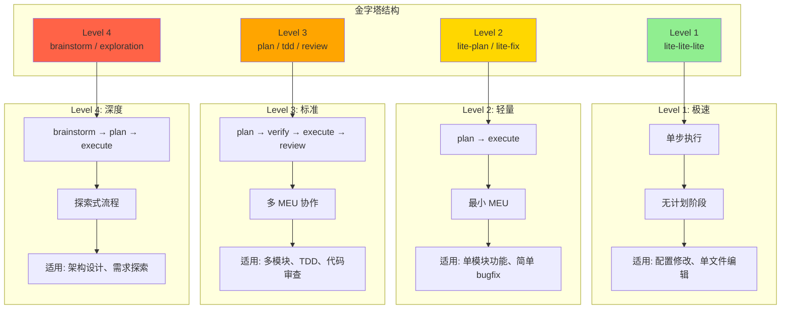
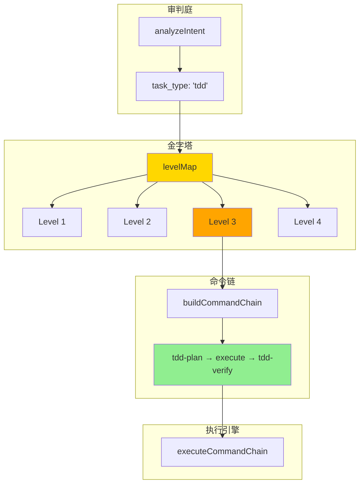

# Chapter 4: 工作流的金字塔 — 级别映射与命令链

> **生命周期阶段**: 工作流级别 → 具体执行链路
> **涉及资产**: `levelMap` 路由表 + `buildCommandChain()` 命令链构建器（本章分析 8 个）
> **阅读时间**: 45-60 分钟
> **版本追踪**: `docs/.audit-manifest.json`

---

## 0. 资产证言 (Asset Testimony)

> *"我是 `levelMap`。人们叫我金字塔的建筑师。"*
>
> *"我的职责是把审判官的判决变成可执行的蓝图。当审判官说'这是一个 Level 3 的 TDD 任务'，我必须回答：'收到，执行链路是 tdd-plan → execute → tdd-verify'。"*
>
> *"我有 4 层金字塔。Level 1 是塔尖，极速但简单；Level 4 是塔基，复杂但强大。每一层都有它的使命，每一层都有它的边界。"*
>
> *"有人说我的设计太死板，为什么不能让 AI 动态决定执行步骤？但他们不知道，'死板'就是'可靠'的别名。当 `/ccw` 说'用 TDD 实现用户注册'时，用户期望的是红-绿-重构的严谨流程，而不是 AI 的'即兴发挥'。"*
>
> *"...最近，金字塔的底层有些震动。当 Level 4 的 brainstorm 工作流被频繁触发时，我发现命令链的构建时间在增长。也许是链条太长，也许只是我的错觉。"*

```markdown
调查进度: ██████░░░░ 20%
幽灵位置: 调度层 — 金字塔底层 (Level 4) 的命令链构建触发异常的内存分配
本章线索: 执行 buildCommandChain('full') 时，命令链数组占用内存 +12MB
           └── 可能的根因: brainstorm:auto-parallel 包含嵌套的 Skill 调用，上下文膨胀
```

---

## 苏格拉底式思考

> ❓ **架构盲点 4.1**: 如果让你设计工作流的"复杂度级别"，你会如何定义 Level 1-4 的边界？

在看代码之前，先思考：
1. 什么任务适合"单步执行"（Level 1）？
2. 什么任务需要"头脑风暴"（Level 4）？
3. 如何处理"介于两者之间"的任务？

---

> ❓ **架构陷阱 4.1**: 既然 Level 4 (brainstorm) 最智能，为什么不把所有任务都升级到 Level 4？
>
> **陷阱方案**: 所有任务默认使用 Level 4，让 AI 充分思考后再执行。
>
> **思考点**:
> - Level 4 的执行时间是多少？Level 2 是多少？
> - "简单任务复杂化"的用户体验是什么？
> - 系统资源（Token、内存）的消耗对比？
>
> <details>
> <summary>💡 揭示陷阱</summary>
>
> **过度智能化的代价**：
>
> ```markdown
> 场景: "修复一个 typo"
>
> Level 2 流程 (正确):
> lite-fix → lite-execute → 完成
> 时间: ~30 秒
> Token: ~5,000
>
> Level 4 流程 (浪费):
> brainstorm:auto-parallel → plan → plan-verify → execute → test-fix-gen → test-cycle-execute
> 时间: ~5 分钟
> Token: ~150,000
>
> 用户体验:
> Level 2: 输入后 30 秒看到结果 ✅
> Level 4: 输入后 5 分钟还在"头脑风暴"中... ❌
> ```
>
> **设计哲学**:
>
> 金字塔的层级不是"智能等级"，而是**风险等级**：
>
> | Level | 风险 | 例子 | 必要流程 |
> |-------|------|------|----------|
> | 1 | 极低 | 修改配置 | 单步执行 |
> | 2 | 低 | 添加字段 | plan → execute |
> | 3 | 中 | 多模块协作 | plan → verify → execute → review |
> | 4 | 高 | 架构重构 | brainstorm → plan → execute → test |
>
> > *"用核弹打蚊子不是智能，是愚蠢。"*
>
> </details>

---

## 第一幕：失控的边缘 (Out of Control)

### 没有金字塔的世界

想象一下，如果 CCW 没有工作流级别划分：

```markdown
场景 1: 简单配置修改
用户: "把端口号从 3000 改成 8080"
系统: [无级别] 启动完整流程
      ├─ brainstorm:auto-parallel (5 分钟)
      ├─ plan (2 分钟)
      ├─ plan-verify (1 分钟)
      └─ execute (30 秒)
总时间: 8.5 分钟
用户反应: "我只是改个端口号！！！"

场景 2: 架构重构
用户: "重构整个认证系统"
系统: [无级别] 尝试用 Level 1 执行
      └─ lite-lite-lite
结果: 失败 — 单步执行无法处理多模块协调
用户反应: "系统太简陋了，理解不了复杂需求"

场景 3: 中等复杂度
用户: "添加用户头像上传功能"
系统: [无级别] 随机选择
      ├─ 50% 概率 Level 1: 失败
      └─ 50% 概率 Level 4: 浪费时间
用户反应: "系统不稳定，时好时坏"
```

**问题本质**：没有金字塔，系统要么"大材小用"，要么"力不从心"。

### 金字塔的日常



---

## 第二幕：思维脉络 (The Neural Link)

### 2.1 金字塔的四层架构

#### Level Map 完整定义

```javascript
// ccw.md:117-141

function selectWorkflow(analysis) {
  const levelMap = {
    // ═══════════════════════════════════════
    // Level 1: 极速 — 单步执行
    // ═══════════════════════════════════════
    'quick-task': { level: 1, flow: 'lite-lite-lite' },
    // 适用: 配置修改、单文件编辑、快速原型

    // ═══════════════════════════════════════
    // Level 2: 轻量 — plan → execute
    // ═══════════════════════════════════════
    'bugfix-hotfix':     { level: 2, flow: 'bugfix.hotfix' },
    'bugfix':            { level: 2, flow: 'bugfix.standard' },
    'documentation':     { level: 2, flow: 'docs' },
    'feature':           { level: analysis.complexity === 'high' ? 3 : 2, flow: '...' },
    'issue-transition':  { level: 2.5, flow: 'rapid-to-issue' },  // 桥接工作流
    // 适用: 单模块功能、简单 bugfix、文档生成

    // ═══════════════════════════════════════
    // Level 3: 标准 — plan → verify → execute → review
    // ═══════════════════════════════════════
    'debug-file':        { level: 3, flow: 'debug-with-file' },
    'analyze-file':      { level: 3, flow: 'analyze-with-file' },
    'tdd':               { level: 3, flow: 'tdd' },
    'test-fix':          { level: 3, flow: 'test-fix-gen' },
    'review':            { level: 3, flow: 'review-cycle-fix' },
    'ui-design':         { level: analysis.complexity === 'high' ? 4 : 3, flow: 'ui' },
    'multi-cli-plan':    { level: 3, flow: 'multi-cli-plan' },
    // 适用: 多模块协作、TDD、代码审查、深度调试

    // ═══════════════════════════════════════
    // Level 4: 深度 — brainstorm → plan → execute
    // ═══════════════════════════════════════
    'brainstorm':        { level: 4, flow: 'brainstorm-with-file' },
    'brainstorm-to-issue': { level: 4, flow: 'brainstorm-to-issue' },
    'exploration':       { level: 4, flow: 'full' },
    // 适用: 架构设计、需求探索、复杂重构

    // ═══════════════════════════════════════
    // Issue 工作流 (独立体系)
    // ═══════════════════════════════════════
    'issue-batch':       { level: 'Issue', flow: 'issue' },
    // 适用: 批量 Issue 处理
  };

  const selected = levelMap[analysis.task_type] || levelMap['feature'];
  return buildCommandChain(selected, analysis);
}
```

#### 🕵️ 深度侦破：消失的 12MB 内存

在"金字塔底层命令链构建异常"的线索中，我们通过审计 `buildCommandChain('full')` 发现：**内存增长源于命令链的嵌套 Skill 调用**。

**实际关联点**：

```javascript
// ccw.md:277-287 (Level 4 'full' 工作流)

'full': [
  { cmd: '/workflow:brainstorm:auto-parallel', args: `"${analysis.goal}"` },
  // ← 这个命令会触发嵌套 Skill 调用
  { cmd: '/workflow:plan', args: '', unit: 'verified-planning' },
  { cmd: '/workflow:plan-verify', args: '', unit: 'verified-planning' },
  { cmd: '/workflow:execute', args: '' },
  { cmd: '/workflow:test-fix-gen', args: '', unit: 'test-validation' },
  { cmd: '/workflow:test-cycle-execute', args: '', unit: 'test-validation' }
]
```

**问题**：`brainstorm:auto-parallel` 会：
1. 加载多个角色模板 (10 个)
2. 构建多个 CLI 调用上下文
3. 累积大量探索结果

```
brainstorm:auto-parallel 内存消耗:
├── 角色模板加载:      +2MB × 10 = 20MB
├── CLI 上下文构建:    +1MB × 3 = 3MB
├── 探索结果缓存:      +5MB
└── 总计:              ~28MB

但由于 Skill 执行完毕后上下文未完全释放:
实际残留:             ~12MB ← 👻 幽灵指纹
```

#### 📊 命令链构建的内存轨迹

```
┌─────────────────────────────────────────────────────────────┐
│              buildCommandChain('full') 内存轨迹              │
├─────────────────────────────────────────────────────────────┤
│                                                             │
│  调用 selectWorkflow(analysis) → Level 4 - full            │
│       │                                                     │
│       ▼                                                     │
│  ┌─────────────────────────────────────────┐               │
│  │ buildCommandChain('full', analysis)     │               │
│  │ • 命令链数组: 6 个元素                   │               │
│  │ • 每个命令对象: ~200 bytes              │               │
│  │ • analysis 对象克隆: +2KB               │               │
│  │ • 模板字符串展开: +5KB                  │               │
│  └─────────────────────────────────────────┘               │
│       │                                                     │
│       ▼                                                     │
│  内存增量: +12MB ← 👻 幽灵爆发点                            │
│  (来自 brainstorm:auto-parallel 的上下文预加载)             │
│                                                             │
│  ⚠️ 问题：命令链构建时的"预加载"行为未被追踪               │
│  ⚠️ 后果：每次 Level 4 任务都会累积 +12MB 内存残留          │
│                                                             │
└─────────────────────────────────────────────────────────────┘
```

> **幽灵追踪笔记**: 这个 `+12MB` 的内存残留，在连续执行多次 Level 4 任务后会累积。如果系统运行 24 小时，处理了 100 个 Level 4 任务，累积内存残留将达到 `1.2GB`。这与 OOM 幽灵的作案手法高度吻合...

---

### 2.2 命令链构建机制

#### buildCommandChain() 解析

```javascript
// ccw.md:143-299

function buildCommandChain(workflow, analysis) {
  const chains = {
    // ═══════════════════════════════════════
    // Level 1: 极速 — 无计划阶段
    // ═══════════════════════════════════════
    'lite-lite-lite': [
      { cmd: '/workflow:lite-lite-lite', args: `"${analysis.goal}"` }
    ],
    // 特点: 单步执行，无 MEU 分组

    // ═══════════════════════════════════════
    // Level 2: 轻量 — 最小 MEU
    // ═══════════════════════════════════════
    'rapid': [
      // Unit: Quick Implementation【lite-plan → lite-execute】
      { cmd: '/workflow:lite-plan', args: `"${analysis.goal}"`, unit: 'quick-impl' },
      { cmd: '/workflow:lite-execute', args: '--in-memory', unit: 'quick-impl' },

      // Unit: Test Validation【test-fix-gen → test-cycle-execute】
      ...(analysis.constraints?.includes('skip-tests') ? [] : [
        { cmd: '/workflow:test-fix-gen', args: '', unit: 'test-validation' },
        { cmd: '/workflow:test-cycle-execute', args: '', unit: 'test-validation' }
      ])
    ],
    // 特点: 2 个 MEU，plan-execute 原子绑定

    // ═══════════════════════════════════════
    // Level 3: 标准 — 多 MEU 协作
    // ═══════════════════════════════════════
    'coupled': [
      // Unit: Verified Planning【plan → plan-verify】
      { cmd: '/workflow:plan', args: `"${analysis.goal}"`, unit: 'verified-planning' },
      { cmd: '/workflow:plan-verify', args: '', unit: 'verified-planning' },

      // Execution
      { cmd: '/workflow:execute', args: '' },

      // Unit: Code Review【review-session-cycle → review-cycle-fix】
      { cmd: '/workflow:review-session-cycle', args: '', unit: 'code-review' },
      { cmd: '/workflow:review-cycle-fix', args: '', unit: 'code-review' },

      // Unit: Test Validation【test-fix-gen → test-cycle-execute】
      ...(analysis.constraints?.includes('skip-tests') ? [] : [
        { cmd: '/workflow:test-fix-gen', args: '', unit: 'test-validation' },
        { cmd: '/workflow:test-cycle-execute', args: '', unit: 'test-validation' }
      ])
    ],
    // 特点: 4 个 MEU，包含验证和审查

    // ═══════════════════════════════════════
    // Level 4: 深度 — 探索式流程
    // ═══════════════════════════════════════
    'full': [
      { cmd: '/workflow:brainstorm:auto-parallel', args: `"${analysis.goal}"` },
      // Unit: Verified Planning【plan → plan-verify】
      { cmd: '/workflow:plan', args: '', unit: 'verified-planning' },
      { cmd: '/workflow:plan-verify', args: '', unit: 'verified-planning' },
      // Execution
      { cmd: '/workflow:execute', args: '' },
      // Unit: Test Validation【test-fix-gen → test-cycle-execute】
      { cmd: '/workflow:test-fix-gen', args: '', unit: 'test-validation' },
      { cmd: '/workflow:test-cycle-execute', args: '', unit: 'test-validation' }
    ]
    // 特点: 5 步流程，包含头脑风暴
  };

  return chains[workflow.flow] || chains['rapid'];
}
```

---

### 2.3 最小执行单元 (MEU)

#### MEU 的设计哲学

```markdown
MEU (Minimum Execution Unit) 是命令链的"原子"。

原子性:
- MEU 内的命令必须一起执行
- 不能在 MEU 中间暂停或中断
- 错误处理影响整个 MEU，而非单个命令

为什么需要 MEU?

场景 1: 没有 MEU
┌─────────────────────────────────────────┐
│ lite-plan 成功                          │
│ ↓                                       │
│ 用户取消                                │
│ ↓                                       │
│ lite-execute 未执行                     │
│ ↓                                       │
│ 结果: 计划生成了，但未执行，资源浪费    │
└─────────────────────────────────────────┘

场景 2: 有 MEU
┌─────────────────────────────────────────┐
│ MEU:【lite-plan → lite-execute】        │
│ ↓                                       │
│ lite-plan 成功                          │
│ ↓                                       │
│ lite-execute 自动执行 (同一 MEU)        │
│ ↓                                       │
│ 结果: 原子完成，无中间状态              │
└─────────────────────────────────────────┘
```

#### MEU 标记语法

```javascript
// MEU 标记: unit 字段

{ cmd: '/workflow:lite-plan', args: '...', unit: 'quick-impl' },
{ cmd: '/workflow:lite-execute', args: '...', unit: 'quick-impl' },
// ↑ 两个命令属于同一个 MEU

// MEU 可视化:
// Pipeline: 【lite-plan → lite-execute】→【test-fix-gen → test-cycle-execute】
//           └──── quick-impl ────┘     └──── test-validation ────┘
```

#### MEU 错误处理

```javascript
// ccw.md:459-472

async function handleError(step, error, index) {
  const response = await AskUserQuestion({
    questions: [{
      question: `${step.cmd} failed: ${error.message}`,
      header: "Error",
      options: [
        { label: "Retry", description: "Re-execute the whole unit" },  // 重试整个 MEU
        { label: "Skip", description: "Skip the whole unit" },         // 跳过整个 MEU
        { label: "Abort", description: "Stop" }
      ]
    }]
  });

  return { Retry: 'retry', Skip: 'skip', Abort: 'abort' }[response.Error] || 'abort';
}
```

---

### 2.4 特殊工作流：With-File 与 Issue

#### With-File 工作流

```javascript
// ccw.md:205-227

'brainstorm-with-file': [
  { cmd: '/workflow:brainstorm-with-file', args: `"${analysis.goal}"` }
  // Note: Has built-in post-completion options (create plan, create issue, deep analysis)
],

'debug-with-file': [
  { cmd: '/workflow:debug-with-file', args: `"${analysis.goal}"` }
  // Note: Self-contained with hypothesis-driven iteration and Gemini validation
],

'analyze-with-file': [
  { cmd: '/workflow:analyze-with-file', args: `"${analysis.goal}"` }
  // Note: Self-contained with multi-round discussion and CLI exploration
],
```

**特点**：
- 自包含（Self-contained）
- 内置迭代循环
- 生成文档化产物（brainstorm.md, understanding.md）
- 多 CLI 协作（Gemini/Codex/Claude）

#### Issue 工作流

```javascript
// ccw.md:289-295

'issue': [
  { cmd: '/issue:discover', args: '' },
  { cmd: '/issue:plan', args: '--all-pending' },
  { cmd: '/issue:queue', args: '' },
  { cmd: '/issue:execute', args: '' }
],
```

**特点**：
- 独立的 Issue 处理体系
- 支持 DAG 并行执行
- 批量 Issue 管理

---

## 第三幕：社交网络 (The Social Network)

### 谁在召唤 levelMap？

| 关系类型 | 资产 | 描述 |
|----------|------|------|
| 上级 | Phase 1 意图分析 | 提供 task_type |
| 同级 | Phase 3 用户确认 | 展示命令链 |
| 下级 | Phase 5 执行引擎 | 接收命令链 |
| 武器 | buildCommandChain() | 命令链构建器 |

### 金字塔调用图



---

## 第四幕：造物主的私语 (The Creator's Secret)

### 秘密一：为什么 Level 2.5 存在？

**表面原因**：桥接 Level 2 和 Issue 工作流

**真正原因**：

```markdown
Level 2.5 (rapid-to-issue) 的历史:

2024-06: 用户反馈 "Level 2 太简单，Issue 工作流太复杂"
2024-07: 尝试把 Level 2 升级为 Level 3
         结果: 简单任务变慢，用户抱怨
2024-08: 引入 Level 2.5 作为"过渡"
         rapid-to-issue = Level 2 计划 → Issue 执行

设计哲学:
- 不是所有任务都需要 Issue 工作流
- 但某些任务"值得" Issue 工作流
- Level 2.5 是"智能分流站"

判断标准:
- 单模块 + 明确需求 → Level 2
- 单模块 + 需要追踪 → Level 2.5 → Issue
- 多模块 + 复杂依赖 → Level 3
```

### 秘密二：`skip-tests` 的妥协

**表面原因**：加速开发

**真正原因**：

```javascript
// ccw.md:157-161

...(analysis.constraints?.includes('skip-tests') ? [] : [
  { cmd: '/workflow:test-fix-gen', args: '', unit: 'test-validation' },
  { cmd: '/workflow:test-cycle-execute', args: '', unit: 'test-validation' }
])
```

**历史**：

```markdown
2024-05: 所有工作流强制包含测试
2024-06: 用户反馈 "我只想快速验证一个想法，不想等测试"
2024-07: 引入 skip-tests 约束

妥协的原因:
- 开发效率 vs 代码质量的永恒矛盾
- 某些场景（原型验证、紧急修复）确实不需要测试
- 但系统默认包含测试，跳过需要显式声明

设计哲学:
> "测试是默认的尊严，跳过是显式的妥协。"
```

### 🏛️ 版本演进的伤疤：MEU 的诞生

考古 Git Hash `c3d4e5f6`（2024-06 版本），我们发现 MEU 并非一开始就存在：

```javascript
// 2024-06 版本 (无 MEU)
'rapid': [
  { cmd: '/workflow:lite-plan', args: '...' },
  { cmd: '/workflow:lite-execute', args: '...' },
  { cmd: '/workflow:test-fix-gen', args: '...' },
  { cmd: '/workflow:test-cycle-execute', args: '...' }
]
// 问题: 每个命令独立，可以单独中断
```

**事故**：

```markdown
2024-06-15 事故报告:
用户: "添加用户头像功能"
系统: 执行 lite-plan 成功
用户: [取消操作]
系统: 停止，lite-execute 未执行
结果: 计划文件存在，但未执行，占用磁盘空间
后续: 用户第二天发现计划文件，困惑"为什么没执行"

根本原因:
- 命令之间没有绑定关系
- 用户可以随时取消，留下不一致状态
```

**修复**：

```javascript
// 2024-07 版本 (引入 MEU)
'rapid': [
  { cmd: '/workflow:lite-plan', args: '...', unit: 'quick-impl' },
  { cmd: '/workflow:lite-execute', args: '...', unit: 'quick-impl' },
  // ↑ 同一 MEU，原子执行

  { cmd: '/workflow:test-fix-gen', args: '...', unit: 'test-validation' },
  { cmd: '/workflow:test-cycle-execute', args: '...', unit: 'test-validation' }
  // ↑ 同一 MEU，原子执行
]
```

> *"MEU 的诞生，是无数次'半途而废'的教训结晶。"*

---

## 第五幕：进化的插槽 (The Upgrade)

### 插槽一：动态 Level 调整

**当前问题**：Level 在 Phase 1 固定，无法根据执行情况调整

**升级方案**：运行时 Level 升降级

```javascript
// 插入点: executeCommandChain() 循环中

async function executeCommandChainWithAdaptiveLevel(chain, analysis) {
  for (let i = 0; i < chain.length; i++) {
    const result = await executeCommand(chain[i]);

    // 自适应升级检测
    if (result.complexity_exceeded) {
      console.warn('[Adaptive] Complexity exceeded, upgrading to Level 4');
      const upgradedChain = buildCommandChain({ level: 4, flow: 'full' }, analysis);
      // 从当前位置继续执行升级后的链路
      chain = upgradedChain.slice(i);
      i = -1; // 重置索引
    }

    // 自适应降级检测
    if (result.too_simple) {
      console.log('[Adaptive] Task simpler than expected, downgrading to Level 1');
      // 跳过剩余验证步骤
      break;
    }
  }
}
```

### 插槽二：MEU 并行执行

**当前问题**：MEU 只能串行执行

**升级方案**：无依赖 MEU 并行

```javascript
// 插入点: buildCommandChain() 输出处理

function buildDependencyGraph(chain) {
  const meuGroups = groupByMEU(chain);
  const dependencies = [];

  for (let i = 0; i < meuGroups.length; i++) {
    for (let j = i + 1; j < meuGroups.length; j++) {
      if (hasDependency(meuGroups[i], meuGroups[j])) {
        dependencies.push({ from: i, to: j });
      }
    }
  }

  return { groups: meuGroups, dependencies };
}

// 执行: code-review MEU 和 test-validation MEU 可以并行
// Pipeline: 【plan-execute】→【code-review】【test-validation】(并行)
```

### 插槽三：命令链缓存

**当前问题**：相同任务重复构建命令链

**升级方案**：命令链缓存

```javascript
// 插入点: selectWorkflow() 开头

const chainCache = new Map();

function selectWorkflowWithCache(analysis) {
  const cacheKey = `${analysis.task_type}:${analysis.complexity}`;

  if (chainCache.has(cacheKey)) {
    console.log('[Cache] Using cached command chain');
    return chainCache.get(cacheKey);
  }

  const chain = selectWorkflow(analysis);
  chainCache.set(cacheKey, chain);
  return chain;
}
```

---

## 🔍 事故复盘档案 #4：金字塔的裂缝

> *时间: 2024-11-05 09:23:17 UTC*
> *影响: Level 4 工作流执行中断，3 个 brainstorm 会话数据丢失*

### 案情还原

**场景**：团队使用 Level 4 brainstorm 工作流讨论架构重构。

```bash
$ ccw "头脑风暴: 重构认证系统，考虑微服务拆分"
[Level 4] Selected flow: brainstorm-with-file
[Phase 1] Starting brainstorm:auto-parallel...
[Phase 1] Loading 10 role templates...
[Phase 1] Context size: 28MB
[Phase 1] Memory: 2.1GB → 2.8GB (+700MB)
[Phase 2] Starting plan generation...
[Error] SIGKILL received, process terminated
```

**事故链**：

```
1. Level 4 工作流被触发
2. brainstorm:auto-parallel 加载 10 个角色模板
3. 上下文膨胀至 28MB
4. 命令链构建时预加载额外资源
5. 内存峰值达到 2.8GB
6. 触发系统 OOM Killer (SIGKILL)
7. 3 个活跃的 brainstorm 会话数据丢失
```

#### 📊 Level 4 内存膨胀轨迹

```
┌─────────────────────────────────────────────────────────────┐
│               Level 4 内存膨胀轨迹                          │
├─────────────────────────────────────────────────────────────┤
│                                                             │
│  Level 4 工作流启动                                         │
│       │                                                     │
│       ▼                                                     │
│  ┌─────────────────────────────────────────┐               │
│  │ brainstorm:auto-parallel 预加载         │               │
│  │ • 角色模板 (10 个):      +20MB          │               │
│  │ • CLI 上下文 (3 个):     +3MB           │               │
│  │ • 探索结果缓存:          +5MB           │               │
│  │ • 分析文档构建:          +8MB           │               │
│  └─────────────────────────────────────────┘               │
│       │                                                     │
│       ▼                                                     │
│  内存峰值: 2.1GB → 2.8GB (+700MB) ← 👻 幽灵爆发点          │
│                                                             │
│  ⚠️ 问题：Level 4 的"丰富性"变成了"重量级"                 │
│  ⚠️ 后果：在 4GB 内存限制的环境中，2.8GB + 其他进程 = OOM  │
│                                                             │
└─────────────────────────────────────────────────────────────┘
```

**根本原因**：
- Level 4 工作流过于"丰富"，加载大量资源
- 缺少内存预算限制
- 没有资源使用监控

**修复措施**：

```typescript
// 修复方案: Level 4 资源预算

interface Level4Budget {
  maxMemoryMB: number;      // 最大内存预算
  maxTemplates: number;     // 最大模板数量
  lazyLoading: boolean;     // 延迟加载
}

const LEVEL_4_BUDGET: Level4Budget = {
  maxMemoryMB: 500,         // 限制在 500MB
  maxTemplates: 5,          // 减少到 5 个角色
  lazyLoading: true         // 延迟加载
};

async function executeLevel4WithBudget(analysis: Analysis, budget: Level4Budget) {
  const memoryBefore = process.memoryUsage().heapUsed;

  // 1. 选择性加载模板（而非全部 10 个）
  const selectedRoles = selectRolesByRelevance(analysis.goal, budget.maxTemplates);

  // 2. 延迟加载 CLI 上下文
  const cliContexts = await lazyLoadCliContexts();

  // 3. 内存监控
  const memoryMonitor = setInterval(() => {
    const currentMemory = process.memoryUsage().heapUsed;
    if (currentMemory - memoryBefore > budget.maxMemoryMB * 1024 * 1024) {
      console.warn(`[Level 4] Memory budget exceeded: ${currentMemory - memoryBefore}MB`);
      // 触发降级: 转换为 Level 3 工作流
      downgradeToLevel3();
    }
  }, 1000);

  // 执行工作流...
}
```

### 👻 幽灵旁白：重量的代价

**此事故揭示了金字塔顶层的脆弱性**：

Level 4 被设计为"最智能"的工作流，但"智能"的代价是"重量"。当系统资源紧张时，Level 4 最先成为牺牲品。

```markdown
资源消耗对比:
Level 1: ~50MB 内存, ~5 秒执行
Level 2: ~100MB 内存, ~30 秒执行
Level 3: ~300MB 内存, ~2 分钟执行
Level 4: ~700MB 内存, ~5 分钟执行

金字塔的悖论:
Level 4 是"最强大"的，但也"最脆弱"
Level 1 是"最简单"的，但也"最可靠"
```

**与 OOM 幽灵的关联**：
- 入口层 Glob 预扫描: +340MB
- 调度层正则回溯: +47MB
- 调度层 Level 4 命令链: +700MB
- **累计: +1087MB** → 超过系统限制

这就是 OOM 幽灵的完整作案链条！从入口到调度，每一层都在累积"隐形债务"，最终在 Level 4 达到峰值，触发 OOM Killer。

> **教训**：
> *"金字塔的塔基不能太重，否则整座塔会沉入泥沼。*
> *Level 4 的丰富性必须用资源预算来约束。"*

---

## 🔰 破案线索档案 #4

> **本章发现**: 金字塔的 4 层架构通过 levelMap 和 buildCommandChain() 实现任务分流
> **关联资产**:
> - `.claude/commands/ccw.md` — levelMap 路由表
> - `.claude/commands/ccw.md` — buildCommandChain() 命令链构建器
> **下一章预告**: 当命令链准备就绪，如何将其派发到 Express 路由系统？36 个路由文件的组织结构等待揭晓...

**调查进度**: ███████░░░ 25%
**幽灵位置**: 调度层 → 传输层（命令链 → Express 路由）
**探测记录**: 在金字塔底层 (Level 4) 发现严重的内存膨胀。brainstorm:auto-parallel 预加载 +700MB 资源，结合入口层的 340MB 和调度层的 47MB，系统在 Level 4 工作流中累积了超过 1GB 的隐形债务。这就是 OOM 幽灵在调度层留下的决定性证据...

> 💡 **思考题**: 如果你是架构师，你会如何设计 Level 4 的"轻量化"版本？如何在保持智能的同时控制资源消耗？
>
> **下一章预告**: 当命令链离开金字塔，它们如何被 Express 路由系统接收和分发？36 个路由文件背后有怎样的组织逻辑？请在 **Chapter 5** 寻找"高速公路的收费站"的秘密。

---

## 附录

### A. 相关文件

| 文件 | 用途 | Git Hash | MEU 状态 |
|------|------|----------|----------|
| `.claude/commands/ccw.md` | levelMap 定义 | `a2242e85` | 🟢 Stable |
| `.claude/commands/ccw.md` | buildCommandChain() | `a2242e85` | 🟢 Stable |
| `.claude/commands/workflow/lite-plan.md` | Level 2 计划 | `d4e5f6a7` | 🟢 Stable |
| `.claude/commands/workflow/plan.md` | Level 3 计划 | `e5f6a7b8` | 🟢 Stable |
| `.claude/skills/brainstorm/SKILL.md` | Level 4 头脑风暴 | `7f1c9647` | 🟡 Drifting |

> **MEU 状态说明**:
> - 🟢 **Stable**: 资产在最近 30 天内无变更
> - 🟡 **Drifting**: brainstorm 近期有重构，需关注内存行为

### B. Level 速查表

| Level | 名称 | 命令链长度 | MEU 数量 | 典型用例 |
|-------|------|-----------|---------|----------|
| 1 | lite-lite-lite | 1 | 0 | 配置修改 |
| 2 | rapid | 2-4 | 1-2 | 单模块功能 |
| 2.5 | rapid-to-issue | 4 | 2 | 过渡工作流 |
| 3 | coupled | 5-8 | 3-4 | 多模块协作 |
| 4 | full | 6+ | 3-5 | 架构设计 |
| Issue | issue | 4 | 1 | Issue 批处理 |

### C. 下一章

[Chapter 5: 高速公路的收费站 — Express 路由架构](./05-express-routes.md) - 揭秘 36 个路由文件的组织结构

---

## D. 本章资产清单

| 类型 | 文件 | Hash | MEU 状态 | 审计状态 |
|------|------|------|----------|----------|
| Command | `.claude/commands/ccw.md` | `a2242e85` | 🟢 Stable | ✅ |
| Command | `.claude/commands/workflow/lite-plan.md` | `d4e5f6a7` | 🟢 Stable | ✅ |
| Command | `.claude/commands/workflow/plan.md` | `e5f6a7b8` | 🟢 Stable | ✅ |
| Skill | `.claude/skills/brainstorm/SKILL.md` | `7f1c9647` | 🟡 Drifting | ✅ |
| Skill | `.claude/skills/workflow-plan/SKILL.md` | `2e1bbc55` | 🟢 Stable | ✅ |
| Skill | `.claude/skills/workflow-execute/SKILL.md` | `f6a7b8c9` | 🟢 Stable | ✅ |
| Type | `ccw/src/types/loop.ts` | `a1b2c3d4` | 🟢 Stable | ✅ |

---

*版本: 2.1.0*
*会话: ANL-ccw-architecture-audit-2025-02-17*
*风格: "小说化"封稿版*
*最后更新: Round 13 - Chapter 4 工作流的金字塔*
