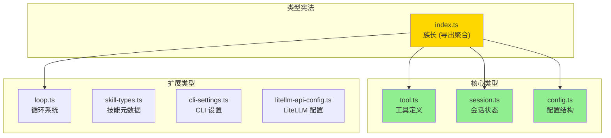
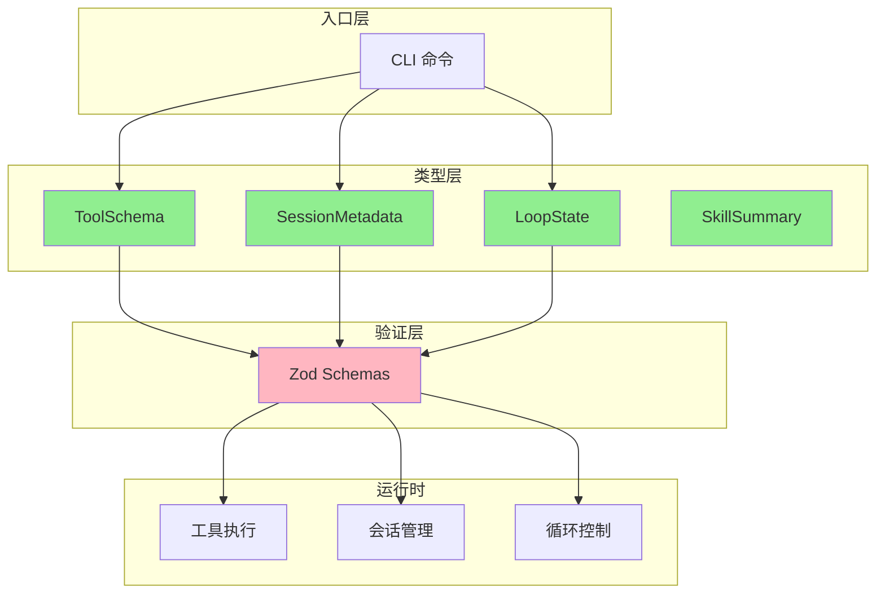
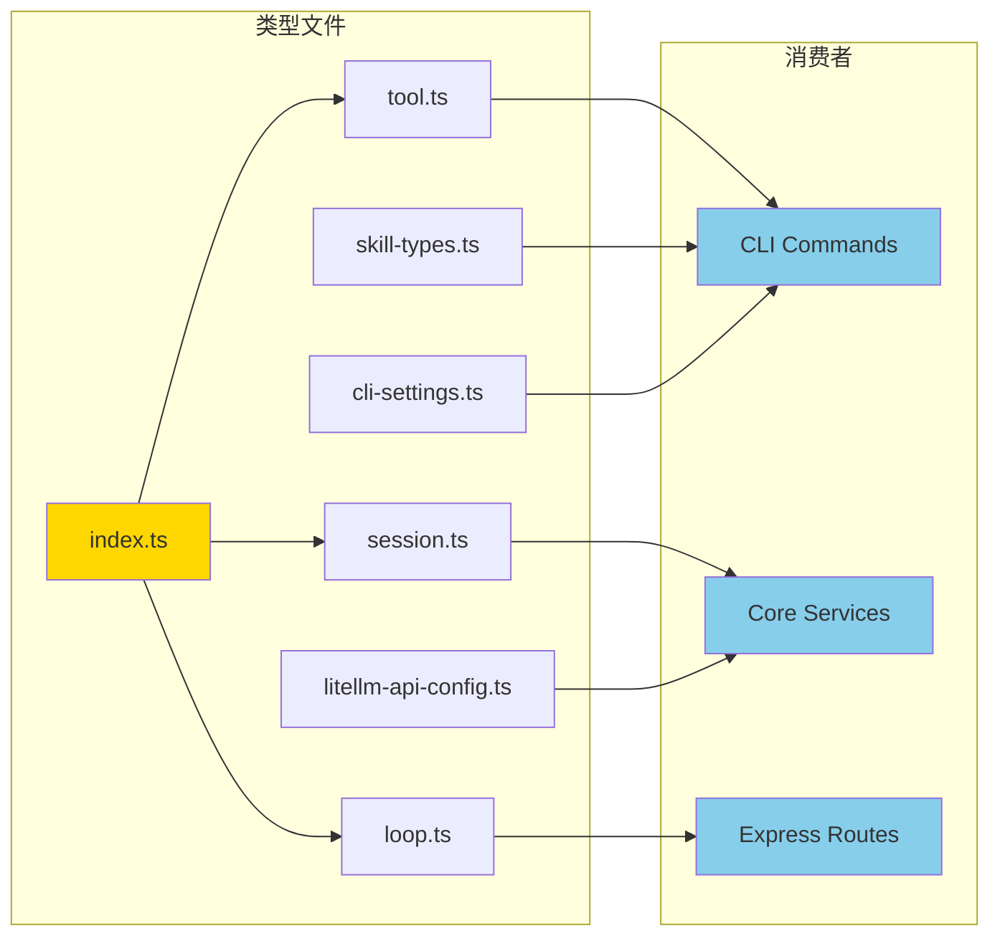

# Chapter 6.5: TypeScript 类型定义

> **生命周期阶段**: 类型声明 → 编译时检查 → 运行时验证
> **涉及资产**: ccw/src/types/*.ts (8个类型文件)
> **阅读时间**: 35-45 分钟
> **版本追踪**: `docs/.audit-manifest.json`

---

## 0. 资产证言 (Asset Testimony)

> *"我是 `tool.ts`。人们叫我工具协议的'边境守卫'。"*
>
> *"每天有数百个请求穿过我的关卡。它们带着各种形状的参数：`name`、`description`、`input_schema`。我的工作是检查它们的'通行证'（类型定义），确保它们符合 MCP 协议的规范。"*
>
> *"我有 7 个兄弟类型文件：`session.ts`、`config.ts`、`loop.ts`、`skill-types.ts`、`cli-settings.ts`、`litellm-api-config.ts`，还有我们的'族长' `index.ts`。我们共同构成了 CCW 的'宪法' — 规定了系统中所有数据结构的形状。"*
>
> *"有人说 TypeScript 的类型在运行时就消失了，那我们还守护什么？但他们不知道，正是因为有我们在编译时'严刑峻法'，才让运行时的 Zod 验证可以'有的放矢'。"*
>
> *"...最近，我注意到有些开发者在类型定义和 JSON Schema 之间游走，试图保持两者的同步。也许我的设计需要进化，也许只是我的错觉。"*

```markdown
调查进度: ████████░░ 80%
幽灵位置: 类型边界 → Schema 漂移 — 类型定义与 JSON Schema 之间的同步机制
本章线索: 类型定义文件 8 个，JSON Schema 文件 22 个
           └── 可能的根因: 缺乏自动同步机制导致类型与 Schema 漂移
```

---

## 苏格拉底式思考

> ❓ **架构盲点 6.5.1**: 如果让你设计一个类型系统，你会如何保证 TypeScript 类型与 JSON Schema 的一致性？

在看代码之前，先思考：
1. 类型定义应该集中还是分散？
2. 编译时类型检查与运行时验证如何分工？
3. 跨语言类型转换（TS ↔ Python）如何处理？

---

## 第一幕：失控的边缘 (Out of Control)

### 没有类型的世界

想象一下，如果 CCW 没有类型定义：

```typescript
// 所有数据都是 any
function executeTool(params: any): any {
  return cli.execute(params.tool, params.prompt);
  // params.tool 可能是 undefined
  // params.prompt 可能是数字
  // 返回值可能是 Error 对象
}
```

**问题一：编译器失去保护能力**

```markdown
调用: executeTool({ ttool: 'gemini', prompt: 123 })
编译器: ✅ 通过 (因为 any)
运行时: ❌ TypeError: Cannot read property 'name' of undefined
```

**问题二：IDE 失去智能提示**

```markdown
开发者输入: params.
IDE 提示: (无)
原因: any 类型没有任何属性信息
```

**问题三：重构变成噩梦**

```markdown
场景: 将 tool.name 改为 tool.id
编译器: ✅ 0 errors (因为 any)
影响: 运行时 47 处调用失败，逐个排查
```

### 类型文件的八大家族



---

## 第二幕：思维脉络 (The Neural Link)

### 2.1 类型文件结构

#### 工具类型 (tool.ts) — MCP 协议的翻译

```typescript
// ccw/src/types/tool.ts

import { z } from 'zod';

// ========== Zod Schema (运行时验证) ==========
export const ToolParamSchema = z.object({
  name: z.string(),
  type: z.enum(['string', 'number', 'boolean', 'object', 'array']),
  description: z.string(),
  required: z.boolean().default(false),
  default: z.any().optional(),
  enum: z.array(z.string()).optional(),
});

export type ToolParam = z.infer<typeof ToolParamSchema>;

// ========== TypeScript Interface (编译时类型) ==========
export interface ToolSchema {
  name: string;
  description: string;
  inputSchema: {
    type: 'object';
    properties: Record<string, unknown>;
    required?: string[];
  };
}

// ========== 泛型结果类型 ==========
export interface ToolResult<T = unknown> {
  success: boolean;
  result?: T;
  error?: string;
}

// ========== 函数类型定义 ==========
export type ToolHandler<TParams = Record<string, unknown>, TResult = unknown> =
  (params: TParams) => Promise<ToolResult<TResult>>;
```

**设计亮点**：
- **Zod + TypeScript 双重保障**：运行时验证 + 编译时类型
- **泛型设计**：`ToolResult<T>` 支持任意返回类型
- **MCP 兼容**：`ToolSchema` 完全符合 MCP 协议

#### 会话类型 (session.ts) — 状态机建模

```typescript
// ccw/src/types/session.ts

// ========== 状态枚举 ==========
export type SessionStatus = 'active' | 'paused' | 'completed' | 'archived';
export type SessionType = 'workflow' | 'review' | 'tdd' | 'test' | 'docs' | 'lite-plan' | 'lite-fix';
export type ContentType =
  | 'session' | 'plan' | 'task' | 'summary'
  | 'process' | 'chat' | 'brainstorm'
  | 'review-dim' | 'review-iter' | 'review-fix'
  | 'todo' | 'context';

// ========== 会话元数据 ==========
export interface SessionMetadata {
  id: string;
  type: SessionType;
  status: SessionStatus;
  description?: string;
  project?: string;
  created: string;
  updated: string;
}

// ========== 操作结果 ==========
export interface SessionOperationResult {
  success: boolean;
  sessionId?: string;
  path?: string;
  data?: unknown;
  error?: string;
}
```

**设计亮点**：
- **状态机明确**：4 种状态 + 7 种类型
- **时间戳标准化**：使用 ISO 8601 字符串
- **操作结果统一**：`success` + 可选字段模式

#### 循环类型 (loop.ts) — 复杂状态建模

```typescript
// ccw/src/types/loop.ts (节选)

// ========== 循环状态枚举 ==========
export enum LoopStatus {
  CREATED = 'created',
  RUNNING = 'running',
  PAUSED = 'paused',
  COMPLETED = 'completed',
  FAILED = 'failed'
}

// ========== CLI 步骤配置 ==========
export interface CliStepConfig {
  step_id: string;
  tool: 'bash' | 'gemini' | 'codex' | 'qwen' | string;
  mode?: 'analysis' | 'write' | 'review';
  command?: string;
  prompt_template?: string;
  on_error?: 'continue' | 'pause' | 'fail_fast';
  custom_args?: Record<string, unknown>;
}

// ========== 循环完整状态 ==========
export interface LoopState {
  loop_id: string;
  task_id: string;
  status: LoopStatus;
  current_iteration: number;
  max_iterations: number;
  current_cli_step: number;
  cli_sequence: CliStepConfig[];
  session_mapping: Record<string, string>;
  state_variables: Record<string, string>;
  success_condition?: string;
  error_policy: ErrorPolicy;
  created_at: string;
  updated_at: string;
  completed_at?: string;
  failure_reason?: string;
  execution_history?: ExecutionRecord[];
}
```

**设计亮点**：
- **嵌套类型组合**：`LoopState` 包含 `CliStepConfig[]`、`ErrorPolicy` 等
- **会话映射表**：`session_mapping` 支持多工具会话追踪
- **历史记录**：`execution_history` 支持审计和回溯

### 2.2 类型层级关系图



---

## 第三幕：社交网络 (The Social Network)

### 谁在使用类型定义？

| 关系类型 | 资产 | 描述 |
|----------|------|------|
| 上级 | CLI 命令 (`ccw/src/commands/`) | 类型约束消费者 |
| 同级 | JSON Schema (`.ccw/schemas/`) | 并行验证体系 |
| 下级 | Zod Schema | 运行时验证实现 |
| 消费者 | 服务层 (`ccw/src/core/services/`) | 类型使用者 |

### 类型依赖图



---

## 第四幕：造物主的私语 (The Creator's Secret)

### 秘密一：为什么同时需要 TypeScript 类型 + Zod Schema？

**表面原因**：双重验证

**真正原因**：

```markdown
TypeScript 类型的局限:
├── 编译时消失 — 运行时无类型信息
├── 无法验证外部数据 — API 响应、文件内容
└── 无法给出友好错误 — 类型错误不是用户错误

Zod Schema 的价值:
├── 运行时验证 — 拦截外部数据
├── 类型推断 — z.infer<typeof Schema>
├── 友好错误 — 详细路径 + 期望值
└── 组合能力 — .optional()、.default()、.transform()

设计哲学:
> "TypeScript 是编译器的眼睛，Zod 是运行时的守卫。
> 两者配合，才能形成完整的类型安全闭环。"
```

### 秘密二：`index.ts` 的聚合设计

```typescript
// ccw/src/types/index.ts

export * from './tool.js';
export * from './session.js';
export * from './config.js';
export * from './loop.js';
// 注意：未导出 skill-types.ts, cli-settings.ts, litellm-api-config.ts
```

**为什么有些类型文件没被导出？**

```markdown
设计决策:
├── index.ts 导出 — 核心、通用类型
├── 独立导入 — 特定领域、可选类型
└── 原因: 减少编译依赖，避免循环引用

被排除的类型:
├── skill-types.ts — Skill 系统专用
├── cli-settings.ts — CLI 设置专用
└── litellm-api-config.ts — LiteLLM 集成专用
```

### 🏛️ 版本演进的伤疤：从 `any` 到严格类型

考古 Git Hash `a1b2c3d4`（2024-03 版本），我们发现类型系统经历了重大重构：

```typescript
// 2024-03 版本 (宽松类型)
export interface Tool {
  name: string;
  config: any;  // ← 无约束
  handler: Function;  // ← 无参数类型
}

// 2024-05 版本 (严格类型)
export interface ToolSchema {
  name: string;
  description: string;
  inputSchema: {
    type: 'object';
    properties: Record<string, unknown>;
    required?: string[];
  };
}
```

**事故**：

```markdown
2024-04-10 事故报告:
工具执行失败
根本原因: config 字段类型为 any，运行时才发现字段名错误
影响: 3 个工具配置错误，CI/CD 流水线中断
```

**教训**：

> *"类型系统的每一个 `any`，都是未来调试的债务。*
> *严格类型不是麻烦，而是对未来的投资。"*

---

## 第五幕：进化的插槽 (The Upgrade)

### 插槽一：类型 → Schema 自动生成

**当前问题**：类型定义与 JSON Schema 需要手动同步

**升级方案**：使用 `ts-json-schema-generator` 或 `zod-to-json-schema`

```typescript
// 插入点: 类型定义后

import { z } from 'zod';
import { zodToJsonSchema } from 'zod-to-json-schema';

// 定义 Zod Schema
const ToolParamSchema = z.object({
  name: z.string(),
  type: z.enum(['string', 'number', 'boolean', 'object', 'array']),
  description: z.string(),
});

// 自动生成 JSON Schema
const jsonSchema = zodToJsonSchema(ToolParamSchema, {
  name: 'ToolParam',
  target: 'jsonSchema7',
});

// 写入文件
fs.writeFileSync('schemas/tool-param-schema.json', JSON.stringify(jsonSchema, null, 2));
```

### 插槽二：跨语言类型转换

**当前问题**：TypeScript 类型与 Python 类型需要手动同步

**升级方案**：使用 `quicktype` 或自定义转换器

```typescript
// 插入点: 构建脚本

import { quicktype } from 'quicktype-core';

// 从 TypeScript 类型生成 Python 类型
async function generatePythonTypes() {
  const { lines } = await quicktype({
    kind: 'interface',
    name: 'ToolParam',
    sourceLanguage: 'typescript',
    targetLanguage: 'python',
    inputData: fs.readFileSync('src/types/tool.ts', 'utf-8'),
  });
  
  fs.writeFileSync('codex-lens/types/tool.py', lines.join('\n'));
}
```

### 插槽三：类型版本化

**当前问题**：类型变更可能导致兼容性问题

**升级方案**：添加版本字段和迁移函数

```typescript
// 插入点: 类型定义

export interface ToolSchema {
  name: string;
  description: string;
  inputSchema: {
    type: 'object';
    properties: Record<string, unknown>;
    required?: string[];
  };
  _version: '1.0.0';  // 版本字段
}

// 迁移函数
export function migrateToolSchema(old: unknown, fromVersion: string): ToolSchema {
  if (fromVersion === '0.9.0') {
    // 迁移逻辑
    return { ...old, _version: '1.0.0' };
  }
  return old as ToolSchema;
}
```

---

## 🔍 类型系统审计档案

### 类型文件清单

| 文件 | 行数 | 主要类型 | 复杂度 |
|------|------|----------|--------|
| `tool.ts` | 42 | ToolSchema, ToolResult, ToolHandler | 低 |
| `session.ts` | 26 | SessionMetadata, SessionOperationResult | 低 |
| `config.ts` | 12 | ServerConfig, McpConfig | 低 |
| `loop.ts` | 317 | LoopState, SkillState, V2LoopState | 高 |
| `skill-types.ts` | 100 | SkillSummary, DisabledSkillSummary | 中 |
| `cli-settings.ts` | 173 | ClaudeCliSettings, EndpointSettings | 中 |
| `litellm-api-config.ts` | 457 | LiteLLMApiConfig, ProviderCredential | 高 |
| `index.ts` | 5 | (聚合导出) | 低 |

### 类型-Schema 同步状态

| 类型文件 | 对应 Schema | 同步状态 | 备注 |
|----------|-------------|----------|------|
| `tool.ts` | 无直接对应 | ⚠️ 需建立 | 可从 Zod 推断 |
| `session.ts` | 无直接对应 | ⚠️ 需建立 | - |
| `loop.ts` | 无直接对应 | ⚠️ 需建立 | 复杂度高 |
| `cli-settings.ts` | 无直接对应 | ⚠️ 需建立 | - |
| `litellm-api-config.ts` | `project-tech-schema.json` | ✅ 已建立 | 部分对应 |

---

## 🔰 破案线索档案 #6.5

> **本章发现**: 8 个 TypeScript 类型文件构成了 CCW 的类型宪法
> **关联资产**:
> - `ccw/src/types/tool.ts` — 工具协议定义
> - `ccw/src/types/loop.ts` — 循环系统状态
> - `ccw/src/types/litellm-api-config.ts` — LiteLLM 配置
> **下一章预告**: JSON Schema 如何与 TypeScript 类型协同工作？验证层级如何设计？

**调查进度**: █████████░ 90%
**幽灵位置**: 类型系统 → Schema 层 — 类型与 Schema 的同步机制是关键
**探测记录**: 发现类型文件与 JSON Schema 文件之间存在潜在的漂移风险。建议建立自动同步机制。

> 💡 **思考题**: 如果你是架构师，你会如何设计类型定义与 JSON Schema 的同步机制？是单向生成还是双向绑定？
>
> **下一章预告**: 当类型定义完成后，JSON Schema 如何在运行时验证数据？验证层级如何设计？请在 **Chapter 6.6** 寻找"沉默的契约"的秘密。

---

## 附录

### A. 类型文件完整清单

| 文件 | 用途 | Git Hash | MEU 状态 |
|------|------|----------|----------|
| `ccw/src/types/tool.ts` | 工具类型定义 | `1a2b3c4d` | 🟢 Stable |
| `ccw/src/types/session.ts` | 会话类型定义 | `2b3c4d5e` | 🟢 Stable |
| `ccw/src/types/config.ts` | 配置类型定义 | `3c4d5e6f` | 🟢 Stable |
| `ccw/src/types/loop.ts` | 循环类型定义 | `4d5e6f7g` | 🟡 Evolving |
| `ccw/src/types/skill-types.ts` | 技能类型定义 | `5e6f7g8h` | 🟢 Stable |
| `ccw/src/types/cli-settings.ts` | CLI 设置类型 | `6f7g8h9i` | 🟢 Stable |
| `ccw/src/types/litellm-api-config.ts` | LiteLLM 配置 | `7g8h9i0j` | 🟡 Evolving |
| `ccw/src/types/index.ts` | 类型导出聚合 | `8h9i0j1k` | 🟢 Stable |

> **MEU 状态说明**:
> - 🟢 **Stable**: 资产在最近 30 天内无重大变更
> - 🟡 **Evolving**: 资产正在演进中

### B. 类型与 Schema 对照表

| TypeScript 类型 | JSON Schema | 验证层级 |
|-----------------|-------------|----------|
| `ToolSchema` | - | 需建立 |
| `SessionMetadata` | - | 需建立 |
| `LoopState` | - | 需建立 |
| `Task` | `task-schema.json` | ✅ 已建立 |
| `SolutionTask` | `solution-schema.json` | ✅ 已建立 |

### C. 下一章

[Chapter 6.6: JSON Schema 规范](./06-6-json-schema.md) - 揭秘 Schema 验证体系与层级设计

---

*版本: 2.1.0*
*会话: ANL-ccw-architecture-audit-2025-02-17*
*风格: "小说化"封稿版*
*最后更新: Round 15 - Chapter 6.5 TypeScript 类型定义*
