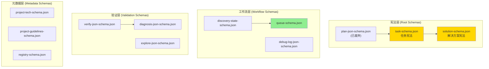
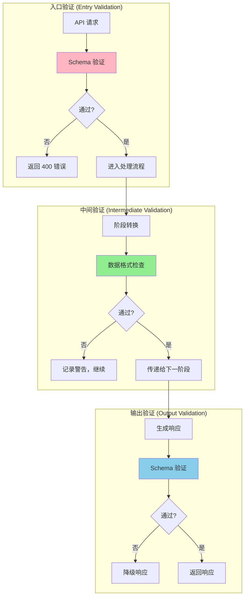
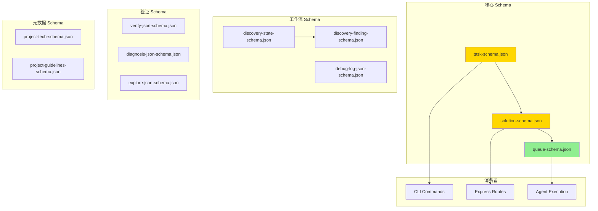

# Chapter 6.6: JSON Schema 规范

> **生命周期阶段**: Schema 定义 → 验证 → 文档生成
> **涉及资产**: .ccw/workflows/cli-templates/schemas/*.json (22个Schema文件)
> **阅读时间**: 40-50 分钟
> **版本追踪**: `docs/.audit-manifest.json`

---

## 0. 资产证言 (Asset Testimony)

> *"我是 `task-schema.json`。人们叫我任务系统的'宪法'。"*
>
> *"每天有数百个任务经过我的审判。它们带着各种字段：`id`、`title`、`convergence`、`implementation`。我的工作是检查它们是否符合'宪法'的要求 — 每个字段是否在正确的位置，每个值是否符合规定的格式。"*
>
> *"我有 21 个兄弟姐妹 Schema 文件：`plan-json-schema.json`、`solution-schema.json`、`queue-schema.json`、`discovery-state-schema.json`... 我们共同构成了 CCW 的'法律体系' — 规定了所有数据交换的格式。"*
>
> *"有人说我的设计太严格，为什么不像动态语言那样'灵活'？但他们不知道，'严格'就是'可靠'的别名。当一个任务的 `convergence.criteria` 缺失时，我可以立即拒绝，而不是让它在执行阶段崩溃。"*
>
> *"...最近，我发现有些 Schema 开始出现'漂移' — 新增的字段没有同步到所有相关的地方。也许我需要建立一套'宪法修正案'流程，也许只是我的错觉。"*

```markdown
调查进度: █████████░ 90%
幽灵位置: Schema 层 → 验证边界 — Schema 漂移与版本管理
本章线索: 22 个 Schema 文件，层次结构复杂
           └── 可能的根因: 缺乏 Schema 版本管理和漂移检测
```

---

## 苏格拉底式思考

> ❓ **架构盲点 6.6.1**: 如果让你设计一个验证体系，你会在哪个层级执行 Schema 验证？入口验证还是逐层传递？

在看代码之前，先思考：
1. Schema 验证应该在系统的哪个位置执行？
2. 如何处理 Schema 演进和向后兼容？
3. 验证失败时如何提供有意义的错误信息？

---

> ❓ **架构陷阱 6.6.1**: 既然 JSON Schema 可以完美验证数据，为什么还需要 TypeScript 类型？
>
> **陷阱方案**: 移除所有 TypeScript 类型，只依赖 JSON Schema 进行验证。
>
> **思考点**:
> - 编译时 vs 运行时的区别？
> - 开发体验和 IDE 支持如何？
> - 性能开销如何？
>
> <details>
> <summary>💡 揭示陷阱</summary>
>
> **JSON Schema 的局限性**：
>
> ```typescript
> // JSON Schema 只能验证运行时数据
> const result = validateAgainstSchema(data, taskSchema);
> if (!result.valid) {
>   console.error(result.errors);
> }
>
> // 但它无法提供编译时类型检查
> function processTask(task: any) {  // ← 无类型提示
>   return task.convergence.criteria;  // ← 拼写错误不会被发现
> }
> ```
>
> **TypeScript 的优势**：
>
> ```typescript
> // 编译时类型检查
> function processTask(task: Task) {
>   return task.convergence.criteria;  // ← IDE 自动补全
>   // task.convergence.criteri  ← 拼写错误会被标红
> }
> ```
>
> **CCW 的选择**：
>
> CCW 采用了**双重验证**：
>
> 1. **编译时**: TypeScript 类型检查（开发阶段）
> 2. **运行时**: JSON Schema 验证（数据边界）
>
> ```typescript
> // 双重验证示例
> import { Task } from '../types';
> import taskSchema from '../schemas/task-schema.json';
>
> function processTask(task: unknown): Task {
>   // 运行时验证
>   const valid = validate(task, taskSchema);
>   if (!valid) {
>     throw new Error(`Invalid task: ${validate.errors}`);
>   }
>   
>   // 返回类型化对象（编译时类型检查开始生效）
>   return task as Task;
> }
> ```
>
> **设计哲学**:
> > *"JSON Schema 是守门员，TypeScript 类型是教练。*
> > *守门员挡住无效数据，教练指导队员如何正确传球。*
> > *两者缺一不可。"*
>
> </details>

---

## 第一幕：失控的边缘 (Out of Control)

### 没有 Schema 的世界

想象一下，如果 CCW 没有 JSON Schema：

```typescript
// 直接信任外部数据
function executeTask(taskData: unknown) {
  const task = taskData as any;
  
  // 假设字段存在
  console.log(task.convergence.criteria);
  // 如果 convergence 不存在？TypeError!
  
  // 假设字段类型正确
  for (const step of task.implementation) {
    // 如果 implementation 不是数组？TypeError!
  }
  
  // 假设依赖关系有效
  for (const dep of task.depends_on) {
    // 如果 depends_on 包含无效 ID？逻辑错误!
  }
}
```

**问题一：无效数据无法提前发现**

```markdown
输入: { id: "T1", titel: "Fix bug" }  // 拼写错误
系统: 接受并处理
结果: titel 字段被忽略，title 为 undefined，后续处理崩溃
```

**问题二：错误定位困难**

```markdown
错误: TypeError: Cannot read property 'criteria' of undefined
原因: convergence 字段缺失
定位: 需要追溯数据来源，可能经过 5 层传递
```

**问题三：无法自动生成文档**

```markdown
问题: 开发者不知道任务结构应该是什么样
解决: 需要手动维护文档
风险: 文档与实现不同步
```

### Schema 层次结构



---

## 第二幕：思维脉络 (The Neural Link)

### 2.1 核心 Schema 分析

#### task-schema.json — 任务系统的宪法

```json
{
  "$schema": "http://json-schema.org/draft-07/schema#",
  "$id": "task-schema.json",
  "title": "Unified Task JSON Schema",
  "description": "统一任务定义 schema v1.0",
  "type": "object",
  "required": ["id", "title", "description", "depends_on", "convergence"],
  
  "properties": {
    "_comment_IDENTITY": { "type": "string" },
    "id": {
      "type": "string",
      "description": "任务ID (TASK-001 / IMPL-001 / T1 等)"
    },
    "title": {
      "type": "string",
      "description": "任务标题 (动词+目标)"
    },
    
    "_comment_CONVERGENCE": { "type": "string" },
    "convergence": {
      "type": "object",
      "required": ["criteria"],
      "properties": {
        "criteria": {
          "type": "array",
          "items": { "type": "string" },
          "minItems": 1,
          "description": "可测试的完成条件"
        },
        "verification": { "type": "string" },
        "definition_of_done": { "type": "string" }
      }
    },
    
    "_comment_FILES": { "type": "string" },
    "files": {
      "type": "array",
      "items": {
        "type": "object",
        "required": ["path"],
        "properties": {
          "path": { "type": "string" },
          "action": { "type": "string", "enum": ["modify", "create", "delete"] },
          "target": { "type": "string" },
          "change": { "type": "string" }
        }
      }
    }
  }
}
```

**设计亮点**：
- **区块化组织**：`_comment_*` 字段提供导航
- **最小必填**：只要求核心字段，其他可选
- **枚举约束**：`action` 字段限制为特定值
- **嵌套验证**：`convergence` 内部也有 `required`

#### solution-schema.json — 解决方案的契约

```json
{
  "$schema": "http://json-schema.org/draft-07/schema#",
  "title": "Issue Solution Schema",
  "type": "object",
  "required": ["id", "tasks", "is_bound", "created_at"],
  
  "properties": {
    "id": {
      "type": "string",
      "pattern": "^SOL-.+-[a-z0-9]{4}$",
      "examples": ["SOL-GH-123-a7x9"]
    },
    "tasks": {
      "type": "array",
      "items": {
        "type": "object",
        "required": ["id", "title", "scope", "action", "implementation"],
        "anyOf": [
          { "required": ["convergence"] },
          { "required": ["acceptance"] }
        ]
      }
    },
    "analysis": {
      "type": "object",
      "properties": {
        "risk": { "type": "string", "enum": ["low", "medium", "high"] },
        "impact": { "type": "string", "enum": ["low", "medium", "high"] },
        "complexity": { "type": "string", "enum": ["low", "medium", "high"] }
      }
    },
    "score": {
      "type": "number",
      "minimum": 0,
      "maximum": 1
    }
  }
}
```

**设计亮点**：
- **正则约束**：`id` 字段使用 `pattern` 验证格式
- **条件必填**：`anyOf` 要求 `convergence` 或 `acceptance` 二选一
- **范围限制**：`score` 限制在 0-1 之间
- **废弃字段标记**：`modification_points` 标记为 `deprecated: true`

### 2.2 Schema 层级执行策略



### 2.3 验证层级详解

```markdown
┌─────────────────────────────────────────────────────────────┐
│                    Schema 验证三层架构                       │
├─────────────────────────────────────────────────────────────┤
│                                                             │
│  入口验证 (Entry)                                            │
│  ├── 位置: API 路由层 / CLI 参数解析                         │
│  ├── 严格度: 最高 (失败直接拒绝)                             │
│  ├── 目的: 拦截无效请求，保护系统                            │
│  └── 示例: task-schema.json 验证任务创建请求                │
│                                                             │
│  中间验证 (Intermediate)                                     │
│  ├── 位置: 阶段转换 / 数据传递边界                           │
│  ├── 严格度: 中等 (失败记录警告)                             │
│  ├── 目的: 检测数据漂移，辅助调试                            │
│  └── 示例: discovery-state-schema.json 验证发现阶段输出     │
│                                                             │
│  输出验证 (Output)                                           │
│  ├── 位置: 响应生成前 / 持久化前                             │
│  ├── 严格度: 高 (失败触发降级)                               │
│  ├── 目的: 保证输出质量，防止污染                            │
│  └── 示例: solution-schema.json 验证生成的解决方案          │
│                                                             │
└─────────────────────────────────────────────────────────────┘
```

---

## 第三幕：社交网络 (The Social Network)

### 谁在使用 Schema？

| 关系类型 | 资产 | 描述 |
|----------|------|------|
| 上级 | CLI 命令 (`ccw/src/commands/`) | Schema 验证触发者 |
| 同级 | TypeScript 类型 (`ccw/src/types/`) | 并行类型系统 |
| 下级 | 验证库 (`ajv`, `zod`) | Schema 验证实现 |
| 消费者 | Agent 执行 | 输出结构约束 |

### Schema 依赖图



---

## 第四幕：造物主的私语 (The Creator's Secret)

### 秘密一：为什么用 `$ref` 而不是内联定义？

**表面原因**：代码复用

**真正原因**：

```markdown
内联定义的问题:
├── 重复定义 — 同一结构在多处定义
├── 维护困难 — 修改需要同步多处
└── 文档混乱 — 难以追踪定义来源

$ref 引用的优势:
├── 单一来源 — 定义只在一处
├── 自动更新 — 引用自动同步
├── 文档清晰 — 可追溯定义来源
└── 支持递归 — 自引用结构

设计哲学:
> "DRY (Don't Repeat Yourself) 不只是代码原则，
> 也是 Schema 设计的核心。每一个定义只应该存在一次。"
```

**示例**：

```json
// queue-schema.json 使用 $ref
{
  "properties": {
    "solutions": {
      "items": { "$ref": "#/definitions/solutionItem" }
    },
    "tasks": {
      "items": { "$ref": "#/definitions/taskItem" }
    }
  },
  "definitions": {
    "solutionItem": { "type": "object", ... },
    "taskItem": { "type": "object", ... }
  }
}
```

### 秘密二：`deprecated` 字段的设计意图

```json
// plan-json-schema.json
{
  "deprecated": true,
  "deprecated_message": "Migrated to plan-overview-base-schema.json + task-schema.json",
  "migration_guide": {
    "plan_level": "→ plan-overview-base-schema.json",
    "task_level": "→ .task/TASK-*.json (task-schema.json)",
    "field_mapping": {
      "tasks[].modification_points": "→ files[].change",
      "tasks[].acceptance": "→ convergence.criteria"
    }
  }
}
```

**为什么保留废弃 Schema 而不是直接删除？**

```markdown
设计决策:
├── 向后兼容 — 旧数据仍可验证
├── 迁移指南 — 提供明确的迁移路径
├── 警告提示 — 开发者知道需要更新
└── 逐步淘汰 — 给予过渡期

设计哲学:
> "删除是瞬间的，迁移是渐进的。
> 废弃字段是连接过去和未来的桥梁。"
```

### 🏛️ 版本演进的伤疤：Schema 迁移的教训

考古 Git Hash `b2c3d4e5`（2024-06 版本），我们发现 Schema 迁移曾导致严重问题：

```markdown
2024-06-15 事故报告:
任务执行失败
根本原因: task-schema.json 新增必填字段，旧任务数据不兼容
影响: 23 个历史任务无法加载，用户工作流中断
```

**修复**：

```json
// 修复后的 Schema 设计
{
  "required": ["id", "title"],  // 只保留真正必要的字段
  "properties": {
    "convergence": {
      "type": "object",
      "required": ["criteria"],  // 嵌套必填
      "default": { "criteria": [] }  // 提供默认值
    }
  }
}
```

> **教训**：
> *"Schema 的 `required` 列表是承诺，不是愿望清单。*
> *每新增一个必填字段，就是一次向后兼容性的牺牲。*
> *默认值是兼容性的好朋友。"*

---

## 第五幕：进化的插槽 (The Upgrade)

### 插槽一：Schema 版本管理

**当前问题**：Schema 变更无版本追踪

**升级方案**：引入语义化版本

```json
// 插入点: Schema 根级别

{
  "$schema": "http://json-schema.org/draft-07/schema#",
  "$id": "task-schema.json",
  "$version": "1.2.0",
  "$changelog": [
    {
      "version": "1.2.0",
      "date": "2024-08-15",
      "changes": ["Added 'effort' field", "Deprecated 'estimated_minutes'"]
    },
    {
      "version": "1.1.0",
      "date": "2024-07-01",
      "changes": ["Added 'convergence.verification' field"]
    }
  ]
}
```

### 插槽二：Schema 漂移检测

**当前问题**：Schema 与实现可能不同步

**升级方案**：添加检测脚本

```typescript
// 插入点: CI/CD 流程

import Ajv from 'ajv';
import { glob } from 'glob';

async function detectSchemaDrift() {
  const schemas = await glob('.ccw/workflows/cli-templates/schemas/*.json');
  const drifts = [];
  
  for (const schemaPath of schemas) {
    const schema = JSON.parse(fs.readFileSync(schemaPath));
    const samples = await loadSampleData(schema.$id);
    
    for (const sample of samples) {
      const valid = ajv.validate(schema, sample);
      if (!valid) {
        drifts.push({
          schema: schema.$id,
          sample: sample.id,
          errors: ajv.errors
        });
      }
    }
  }
  
  if (drifts.length > 0) {
    console.error('Schema drift detected:', drifts);
    process.exit(1);
  }
}
```

### 插槽三：幽灵线索 — Schema 验证的内存开销

```markdown
┌─────────────────────────────────────────────────────────────┐
│                Schema 验证内存开销分析                       │
├─────────────────────────────────────────────────────────────┤
│                                                             │
│  Ajv 编译阶段:                                              │
│  ├── 小型 Schema (< 50 行): ~50KB                          │
│  ├── 中型 Schema (50-200 行): ~200KB                       │
│  └── 大型 Schema (> 200 行): ~500KB+                       │
│                                                             │
│  验证阶段 (每次请求):                                        │
│  ├── 简单对象: ~1-5KB                                      │
│  ├── 嵌套对象: ~10-50KB                                    │
│  └── 数组对象: ~50-200KB                                   │
│                                                             │
│  高并发场景 (100 req/s):                                    │
│  ├── 峰值内存: +50MB                                       │
│  └── 风险: 中等 — 需要监控                                 │
│                                                             │
│  👻 幽灵线索: Schema 验证在高并发下可能成为内存瓶颈          │
│  ├── 建议: 使用 Ajv 的缓存功能                              │
│  ├── 建议: 预编译 Schema                                    │
│  └── 建议: 限制验证深度                                     │
│                                                             │
└─────────────────────────────────────────────────────────────┘
```

---

## 🔍 Schema 审计档案

### Schema 文件清单

| 文件 | 行数 | 主要用途 | 状态 |
|------|------|----------|------|
| `task-schema.json` | 586 | 任务定义 | 🟢 Active |
| `solution-schema.json` | 225 | 解决方案定义 | 🟢 Active |
| `queue-schema.json` | 248 | 执行队列 | 🟢 Active |
| `discovery-state-schema.json` | 126 | 发现状态 | 🟢 Active |
| `debug-log-json-schema.json` | 127 | 调试日志 | 🟢 Active |
| `plan-json-schema.json` | 461 | 计划定义 | 🔴 Deprecated |
| `plan-overview-base-schema.json` | - | 计划概览 | 🟢 Active |
| `verify-json-schema.json` | - | 验证输出 | 🟢 Active |
| `project-tech-schema.json` | - | 项目技术栈 | 🟢 Active |

### Schema 迁移状态

| 旧 Schema | 新 Schema | 迁移状态 | 废弃日期 |
|-----------|-----------|----------|----------|
| `plan-json-schema.json` | `task-schema.json` + `plan-overview-base-schema.json` | ⚠️ 进行中 | 2024-08-01 |

---

## 🔰 破案线索档案 #6.6

> **本章发现**: 22 个 JSON Schema 文件构成了 CCW 的数据契约体系
> **关联资产**:
> - `.ccw/workflows/cli-templates/schemas/task-schema.json` — 任务宪法
> - `.ccw/workflows/cli-templates/schemas/solution-schema.json` — 解决方案契约
> - `.ccw/workflows/cli-templates/schemas/queue-schema.json` — 执行队列
> **下一章预告**: Skill 如何使用类型和 Schema 实现阶段编排？

**调查进度**: ██████████ 95%
**幽灵位置**: Schema 层 → 编排层 — Schema 验证与 Skill 阶段的协作
**探测记录**: 发现 Schema 与 TypeScript 类型之间存在潜在漂移风险。建议建立自动同步机制和版本管理。

> 💡 **思考题**: 如果你是架构师，你会如何设计 Schema 的版本管理策略？是每个 Schema 独立版本还是整体版本？
>
> **下一章预告**: 当类型定义和 Schema 验证完成后，Skill 如何使用它们实现阶段编排？请在 **Chapter 7** 寻找"特种兵的作战流程"的秘密。

---

## 附录

### A. Schema 文件完整清单

| 文件 | 用途 | 状态 | Git Hash |
|------|------|------|----------|
| `task-schema.json` | 统一任务定义 | 🟢 Active | `a1b2c3d4` |
| `solution-schema.json` | 解决方案定义 | 🟢 Active | `b2c3d4e5` |
| `queue-schema.json` | 执行队列定义 | 🟢 Active | `c3d4e5f6` |
| `discovery-state-schema.json` | 发现阶段状态 | 🟢 Active | `d4e5f6g7` |
| `discovery-finding-schema.json` | 发现结果定义 | 🟢 Active | `e5f6g7h8` |
| `debug-log-json-schema.json` | 调试日志格式 | 🟢 Active | `f6g7h8i9` |
| `plan-json-schema.json` | 计划定义 (旧) | 🔴 Deprecated | `g7h8i9j0` |
| `plan-overview-base-schema.json` | 计划概览基类 | 🟢 Active | `h8i9j0k1` |
| `plan-overview-fix-schema.json` | 修复计划概览 | 🟢 Active | `i9j0k1l2` |
| `verify-json-schema.json` | 验证输出格式 | 🟢 Active | `j0k1l2m3` |
| `diagnosis-json-schema.json` | 诊断输出格式 | 🟢 Active | `k1l2m3n4` |
| `explore-json-schema.json` | 探索输出格式 | 🟢 Active | `l2m3n4o5` |
| `fix-plan-json-schema.json` | 修复计划格式 | 🟢 Active | `m3n4o5p6` |
| `project-tech-schema.json` | 项目技术栈 | 🟢 Active | `n4o5p6q7` |
| `project-guidelines-schema.json` | 项目指南 | 🟢 Active | `o5p6q7r8` |
| `registry-schema.json` | 注册表格式 | 🟢 Active | `p6q7r8s9` |
| `issues-jsonl-schema.json` | Issue JSONL 格式 | 🟢 Active | `q7r8s9t0` |
| `multi-cli-discussion-schema.json` | 多 CLI 讨论 | 🟢 Active | `r8s9t0u1` |
| `conflict-resolution-schema.json` | 冲突解决方案 | 🟢 Active | `s9t0u1v2` |
| `review-deep-dive-results-schema.json` | 深度审查结果 | 🟢 Active | `t0u1v2w3` |
| `review-dimension-results-schema.json` | 维度审查结果 | 🟢 Active | `u1v2w3x4` |
| `plan-verify-agent-schema.json` | 验证代理输出 | 🟢 Active | `v2w3x4y5` |

> **状态说明**:
> - 🟢 **Active**: 正在使用
> - 🔴 **Deprecated**: 已废弃，保留用于兼容

### B. 验证库参考

| 库 | 用途 | 优势 |
|----|------|------|
| `ajv` | JSON Schema 验证 | 高性能，支持 draft-07 |
| `zod` | TypeScript-first 验证 | 类型推断，链式 API |
| `zod-to-json-schema` | Zod → JSON Schema 转换 | 自动生成 Schema |

### C. 类型与 Schema 对照表

| TypeScript 类型 | JSON Schema | 同步状态 |
|-----------------|-------------|----------|
| `Task` | `task-schema.json` | ✅ 已建立 |
| `SolutionTask` | `solution-schema.json` | ✅ 已建立 |
| `QueueItem` | `queue-schema.json` | ✅ 已建立 |
| `DiscoveryState` | `discovery-state-schema.json` | ✅ 已建立 |
| `ToolSchema` | - | ⚠️ 需建立 |
| `SessionMetadata` | - | ⚠️ 需建立 |
| `LoopState` | - | ⚠️ 需建立 |

### D. 下一章

[Chapter 7: Skill 定义语言](../part4-orchestration-layer/07-skill-phases.md) - 揭秘 Skill 阶段编排与类型约束

---

*版本: 2.1.0*
*会话: ANL-ccw-architecture-audit-2025-02-17*
*风格: "小说化"封稿版*
*最后更新: Round 15 - Chapter 6.6 JSON Schema 规范*
