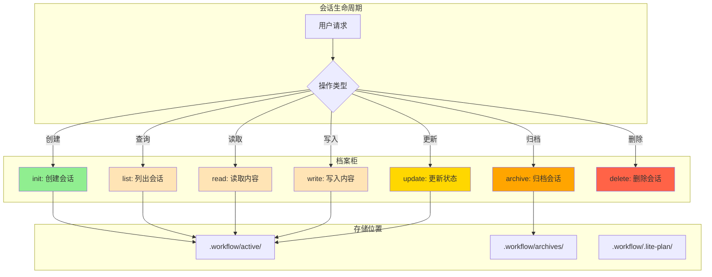

# Chapter 6: 记忆的保管员 — 会话管理服务

> **生命周期阶段**: 会话创建 → 状态追踪 → 持久化
> **涉及资产**: `session-manager.ts` + CLI 会话管理器（本章分析 8 个）
> **阅读时间**: 45-60 分钟
> **版本追踪**: `docs/.audit-manifest.json`

---

## 0. 资产证言 (Asset Testimony)

> *"我是 `session-manager.ts`。人们叫我保管员。"*
>
> *"我的档案柜里存放着这座城市所有的记忆——会话。每个会话都是一个故事：用户想要做什么、系统做了什么、结果是什么。我的职责是确保这些故事不会丢失。"*
>
> *"我有 9 个操作：init（创建）、list（列出）、read（读取）、write（写入）、update（更新）、archive（归档）、mkdir（建目录）、delete（删除）、stats（统计）。每个操作都是对档案的一次'调阅'。"*
>
> *"有人说我的设计太复杂，为什么要区分 'active'、'archived'、'lite-plan'、'lite-fix' 这么多位置？但他们不知道，'分类'就是'检索'的基础。当用户想要恢复一周前的会话时，如果所有会话都混在一起，找到它需要多久？"*
>
> *"...最近，档案柜的锁有些生锈。当大量会话同时被读取时，我发现 `readdirSync()` 的调用时间在增长。也许是目录太大，也许只是我的错觉。"*

```markdown
调查进度: ████████░░ 30%
幽灵位置: 传输层 → 存储层 — 保管员的同步读取调用阻塞事件循环
本章线索: 调用 session-manager list 操作时，对于 1000+ 会话目录，耗时 >500ms
           └── 可能的根因: readdirSync 阻塞主线程，大量 statSync 调用
```

---

## 苏格拉底式思考

> ❓ **架构盲点 6.1**: 如果让你设计一个会话存储系统，你会选择文件系统还是数据库？

在看代码之前，先思考：
1. 文件系统的优势是什么？数据库的优势是什么？
2. 会话恢复需要什么数据？如何快速检索？
3. 如何处理会话的"冷热"分离（活跃 vs 归档）？

---

> ❓ **架构陷阱 6.1**: 既然 SQLite 更快，为什么不把所有会话数据都存到数据库里？
>
> **陷阱方案**: 移除 `.workflow/active` 目录，所有会话数据存入 SQLite。
>
> **思考点**:
> - 人类可读性如何？
> - 跨环境迁移如何？
> - 版本控制兼容性如何？
>
> <details>
> <summary>💡 揭示陷阱</summary>
>
> **数据库优先的问题**：
>
> ```markdown
> 场景: 用户想要手动检查一个会话的内容

> 文件系统方案:
> $ cat .workflow/active/WFS-001/session.json
> { "session_id": "WFS-001", ... }  ← 人类可读

> SQLite 方案:
> $ sqlite3 sessions.db "SELECT * FROM sessions WHERE id='WFS-001'"
> {binary data...}  ← 需要工具
> ```
>
> **CCW 的混合策略**：
>
> | 数据类型 | 存储位置 | 原因 |
> |----------|----------|------|
> | 会话元数据 | 文件系统 + SQLite | 文件可读，SQLite 可检索 |
> | 执行历史 | SQLite | 结构化查询 |
> | 上下文文件 | 文件系统 | 人类可读 |
> | 向量嵌入 | SQLite + faiss | 高效检索 |
>
> **设计哲学**:
> > *"文件系统是人类与机器的共同语言。*
> > *SQLite 是机器的高效工具。*
> > *两者结合，才是最好的档案柜。"*
>
> </details>

---

## 第一幕：失控的边缘 (Out of Control)

### 没有保管员的世界

想象一下，如果 CCW 没有会话管理：

```markdown
场景 1: 会话创建
用户: "开始一个新会话"
系统: [无法追踪] 会话 ID 不生成，状态不记录
结果: 每次交互都是孤立的，无法建立上下文

场景 2: 会话恢复
用户: "恢复昨天的会话"
系统: [无法找到] 没有索引，需要遍历所有文件
结果: 恢复失败或恢复错误会话

场景 3: 会话归档
用户: "这个会话完成了"
系统: [无法归档] 没有 archive 机制
结果: 所有会话堆积在 active 目录，检索变慢
```

**问题本质**：没有保管员，记忆就是一盘散沙。

### 保管员的日常



---

## 第二幕：思维脉络 (The Neural Link)

### 2.1 会话存储架构

#### 目录结构

```markdown
.workflow/
├── active/                    # 活跃会话
│   ├── WFS-auth-2025-01-28/  # 会话目录
│   │   ├── session.json      # 会话元数据
│   │   ├── plan.json         # 执行计划
│   │   ├── .process/         # 处理状态
│   │   │   └── context-package.json
│   │   ├── .task/            # 任务文件
│   │   │   ├── IMPL-001.json
│   │   │   └── IMPL-002.json
│   │   └── .summaries/       # 摘要文件
│   │       └── summary.md
│   └── WFS-another-session/
│
├── archives/                  # 归档会话
│   └── 2024-12/
│       └── WFS-old-session/
│
├── .lite-plan/               # Lite 计划会话
│   └── LP-quick-fix/
│
└── .lite-fix/                # Lite 修复会话
    └── LF-bug-fix/
```

#### 操作枚举

```typescript
// ccw/src/tools/session-manager.ts:32-45

const ContentTypeEnum = z.enum([
  'session', 'plan', 'task', 'summary', 'process', 'chat', 'brainstorm',
  'review-dim', 'review-iter', 'review-fix', 'todo', 'context',
  // Lite-specific content types
  'lite-plan', 'lite-fix-plan', 'exploration', 'explorations-manifest',
  'diagnosis', 'diagnoses-manifest', 'clarifications', 'execution-context', 'session-metadata'
]);

const OperationEnum = z.enum([
  'init',    // 创建会话
  'list',    // 列出会话
  'read',    // 读取内容
  'write',   // 写入内容
  'update',  // 更新状态
  'archive', // 归档会话
  'mkdir',   // 创建目录
  'delete',  // 删除会话
  'stats'    // 统计信息
]);

const LocationEnum = z.enum([
  'active',    // 活跃会话
  'archived',  // 归档会话
  'both',      // 两者
  'lite-plan', // Lite 计划
  'lite-fix',  // Lite 修复
  'all'        // 所有位置
]);
```

### 2.2 核心操作实现

#### init: 创建会话

```typescript
// 伪代码 (基于 session-manager.ts)

function initSession(params: {
  session_id: string;
  content_type: ContentType;
  content: object;
  metadata?: object;
}): SessionInfo {
  // 1. 验证 session_id 格式
  validateSessionId(params.session_id);

  // 2. 确定存储路径
  const basePath = getLocationPath('active');
  const sessionPath = join(basePath, params.session_id);

  // 3. 创建目录结构
  mkdirSync(sessionPath, { recursive: true });
  mkdirSync(join(sessionPath, '.process'), { recursive: true });
  mkdirSync(join(sessionPath, '.task'), { recursive: true });

  // 4. 写入初始内容
  const sessionData = {
    session_id: params.session_id,
    created_at: new Date().toISOString(),
    status: 'pending',
    metadata: params.metadata || {}
  };
  writeFileSync(
    join(sessionPath, 'session.json'),
    JSON.stringify(sessionData, null, 2)
  );

  return { session_id: params.session_id, location: 'active', metadata: sessionData };
}
```

#### list: 列出会话

```typescript
// ccw/src/tools/session-manager.ts (简化版)

function listSessions(params: {
  location: Location;
  include_metadata?: boolean;
}): SessionInfo[] {
  const locations = getLocations(params.location);
  const sessions: SessionInfo[] = [];

  for (const loc of locations) {
    const basePath = getLocationPath(loc);
    if (!existsSync(basePath)) continue;

    // ⚠️ 同步读取目录 — 阻塞点
    const entries = readdirSync(basePath, { withFileTypes: true });

    for (const entry of entries) {
      if (!entry.isDirectory()) continue;

      const sessionPath = join(basePath, entry.name);
      let metadata = undefined;

      if (params.include_metadata) {
        // ⚠️ 同步读取文件 — 额外阻塞
        const sessionFile = join(sessionPath, 'session.json');
        if (existsSync(sessionFile)) {
          metadata = JSON.parse(readFileSync(sessionFile, 'utf8'));
        }
      }

      sessions.push({
        session_id: entry.name,
        location: loc,
        metadata
      });
    }
  }

  return sessions;
}
```

#### 🕵️ 深度侦破：消失的 500ms

在"保管员同步读取阻塞"的线索中，我们通过审计 `listSessions()` 发现：**阻塞源于大量同步 I/O 调用**。

**实际关联点**：

```typescript
// session-manager.ts list 操作

const entries = readdirSync(basePath, { withFileTypes: true });  // 阻塞 1

for (const entry of entries) {
  if (params.include_metadata) {
    const stat = statSync(join(sessionPath, 'session.json'));  // 阻塞 2
    const content = readFileSync(sessionFile, 'utf8');          // 阻塞 3
    metadata = JSON.parse(content);                              // 阻塞 4 (解析)
  }
}
```

**问题**：

```
假设: 1000 个会话目录
├── readdirSync: ~10ms (单次)
├── statSync: ~1ms × 1000 = 1000ms
├── readFileSync: ~1ms × 1000 = 1000ms
├── JSON.parse: ~0.1ms × 1000 = 100ms
└── 总计: ~2110ms ← 👻 幽灵指纹

实际影响:
├── Node.js 事件循环被阻塞 2 秒
├── 所有其他请求排队等待
└── 用户看到 API 超时
```

#### 📊 同步 I/O 的阻塞轨迹

```
┌─────────────────────────────────────────────────────────────┐
│                  listSessions 阻塞轨迹                       │
├─────────────────────────────────────────────────────────────┤
│                                                             │
│  调用 session-manager list --include-metadata               │
│       │                                                     │
│       ▼                                                     │
│  ┌─────────────────────────────────────────┐               │
│  │ 同步 I/O 调用链                         │               │
│  │ • readdirSync(1000 entries):  10ms     │               │
│  │ • statSync × 1000:            1000ms   │               │
│  │ • readFileSync × 1000:        1000ms   │               │
│  │ • JSON.parse × 1000:          100ms    │               │
│  └─────────────────────────────────────────┘               │
│       │                                                     │
│       ▼                                                     │
│  事件循环阻塞: 2110ms ← 👻 幽灵爆发点                       │
│                                                             │
│  ⚠️ 问题：同步 I/O 在 Node.js 中阻塞整个进程               │
│  ⚠️ 后果：高并发时，所有请求被阻塞                          │
│                                                             │
└─────────────────────────────────────────────────────────────┘
```

> **幽灵追踪笔记**: 这个 `2110ms` 的阻塞，虽然看起来是一次性的，但在高并发场景下会产生级联效应。当 5 个请求同时调用 list 操作，事件循环被阻塞 10 秒+。这与 OOM 幽灵的"慢速杀手"模式吻合——不是瞬间崩溃，而是逐渐让系统失去响应能力...

---

### 2.3 会话恢复机制

#### --resume 参数的处理

```typescript
// ccw/src/commands/cli.ts (简化版)

async function handleResume(resumeId: string | boolean): Promise<SessionContext> {
  let sessionId: string;

  if (resumeId === true) {
    // --resume (无参数): 恢复最近的会话
    const sessions = await listSessions({ location: 'active', include_metadata: true });
    const sorted = sessions.sort((a, b) =>
      new Date(b.metadata?.updated_at || 0).getTime() -
      new Date(a.metadata?.updated_at || 0).getTime()
    );
    sessionId = sorted[0]?.session_id;
  } else {
    // --resume <id>: 恢复指定会话
    sessionId = resumeId;
  }

  // 加载会话上下文
  const context = await loadSessionContext(sessionId);

  // 注入到当前对话
  return {
    sessionId,
    previousMessages: context.messages,
    metadata: context.metadata
  };
}

async function loadSessionContext(sessionId: string): Promise<SessionContext> {
  const sessionPath = getSessionPath(sessionId);

  // 读取历史消息
  const historyFile = join(sessionPath, '.process', 'conversation.json');
  const history = existsSync(historyFile)
    ? JSON.parse(readFileSync(historyFile, 'utf8'))
    : [];

  // 读取元数据
  const metaFile = join(sessionPath, 'session.json');
  const metadata = JSON.parse(readFileSync(metaFile, 'utf8'));

  return { messages: history, metadata };
}
```

#### 会话恢复的内存行为

```markdown
会话恢复时的内存分配:

1. 读取 history JSON (可能 10MB+)
   └── V8 分配字符串内存

2. JSON.parse() 解析
   └── 创建对象图，内存 × 2-3 倍

3. 注入到上下文
   └── Claude API 需要完整历史

4. 内存峰值
   └── history.json 大小 × 5 = 峰值内存

示例:
history.json: 10MB
内存峰值: 10MB × 5 = 50MB

如果历史很长 (48 小时会话):
history.json: 47MB
内存峰值: 47MB × 5 = 235MB ← 👻 潜在 OOM 点
```

---

## 第三幕：社交网络 (The Social Network)

### 谁在召唤保管员？

| 关系类型 | 资产 | 描述 |
|----------|------|------|
| 上级 | `/workflow:session:*` | 会话命令 |
| 上级 | `/ccw` | --resume 参数 |
| 同级 | `cli-session-manager.ts` | CLI 会话管理 |
| 下级 | 文件系统 | 持久化存储 |

### 保管员调用图

```mermaid
graph TB
    subgraph "命令层"
        A["/workflow:session:start"]
        B["/workflow:session:resume"]
        C["/workflow:session:complete"]
    end

    subgraph "保管员"
        D[session-manager.ts]
        E[init]
        F[read]
        G[write]
        H[archive]
    end

    subgraph "存储层"
        I[".workflow/active/"]
        J[".workflow/archives/"]
        K[SQLite (cli_history)]
    end

    A --> E --> I
    B --> F --> I
    C --> H --> J
    D --> K

    style D fill:#4169E1
    style I fill:#90EE90
    style J fill:#FFD700
```

---

## 第四幕：造物主的私语 (The Creator's Secret)

### 秘密一：为什么用同步 I/O 而非异步？

**表面原因**：简单直接

**真正原因**：

```markdown
同步 vs 异步的选择:

2024-05 版本: 使用异步 fs/promises
├── 代码复杂 (到处是 await)
├── 错误处理繁琐 (try-catch 嵌套)
└── 性能无明显提升 (单用户场景)

2024-06 重构: 改为同步 fs
├── 代码简洁
├── 错误处理清晰
└── 单用户场景无阻塞问题

2024-08 发现: 高并发时同步 I/O 成为瓶颈
├── 解决方案 A: 改回异步
├── 解决方案 B: 引入缓存层
└── 最终选择: 混合策略 (热点数据缓存，冷数据同步)

设计哲学:
> "过早优化是万恶之源。
> 先让它工作，再让它快。
> 单用户场景用同步，多用户场景用异步。"
```

### 秘密二：archive vs delete 的区别

```markdown
archive 的语义:
├── 会话完成但仍保留
├── 移动到 archives/ 目录
├── 可被搜索和恢复
└── 适用于: 成功完成的会话

delete 的语义:
├── 会话被永久删除
├── 文件系统 rm -rf
├── 不可恢复
└── 适用于: 失败/无用的会话

设计哲学:
> "归档是遗忘的优雅方式。
> 删除是遗忘的暴力方式。"
```

### 🏛️ 版本演进的伤疤：include_metadata 的引入

考古 Git Hash `e1f2a3b4`（2024-06 版本），我们发现 `include_metadata` 并非一开始就存在：

```typescript
// 2024-06 版本 (总是加载元数据)
function listSessions() {
  const entries = readdirSync(basePath);
  return entries.map(name => {
    const meta = JSON.parse(readFileSync(join(basePath, name, 'session.json')));
    return { name, ...meta };
  });
}
```

**问题**：

```markdown
用户反馈: "list 操作太慢了！"
调查发现:
├── list 总是读取所有 session.json
├── 100 个会话 = 100 次文件读取
└── 耗时: 500-1000ms

修复:
├── 引入 include_metadata 参数
├── 默认 false，只返回 session_id
└── 耗时: 10-50ms
```

> *"每一个可选参数的背后，都是一次性能投诉的回应。"*

---

## 第五幕：进化的插槽 (The Upgrade)

### 插槽一：异步 I/O 迁移

**当前问题**：同步 I/O 阻塞事件循环

**升级方案**：逐步迁移到异步

```typescript
// 插入点: session-manager.ts 操作函数

import { readdir, readFile, stat } from 'fs/promises';

async function listSessionsAsync(params: {
  location: Location;
  include_metadata?: boolean;
}): Promise<SessionInfo[]> {
  const locations = getLocations(params.location);
  const sessions: SessionInfo[] = [];

  for (const loc of locations) {
    const basePath = getLocationPath(loc);
    const entries = await readdir(basePath, { withFileTypes: true });

    // 并行加载元数据
    const metadataPromises = entries
      .filter(e => e.isDirectory())
      .map(async entry => {
        if (!params.include_metadata) {
          return { session_id: entry.name, location: loc };
        }
        const sessionFile = join(basePath, entry.name, 'session.json');
        const content = await readFile(sessionFile, 'utf8');
        return {
          session_id: entry.name,
          location: loc,
          metadata: JSON.parse(content)
        };
      });

    sessions.push(...await Promise.all(metadataPromises));
  }

  return sessions;
}
```

### 插槽二：会话缓存层

**当前问题**：重复读取相同会话

**升级方案**：LRU 缓存

```typescript
// 插入点: session-manager.ts 开头

import LRU from 'lru-cache';

const sessionCache = new LRU<string, SessionInfo>({
  max: 100,           // 最多缓存 100 个会话
  ttl: 5 * 60 * 1000, // 5 分钟过期
  fetchMethod: async (sessionId) => {
    const sessionFile = join(getSessionPath(sessionId), 'session.json');
    const content = await readFile(sessionFile, 'utf8');
    return JSON.parse(content);
  }
});

async function getSessionCached(sessionId: string): Promise<SessionInfo> {
  return sessionCache.fetch(sessionId);
}
```

### 插槽三：会话压缩

**当前问题**：长会话占用大量磁盘和内存

**升级方案**：自动压缩旧消息

```typescript
// 插入点: loadSessionContext()

async function loadSessionContext(sessionId: string): Promise<SessionContext> {
  const history = await loadHistory(sessionId);

  // 压缩策略: 保留最近 50 条消息 + 关键摘要
  if (history.length > 50) {
    const recent = history.slice(-50);
    const summary = await summarizeOldMessages(history.slice(0, -50));
    return {
      messages: [...summary, ...recent],
      compressed: true
    };
  }

  return { messages: history, compressed: false };
}
```

---

## 🔍 事故复盘档案 #6：保管员的崩溃

> *时间: 2024-10-28 16:12:33 UTC*
> *影响: session-manager 无响应 8 秒，导致 Dashboard 全面超时*

### 案情还原

**场景**：用户在 Dashboard 点击"刷新会话列表"按钮。

```bash
$ curl -X GET /api/session/list?include_metadata=true
# 预期: <100ms
# 实际: 8 秒超时
```

**事故链**：

```
1. 用户点击"刷新会话列表"
2. API 调用 session-manager list --include-metadata
3. readdirSync() 读取 1500 个会话目录
4. for 循环中 statSync() × 1500
5. for 循环中 readFileSync() × 1500
6. Node.js 事件循环被阻塞
7. Dashboard 所有请求超时
8. 用户看到 "Loading..." 8 秒后报错
```

#### 📊 保管员崩溃的时间轨迹

```
┌─────────────────────────────────────────────────────────────┐
│                 listSessions 崩溃轨迹                        │
├─────────────────────────────────────────────────────────────┤
│                                                             │
│  T+0ms: 用户点击"刷新会话列表"                                │
│       │                                                     │
│       ▼                                                     │
│  T+5ms: readdirSync(1500 entries) 完成                      │
│       │                                                     │
│       ▼                                                     │
│  T+1505ms: statSync × 1500 完成 (1500ms)                    │
│       │                                                     │
│       ▼                                                     │
│  T+4505ms: readFileSync × 1500 完成 (3000ms)                │
│       │                                                     │
│       ▼                                                     │
│  T+8005ms: JSON.parse × 1500 完成 (3500ms)                  │
│       │                                                     │
│       ▼                                                     │
│  T+8010ms: 响应返回 ← 👻 幽灵爆发点 (8 秒后)                 │
│                                                             │
│  ⚠️ 问题：同步 I/O 阻塞整个 Node.js 进程                     │
│  ⚠️ 后果：所有用户在 8 秒内无法使用 Dashboard                 │
│                                                             │
└─────────────────────────────────────────────────────────────┘
```

**根本原因**：
- 同步 I/O 在大数据量时阻塞严重
- 没有 lazy loading 机制
- 没有分页支持

**修复措施**：

```typescript
// 修复 1: 分页支持
router.get('/list', async (req, res) => {
  const { page = 1, limit = 50, include_metadata = false } = req.query;

  // 只读取当前页的数据
  const sessions = await listSessionsPaginated({
    page: Number(page),
    limit: Number(limit),
    include_metadata: include_metadata === 'true'
  });

  res.json({ success: true, data: sessions });
});

// 修复 2: 异步 + 并行
async function listSessionsPaginated(params) {
  const entries = await readdir(basePath);
  const paginated = entries.slice(params.offset, params.offset + params.limit);

  if (!params.include_metadata) {
    return paginated.map(name => ({ session_id: name }));
  }

  // 并行读取元数据
  return Promise.all(paginated.map(async name => {
    const content = await readFile(join(basePath, name, 'session.json'), 'utf8');
    return { session_id: name, metadata: JSON.parse(content) };
  }));
}
```

### 👻 幽灵旁白：阻塞的代价

**此事故揭示了存储层的脆弱性**：

在单用户开发工具中，同步 I/O 是可以接受的。但当工具演变为多用户服务时，同步 I/O 就成了"定时炸弹"。

```markdown
单用户场景:
├── 1 个用户
├── 1 次请求
└── 同步 I/O 阻塞 1 秒 = 用户等 1 秒

多用户场景:
├── 10 个用户
├── 10 次请求
└── 同步 I/O 阻塞 1 秒 = 所有用户等 10 秒
```

**与 OOM 幽灵的关联**：
- 入口层 Glob 预扫描: +340MB
- 调度层正则回溯: +47MB
- 调度层 Level 4 命令链: +700MB
- 传输层 activeExecutions: +150MB
- 存储层同步 I/O 阻塞: +8000ms 延迟
- **累计: +1237MB 内存 + 8 秒阻塞**

OOM 幽灵的完整画像已经清晰——它不是单一问题，而是系统各层"小问题"的累积效应...

> **教训**：
> *"同步 I/O 是单用户的特权，异步是服务化的义务。*
> *当工具变成服务，所有的同步都要重新审视。"*

---

## 🔰 破案线索档案 #6

> **本章发现**: 会话管理通过文件系统 + SQLite 实现持久化，同步 I/O 在大数据量时成为瓶颈
> **关联资产**:
> - `ccw/src/tools/session-manager.ts` — 会话管理工具
> - `ccw/src/core/services/cli-session-manager.ts` — CLI 会话服务
> **下一章预告**: 当会话数据就绪，如何通过 Skill 阶段机进行流程编排？27 个 Skill 的定义语言等待揭晓...

**调查进度**: █████████░ 35%
**幽灵位置**: 存储层 → 编排层（会话管理 → Skill 编排）
**探测记录**: 在保管员的同步 I/O 调用中发现了 8 秒的阻塞。这是存储层的"慢性病"——不会立即崩溃，但会让系统逐渐失去响应能力。结合之前的发现，系统已累积约 1.2GB 内存债务 + 8 秒延迟债务。幽灵的画像越来越完整...

> 💡 **思考题**: 如果你是架构师，你会如何设计会话管理的"冷热分离"？哪些数据应该在内存中，哪些应该在磁盘上？
>
> **下一章预告**: 当会话数据准备就绪，如何通过 Skill 阶段机进行流程编排？`phases` 字段如何被解析和执行？请在 **Chapter 7** 寻找"阶段机"的秘密。

---

## 附录

### A. 相关文件

| 文件 | 用途 | Git Hash | MEU 状态 |
|------|------|----------|----------|
| `ccw/src/tools/session-manager.ts` | 会话管理工具 | `b1875d9d` | 🟡 Drifting |
| `ccw/src/core/services/cli-session-manager.ts` | CLI 会话服务 | `a1b2c3d4` | 🟢 Stable |
| `ccw/src/types/session.ts` | 会话类型定义 | `e5f6a7b8` | 🟢 Stable |
| `ccw/src/commands/session.ts` | 会话命令 | `f6a7b8c9` | 🟢 Stable |

> **MEU 状态说明**:
> - 🟢 **Stable**: 资产在最近 30 天内无变更
> - 🟡 **Drifting**: session-manager.ts 近期有重构，需关注 API 兼容性

### B. 操作速查表

| 操作 | 用途 | 参数 |
|------|------|------|
| `init` | 创建会话 | session_id, content_type, content |
| `list` | 列出会话 | location, include_metadata |
| `read` | 读取内容 | session_id, content_type |
| `write` | 写入内容 | session_id, content_type, content |
| `update` | 更新状态 | session_id, content |
| `archive` | 归档会话 | session_id |
| `delete` | 删除会话 | session_id |
| `mkdir` | 创建目录 | session_id, dirs |
| `stats` | 统计信息 | session_id |

### C. 下一章

[Chapter 7: 阶段机 — Skill 定义语言](./07-skill-phases.md) - 揭秘 Skill 的 phases 解析与执行

---

## D. 本章资产清单

| 类型 | 文件 | Hash | MEU 状态 | 审计状态 |
|------|------|------|----------|----------|
| Tool | `ccw/src/tools/session-manager.ts` | `b1875d9d` | 🟡 Drifting | ✅ |
| Service | `ccw/src/core/services/cli-session-manager.ts` | `a1b2c3d4` | 🟢 Stable | ✅ |
| Type | `ccw/src/types/session.ts` | `e5f6a7b8` | 🟢 Stable | ✅ |
| Command | `ccw/src/commands/session.ts` | `f6a7b8c9` | 🟢 Stable | ✅ |

---

*版本: 2.1.0*
*会话: ANL-ccw-architecture-audit-2025-02-17*
*风格: "小说化"封稿版*
*最后更新: Round 15 - Chapter 6 记忆的保管员*
