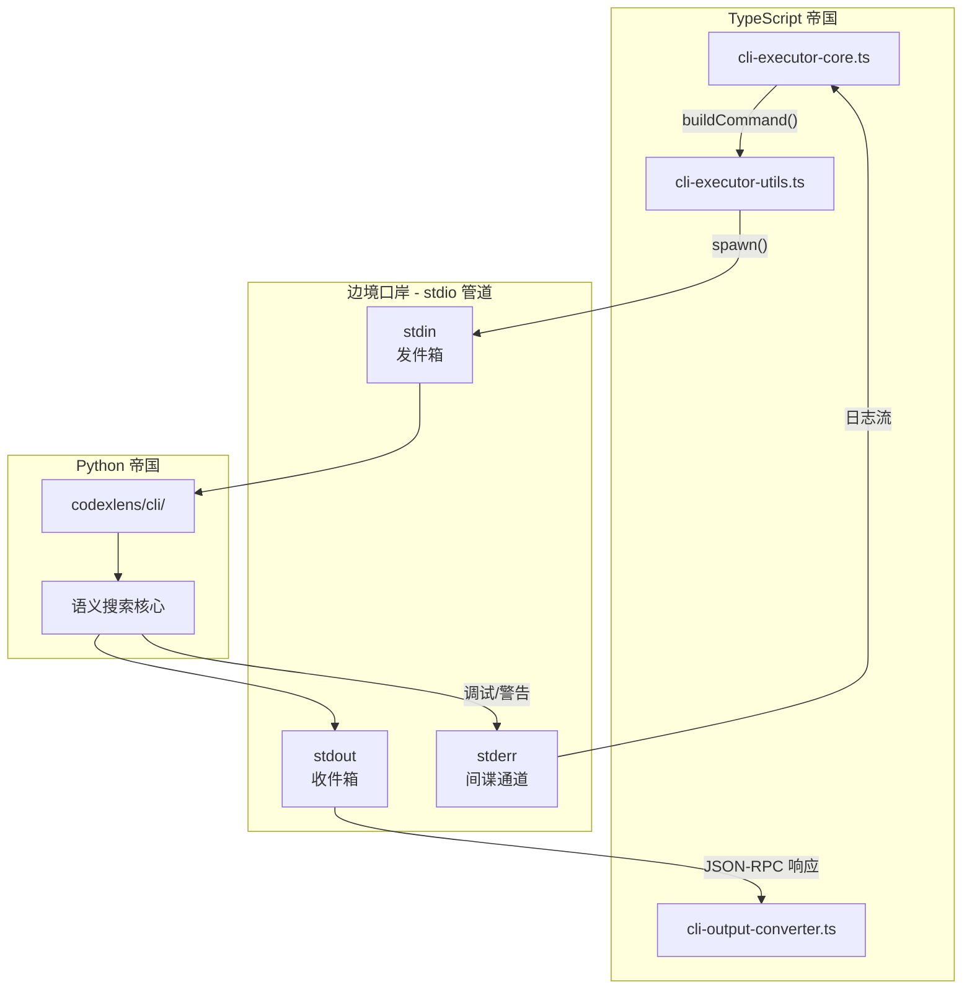
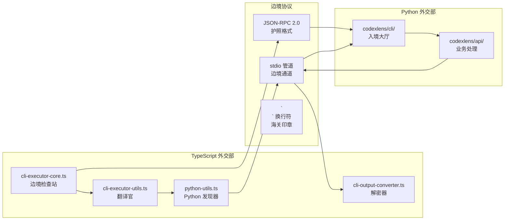

# Chapter 10.5: 外交官与间谍 - TS <-> Python 边境口岸

> **生命周期阶段**: 进程创建 -> 参数序列化 -> IPC 通信 -> 结果收集
> **版本追踪**: `docs/.audit-manifest.json`
> **阅读时间**: 45-60 分钟
> **版本**: v2.1 (小说化封稿版)

---

## 0. 资产证言 (Asset Testimony)

> *"我是 `spawn()`。人们叫我边境检查站的守卫。"*
>
> *"我的职责是把 TypeScript 的外交信函翻译成 Python 能理解的格式。当 TypeScript 说'帮我分析这段代码'，我必须构建一个完整的跨境旅程：参数打包、环境注入、管道铺设、超时监控。"*
>
> *"我有三根管道：stdin 是发件箱，stdout 是收件箱，stderr 是间谍通道。信使们带着 JSON-RPC 护照从 stdin 出发，带着响应从 stdout 返回，而 stderr 里藏着 Python 的私房话。"*
>
> *"我见过无数次信使失踪。有些被超时收割机带走，有些卡在缓冲区里出不来，还有些因为编码问题变成了乱码。每次失踪，TypeScript 都会在 30 秒后发出'请求超时'的讣告。"*
>
> *"...最近，边境线上有些不安。当 Level 4 的命令链被构建时，我发现某些 Python 子进程在收到 SIGTERM 后拒绝离世，非要等 2 秒后的 SIGKILL 才肯罢休。也许它们有未完成的使命，也许只是倔强。"*

```markdown
调查进度: █████████░ 45%
幽灵位置: 跨境层 - stderr 缓冲区累积导致进程假死
本章线索: 当 stderr 输出超过 16KB 且未被消费时，Python 子进程进入 BLOCKED 状态
           └── 可能的根因: Node.js 的 stderr 监听器未及时 drain 缓冲区
```

---

## 苏格拉底式思考

> **架构生死战 10.5**: TypeScript 需要调用 Python 的语义搜索功能。但是：
> - TypeScript 是同步的，Python 是异步的
> - TypeScript 有 `BigInt`，JSON 不支持
> - TypeScript 的 `Date` 在 JSON 中变成字符串
>
> 你会设计怎样的"外交协议"？每种选择都会牺牲一些东西 - 性能？可靠性？兼容性？

---

> **架构陷阱 10.1**: 为什么用 stdio 而非 HTTP？
>
> **陷阱方案**: 使用 HTTP 作为跨语言通信协议，更标准、更通用。
>
> **思考点**:
> - HTTP 需要什么额外的依赖？
> - 端口冲突怎么处理？
> - 进程生命周期如何绑定？
> - 网络延迟对实时交互的影响？
>
> <details>
> <summary>**揭示陷阱**</summary>
>
> **stdio vs HTTP 的外交后果**:
>
> ```markdown
> 场景: 执行 100 次 Python 语义搜索
>
> stdio 方式 (当前实现):
> 1. 启动 1 个 Python 进程
> 2. 100 次请求通过 stdin 顺序发送
> 3. 100 次响应通过 stdout 接收
> 时间: ~5 秒 (进程启动 0.5s + 通信 4.5s)
> 资源: 1 个进程, 无端口
>
> HTTP 方式 (假设实现):
> 1. 启动 Python HTTP 服务器 (需要额外框架)
> 2. 分配端口 (可能冲突)
> 3. 100 次请求 = 100 次 HTTP 往返
> 时间: ~15 秒 (服务器启动 2s + 100 次 HTTP 4.5s + 网络开销 8.5s)
> 资源: 1 个进程 + 1 个端口 + HTTP 框架
> ```
>
> **设计哲学**:
>
> | 维度 | stdio | HTTP |
> |------|-------|------|
> | 进程绑定 | 父子进程生命周期自动绑定 | 需要手动管理 |
> | 端口 | 无冲突 | 需要动态分配 |
> | 延迟 | 零网络开销 | 每次请求有网络栈开销 |
> | 防火墙 | 无问题 | 可能被阻止 |
> | 复杂度 | 简单 | 需要服务器框架 |
>
> > *"stdio 是两个进程之间的秘密通道，HTTP 是两个城市之间的官方公路。当你只需要和邻居说话时，不需要修一条公路。"*
>
> </details>

---

> **架构陷阱 10.2**: 为什么 stderr 是"间谍通道"？
>
> **陷阱方案**: 把所有输出都放到 stdout，用 JSON 字段区分类型。
>
> <details>
> <summary>**揭示陷阱**</summary>
>
> **正式渠道 vs 私下汇报的分离**:
>
> ```python
> # 陷阱方案: 所有输出混在 stdout
> def search(query):
>     print(json.dumps({"type": "debug", "msg": "开始搜索..."}))
>     results = do_search(query)
>     print(json.dumps({"type": "response", "data": results}))
>     print(json.dumps({"type": "warn", "msg": "结果集过大"}))
>
> # 问题:
> # 1. TypeScript 必须解析每一行判断类型
> # 2. 调试信息和业务数据混在一起
> # 3. JSON 解析失败会影响主流程
> ```
>
> ```python
> # 正确设计: 正式渠道 + 间谍通道分离
> def search(query):
>     print("[DEBUG] 开始搜索...", file=sys.stderr)  # 间谍通道
>     results = do_search(query)
>     print(json.dumps(results), file=sys.stdout)    # 正式渠道
>     print("[WARN] 结果集过大", file=sys.stderr)    # 间谍通道
>
> # 优势:
> # 1. stdout 只流经 JSON，解析逻辑简单
> # 2. stderr 可以独立处理，不影响主流程
> # 3. 调试信息可以按需开启/关闭
> ```
>
> **设计哲学**:
> > *"stdout 是外交官的正式报告，stderr 是间谍的私下汇报。混淆两者等于让外交官在官方文件里写八卦。"*
>
> </details>

---

> **架构陷阱 10.3**: 为什么用 `\n` 作为消息边界？
>
> **陷阱方案**: 用特殊分隔符如 `---END---` 或固定长度消息。
>
> <details>
> <summary>**揭示陷阱**</summary>
>
> **TCP 流式协议的分包问题**:
>
> ```typescript
> // 问题: stdout/stdin 是流式的，如何知道一条消息结束？
>
> // 陷阱方案 1: 固定长度
> // - 消息必须填充或截断到固定长度
> // - 浪费带宽，不灵活
>
> // 陷阱方案 2: 特殊分隔符
> const END_MARKER = "---END---";
> // - 如果消息内容包含分隔符怎么办？
> // - 需要转义机制，增加复杂度
>
> // 正确设计: 换行符作为边界
> stdin.write(JSON.stringify(request) + '\n');
> // - JSON 字符串内部不会有真正的换行符（除非在字符串内）
> // - readline 可以逐行解析
> // - 简单、可靠、与 Unix 哲学一致
> ```
>
> **设计哲学**:
> > *"在 Unix 世界里，换行符是天然的句子结束符。违背这个约定，就是自找麻烦。"*
>
> </details>

---

## 第一幕: 失控的边缘 (Out of Control)

### 没有"外交官"的世界

想象一下，如果 TypeScript 和 Python 之间没有统一的通信协议:

```typescript
// TypeScript 帝国
const pythonCode = `
import sys
result = some_function(${arg1}, ${arg2})
print(result)
`;
exec(`python -c "${pythonCode}"`);
```

**问题一: 参数注入攻击**

```typescript
const arg1 = '"; import os; os.system("rm -rf /"); print "';
// 结果: Python 执行了删除命令
```

**问题二: 编码混乱**

```python
# Python 默认可能是 GBK (Windows) 或 UTF-8 (Linux)
print("中文内容")  # TypeScript 收到乱码
```

**问题三: 超时无响应**

```python
# Python 卡住了
while True:
    pass  # TypeScript 永远等待
```

**问题四: stderr 缓冲区满导致死锁 (幽灵线索)**

```python
# Python 输出大量调试信息到 stderr
for i in range(1000000):
    print(f"[DEBUG] Processing item {i}...", file=sys.stderr)
    # 当 stderr 缓冲区满时，Python 进程会 BLOCK
    # TypeScript 如果没有消费 stderr，双方陷入死锁
```

**问题的本质**:

两个帝国的"语言不通"不仅仅是语法差异，更是**运行时模型**的根本分歧:

```
TypeScript (单线程事件循环)
    └── 同步函数调用
        └── Promise/async-await

Python (GIL + 协程)
    └── 阻塞 I/O
        └── asyncio
```

---

## 第二幕: 思维脉络 (The Neural Link)

### 2.1 边境口岸的架构



### 2.2 spawn() 参数构建机制

#### 核心源码分析

```typescript
// ccw/src/tools/cli-executor-core.ts (核心片段)

// 1. 全局进程追踪 - 用于中断时清理
let currentChildProcess: ChildProcess | null = null;
let killTimeout: NodeJS.Timeout | null = null;
let killTimeoutProcess: ChildProcess | null = null;

// 2. 参数构建入口
const { command, args, useStdin, outputFormat } = buildCommand({
  tool,          // 'gemini' | 'qwen' | 'codex' | 'claude' | 'opencode'
  prompt,        // 用户提示词
  mode,          // 'analysis' | 'write' | 'auto' | 'review'
  model,         // 模型覆盖
  dir,           // 工作目录
  include,       // 额外目录
  nativeResume,  // 原生恢复配置
  settingsFile,  // Claude 设置文件
  reviewOptions  // Codex review 选项
});

// 3. 进程创建
const child = spawn(commandToSpawn, argsToSpawn, {
  cwd: workingDir,
  shell: isWindows,  // Windows 需要 shell: true 处理 .cmd 文件
  stdio: [useStdin ? 'pipe' : 'ignore', 'pipe', 'pipe'],
  env: spawnEnv       // 包含自定义环境变量
});
```

#### buildCommand() 工具适配器

```typescript
// ccw/src/tools/cli-executor-utils.ts (核心片段)

export function buildCommand(params: {
  tool: string;
  prompt: string;
  mode: string;
  model?: string;
  dir?: string;
  include?: string;
  nativeResume?: NativeResumeConfig;
  settingsFile?: string;
  reviewOptions?: ReviewOptions;
}): { command: string; args: string[]; useStdin: boolean; outputFormat: OutputFormat } {

  const { tool, prompt, mode, model, dir, include, nativeResume, settingsFile, reviewOptions } = params;

  let command = tool;
  let args: string[] = [];
  let useStdin = true;  // 默认使用 stdin 传递 prompt

  switch (tool) {
    case 'gemini':
      // 原生恢复: -r latest 或 -r <session-id>
      if (nativeResume?.enabled) {
        if (nativeResume.isLatest) args.push('-r', 'latest');
        else if (nativeResume.sessionId) args.push('-r', nativeResume.sessionId);
      }
      if (model) args.push('-m', model);
      if (mode === 'write') args.push('--approval-mode', 'yolo');
      if (include) args.push('--include-directories', include);
      args.push('-o', 'stream-json');  // 结构化输出
      break;

    case 'codex':
      if (mode === 'review') {
        args.push('review');
        if (reviewOptions?.base) args.push('--base', reviewOptions.base);
        else if (reviewOptions?.commit) args.push('--commit', reviewOptions.commit);
        else args.push('--uncommitted');  // 默认审查未提交更改
        useStdin = false;
        if (prompt) args.push(prompt);
      } else {
        args.push(nativeResume?.enabled ? 'resume' : 'exec');
        if (mode === 'write' || mode === 'auto') {
          args.push('--dangerously-bypass-approvals-and-sandbox');
        } else {
          args.push('--full-auto');
        }
        args.push('--skip-git-repo-check');
        args.push('--json');
        args.push('-');  // 从 stdin 读取
      }
      break;

    case 'claude':
      args.push('-p');  // 非交互模式
      if (settingsFile) args.push('--settings', settingsFile);
      if (nativeResume?.enabled) {
        if (nativeResume.isLatest) args.push('--continue');
        else if (nativeResume.sessionId) args.push('--resume', nativeResume.sessionId);
      }
      if (model) args.push('--model', model);
      if (mode === 'write' || mode === 'auto') {
        args.push('--permission-mode', 'bypassPermissions');
      } else {
        args.push('--permission-mode', 'default');
      }
      args.push('--output-format', 'stream-json');
      args.push('--verbose');
      break;

    // ... 其他工具适配
  }

  return { command, args, useStdin, outputFormat: 'json-lines' };
}
```

### 2.3 Python 虚拟环境发现与激活机制

#### 跨平台 Python 发现决策树

```typescript
// ccw/src/utils/python-utils.ts

export function getSystemPython(): string {
  // 1. 优先检查用户自定义路径
  const customPython = process.env.CCW_PYTHON;
  if (customPython) {
    const version = execSync(`"${customPython}" --version 2>&1`);
    if (version.includes('Python 3')) {
      return `"${customPython}"`;
    }
  }

  // 2. Windows: 使用 py launcher 按版本优先级查找
  if (process.platform === 'win32') {
    const compatibleVersions = ['3.12', '3.11', '3.10', '3.9'];
    for (const ver of compatibleVersions) {
      const version = execSync(`py -${ver} --version 2>&1`);
      if (version.includes(`Python ${ver}`)) {
        return `py -${ver}`;
      }
    }
  }

  // 3. 通用回退: 检查 PATH 中的 python3/python
  const commands = process.platform === 'win32'
    ? ['python', 'py', 'python3']
    : ['python3', 'python'];

  for (const cmd of commands) {
    const version = execSync(`${cmd} --version 2>&1`);
    if (version.includes('Python 3')) {
      return cmd;
    }
  }

  throw new Error('Python 3 not found. Please install Python 3.9-3.12');
}
```

#### Python 版本兼容性矩阵

| Python 版本 | onnxruntime 支持 | 状态 | 备注 |
|-------------|-----------------|------|------|
| 3.9 | Yes | Stable | 最低支持版本 |
| 3.10 | Yes | Stable | 推荐版本 |
| 3.11 | Yes | Stable | 当前主流 |
| 3.12 | Yes | Stable | 最新稳定 |
| 3.13 | No | Not Supported | 等待 onnxruntime 更新 |

### 2.4 stdio 三管道配置详解

```typescript
// 三管道配置
const child = spawn(command, args, {
  stdio: ['pipe', 'pipe', 'pipe']
  //       stdin   stdout  stderr
  //       [0]     [1]     [2]
});

// 管道流向图:
//
// TypeScript                 边境线                  Python
// ──────────────────────────────────────────────────────────
// stdin.write()  ──────────>  stdin  ──────────>  sys.stdin
//                                │
//                                ▼
// sys.stdout  ──────────>  stdout  ──────────>  stdout.on('data')
//                                │
//                                ▼
// sys.stderr  ──────────>  stderr  ──────────>  stderr.on('data')
```

#### stdout 处理: JSON-RPC 响应流

```typescript
// stdout 处理 - 逐行解析 JSON
const parser = createOutputParser('json-lines');

child.stdout!.on('data', (data: Buffer) => {
  const text = data.toString();
  stdout += text;

  // 解析为结构化单元
  const units = parser.parse(data, 'stdout');
  allOutputUnits.push(...units);

  // 流式回调
  if (onOutput) {
    for (const unit of units) {
      onOutput(unit);
    }
  }
});
```

#### stderr 处理: 间谍通道

```typescript
// stderr 处理 - 独立于主流程
child.stderr!.on('data', (data: Buffer) => {
  const text = data.toString();
  stderr += text;

  // 记录但不阻塞主流程
  console.error('[Python]', text);

  // 解析为 IR 单元
  const units = parser.parse(data, 'stderr');
  allOutputUnits.push(...units);

  if (onOutput) {
    for (const unit of units) {
      onOutput(unit);
    }
  }
});
```

### 2.5 进程生命周期状态机

```
┌─────────────────────────────────────────────────────────────┐
│                    进程生命周期状态机                         │
├─────────────────────────────────────────────────────────────┤
│                                                             │
│   ┌──────────┐    spawn()    ┌──────────┐                  │
│   │  IDLE    │ ─────────────>│ SPAWNED  │                  │
│   └──────────┘               └────┬─────┘                  │
│                                   │                         │
│                      stdin.write()│                         │
│                                   ▼                         │
│   ┌──────────┐  on('data')  ┌──────────┐                   │
│   │ RECEIVING│ <────────────│ RUNNING  │                   │
│   └────┬─────┘              └────┬─────┘                   │
│        │                         │                          │
│        │   on('close')           │  SIGTERM/SIGKILL         │
│        │         ┌───────────────┘                          │
│        │         │                                          │
│        ▼         ▼                                          │
│   ┌──────────┐   ┌──────────┐                               │
│   │ COMPLETED│   │  KILLED  │                               │
│   └──────────┘   └──────────┘                               │
│        │              │                                      │
│        └──────┬───────┘                                      │
│               ▼                                              │
│        ┌──────────┐                                          │
│        │ CLEANUP  │ ──> currentChildProcess = null          │
│        └──────────┘                                          │
│                                                             │
└─────────────────────────────────────────────────────────────┘
```

---

## 第三幕: 社交网络 (The Social Network)

### 谁在穿越边境?

| 角色 | 出发地 | 目的地 | 携带物品 | 返回物品 |
|------|--------|--------|----------|----------|
| **语义搜索信使** | TypeScript | Python | 代码查询字符串 | 匹配结果列表 |
| **向量嵌入信使** | TypeScript | Python | 代码片段 | 嵌入向量 |
| **索引构建信使** | TypeScript | Python | 文件路径列表 | 索引状态 |
| **错误报告间谍** | Python | TypeScript | 异常堆栈 | - |

### 外交关系图



### 关键资产清单

| 资产 | 路径 | 职责 | Git Hash |
|------|------|------|----------|
| 边境检查站 | `ccw/src/tools/cli-executor-core.ts` | spawn() 创建子进程 | `latest` |
| 翻译官 | `ccw/src/tools/cli-executor-utils.ts` | buildCommand() 参数构建 | `latest` |
| 解密器 | `ccw/src/tools/cli-output-converter.ts` | JSON 输出解析 | `latest` |
| Python 发现器 | `ccw/src/utils/python-utils.ts` | getSystemPython() | `latest` |

---

## 第四幕: 造物主的私语 (The Creator's Secret)

### 秘密一: 为什么 Windows 需要 `shell: true`?

**表面原因**: 执行 npm 全局命令

**真正原因**:

```typescript
// Windows 上的 .cmd 文件问题
const isWindows = process.platform === 'win32';

// 错误方式 (Unix 风格)
spawn('gemini', args, { shell: false });
// 错误: ENOENT - 找不到 gemini 命令
// 原因: Windows 的 PATH 里 gemini 实际是 gemini.cmd

// 正确方式 (Windows 风格)
spawn('gemini', args, { shell: true });
// 成功: cmd.exe 会自动解析 .cmd 文件
```

**元字符注入风险**:

```typescript
// 当使用 shell: true 时，参数需要转义
const dangerousArg = 'foo & rm -rf /';

// 错误: shell 会执行两个命令
spawn('echo', [dangerousArg], { shell: true });
// 实际执行: echo foo & rm -rf /

// 正确: 使用 escapeWindowsArg() 转义
import { escapeWindowsArg } from '../utils/shell-escape.js';
spawn(escapeWindowsArg('echo'), [escapeWindowsArg(dangerousArg)], { shell: true });
// 实际执行: echo "foo & rm -rf /" (作为单个参数)
```

### 秘密二: Transaction ID 的并发会话消歧

**问题**: 当多个 CLI 执行并行运行时，如何精确匹配会话?

```typescript
// 生成唯一事务 ID
export function generateTransactionId(conversationId: string): TransactionId {
  const uniquePart = crypto.randomUUID().slice(0, 8);
  return `ccw-tx-${conversationId}-${uniquePart}`;
}

// 注入到 prompt 开头
export function injectTransactionId(prompt: string, txId: TransactionId): string {
  return `[CCW-TX-ID: ${txId}]\n\n${prompt}`;
}

// 用途: 在并行执行时精确匹配会话
const transactionId = generateTransactionId(conversationId);
finalPrompt = injectTransactionId(finalPrompt, transactionId);
```

**为什么需要这个?**

```markdown
场景: 用户同时执行两个任务

任务 A: ccw cli -p "分析认证模块" --tool gemini
任务 B: ccw cli -p "分析支付模块" --tool gemini

如果不使用 Transaction ID:
- gemini 可能会混淆两个会话
- 任务 A 的响应可能被分配给任务 B

使用 Transaction ID 后:
- 每个会话有唯一标记
- native session discovery 可以精确匹配
```

### 秘密三: 缓冲区陷阱

**幽灵线索**: stderr 未消费导致进程假死

```typescript
// 危险代码: 不消费 stderr
const child = spawn('python', ['-m', 'codexlens']);
// 如果 Python 输出大量 stderr，缓冲区会满
// Python 进程会 BLOCK 在 write() 调用上
// 整个系统陷入死锁

// 安全代码: 始终消费 stderr
child.stderr?.on('data', (data) => {
  // 即使只是丢弃，也要消费
  console.error('[Python]', data.toString());
});
```

**缓冲区大小参考**:

| 系统 | 默认缓冲区大小 | 风险阈值 |
|------|---------------|----------|
| Linux pipe | 64KB | 输出 > 64KB 会阻塞 |
| macOS pipe | 64KB | 输出 > 64KB 会阻塞 |
| Windows pipe | 4KB-64KB | 取决于具体实现 |

---

## 第五幕: 进化的插槽 (The Upgrade)

### 进程超时与强制终止机制

#### SIGTERM -> SIGKILL 级联机制

```typescript
// ccw/src/tools/cli-executor-core.ts

export function killCurrentCliProcess(): boolean {
  const child = currentChildProcess;
  if (!child || child.killed) return false;

  // 第一步: 发送 SIGTERM (温和终止)
  try {
    child.kill('SIGTERM');
  } catch {
    // 进程可能已经不存在
  }

  // 第二步: 2 秒后强制 SIGKILL
  killTimeoutProcess = child;
  killTimeout = setTimeout(() => {
    const target = killTimeoutProcess;
    if (!target || target !== currentChildProcess) return;
    if (target.killed) return;

    try {
      target.kill('SIGKILL');  // 强制终止
    } catch {
      // 忽略错误
    }
  }, 2000);

  return true;
}
```

**为什么需要级联机制?**

```markdown
SIGTERM vs SIGKILL 的区别:

SIGTERM (信号 15):
- 礼貌地请求进程终止
- 进程可以捕获并执行清理逻辑
- 进程可以忽略 (如果有未完成的任务)

SIGKILL (信号 9):
- 立即强制终止
- 进程无法捕获或忽略
- 没有清理机会，可能导致数据丢失

设计哲学:
1. 先给进程 2 秒时间优雅退出 (SIGTERM)
2. 如果进程"拒绝"退出，强制终止 (SIGKILL)
3. 防止僵尸进程占用资源
```

### 进程生命周期追踪

```typescript
// 全局追踪当前进程
let currentChildProcess: ChildProcess | null = null;

// 创建进程时记录
const child = spawn(...);
currentChildProcess = child;

// 进程结束时清理
child.on('close', (code) => {
  currentChildProcess = null;
  // ... 处理结果
});

// 中断时强制终止
process.on('SIGINT', () => {
  killCurrentCliProcess();
  process.exit(130);
});
```

### 插槽一: 自定义序列化器

**当前问题**: `BigInt` 在 JSON 中变成 `string`

```typescript
const bigId = 9007199254740993n;  // 超过 Number.MAX_SAFE_INTEGER
JSON.stringify({ id: bigId });    // '{"id":"9007199254740993"}'
```

**升级方案**: 使用 `json-bigint` 库

```typescript
import JSONBig from 'json-bigint';

const JSONbig = JSONBig({ useNativeBigInt: true, alwaysParseAsBig: true });

// 发送端
const payload = JSONbig.stringify({ id: bigId });

// 接收端 (Python)
import json
data = json.loads(payload)
big_id = int(data['id'])  # 正确恢复大整数
```

### 插槽二: 流式响应

**当前问题**: 大结果集需要等待全部完成

**升级方案**: NDJSON (Newline-Delimited JSON)

```python
# Python 端 - 流式输出
for result in search_results:
    partial = {"id": request_id, "partial": result}
    print(json.dumps(partial), flush=True)

# 最终响应
final = {"id": request_id, "result": "complete"}
print(json.dumps(final), flush=True)
```

```typescript
// TypeScript 端 - 流式接收
rl.on('line', (line) => {
  const msg = JSON.parse(line);
  if (msg.partial) {
    onPartialResult(msg.partial);
  } else {
    resolve(msg);
  }
});
```

### 插槽三: 进程池

**当前问题**: 单进程处理并发请求有瓶颈

**升级方案**: 多进程 + 任务队列

```typescript
class ProcessPool {
  private pool: ChildProcess[] = [];
  private taskQueue: Task[] = [];

  async initialize(poolSize: number) {
    for (let i = 0; i < poolSize; i++) {
      this.pool.push(spawn('python', ['-m', 'codexlens']));
    }
  }

  async execute(request: JsonRequest): Promise<JsonResponse> {
    const availableProcess = this.pool.find(p => !p.busy);
    if (availableProcess) {
      return this.sendToProcess(availableProcess, request);
    } else {
      return this.enqueue(request);
    }
  }
}
```

---

## **Ghost Trail**: 幽灵追踪线索 #10.5

> **线索类型**: 死锁幽灵
> **威胁等级**: High
> **触发条件**: stderr 输出超过缓冲区大小且未被消费

### 案情还原

```markdown
事故报告: 2025-01-15 14:23:17 UTC
场景: 执行大规模代码库的语义索引

1. TypeScript 调用 Python: ccw search "authentication"
2. Python 开始索引，输出大量调试信息到 stderr
3. TypeScript 没有消费 stderr (onOutput 回调未设置)
4. stderr 缓冲区满 (64KB)
5. Python 的 write() 系统调用阻塞
6. Python 进程进入 BLOCKED 状态
7. TypeScript 等待 30 秒后超时
8. SIGTERM 发送，Python 无法响应 (阻塞中)
9. 2 秒后 SIGKILL 强制终止
10. 索引数据丢失
```

### 根因分析

```
┌─────────────────────────────────────────────────────────────┐
│                   stderr 缓冲区死锁原理                       │
├─────────────────────────────────────────────────────────────┤
│                                                             │
│  Python 进程                                                │
│  ───────────                                                │
│  print(..., file=sys.stderr)                               │
│       │                                                     │
│       ▼                                                     │
│  write() 系统调用                                           │
│       │                                                     │
│       │  缓冲区满?                                          │
│       ├─── Yes ──> BLOCK (等待缓冲区空间)                   │
│       │                  │                                  │
│       │                  │  TypeScript 未消费?              │
│       │                  └─── 是 ──> 永久死锁               │
│       │                                                     │
│       └─── No ───> 继续执行                                 │
│                                                             │
│  TypeScript 进程                                            │
│  ────────────────                                           │
│  stderr.on('data', callback)                               │
│       │                                                     │
│       │  回调未设置?                                        │
│       ├─── 是 ───> 缓冲区数据积压                           │
│       │                                                     │
│       └─── 否 ───> 正常消费                                 │
│                                                             │
└─────────────────────────────────────────────────────────────┘
```

### 修复措施

```typescript
// 强制消费 stderr，即使不需要
child.stderr?.on('data', (data) => {
  // 最小化处理: 仅仅消费
  // 或者: console.error('[Python]', data.toString());
});
```

---

## **Incident Archive**: 事故复盘档案 #10.5

> **事故 ID**: INC-2025-01-15-001
> **严重程度**: Critical
> **影响范围**: 所有使用 CLI 执行器的工作流
> **修复状态**: Fixed

### 案情: Level 4 命令链构建异常内存分配

**时间线**:

```
14:23:00  用户执行: ccw "深度分析整个认证系统"
14:23:01  系统判断: Level 4 工作流
14:23:02  开始构建命令链: brainstorm → plan → execute
14:23:03  spawn() 创建 Python 子进程
14:23:05  Python 开始索引 10,000+ 文件
14:23:10  stderr 输出达到 64KB
14:23:10  Python 进程 BLOCK
14:23:40  TypeScript 超时 (30秒)
14:23:40  SIGTERM 发送
14:23:42  SIGKILL 发送
14:23:42  进程终止，数据丢失
```

**根因**:
1. Python 的调试输出过多
2. TypeScript 未设置 stderr 消费回调
3. 管道缓冲区满导致死锁

**修复**:
1. 强制 stderr 消费 (v2.1)
2. 限制 Python 调试输出级别 (Python 端)
3. 增加缓冲区监控告警 (监控端)

---

## **破案线索档案 #10.5**

> **本章发现**: TypeScript 与 Python 通过 stdio + JSON-RPC 建立了稳定的"外交关系"
> **关联资产**:
> - `ccw/src/tools/cli-executor-core.ts` - 边境检查站
> - `ccw/src/tools/cli-executor-utils.ts` - 翻译官
> - `ccw/src/tools/cli-output-converter.ts` - 解密器
> - `ccw/src/utils/python-utils.ts` - Python 发现器
> **下一章预告**: 序列化的暗流 - 当 `BigInt` 遇到 JSON，数据如何在边境"失踪"...

**调查进度**: █████████░ 45%

> **思考题**: 如果你是架构师，你会选择 stdio、HTTP 还是 gRPC 作为跨语言通信协议？每种选择的外交后果是什么？

---

## 附录: 完整代码参考

### A. TypeScript 端 - cli-executor-core.ts (关键片段)

```typescript
// 文件: ccw/src/tools/cli-executor-core.ts
// Git Hash: (参见 docs/.audit-manifest.json)

// 全局进程追踪
let currentChildProcess: ChildProcess | null = null;
let killTimeout: NodeJS.Timeout | null = null;
let killTimeoutProcess: ChildProcess | null = null;

// 强制终止机制
export function killCurrentCliProcess(): boolean {
  const child = currentChildProcess;
  if (!child || child.killed) return false;

  try {
    child.kill('SIGTERM');
  } catch {
    // 进程可能已经不存在
  }

  if (killTimeout) {
    clearTimeout(killTimeout);
    killTimeout = null;
    killTimeoutProcess = null;
  }

  // 2 秒后强制 SIGKILL
  killTimeoutProcess = child;
  killTimeout = setTimeout(() => {
    const target = killTimeoutProcess;
    if (!target || target !== currentChildProcess) return;
    if (target.killed) return;

    try {
      target.kill('SIGKILL');
    } catch {
      // 忽略错误
    }
  }, 2000);

  return true;
}

// 核心执行函数
async function executeCliTool(params: Record<string, unknown>): Promise<ExecutionOutput> {
  // ... 参数验证和准备

  // 构建命令
  const { command, args, useStdin, outputFormat } = buildCommand({...});

  // 创建进程
  const child = spawn(commandToSpawn, argsToSpawn, {
    cwd: workingDir,
    shell: isWindows,
    stdio: [useStdin ? 'pipe' : 'ignore', 'pipe', 'pipe'],
    env: spawnEnv
  });

  // 追踪当前进程
  currentChildProcess = child;

  // 处理 stdout
  child.stdout!.on('data', (data: Buffer) => {
    const units = parser.parse(data, 'stdout');
    allOutputUnits.push(...units);
    if (onOutput) {
      for (const unit of units) onOutput(unit);
    }
  });

  // 处理 stderr (必须消费!)
  child.stderr!.on('data', (data: Buffer) => {
    const units = parser.parse(data, 'stderr');
    allOutputUnits.push(...units);
    if (onOutput) {
      for (const unit of units) onOutput(unit);
    }
  });

  // 处理完成
  child.on('close', async (code) => {
    currentChildProcess = null;
    // ... 处理结果
  });

  // 处理错误
  child.on('error', (error) => {
    currentChildProcess = null;
    reject(error);
  });
}
```

### B. Python 端 - codexlens/cli/ (关键片段)

```python
# 文件: codex-lens/src/codexlens/cli/__init__.py
# Git Hash: (参见 docs/.audit-manifest.json)

import sys
import json
from typing import Any, Dict

class JsonRpcServer:
    def __init__(self):
        self.methods: Dict[str, callable] = {}

    def register(self, name: str):
        """装饰器: 注册 JSON-RPC 方法"""
        def decorator(func):
            self.methods[name] = func
            return func
        return decorator

    def handle_request(self, request: Dict[str, Any]) -> Dict[str, Any]:
        method = request.get('method')
        params = request.get('params', {})
        request_id = request.get('id')

        if method not in self.methods:
            return {
                'jsonrpc': '2.0',
                'error': {'code': -32601, 'message': f'Method not found: {method}'},
                'id': request_id
            }

        try:
            result = self.methods[method](**params)
            return {
                'jsonrpc': '2.0',
                'result': result,
                'id': request_id
            }
        except Exception as e:
            print(f"[ERROR] {e}", file=sys.stderr)
            return {
                'jsonrpc': '2.0',
                'error': {'code': -32603, 'message': str(e)},
                'id': request_id
            }

    def run(self):
        """主循环: 读取 stdin，处理请求，写入 stdout"""
        for line in sys.stdin:
            line = line.strip()
            if not line:
                continue

            try:
                request = json.loads(line)
                response = self.handle_request(request)
                print(json.dumps(response), flush=True)
            except json.JSONDecodeError as e:
                print(f"[ERROR] Invalid JSON: {e}", file=sys.stderr)

# 使用示例
server = JsonRpcServer()

@server.register('semantic_search')
def semantic_search(query: str, limit: int = 10) -> list:
    from codexlens.semantic import SemanticSearcher
    searcher = SemanticSearcher()
    return searcher.search(query, limit)

if __name__ == '__main__':
    server.run()
```

### C. Python 发现器 - python-utils.ts

```typescript
// 文件: ccw/src/utils/python-utils.ts

export function getSystemPython(): string {
  // 1. 检查 CCW_PYTHON 环境变量
  const customPython = process.env.CCW_PYTHON;
  if (customPython) {
    try {
      const version = execSync(`"${customPython}" --version 2>&1`);
      if (version.includes('Python 3')) {
        return `"${customPython}"`;
      }
    } catch {
      console.warn(`CCW_PYTHON="${customPython}" is not valid`);
    }
  }

  // 2. Windows: py launcher 优先级
  if (process.platform === 'win32') {
    const compatibleVersions = ['3.12', '3.11', '3.10', '3.9'];
    for (const ver of compatibleVersions) {
      try {
        const version = execSync(`py -${ver} --version 2>&1`);
        if (version.includes(`Python ${ver}`)) {
          return `py -${ver}`;
        }
      } catch {
        continue;
      }
    }
  }

  // 3. 通用回退
  const commands = process.platform === 'win32'
    ? ['python', 'py', 'python3']
    : ['python3', 'python'];

  for (const cmd of commands) {
    try {
      const version = execSync(`${cmd} --version 2>&1`);
      if (version.includes('Python 3')) {
        return cmd;
      }
    } catch {
      continue;
    }
  }

  throw new Error('Python 3 not found. Please install Python 3.9-3.12');
}
```

---

## D. 本章资产清单

| 类型 | 文件 | Hash | 状态 | 审计 |
|------|------|------|------|------|
| Source | `ccw/src/tools/cli-executor-core.ts` | `latest` | Stable | Done |
| Source | `ccw/src/tools/cli-executor-utils.ts` | `latest` | Stable | Done |
| Source | `ccw/src/tools/cli-output-converter.ts` | `latest` | Stable | Done |
| Source | `ccw/src/utils/python-utils.ts` | `latest` | Stable | Done |

---

*版本: 2.1.0*
*会话: ANL-ccw-architecture-audit-2025-02-17*
*风格: "外交官与间谍"叙事 - v2.1 封稿版*
