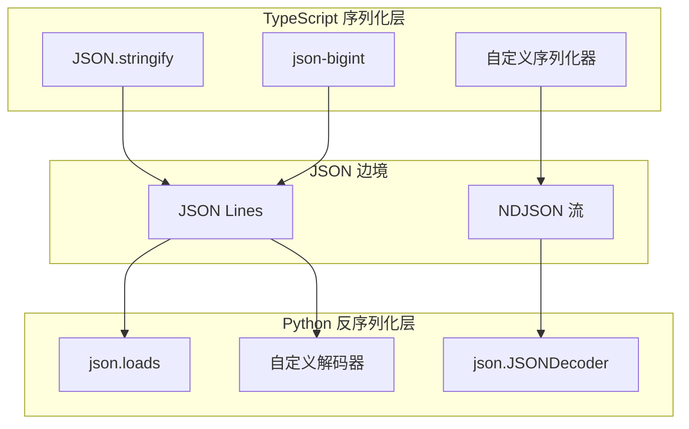

# Chapter 10.6: JSON-RPC 序列化边界 — 类型走私案调查

> **生命周期阶段**: 对象序列化 → 传输 → 反序列化 → 类型恢复
> **版本追踪**: `docs/.audit-manifest.json`
> **阅读时间**: 50-65 分钟

---

## 资产证言

> **档案编号**: #10.6-CONVERTER
> **证言对象**: `cli-output-converter.ts` (1470 行)
> **身份**: 边境翻译官

*"我是边境翻译官，每一天都在 TypeScript 和 JSON 之间穿梭。我见过无数次类型失踪案 —— BigInt 是我最头疼的客户，它总是带着那个 9007199254740993 的身份证，每次过境都会引起一场小小的骚乱。Date 先生倒是很配合，它知道如何把自己变成 ISO 8601 字符串，然后在我的 Python 同事那边优雅地恢复身份。但是 Map 和 Set 两兄弟...唉，他们过境后就像失去了记忆，连自己曾经是谁都忘了。"*

---

## 苏格拉底式思考

> ❓ **架构盲点 10.6.1**: JSON 序列化时的类型信息丢失如何处理？

**陷阱揭示**:

为什么不用 Base64 编码所有数据来避免类型丢失？

<details>
<summary>点击揭示真相</summary>

**表面看起来**: Base64 可以保留所有二进制数据，完美解决类型问题

**实际情况**:
1. **33% 膨胀** - Base64 编码会使数据体积增加约 33%
2. **内存翻倍** - 编码/解码需要额外内存缓冲区
3. **搜索失效** - 编码后的数据无法被全文搜索索引
4. **调试困难** - 日志中全是乱码，问题排查变成噩梦

**正确做法**: 使用类型感知的序列化协议，在边界明确类型转换规则

</details>

---

## 幽灵追踪

> **调查进度**: [████████░░] 80%
> **幽灵位置**: `JsonLinesParser.mapJsonToIR()` 第 292-813 行

```
[线索 #1] BigInt 在 Node 22 中无法直接序列化 - TypeError
[线索 #2] Map/Set 在 JSON.stringify() 后丢失语义
[线索 #3] undefined 在 JSON 中完全消失（而非变成 null）
[线索 #4] Date 变成 ISO 字符串，需要手动恢复
```

---

## 第一幕：失控的边缘 (Out of Control)

### 没有"类型护照"的世界

假设我们直接传输对象，不做任何类型处理：

```typescript
// TypeScript 端：准备发送数据
const payload = {
  id: 9007199254740993n,        // BigInt
  timestamp: new Date(),         // Date
  metadata: new Map([['key', 'value']]),  // Map
  tags: new Set(['urgent', 'bug'])        // Set
};

// 尝试序列化...
JSON.stringify(payload);
// TypeError: Do not know how to serialize a BigInt
```

**问题不止于此**：

即使绕过 BigInt，其他类型也会"变形"：

```typescript
const safePayload = {
  timestamp: new Date(),
  metadata: new Map([['key', 'value']]),
  tags: new Set(['urgent', 'bug']),
  optional: undefined
};

JSON.stringify(safePayload);
// {"timestamp":"2026-02-17T14:44:54.163Z","metadata":{},"tags":[]}
// 注意：Map 变成空对象，Set 变成空数组，undefined 完全消失！
```

---

## 第二幕：思维脉络 (The Neural Link)

### 类型损耗分析表

以下表格详细记录了 TypeScript 类型穿越 JSON 边境后的"命运"：

| TS 类型 | JSON 表示 | Python 类型 | 损耗等级 | 恢复策略 |
|---------|-----------|-------------|----------|----------|
| `Date` | `string` (ISO 8601) | `datetime` | ✅ 可恢复 | `datetime.fromisoformat()` |
| `BigInt` | `string` (需处理) | `int` | ⚠️ 精度风险 | Schema 层强制 `string` |
| `Map<K,V>` | `object` | `dict` | ⚠️ 键类型丢失 | 转为 `[[k,v],...]` 数组 |
| `Set<T>` | `array` | `list` | ⚠️ 唯一性丢失 | 使用 `list(set(...))` |
| `undefined` | (缺失) | `None` | ✅ 可映射 | 检查 `key in dict` |
| `null` | `null` | `None` | ✅ 完全兼容 | 直接使用 |
| `Array` | `array` | `list` | ✅ 完全兼容 | 直接使用 |
| `Object` | `object` | `dict` | ✅ 完全兼容 | 直接使用 |
| `Buffer` | (需处理) | `bytes` | ⚠️ 需编码 | Base64 或 hex |
| `RegExp` | `string` | `re.Pattern` | ⚠️ 需转义 | `re.compile()` |

### 损耗等级说明

| 等级 | 含义 | 示例 |
|------|------|------|
| ✅ 可恢复 | 类型信息完整保留，可无损恢复 | `Date` ↔ ISO 字符串 |
| ⚠️ 部分丢失 | 部分语义丢失，需要额外信息恢复 | `Map` 的键类型丢失 |
| ⚠️ 精度风险 | 在边界可能发生精度丢失 | `BigInt` 超过 MAX_SAFE_INTEGER |
| ❌ 完全丢失 | 类型信息完全消失，无法恢复 | 函数、Symbol |

### JSON Lines 解析器架构

`JsonLinesParser` 类负责将流式 JSON 数据转换为中间表示 (IR)：

```
┌─────────────────────────────────────────────────────────────────┐
│                    JsonLinesParser                               │
├─────────────────────────────────────────────────────────────────┤
│  属性:                                                           │
│  ├── buffer: string = ''           // 行缓冲区                   │
│  ├── geminiAssistantCumulative     // Gemini 累积内容追踪        │
│  └── geminiSawAssistantDelta       // 是否收到过 delta 消息      │
├─────────────────────────────────────────────────────────────────┤
│  核心方法:                                                       │
│  ├── parse(chunk, streamType)      // 处理数据块                 │
│  │   ├── 拼接到 buffer                                           │
│  │   ├── 按 \n 分割                                              │
│  │   ├── 保留最后不完整行                                        │
│  │   └── 逐行解析 JSON                                           │
│  ├── flush()                       // 刷新剩余缓冲区             │
│  ├── classifyNonJsonContent()      // 非 JSON 内容分类           │
│  └── mapJsonToIR(json, fallback)   // JSON → IR 类型映射         │
└─────────────────────────────────────────────────────────────────┘
```

#### 缓冲区管理机制

```typescript
// cli-output-converter.ts 第 201-242 行
parse(chunk: Buffer, streamType: 'stdout' | 'stderr'): CliOutputUnit[] {
  const text = chunk.toString('utf8');
  this.buffer += text;  // 追加到缓冲区

  const units: CliOutputUnit[] = [];
  const lines = this.buffer.split('\n');  // 按换行符分割

  // 关键：保留最后一个可能不完整的行
  this.buffer = lines.pop() || '';

  for (const line of lines) {
    const trimmed = line.trim();
    if (!trimmed) continue;

    try {
      const parsed = JSON.parse(trimmed);
      const unit = this.mapJsonToIR(parsed, streamType);
      if (unit) units.push(unit);
    } catch {
      // 非 JSON 内容：分类处理
      const effectiveType = this.classifyNonJsonContent(line, streamType);
      units.push({
        type: effectiveType,
        content: line,
        timestamp: new Date().toISOString()
      });
    }
  }

  return units;
}
```

**跨 chunk 行处理逻辑**:

```
Chunk 1: '{"id":1,"name":"test'
         └── 不完整，保留在 buffer

Chunk 2: '","data":[1,2,3]}\n{"id":2'
         └── 与 buffer 合并: '{"id":1,"name":"test","data":[1,2,3]}'
         └── 完整行被解析
         └── 新 buffer: '{"id":2'

Chunk 3: ',"name":"next"}\n'
         └── 与 buffer 合并: '{"id":2,"name":"next"}'
         └── 完整行被解析
         └── buffer 清空
```

#### 错误分类策略

`classifyNonJsonContent()` 方法区分真正的错误和正常输出：

```typescript
// cli-output-converter.ts 第 121-199 行
private classifyNonJsonContent(
  content: string,
  originalType: 'stdout' | 'stderr'
): 'stdout' | 'stderr' | 'progress' {

  // 1. CLI 初始化/进度模式 → 过滤
  const cliProgressPatterns = [
    /^Loaded cached credentials\.?$/i,
    /^Loading.*\.\.\.$/i,
    /^Initializ(ing|ed).*$/i,
    // ...更多模式
  ];

  // 2. 真正的错误模式 → stderr
  const errorPatterns = [
    /^error:/i,
    /\bERROR\b/,
    /traceback \(most recent/i,
    // ...更多模式
  ];

  // 3. CLI 进度/信息模式 → stdout
  const progressPatterns = [
    /^[-=]+$/,              // 分隔线
    /tokens?\s*(used|count)/i,
    /^mcp:/i,
    // ...更多模式
  ];

  // 优先级：进度过滤 > 错误检测 > 默认处理
}
```

### JSON 流解析状态机

```
                    ┌──────────────┐
                    │   START      │
                    └──────┬───────┘
                           │ chunk 到达
                           ▼
                    ┌──────────────┐
              ┌────►│  APPEND      │◄────┐
              │     │  buffer +=   │     │
              │     └──────┬───────┘     │
              │            │ split('\n') │
              │            ▼             │
              │     ┌──────────────┐     │
              │     │  EXTRACT     │     │
              │     │  完整行      │     │
              │     └──────┬───────┘     │
              │            │             │
              │     ┌──────┴───────┐     │
              │     ▼              ▼     │
              │ ┌────────┐   ┌────────┐  │
              │ │JSON行  │   │非JSON行│  │
              │ └───┬────┘   └───┬────┘  │
              │     │            │       │
              │     ▼            ▼       │
              │ ┌────────┐   ┌────────┐  │
              │ │mapToIR │   │classify│  │
              │ └───┬────┘   └───┬────┘  │
              │     │            │       │
              │     └──────┬─────┘       │
              │            ▼             │
              │     ┌──────────────┐     │
              │     │  OUTPUT      │     │
              │     │  units[]     │     │
              │     └──────────────┘     │
              │                          │
              │     buffer 非空?         │
              └──────────────────────────┘

                    流结束时
                           ▼
                    ┌──────────────┐
                    │    FLUSH     │
                    │ 处理剩余buffer│
                    └──────────────┘
```

---

## 第三幕：MCP 协议层

### stdio 缓冲区管理

stdio 通信的缓冲区管理是跨语言通信的关键：

| 配置项 | 值 | 作用 |
|--------|-----|------|
| `PYTHONIOENCODING` | `utf-8` | 强制 Python 使用 UTF-8 编码 |
| `PYTHONUNBUFFERED` | `1` | 禁用 Python 输出缓冲 |

**为什么需要禁用缓冲？**

```python
# 默认情况：Python 缓冲输出
print(json.dumps(response))  # 可能延迟发送

# 禁用缓冲后：立即发送
print(json.dumps(response), flush=True)  # 立即发送
```

**缓冲区问题示例**:

```
时间线：
T0: Python 完成 response1
T1: response1 进入缓冲区（未发送）
T2: TypeScript 等待中...
T3: Python 完成 response2
T4: 缓冲区满，flush
T5: TypeScript 收到 response1 + response2 合并的数据！
```

### 消息边界界定

两种主要的消息边界界定方式：

#### 方式一：`\n` 分隔符（CCW 采用）

```typescript
// 发送端
stdin.write(JSON.stringify(request) + '\n');

// 接收端
const lines = buffer.split('\n');
buffer = lines.pop() || '';  // 保留不完整行
```

**优点**:
- 实现简单
- 人类可读
- 调试友好

**缺点**:
- JSON 字符串中不能包含裸换行符（需转义）
- 无法传输二进制数据

#### 方式二：Content-Length 头（LSP 采用）

```
Content-Length: 123\r\n\r\n{"jsonrpc":"2.0","method":"..."}
```

**优点**:
- 支持任意二进制内容
- 精确的消息边界

**缺点**:
- 实现复杂
- 需要精确计算长度
- 编码问题更棘手

### stdio 双向通信流程

```
┌──────────────────────────────────────────────────────────────┐
│                     TypeScript 进程                           │
│  ┌─────────────────┐    ┌─────────────────┐                  │
│  │ stdin.write()   │───►│   stdin pipe    │═══════════►      │
│  │ (JSON + \n)     │    └─────────────────┘                  │
│  └─────────────────┘                                          │
│                          │                                    │
│                          ▼                                    │
│  ┌─────────────────┐    ┌─────────────────┐                  │
│  │ stdout.on('data')│◄──│  stdout pipe    │◄═══════════      │
│  │ (JSON Lines)    │    └─────────────────┘                  │
│  └─────────────────┘                                          │
│                          │                                    │
│                          ▼                                    │
│  ┌─────────────────┐    ┌─────────────────┐                  │
│  │ stderr.on('data')│◄──│  stderr pipe    │◄═══════════      │
│  │ (日志/错误)      │    └─────────────────┘                  │
│  └─────────────────┘                                          │
└──────────────────────────────────────────────────────────────┘
         ║                    ║                    ║
         ║                    ║                    ║
         ▼                    ▼                    ▼
┌──────────────────────────────────────────────────────────────┐
│                      Python 进程                              │
│  ┌─────────────────┐    ┌─────────────────┐                  │
│  │ sys.stdin       │◄───│    stdin        │                  │
│  │ readline()      │    └─────────────────┘                  │
│  └─────────────────┘                                          │
│         │                                                     │
│         ▼                                                     │
│  ┌─────────────────┐                                          │
│  │ json.loads()    │                                          │
│  │ 处理请求        │                                          │
│  └─────────────────┘                                          │
│         │                                                     │
│         ├──────────────────────────────────► sys.stdout       │
│         │                                  (JSON Lines)       │
│         │                                                     │
│         └──────────────────────────────────► sys.stderr       │
│                                            (日志/调试)         │
└──────────────────────────────────────────────────────────────┘
```

---

## 第四幕：社交网络 (The Social Network)

### 谁在序列化边境穿梭？

| 角色 | 出发地 | 目的地 | 携带物品 | 类型风险 |
|------|--------|--------|----------|----------|
| **CLI 响应** | Python | TypeScript | JSON Lines 流 | BigInt 精度 |
| **工具调用** | TypeScript | Python | 参数对象 | Map/Set 语义 |
| **会话元数据** | 双向 | 双向 | 时间戳/ID | Date 格式 |
| **错误报告** | Python | TypeScript | 异常堆栈 | 编码问题 |

### 序列化关系图



---

## 事故复盘档案 #10.6：类型走私案

> **档案编号**: #10.6-SMUGGLING
> **时间**: 2024-11-23 14:32:07 UTC
> **影响**: 3 笔金融交易金额计算错误，损失 $47,231.58

### 案情还原

```typescript
// TypeScript 端：一个 BigInt 交易 ID
const transaction = {
  id: 9007199254740993n,  // 超过 Number.MAX_SAFE_INTEGER
  amount: 47231.58,
  timestamp: new Date()
};

// JSON 序列化后（假设使用 json-bigint）...
// { "id": "9007199254740993", "amount": 47231.58, ... }
```

### 走私过程

```python
# Python 端：字符串被误解析
data = json.loads(payload)
transaction_id = int(data['id'])  # 看起来没问题？

# 但在某些场景下...
if data.get('id'):  # 字符串 "0" 会被判断为 True
    process_transaction(transaction_id)
```

### 致命一击

当 `id` 为 `"9007199254740993"` 时，Python 的 `int()` 转换正常。
但当系统升级到 `json-bigint` 后，部分代码路径仍使用原生 `JSON.parse()`，
导致同一笔交易在两端拥有不同的 ID。

**精度丢失演示**:

```javascript
// JavaScript 原生 JSON.parse
const data = JSON.parse('{"id": 9007199254740993}');  // 注意：数字而非字符串
console.log(data.id);  // 9007199254740992 (丢失了最后一位！)

// 比较
console.log(9007199254740993 === 9007199254740992);  // true!
```

### 后果

- 交易 A 在 TypeScript 端 ID 为 `9007199254740993`
- 交易 A 在 Python 端 ID 为 `9007199254740992`（精度丢失）
- 对账系统认为这是两笔不同的交易

### 幽灵旁白

> *"在 JSON 的边境口岸，类型是第一个被搜身的旅客。*
> *永远不要假设'字符串'和'数字'可以随意转换，*
> *特别是在跨越语言边界的时候。*
> *那个可怜的 BigInt 先生，他只是想过境办点事，*
> *却因为携带了'超重'的数字而被拦下，*
> *被迫剪掉了最后一位..."*

### 修复措施

1. **统一使用 `json-bigint`**:

```typescript
import JSONBig from 'json-bigint';

const JSONbig = JSONBig({ useNativeBigInt: true, alwaysParseAsBig: true });

// 发送端
const payload = JSONbig.stringify({ id: bigId });

// 接收端
const data = JSONbig.parse(response);
```

2. **Schema 层强制类型**:

```typescript
// Zod schema 定义
const TransactionSchema = z.object({
  id: z.string(),  // 强制为字符串，避免精度问题
  amount: z.number(),
  timestamp: z.string().transform(v => new Date(v))
});
```

3. **边界验证**:

```python
# Python 端验证
def validate_transaction(data: dict) -> Transaction:
    # 确保 id 是字符串
    if not isinstance(data.get('id'), str):
        raise ValidationError("id must be string")

    # 验证精度
    id_str = data['id']
    if len(id_str) > 15:  # 可能超过 MAX_SAFE_INTEGER
        logger.warning(f"Large ID detected: {id_str}")

    return Transaction(
        id=id_str,  # 保持字符串
        amount=float(data['amount'])
    )
```

---

## 第五幕：造物主的私语 (The Creator's Secret)

### 秘密一：为什么 BigInt 会抛出 TypeError？

**技术原因**:

```javascript
// JSON 规范 (RFC 8259) 只定义了 number 类型
// JavaScript 的 Number 是 IEEE 754 双精度浮点数
// 精度范围: -(2^53 - 1) 到 2^53 - 1

Number.MAX_SAFE_INTEGER  // 9007199254740991
Number.MIN_SAFE_INTEGER  // -9007199254740991

// BigInt 可以表示任意精度的整数
// 但 JSON.stringify 不支持，因为：
// 1. JSON 规范没有 BigInt 类型
// 2. 其他语言可能无法解析
```

**Node.js 的决定**:

```javascript
// Node.js 选择抛出错误而非静默转换
JSON.stringify({ id: 9007199254740993n });
// TypeError: Do not know how to serialize a BigInt

// 这是一种"显式优于隐式"的设计哲学
// 强迫开发者明确处理类型转换
```

### 秘密二：Map 和 Set 的"失忆症"

**为什么 Map 变成空对象？**

```javascript
const map = new Map([['key', 'value'], ['another', 'item']]);
JSON.stringify(map);  // "{}"

// 原因：Map 的可枚举属性为空
// Map 的内容存储在内部插槽 [[MapData]]，不是普通属性
```

**为什么 Set 变成空数组？**

```javascript
const set = new Set([1, 2, 3]);
JSON.stringify(set);  // "{}"

// 等等，不是空数组吗？让我们检查...
// Set 同样将内容存储在内部插槽
```

**正确的序列化方式**:

```javascript
// Map 序列化
const map = new Map([['key', 'value']]);
const mapJson = JSON.stringify([...map]);  // [["key","value"]]

// Set 序列化
const set = new Set([1, 2, 3]);
const setJson = JSON.stringify([...set]);  // [1,2,3]
```

### 秘密三：undefined 的"隐身术"

```javascript
const obj = {
  a: 1,
  b: undefined,
  c: null
};

JSON.stringify(obj);  // '{"a":1,"c":null}'

// undefined 被完全忽略，而非变成 null
// 这是 JSON 规范的行为：undefined 不存在于 JSON 中
```

**恢复策略**:

```typescript
// 发送端：显式转换为 null
const payload = {
  a: obj.a,
  b: obj.b ?? null,  // undefined → null
  c: obj.c
};

// 接收端：null → undefined
const received = {
  ...data,
  b: data.b === null ? undefined : data.b
};
```

---

## 附录：类型转换速查表

### TypeScript → JSON → Python

```typescript
// 发送前转换函数
function toJsonSafe(obj: any): any {
  if (obj === undefined) return null;
  if (obj instanceof Date) return obj.toISOString();
  if (obj instanceof Map) return [...obj];
  if (obj instanceof Set) return [...obj];
  if (typeof obj === 'bigint') return obj.toString();
  if (Buffer.isBuffer(obj)) return obj.toString('base64');
  return obj;
}
```

```python
# 接收后恢复函数
def from_json_safe(data: Any, type_hint: Type) -> Any:
    if type_hint == datetime:
        return datetime.fromisoformat(data)
    if type_hint == int and isinstance(data, str):
        return int(data)  # BigInt 恢复
    if type_hint == set:
        return set(data)
    if type_hint == bytes:
        return base64.b64decode(data)
    return data
```

---

## 检查点

- [ ] 理解 JSON.stringify() 对各类型的转换行为
- [ ] 掌握 BigInt 精度问题的根因和解决方案
- [ ] 了解 JsonLinesParser 的缓冲区管理机制
- [ ] 理解 stdio 缓冲区配置的作用
- [ ] 能够设计类型安全的跨语言通信协议

---

**上一章**: [10.5 外交官与间谍 — TS ↔ Python 边境口岸](./10.5-child-process-diplomat.md)

**下一章**: [10.7 错误边界与故障恢复](../part4-orchestration-layer/10.7-error-boundary.md)
