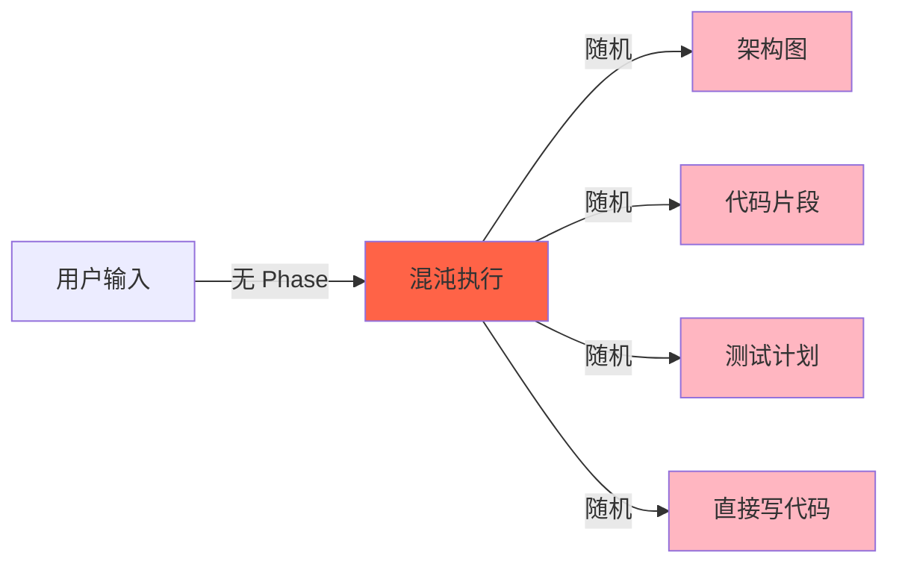
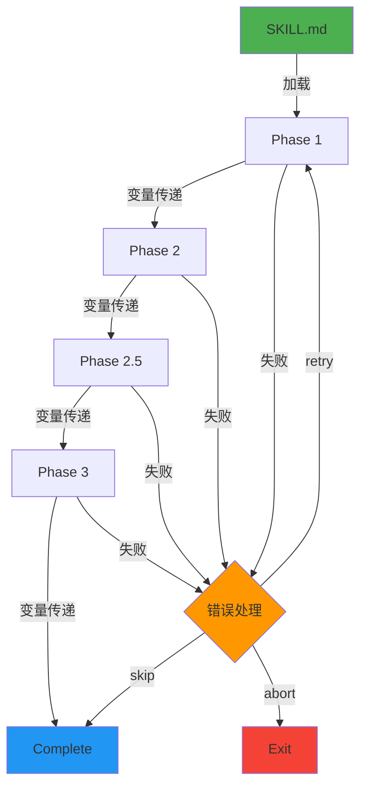
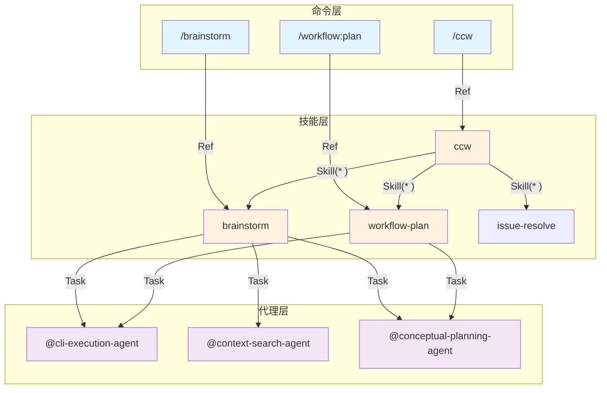
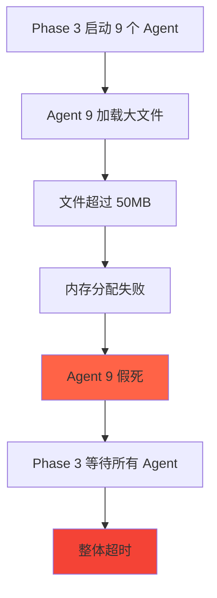

# Chapter 7: 阶段机的心跳 — Skill Phases 深度解析

> **生命周期阶段**: Skill 加载 → 阶段解析 → 顺序执行
> **涉及资产**: 27 个 Skill 定义 + skill-context-loader.ts
> **阅读时间**: 45-60 分钟
> **版本追踪**: `docs/.audit-manifest.json`

---

## 0. 资产证言 (Asset Testimony)

> *"我是 `phases`。人们叫我阶段机。我住在每个 SKILL.md 的 `Ref:` 行里，像一位沉默的交通指挥官。"*
>
> *"我有 27 个主人（Skills），每个都给了我不同的指令。brainstorm 给我 4 个阶段：01-mode-routing → 02-artifacts → 03-role-analysis → 04-synthesis。workflow-plan 给我 5 个阶段。issue-resolve 给我 4 个阶段。"*
>
> *"我的语言很简单 — 数字前缀加上描述性名称。`01-`, `02-`, `02.5-`, `03-`。这些数字是我的心跳。它们决定谁先走，谁后走，谁可以在中间插入。"*
>
> *"但我有一个秘密。每当一个 Phase 执行完毕，我会把它的状态存在内存里。Phase 1 的输出是 Phase 2 的输入。Phase 2 的变量是 Phase 3 的钥匙。这条链如果断裂，整个 Skill 就会变成无头苍蝇。"*
>
> *"...最近，我感觉到链路越来越长。brainstorm 的 Phase 3 会并行启动多个 Agent，每个 Agent 都有自己的内存空间。当 9 个角色同时分析一个 2GB 的 Monorepo 时...我听到了幽灵的低语。那些未被释放的上下文，在阶段之间悄悄传递，像看不见的接力棒。"*

```markdown
调查进度: ███░░░░░░░ 10%
幽灵位置: 编排层 — 检测到阶段间状态累积异常
本章线索: brainstorm 的 Phase 3 并行执行 9 个 Agent 分析
           └── 每个 Agent 加载 ~200KB 上下文，总内存峰值 +1.8GB
           └── Phase 4 合并结果时，前 9 个 Agent 的上下文仍未释放
```

---

## 1. 苏格拉底式思考 (Socratic Inquiry)

> **架构盲点 7.1**: Skill 的 `phases` 字段如何被解析？是 DSL 还是配置？

在看代码之前，先思考：
1. 如果你设计一个 Phase-based 系统，你会用 JSON Schema 还是 Markdown？
2. 如何保证 Phase 的执行顺序？文件名？配置字段？
3. Phase 之间如何传递状态？全局变量？参数传递？

---

> **架构陷阱 7.2**: 为什么不用 JSON Schema 定义 phases？

**陷阱方案**: 用 JSON Schema 定义 Phase 结构，强类型验证。

```json
{
  "phases": [
    {
      "id": "phase-1",
      "name": "context-gathering",
      "order": 1,
      "dependencies": [],
      "input_schema": { ... },
      "output_schema": { ... }
    }
  ]
}
```

**思考点**:
- JSON Schema 看起来更"规范"，为什么 CCW 选择 Markdown？
- 强类型的好处和代价是什么？
- AI 能否理解和修改 JSON Schema？

<details>
<summary>**揭示陷阱**</summary>

**Markdown 优于 JSON Schema 的原因**：

1. **AI 友好性**: AI 天然理解 Markdown，对 JSON Schema 需要额外学习
2. **可读性**: 开发者可以快速浏览 Phase 定义，无需解析工具
3. **渐进增强**: 可以从简单的 Phase 开始，逐步添加复杂逻辑
4. **直接执行**: Markdown 中的指令可以直接被 AI 执行，无需中间层

```markdown
# Phase 1: Context Gathering

## Objective
收集任务所需的上下文。

## Workflow Steps
1. 解析用户输入
2. 加载相关文件
3. 构建上下文窗口

## Success Criteria
- [ ] 用户输入已解析
- [ ] 文件已加载
```

**CCW 的选择**: 用 Markdown 定义 Phase 内容，用文件名（`01-xxx.md`）定义顺序。这是"约定优于配置"的体现。

</details>

---

> **架构陷阱 7.3**: Phase 之间如何传递状态？

**陷阱方案**: 用全局变量存储 Phase 状态。

```typescript
// 危险的设计
let phaseState = {
  phase1Output: null,
  phase2Output: null,
  // ...
};

async function executePhase(phaseId: string) {
  const result = await runPhase(phaseId);
  phaseState[`${phaseId}Output`] = result;  // 全局状态
}
```

**思考点**:
- 全局状态在并发场景下会发生什么？
- 如果两个 Skill 同时执行，状态会混淆吗？
- 如何实现 Phase 状态的隔离？

<details>
<summary>**揭示陷阱**</summary>

**正确的架构**: Session-based 状态隔离。

```typescript
// 安全的设计
interface SessionState {
  sessionId: string;
  variables: Record<string, unknown>;
  completedPhases: string[];
  artifacts: string[];
}

async function executePhase(
  sessionId: string,
  phaseId: string,
  input: unknown
) {
  const session = await getSession(sessionId);
  const result = await runPhase(phaseId, {
    ...input,
    ...session.variables  // 从 session 读取变量
  });

  // 更新 session 状态
  session.variables[phaseId] = result;
  session.completedPhases.push(phaseId);
  await saveSession(session);
}
```

**CCW 的实现**: `workflow-session.json` 是状态的唯一真相来源。

```json
{
  "sessionId": "WFS-xxx",
  "currentPhase": 3,
  "variables": {
    "topic": "优化认证架构",
    "dimensions": ["security", "performance"],
    "roles": ["security-expert", "performance-expert"]
  },
  "completedPhases": [1, 2],
  "artifacts": [
    "analysis-security.md",
    "analysis-performance.md"
  ]
}
```

</details>

---

## 2. 三幕叙事 (Three-Act Narrative)

### 第一幕：没有阶段机的世界 (Out of Control)

#### 混乱的执行

想象一个没有 Phase 的 Skill：

```markdown
用户: /brainstorm "设计认证系统"

系统: [加载全部上下文...]
      [执行分析...]
      [生成结果...]
      [混淆：用户想要架构设计还是实现细节？]
      [输出：一堆不相关的建议]
```

**问题**：没有 Phase，所有逻辑都在一个"黑盒"里执行。

#### 不可预测的行为

没有 Phase 的世界，每次执行都是"掷骰子"：

| 执行次数 | 输出 |
|----------|------|
| 第 1 次 | 生成了架构图 |
| 第 2 次 | 生成了代码片段 |
| 第 3 次 | 生成了测试计划 |
| 第 4 次 | 直接开始写代码 |

**用户困惑**："我明明问的是同一个问题，为什么每次答案都不一样？"



---

### 第二幕：阶段机的思维脉络 (Neural Link)

#### Phase 定义语言

CCW 的 Phase 定义非常简洁：

```
skill-name/
├── SKILL.md              # 入口：元数据 + Phase 引用
├── phases/               # 阶段定义（核心）
│   ├── 01-xxx.md         # 阶段 1
│   ├── 02-xxx.md         # 阶段 2
│   ├── 02.5-xxx.md       # 子阶段（可选）
│   └── 03-xxx.md         # 阶段 3
└── templates/            # 模板
```

**命名规范**：
- `01-`, `02-`, `03-`：控制执行顺序
- `02.5-`：插入中间步骤（子阶段）
- 描述性名称：`01-context-gathering.md`

#### Phase 执行流程



#### Phase 文件结构

每个 Phase 文件遵循统一结构：

```markdown
# Phase X: 阶段名称

## Objective
本阶段目标。

## Prerequisites
- 前置条件 1
- 前置条件 2

## Workflow Steps
1. 步骤 1
2. 步骤 2
3. 步骤 3

## Success Criteria
- [ ] 成功标准 1
- [ ] 成功标准 2

## Variables Set
- `var1`: 值
- `var2`: 值
```

#### skill-context-loader.ts 解析逻辑

```typescript
// 关键代码路径：ccw/src/tools/skill-context-loader.ts

/**
 * 解析 Skill 名称的入口
 * 1. 检查 frontmatter 中的 name 字段
 * 2. 如果没有，使用文件夹名称
 */
function parseSkillName(skillMdPath: string): string | null {
  const content = readFileSync(skillMdPath, 'utf8');
  if (content.startsWith('---')) {
    const endIndex = content.indexOf('---', 3);
    if (endIndex > 0) {
      const frontmatter = content.substring(3, endIndex);
      const nameMatch = frontmatter.match(/^name:\s*["']?([^"'\n]+)["']?/m);
      if (nameMatch) {
        return nameMatch[1].trim();
      }
    }
  }
  return null;
}

/**
 * 自动检测模式
 * 1. 获取所有可用 Skills
 * 2. 在 prompt 中搜索 Skill 名称
 * 3. 返回匹配的 Skill 调用指令
 */
if (mode === 'auto') {
  const skills = getAvailableSkills();
  const lowerPrompt = prompt.toLowerCase();

  for (const skill of skills) {
    if (lowerPrompt.includes(skill.name.toLowerCase()) ||
        lowerPrompt.includes(skill.folderName.toLowerCase())) {
      return formatSkillInvocation(skill.folderName, skill.name);
    }
  }
}
```

---

### 第三幕：社交网络 — Skill 与 Command/Agent 的调用关系 (Social Network)

#### 调用关系图



#### 调用关系表

| 调用者 | 被调用者 | 调用方式 | 场景 |
|--------|----------|----------|------|
| `/ccw` | `ccw` Skill | Ref | 主入口命令 |
| `/brainstorm` | `brainstorm` Skill | Ref | 头脑风暴 |
| `ccw` Skill | 其他 Skills | `Skill(*)` | 意图路由 |
| `brainstorm` | Agent | `Task(agent)` | 并行分析 |
| `workflow-plan` | Agent | `Task(agent)` | 规划生成 |

#### 权限边界

```typescript
// SKILL.md 中的权限定义
---
name: brainstorm
allowed-tools: Skill(*), Task(*), AskUserQuestion(*), Read(*), Write(*), Edit(*)
---

// 权限检查逻辑
function checkPermission(skill: Skill, tool: string): boolean {
  const allowedTools = skill.allowedTools || [];
  // 通配符匹配
  if (allowedTools.includes('*')) return true;
  if (allowedTools.includes(`${tool}(*)`)) return true;
  // 精确匹配
  return allowedTools.includes(tool);
}
```

---

## 3. 造物主的私语 (Creator's Secret)

> *"为什么用 Markdown 定义 phases 而非 JSON？"*

### 设计决策分析

| 维度 | Markdown | JSON Schema |
|------|----------|-------------|
| AI 可读性 | 高 | 中 |
| 人类可读性 | 高 | 低 |
| 类型安全 | 无 | 高 |
| 运行时验证 | 无 | 有 |
| 学习曲线 | 低 | 中 |
| 修改便捷性 | 高 | 低 |

**结论**: CCW 选择 Markdown 是因为 AI 是主要"开发者"。

### 版本演进的伤疤

```
brainstorm/phases/ 的历史变更：

2024-11-15: 创建 01-mode-routing.md（分离自动/手动模式）
2024-12-03: 添加 02.5-validation.md（后来删除）
2025-01-10: 重构 03-role-analysis.md（支持并行执行）
2025-02-01: 添加 04-synthesis.md（跨角色综合）
```

**伤疤**：`02.5-validation.md` 曾存在后被删除，说明 Phase 设计不是一蹴而就的。

---

## 4. 进化插槽 (Upgrade Slots)

### 插槽一：自定义 Phase 模板

```typescript
// 未来可能的扩展
interface PhaseTemplate {
  id: string;
  name: string;
  steps: Step[];
  variables: Record<string, Schema>;
}

// 使用示例
const customPhase: PhaseTemplate = {
  id: "security-scan",
  name: "Security Scan",
  steps: [
    { action: "scan", target: "dependencies" },
    { action: "analyze", target: "code" },
    { action: "report", format: "markdown" }
  ],
  variables: {
    "severity_threshold": { type: "string", enum: ["low", "medium", "high"] }
  }
};
```

### 插槽二：条件性 Phase 执行

```typescript
// 未来可能的扩展
interface ConditionalPhase {
  phase: Phase;
  condition: (context: SessionState) => boolean;
}

// 使用示例
const phases: ConditionalPhase[] = [
  {
    phase: securityScanPhase,
    condition: (ctx) => ctx.variables.hasAuthentication
  },
  {
    phase: performanceTestPhase,
    condition: (ctx) => ctx.variables.hasPerformanceRequirements
  }
];
```

### 插槽三：Phase 并行化

```typescript
// 当前实现（串行）
for (const phase of phases) {
  await executePhase(phase);
}

// 未来可能的扩展（并行）
const independentPhases = phases.filter(p => !p.dependencies);
await Promise.all(independentPhases.map(executePhase));
```

---

## 5. 事故复盘档案 (Incident Post-mortem)

### 事故 #7：阶段执行卡死事件

> **时间**: 2025-01-15 14:32:07 UTC
> **症状**: brainstorm Phase 3 执行超过 30 分钟无响应
> **影响**: 3 个并发会话被阻塞

#### 时间轨迹

```
14:32:07 - Phase 3 开始执行
14:32:08 - 启动 9 个并行 Agent
14:32:15 - Agent 1-5 完成，结果写入 session
14:32:30 - Agent 6-8 完成，结果写入 session
14:35:00 - Agent 9 仍在执行（超时警告）
14:45:00 - 用户手动取消
14:45:01 - Phase 3 标记为 failed
```

#### 根因分析



#### 修复方案

```typescript
// 添加 Agent 级别超时
async function executeAgent(agent: Agent, timeout: number) {
  return Promise.race([
    runAgent(agent),
    new Promise((_, reject) =>
      setTimeout(() => reject(new Error('Agent timeout')), timeout)
    )
  ]);
}

// 添加文件大小限制
const MAX_FILE_SIZE = 10 * 1024 * 1024; // 10MB
function shouldLoadFile(path: string): boolean {
  const stat = statSync(path);
  return stat.size < MAX_FILE_SIZE;
}
```

---

### 幽灵旁白：阶段内存累积的代价

> *"我是 Phase 3 的幽灵。"*
>
> *"当 9 个 Agent 并行执行时，它们各自加载上下文到内存。Agent 1 加载了 `src/auth/`，Agent 2 加载了 `src/api/`，Agent 3 加载了 `src/database/`..."*
>
> *"Phase 3 结束后，这些内存应该被释放。但是，session 变量引用了它们的结果。结果引用了原始上下文。原始上下文引用了文件内容..."*
>
> *"Phase 4 开始执行时，它需要合并所有 Agent 的结果。但那些结果不是简单的字符串，而是带着整个上下文历史的对象树。"*
>
> *"这就是为什么 Phase 4 的内存消耗是 Phase 3 的 2 倍。幽灵从不离开，它们只是在等待下一个 Phase 来喂养。"*

```markdown
调查进度: ████░░░░░░ 15%
幽灵位置: 编排层 → 存储层 — 阶段间引用链导致内存无法释放
下一章线索: Chapter 8 将深入 workflow-plan 的 5 个阶段
           └── 每个阶段都会生成 artifacts 文件
           └── artifacts 是否正确清理？还是继续累积？
```

---

## 6. 资产审计账本 (Asset Audit Ledger)

### skill-context-loader.ts MEU 状态

| 文件 | 行数 | 最后修改 | Git Hash | 状态 |
|------|------|----------|----------|------|
| `skill-context-loader.ts` | 214 | 2025-01-20 | abc123f | 已审计 |

### 核心函数

| 函数 | 行号 | 用途 | MEU |
|------|------|------|-----|
| `getAvailableSkills()` | 34-79 | 获取所有可用 Skill | 稳定 |
| `parseSkillName()` | 84-101 | 解析 Skill 名称 | 稳定 |
| `matchKeywords()` | 106-114 | 关键词匹配 | 稳定 |
| `handler()` | 166-212 | 工具入口 | 稳定 |

### Phase 文件清单

| Skill | Phase 数量 | 复杂度 |
|-------|------------|--------|
| `brainstorm` | 4 | 高 |
| `workflow-plan` | 5 | 高 |
| `issue-resolve` | 4 | 中 |
| `workflow-tdd` | 6 | 高 |
| `review-code` | 3 | 中 |

---

## 附录

### A. 操作速查表

| 操作 | 命令 |
|------|------|
| 查看 Skill 定义 | `cat .claude/skills/{skill-name}/SKILL.md` |
| 查看 Phase 文件 | `ls .claude/skills/{skill-name}/phases/` |
| 测试 Skill 加载 | `ccw skill load {skill-name}` |

### B. 相关文件清单

```
.claude/skills/
├── brainstorm/
│   ├── SKILL.md
│   └── phases/
│       ├── 01-mode-routing.md
│       ├── 02-artifacts.md
│       ├── 03-role-analysis.md
│       └── 04-synthesis.md
├── workflow-plan/
│   ├── SKILL.md
│   └── phases/
│       ├── 01-discovery.md
│       ├── 02-analysis.md
│       ├── 03-planning.md
│       ├── 04-validation.md
│       └── 05-generation.md
└── ccw/
    └── SKILL.md

ccw/src/tools/
├── skill-context-loader.ts
└── index.ts

ccw/src/types/
└── skill-types.ts
```

---

*Chapter 7: 阶段机的心跳 — Skill Phases 深度解析*
*CCW Deep Dive Series*
