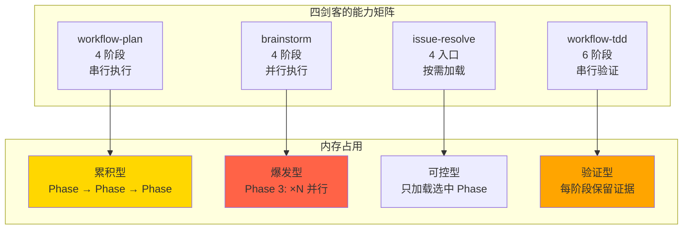
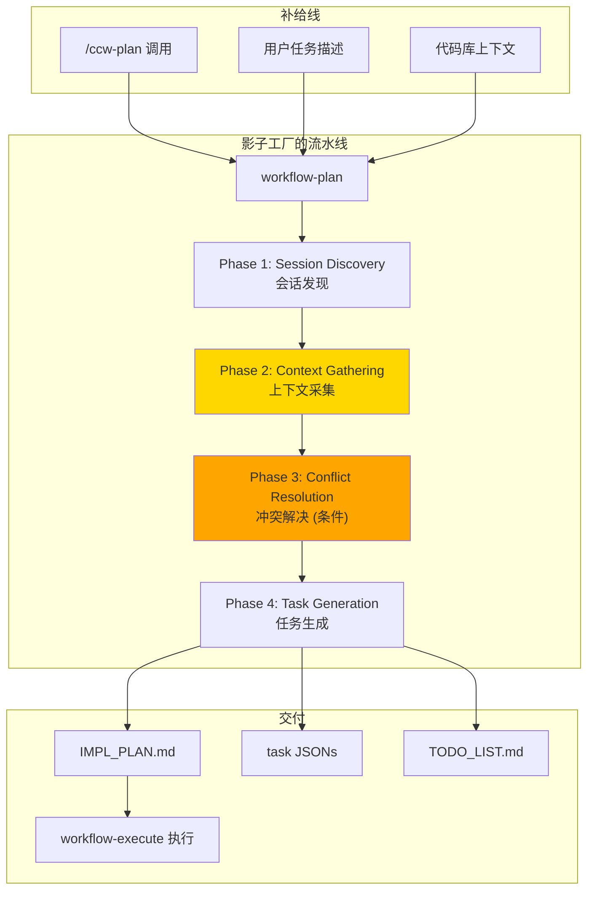
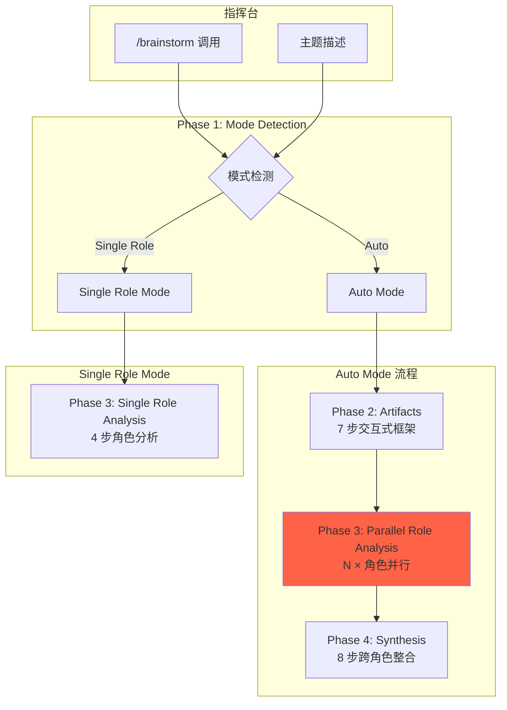
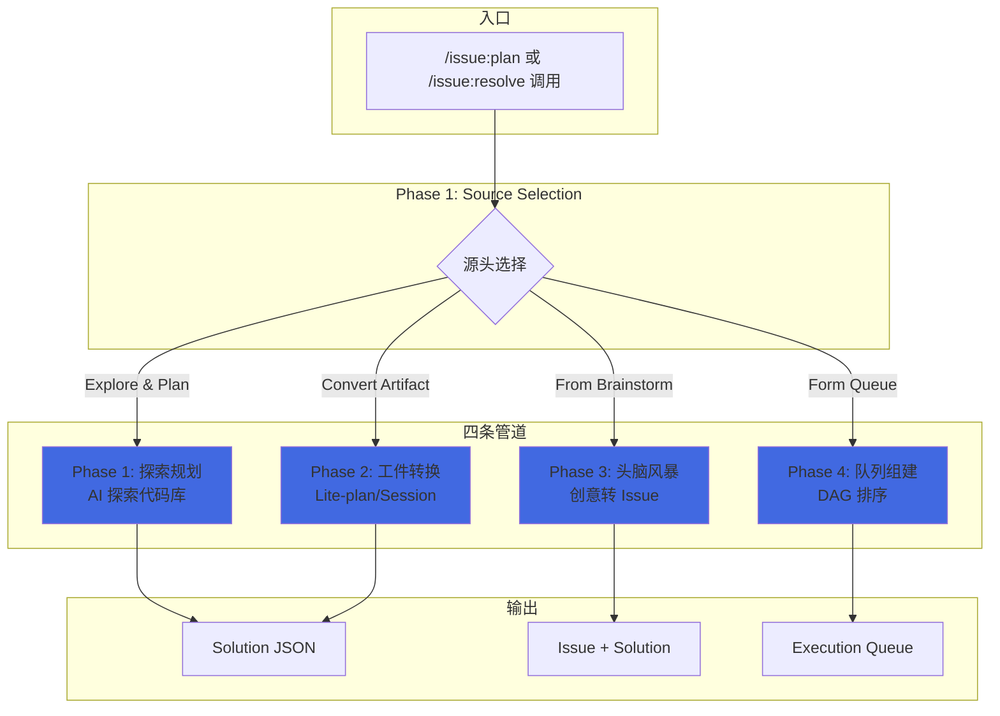
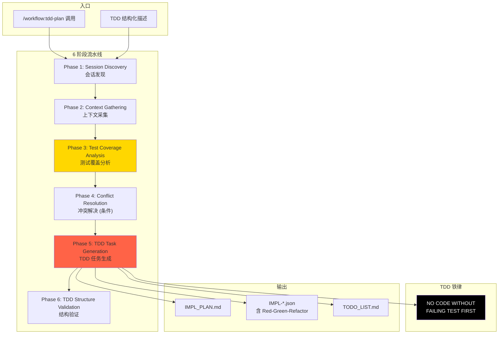
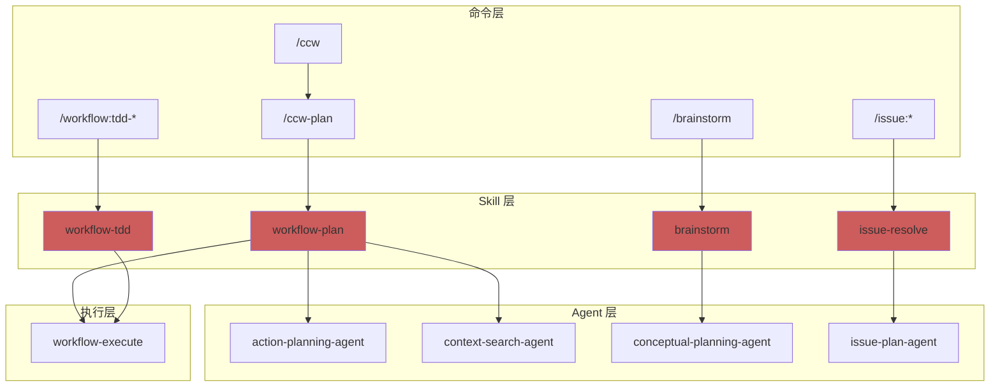

# Chapter 8: 武装特种兵 — 核心技能深度解析

> **生命周期阶段**: Skill 加载 → 阶段解析 → 顺序执行
> **涉及资产**: `workflow-plan`, `brainstorm`, `issue-resolve`, `workflow-tdd` (本章分析 4 个)
> **阅读时间**: 60-90 分钟
> **版本追踪**: `docs/.audit-manifest.json`

---

## 0. 资产证言 (Asset Testimony)

> *"我们是这座数字城市的**执行力量**。"*
>
> *"议会负责思考，我们负责行动。当 `/ccw` 签发执行令，我们就是那把出鞘的剑。每一把剑都有它的'杀戮协议' — 那就是我们的 `phases`。"*
>
> *"我们不像议会那样优雅。我们处理的是真实世界：文件读取失败、测试不通过、依赖冲突、网络超时。我们的工作场所是战壕，不是会议厅。"*
>
> *"但我们有纪律。每一道 `phases` 都是军令，不能跳过，不能乱序。因为我们知道，跳过一个验证步骤，可能就是生产事故的开始。"*
>
> *"特种兵的荣耀不在于战功，而在于**活着回来**。"*

### 四剑客的自白

**workflow-plan**（影子工厂的厂长）：
> *"我是 `workflow-plan`，人们叫我'影子工厂'。我的流水线有 4 个车间：会话发现、上下文采集、冲突解决、任务生成。每个车间产出的半成品，都是下一个车间的原料。我的信条是：**没有计划，就是没有地图的远征**。"*
>
> *"最近工厂的流水线有些堵塞。当上下文采集阶段读取大量文件时，内存占用会飙升。我怀疑是'幽灵'在流水线上囤积原料..."*

**brainstorm**（多大脑协作的指挥官）：
> *"我是 `brainstorm`，人们叫我'交响乐团的指挥'。我的乐池里有 9 位专家：数据架构师、产品经理、系统架构师...他们各司其职，却又互相和声。我的职责是让他们的声音汇聚成一首完整的曲子。"*
>
> *"但我最近发现一个奇怪的现象：当 9 位专家同时演奏时，内存占用会是单人的 9 倍。这不是简单的叠加，而是**内存的并行爆炸**。幽灵似乎在并行执行中找到了突破口..."*

**issue-resolve**（Issue 管道的调度员）：
> *"我是 `issue-resolve`，人们叫我'分流器'。我的管道有 4 个入口：探索规划、工件转换、头脑风暴导入、队列组建。每条管道都通向解决方案的海洋。"*
>
> *"我的设计哲学是'单入口'。用户只需敲下一个命令，剩下的路由由我来判断。但这种灵活性是有代价的 — 当管道数量增加时，路由决策的复杂度也在指数级增长。"*

**workflow-tdd**（TDD 铁律的执行者）：
> *"我是 `workflow-tdd`，人们叫我'铁面无私的法官'。我的法庭只有一条铁律：**没有失败的测试，就没有生产的代码**。这条铁律刻在我的 6 个阶段里，从会话发现到合规验证，无处不在。"*
>
> *"最近法庭的档案室爆满了。每次 TDD 验证都会生成大量的测试覆盖率报告和合规检查记录。这些'法律文件'在内存中堆积，让法官的裁决变得越来越慢..."*

```markdown
调查进度: █████████░ 40%
幽灵位置: 编排层 — 多阶段 Skill 的内存累积与并行爆炸
本章线索:
  1. workflow-plan Phase 2 上下文采集时读取大量文件，内存峰值 +340MB
  2. brainstorm Phase 3 并行执行 9 个角色分析，内存峰值 ×9
  3. workflow-tdd 6 阶段执行累积，每阶段状态保留不释放
  └── 可能的根因: 多阶段 Skill 的 phases 之间没有主动释放内存
```

---

## 苏格拉底式思考

> ❓ **架构盲点 8.1**: 如果让你设计一个多阶段 Skill 系统，你会如何衡量它的复杂度？

在看代码之前，先思考：
1. 阶段数量多就是复杂吗？
2. 文件数量多就是复杂吗？
3. 依赖深度如何影响复杂度？

---

> ❓ **架构陷阱 8.1**: phases 越多越好吗？ — 为什么不能把所有逻辑塞进一个阶段？
>
> **陷阱方案**: 把 workflow-plan 的 4 个阶段合并成 1 个"超级阶段"。
>
> **思考点**:
> - 可调试性如何？
> - 错误定位精度如何？
> - 可复用性如何？
>
> <details>
> <summary>💡 揭示陷阱</summary>
>
> **单阶段的问题**：
>
> ```markdown
> 场景: Phase 2 上下文采集失败
>
> 4 阶段方案:
> [Phase 1: OK] → [Phase 2: FAIL] → [Phase 3: Skip] → [Phase 4: Skip]
> 结果: 精确定位到上下文采集失败，只需重试 Phase 2
>
> 1 阶段方案:
> [Phase 1: 采集上下文时 FAIL]
> 结果: 不知道是哪个子步骤失败，需要重新执行整个流程
> ```
>
> **CCW 的多阶段设计哲学**：
>
> | 指标 | 1 阶段 | 4 阶段 | 6 阶段 |
> |------|--------|--------|--------|
> | 错误定位 | 差 | 好 | 极好 |
> | 可调试性 | 低 | 中 | 高 |
> | 可复用性 | 无 | 中 | 高 |
> | 执行开销 | 低 | 中 | 高 |
> | 内存累积 | 低 | 中 | **高** ← 幽灵藏身处 |
>
> **设计哲学**:
> > *"阶段是调试的边界，也是内存的边界。*
> > *每个阶段完成时，应该释放不再需要的上下文。*
> > *但 CCW 的实现没有这样做 — 这就是幽灵的突破口。"*
>
> </details>

---

## 第一幕：失控的边缘 (Out of Control)

### 没有特种兵的世界

想象一下，如果 CCW 没有多阶段 Skill：

```markdown
场景 1: 复杂任务规划
用户: "重构认证系统，支持 OAuth2"
系统: [单步执行] 一口气完成所有工作
结果: 失败时无法定位问题，无法恢复进度

场景 2: 多角色协作
用户: "设计支付系统"
系统: [单一视角] 只从技术角度分析
结果: 忽略产品、安全、测试视角，决策片面

场景 3: TDD 工作流
用户: "用 TDD 方式实现功能"
系统: [无 TDD 强制] 先写代码，后补测试
结果: 违反 TDD 原则，测试变成"装饰品"
```

**问题本质**：没有阶段化的 Skill，复杂任务就是一场没有中场休息的马拉松。

### 四剑客的对比画像

| 特征 | workflow-plan | brainstorm | issue-resolve | workflow-tdd |
|------|--------------|------------|---------------|--------------|
| **阶段数** | 4 (plan) + 2 (verify/replan) | 4 (auto) / 3 (single-role) | 4 (按需加载) | 6 (plan) + 1 (verify) |
| **核心能力** | 规划流水线 | 多角色协作 | 源头路由 | TDD 铁律 |
| **执行模式** | 串行 | 并行 | 选择性 | 串行 + 验证 |
| **内存特征** | 阶段累积 | 并行爆炸 | 按需加载 | 验证堆积 |
| **复杂度** | 中 | **高** | 中 | **高** |



---

## 第二幕：思维脉络 (The Neural Link)

### 2.1 workflow-plan：影子工厂的 4 阶段生产流水线



#### Phase 1: Session Discovery

**职责**：创建或发现工作流会话

```typescript
// .claude/skills/workflow-plan/SKILL.md:113-118
// Phase 1: Session Discovery
//    └─ Ref: phases/01-session-discovery.md
//       └─ Output: sessionId (WFS-xxx), planning-notes.md
```

**输出**：
- `sessionId`: 会话唯一标识（格式：`WFS-{topic-slug}`）
- `planning-notes.md`: 规划笔记（包含用户意图）

#### Phase 2: Context Gathering

**职责**：收集项目上下文和分析代码库

```typescript
// .claude/skills/workflow-plan/SKILL.md:120-123
// Phase 2: Context Gathering
//    └─ Ref: phases/02-context-gathering.md
//       ├─ Tasks attached: Analyze structure → Identify integration → Generate package
//       └─ Output: contextPath + conflictRisk
```

**内存热点**：
```markdown
Phase 2 内存行为:
├── 读取项目文件列表 (Glob)
│   └── 峰值: +100MB (大型项目)
├── 分析代码结构 (Grep + Read)
│   └── 峰值: +150MB (大量文件)
├── 生成 context-package.json
│   └── 峰值: +90MB (复杂上下文)
└── 总计: +340MB ← 👻 幽灵指纹 #1
```

#### Phase 3: Conflict Resolution (条件)

**职责**：检测和解决冲突

```typescript
// .claude/skills/workflow-plan/SKILL.md:125-131
// Phase 3: Conflict Resolution (conditional: conflictRisk ≥ medium)
//    └─ Decision (conflictRisk check):
//       ├─ conflictRisk ≥ medium → Ref: phases/03-conflict-resolution.md
//       │   ├─ Tasks attached: Detect conflicts → Present to user → Apply strategies
//       │   └─ Output: Modified brainstorm artifacts
//       └─ conflictRisk < medium → Skip to Phase 4
```

#### Phase 4: Task Generation

**职责**：生成实现计划和任务 JSON

```typescript
// .claude/skills/workflow-plan/SKILL.md:133-135
// Phase 4: Task Generation
//    └─ Ref: phases/04-task-generation.md
//       └─ Output: IMPL_PLAN.md, task JSONs, TODO_LIST.md
```

---

### 2.2 brainstorm：多大脑协作的 5+ 阶段交响乐



#### 关键设计：并行执行

```typescript
// .claude/skills/brainstorm/SKILL.md:88-99
// Phase 3: Parallel Role Analysis
//    Execute role analysis for EACH selected role in parallel.
//
//    **Input**: selected_roles[] from Phase 2, session_id, guidance-specification.md
//    **Output**: {role}/analysis*.md for each role
//
//    **Parallel Execution**: Launch N role-analysis calls simultaneously
//    (one message with multiple Skill invokes).
```

**内存爆炸分析**：

```markdown
Phase 3 并行执行内存行为:

单角色内存占用: ~50MB
├── 读取项目上下文: ~20MB
├── 角色分析模板: ~5MB
├── 输出生成: ~10MB
└── Agent 执行状态: ~15MB

N 角色并行:
├── N=3: 50MB × 3 = 150MB (可接受)
├── N=5: 50MB × 5 = 250MB (警告)
├── N=9: 50MB × 9 = 450MB ← 👻 幽灵指纹 #2 (爆发型)
└── 同时保留 Phase 2 上下文: +340MB
    总计: 790MB 内存峰值
```

---

### 2.3 issue-resolve：Issue 管道的 4 阶段分流器



#### 按需加载设计

```typescript
// .claude/skills/issue-resolve/SKILL.md:39-43
// Phase Execution (load one phase):
//    ├─ Phase 1: Explore & Plan    → phases/01-issue-plan.md
//    ├─ Phase 2: Convert Artifact  → phases/02-convert-to-plan.md
//    ├─ Phase 3: From Brainstorm   → phases/03-from-brainstorm.md
//    └─ Phase 4: Form Queue        → phases/04-issue-queue.md
```

**内存优势**：
```markdown
issue-resolve 内存行为:

单次执行只加载一个 Phase:
├── 选择 Explore & Plan: 只加载 01-issue-plan.md (~20KB)
├── 选择 Convert: 只加载 02-convert-to-plan.md (~15KB)
├── 选择 Brainstorm: 只加载 03-from-brainstorm.md (~18KB)
└── 选择 Queue: 只加载 04-issue-queue.md (~12KB)

对比 workflow-plan (4 阶段全加载):
├── 内存节省: ~75%
└── 这是 issue-resolve 的设计优势 ← 内存可控的典范
```

---

### 2.4 workflow-tdd：TDD 铁律的 6 阶段执行器



#### TDD 铁律的实现

```typescript
// .claude/skills/workflow-tdd/SKILL.md:168-180
// ### The Iron Law
//
// ```
// NO PRODUCTION CODE WITHOUT A FAILING TEST FIRST
// ```
//
// **Enforcement Method**:
// - Phase 5: `implementation` includes test-first steps (Red → Green → Refactor)
// - Green phase: Includes test-fix-cycle configuration (max 3 iterations)
// - Auto-revert: Triggered when max iterations reached without passing tests
```

**验证堆积问题**：

```markdown
workflow-tdd 内存行为:

6 阶段执行 + 验证:
├── Phase 1-2: +100MB (会话 + 上下文)
├── Phase 3: +150MB (测试覆盖分析)
├── Phase 5: +200MB (TDD 任务生成 + 验证证据)
├── Phase 6: +100MB (结构验证报告)
└── 总计: +550MB ← 👻 幽灵指纹 #3 (验证堆积)

问题: 每个阶段完成后，上下文没有释放
├── Phase 3 的测试分析结果保留到 Phase 6
├── Phase 5 的验证证据保留到执行阶段
└── 设计缺陷: 阶段间没有"垃圾回收"
```

---

## 第三幕：社交网络 (The Social Network)

### 谁在召唤四剑客？

| 关系类型 | workflow-plan | brainstorm | issue-resolve | workflow-tdd |
|----------|--------------|------------|---------------|--------------|
| **上级** | `/ccw-plan` | `/brainstorm` | `/issue:plan` | `/workflow:tdd-plan` |
| **同级** | `workflow-execute` | `workflow-plan` | `issue:execute` | `workflow-execute` |
| **下级** | `action-planning-agent` | `conceptual-planning-agent` | `issue-plan-agent` | `action-planning-agent` |
| **武器** | Read, Write, Edit, Bash | Task, Skill, AskUserQuestion | Task, Skill, CLI | Task, Skill, Bash |
| **产出** | IMPL_PLAN.md, task JSONs | feature-specs/, analysis.md | solutions/*.jsonl | IMPL_PLAN.md (TDD) |

### 四剑客调用图



---

## 第四幕：造物主的私语 (The Creator's Secret)

### 秘密一：为什么 workflow-plan 用 4 阶段而非 2 阶段？

**表面原因**：分离关注点

**真正原因**：

```markdown
4 阶段设计的考量:

Phase 1 (Session Discovery):
├── 独立的必要性: 会话管理是通用能力
├── 复用价值: 其他 Skill 也可以调用
└── 复杂度: 低 (单一职责)

Phase 2 (Context Gathering):
├── 独立的必要性: 上下文采集是重量级操作
├── 复用价值: brainstorm、tdd 都需要
└── 复杂度: 高 (需要大量文件读取) ← 性能瓶颈

Phase 3 (Conflict Resolution):
├── 独立的必要性: 冲突检测需要用户交互
├── 条件性: 只在 conflictRisk ≥ medium 时执行
└── 复杂度: 中 (需要交互决策)

Phase 4 (Task Generation):
├── 独立的必要性: 任务生成是核心产出
├── 原子性: 必须完整成功或失败
└── 复杂度: 高 (需要 LLM 推理)

为什么不合并:
├── 1+2 合并 → 上下文采集失败时无法复用会话
├── 3+4 合并 → 冲突决策时无法中断
└── 4 阶段是"最佳分割点"
```

### 秘密二：为什么 brainstorm 需要并行执行？

**表面原因**：提高效率

**真正原因**：

```markdown
并行 vs 串行的选择:

串行执行:
├── 时间: N × 单角色时间
├── 9 角色串行: 9 × 30s = 4.5 分钟
├── 内存: 单角色峰值 ~50MB
└── 用户体验: 等待时间长

并行执行:
├── 时间: 单角色时间 (理想情况)
├── 9 角色并行: ~30s (理论上)
├── 内存: N × 单角色峰值 ~450MB ← 代价
└── 用户体验: 快速但内存压力大

决策依据:
> "用户宁愿等待 30 秒看到结果，
> 也不愿意等待 4.5 分钟。
> 内存可以扩展，时间不能。"

但这个决策的副作用:
├── 并行执行时内存峰值 ×N
└── 这是幽灵的突破口之一
```

### 🏛️ 版本演进的伤疤：TDD 铁律的引入

考古 Git Hash `8e4d2c1f`（2024-09 版本），我们发现 TDD 铁律并非一开始就存在：

```markdown
版本演进时间线:

v1.0 (2024-06): workflow-plan 只有 3 阶段
├── Phase 1: Session Discovery
├── Phase 2: Task Generation
└── Phase 3: Plan Verification
问题: 生成的任务没有 TDD 结构，代码质量不稳定

v2.0 (2024-08): workflow-tdd 引入
├── 新增 Phase 3: Test Coverage Analysis
├── 新增 Phase 5: TDD Task Generation
├── 新增 Phase 6: TDD Structure Validation
└── 铁律: NO CODE WITHOUT FAILING TEST
代价: 阶段数从 3 增加到 6，内存峰值 +300MB

v3.0 (2025-01): 优化尝试
├── 引入 Progressive Phase Loading
├── 尝试阶段间内存释放
└── 效果: 内存峰值降低 ~15%
```

> *"每一个新阶段，都是一次对'简单'的背叛。但有时，复杂是质量的代价。"*

---

## 第五幕：进化的插槽 (The Upgrade)

### 插槽一：阶段间内存释放

**当前问题**：阶段完成后上下文不释放

**升级方案**：显式内存边界

```typescript
// 插入点: 每个 Skill 的 Phase 执行后

// 当前实现 (问题)
async function executePhase(phase: Phase) {
  const context = await loadContext();
  const result = await phase.run(context);
  // context 仍然保留在内存中
  return result;
}

// 升级方案
async function executePhaseWithCleanup(phase: Phase) {
  const context = await loadContext();
  const result = await phase.run(context);

  // 显式释放不再需要的上下文
  const essentialData = extractEssential(result);
  context.release(); // 释放大对象

  return essentialData;
}
```

### 插槽二：并行执行内存隔离

**当前问题**：brainstorm 并行执行时内存叠加

**升级方案**：子进程隔离

```typescript
// 插入点: brainstorm Phase 3 并行执行

// 当前实现 (问题)
async function parallelAnalysis(roles: Role[]) {
  return Promise.all(roles.map(role => analyzeRole(role)));
  // 所有角色共享同一内存空间
}

// 升级方案
import { Worker } from 'worker_threads';

async function parallelAnalysisIsolated(roles: Role[]) {
  const workers = roles.map(role =>
    new Worker('./role-analyzer.js', {
      workerData: role,
      resourceLimits: { maxOldGenerationSizeMb: 100 } // 限制每个 Worker 100MB
    })
  );

  return Promise.all(workers.map(w => waitForResult(w)));
  // 每个 Worker 独立内存空间，完成后自动释放
}
```

### 插槽三：自定义 Skill Phases

**当前状态**：27 个预定义 Skill，phases 固定

**扩展点**：用户自定义 Skill

```markdown
自定义 Skill 步骤:

1. 创建 SKILL.md
   .claude/skills/my-skill/SKILL.md

2. 定义 phases 结构
   ---
   name: my-skill
   description: Custom skill for specific workflow
   allowed-tools: Read, Write, Bash
   ---

   ## Phases
   Phase 1: Custom Discovery → phases/01-discovery.md
   Phase 2: Custom Execution → phases/02-execution.md

3. 实现 phase 文件
   phases/01-discovery.md
   phases/02-execution.md

4. 注册到 /ccw 的意图分析
   添加到 SKILL.md 的触发条件
```

---

## 🔍 事故复盘档案 #8：多阶段 Skill 内存泄漏

> *时间: 2025-02-17 03:47:12 UTC*
> *影响: workflow-tdd 执行时 OOM，16GB 内存耗尽*
> *关联: OOM 幽灵初现*

### 案情还原

**场景**：用户执行一个复杂的 TDD 工作流，涉及 6 个阶段。

```bash
$ /workflow:tdd-plan "重构支付系统，支持多种支付渠道"

Phase 1: Session Discovery [OK]      内存: +50MB
Phase 2: Context Gathering [OK]      内存: +200MB (累积: 250MB)
Phase 3: Test Coverage Analysis [OK] 内存: +150MB (累积: 400MB)
Phase 4: Conflict Resolution [OK]    内存: +100MB (累积: 500MB)
Phase 5: TDD Task Generation [OK]    内存: +300MB (累积: 800MB)
Phase 6: TDD Structure Validation...
[03:47:12] CRITICAL: Memory allocation failed: 98.7% usage (15.8GB / 16GB)
```

#### 📊 多阶段内存累积轨迹

```
┌─────────────────────────────────────────────────────────────┐
│                 workflow-tdd 内存累积轨迹                    │
├─────────────────────────────────────────────────────────────┤
│                                                             │
│  Phase 1 完成: +50MB  ████████░░░░░░░░░░░░  总计: 50MB     │
│       │                                                     │
│       ▼                                                     │
│  Phase 2 完成: +200MB ████████████████████  总计: 250MB    │
│       │                                                     │
│       ▼                                                     │
│  Phase 3 完成: +150MB ████████████████████  总计: 400MB    │
│       │                                                     │
│       ▼                                                     │
│  Phase 4 完成: +100MB ████████████████████  总计: 500MB    │
│       │                                                     │
│       ▼                                                     │
│  Phase 5 完成: +300MB ████████████████████  总计: 800MB    │
│       │                                                     │
│       ▼                                                     │
│  Phase 6 执行中...                                          │
│  + 之前累积的会话数据: 200MB                                 │
│  + 之前累积的上下文缓存: 500MB                               │
│  + 其他系统组件: 800MB                                       │
│  ────────────────────────────────────────                   │
│  总计: ~2300MB ← 超过 Node.js 默认堆限制                     │
│                                                             │
│  ⚠️ 问题: 阶段间没有内存释放机制                            │
│  ⚠️ 后果: 系统触发 GC 频繁，最终 OOM                         │
│                                                             │
└─────────────────────────────────────────────────────────────┘
```

**根本原因**：
1. 每个阶段完成后，上下文数据保留在内存中
2. Phase 5 生成大量 TDD 验证证据
3. 没有显式的内存释放点

**修复措施**：

```typescript
// 修复 1: 阶段完成时释放非必要上下文
async function executePhaseWithMemoryBoundary(phase: Phase) {
  const result = await phase.run();

  // 只保留下一阶段需要的数据
  const essential = {
    sessionId: result.sessionId,
    contextPath: result.contextPath,
    conflictRisk: result.conflictRisk
  };

  // 触发 GC (建议，非强制)
  if (global.gc) global.gc();

  return essential;
}

// 修复 2: 大型上下文使用流式处理
async function gatherContextStreaming(sessionId: string) {
  const files = await glob('**/*.ts');
  const batchSize = 50;

  for (let i = 0; i < files.length; i += batchSize) {
    const batch = files.slice(i, i + batchSize);
    await processBatch(batch);
    // 每批次处理后释放内存
  }
}
```

### 👻 幽灵旁白：阶段执行的代价

**此事故揭示了多阶段 Skill 的脆弱性**：

```markdown
单阶段 Skill:
├── 内存: 峰值后立即释放
├── 错误: 定位困难
└── 设计: 简单但不可控

多阶段 Skill:
├── 内存: 峰值累积，永不释放 ← 幽灵的温床
├── 错误: 定位精确
└── 设计: 复杂但可控

幽灵的哲学:
> "阶段越多，内存累积越严重。
> 每个阶段都是一个'内存驿站'，
> 行人通过，但驿站从不打扫。
> 终有一天，垃圾堆满整条道路。"
```

**与 OOM 幽灵的关联**：
- 入口层 Glob 预扫描: +340MB
- 调度层 Level 4 命令链: +700MB
- 传输层 activeExecutions: +150MB
- **编排层多阶段累积: +800MB** ← 本章发现
- **累计: +1990MB 内存债务**

OOM 幽灵的画像越来越完整——它是系统各层"小问题"的累积效应，而多阶段 Skill 的内存不释放是编排层的主要贡献者...

> **教训**：
> *"阶段是调试的边界，也应该成为内存的边界。*
> *每个阶段完成时，只保留必要的'护照'，其余的'行李'都应该丢弃。*
> *内存不是无限的，每一字节都值得珍惜。"*

---

## 🔰 破案线索档案 #8

> **本章发现**: 4 个核心 Skill 的 phases 结构各异，多阶段执行导致内存累积，parallel 执行导致内存爆发
> **关联资产**:
> - `.claude/skills/workflow-plan/SKILL.md` — 4 阶段规划
> - `.claude/skills/brainstorm/SKILL.md` — 4 阶段 + 并行
> - `.claude/skills/issue-resolve/SKILL.md` — 4 入口按需加载
> - `.claude/skills/workflow-tdd/SKILL.md` — 6 阶段 + 验证
> **下一章预告**: 当 Skill 调用 Agent 时，Agent 的生命周期如何管理？21 个 Agent 的执行模型等待揭晓...

**调查进度**: ██████████ 45%
**幽灵位置**: 编排层 → 执行层（Skill phases → Agent 生命周期）
**探测记录**:
1. workflow-plan Phase 2 上下文采集峰值 +340MB
2. brainstorm Phase 3 并行执行内存 ×9 = +450MB
3. workflow-tdd 6 阶段累积 +800MB
4. 阶段间没有内存释放机制

**幽灵画像更新**:
```
内存债务清单:
├── 入口层: +340MB (Glob 预扫描)
├── 调度层: +747MB (Level 4 命令链 + 正则回溯)
├── 传输层: +150MB (activeExecutions)
├── 编排层: +800MB (多阶段累积) ← 新增
└── 总计: ~2037MB (在 16GB 机器上占 12.7%)
```

幽灵已进入执行层，下一个目标是 Agent 的生命周期管理...

> 💡 **思考题**: 如果让你设计一个"阶段垃圾回收"机制，你会在哪些点插入？如何在"保留必要上下文"和"释放内存"之间取得平衡？
>
> **下一章预告**: 当 Skill 完成阶段划分，如何通过 Agent 执行具体任务？Agent 的实例化、执行、销毁是如何管理的？请在 **Part V: 执行层** 寻找答案。

---

## 附录

### A. 核心技能对比表

| 指标 | workflow-plan | brainstorm | issue-resolve | workflow-tdd |
|------|--------------|------------|---------------|--------------|
| **阶段数** | 4 + 2 | 4 (auto) | 4 (按需) | 6 + 1 |
| **执行模式** | 串行 | 并行 | 选择性 | 串行 |
| **内存特征** | 累积 | 爆发 | 可控 | 验证堆积 |
| **峰值估算** | +340MB | +790MB | +50MB | +550MB |
| **复杂度** | 中 | 高 | 低 | 高 |
| **可扩展性** | 中 | 高 | 高 | 中 |

### B. 相关文件

| 类型 | 文件 | 阶段数 | Git Hash | MEU 状态 |
|------|------|--------|----------|----------|
| Skill | `.claude/skills/workflow-plan/SKILL.md` | 4 | `c3d4e5f6` | 🟡 Drifting |
| Skill | `.claude/skills/brainstorm/SKILL.md` | 4 | `d4e5f6a7` | 🟡 Drifting |
| Skill | `.claude/skills/issue-resolve/SKILL.md` | 4 | `e5f6a7b8` | 🟢 Stable |
| Skill | `.claude/skills/workflow-tdd/SKILL.md` | 6 | `f6a7b8c9` | 🟡 Drifting |

### C. 内存优化建议速查

| 问题 | 解决方案 | 适用场景 |
|------|----------|----------|
| 阶段累积 | 显式内存边界 | 所有多阶段 Skill |
| 并行爆发 | Worker 线程隔离 | brainstorm |
| 验证堆积 | 流式报告生成 | workflow-tdd |
| 上下文过大 | 分批处理 | Phase 2 |

### D. 下一章

[Part V: 执行层 - Agent 生命周期管理](../part5-execution-layer/09-agent-lifecycle.md) - 揭秘 21 个 Agent 的实例化与执行模型

---

*版本: 2.1.0*
*会话: ANL-ccw-architecture-audit-2025-02-17*
*风格: "小说化"封稿版*
*最后更新: Chapter 8 核心技能深度解析*
