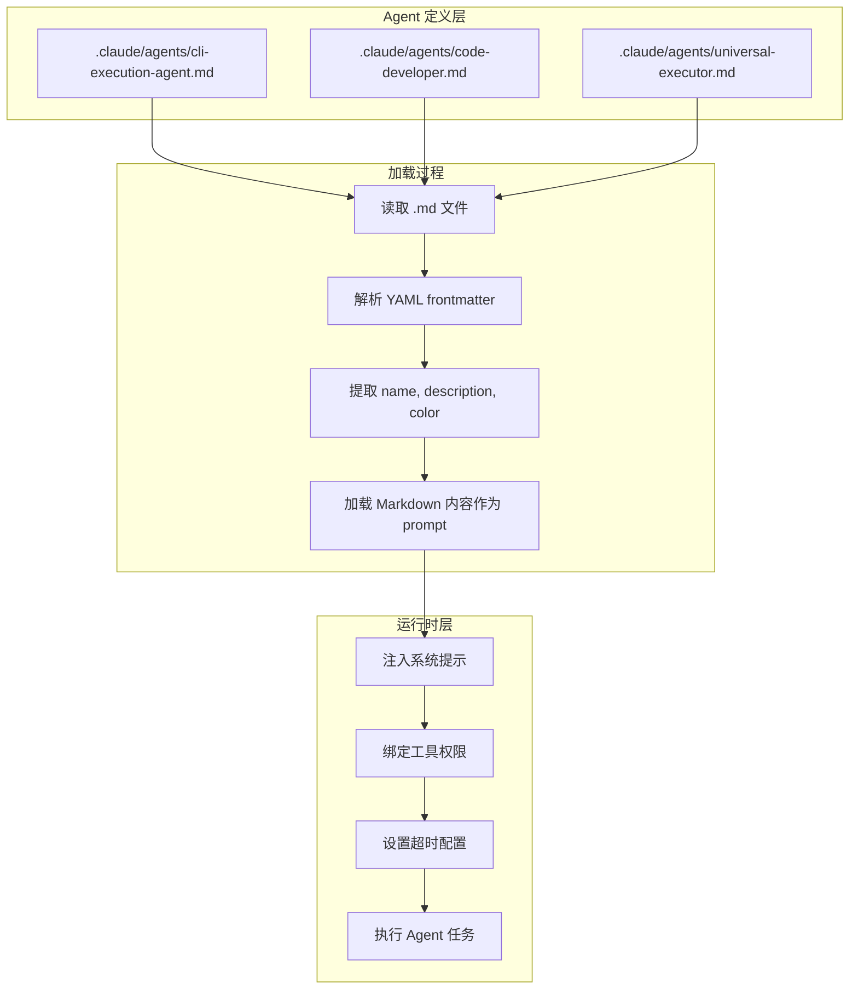
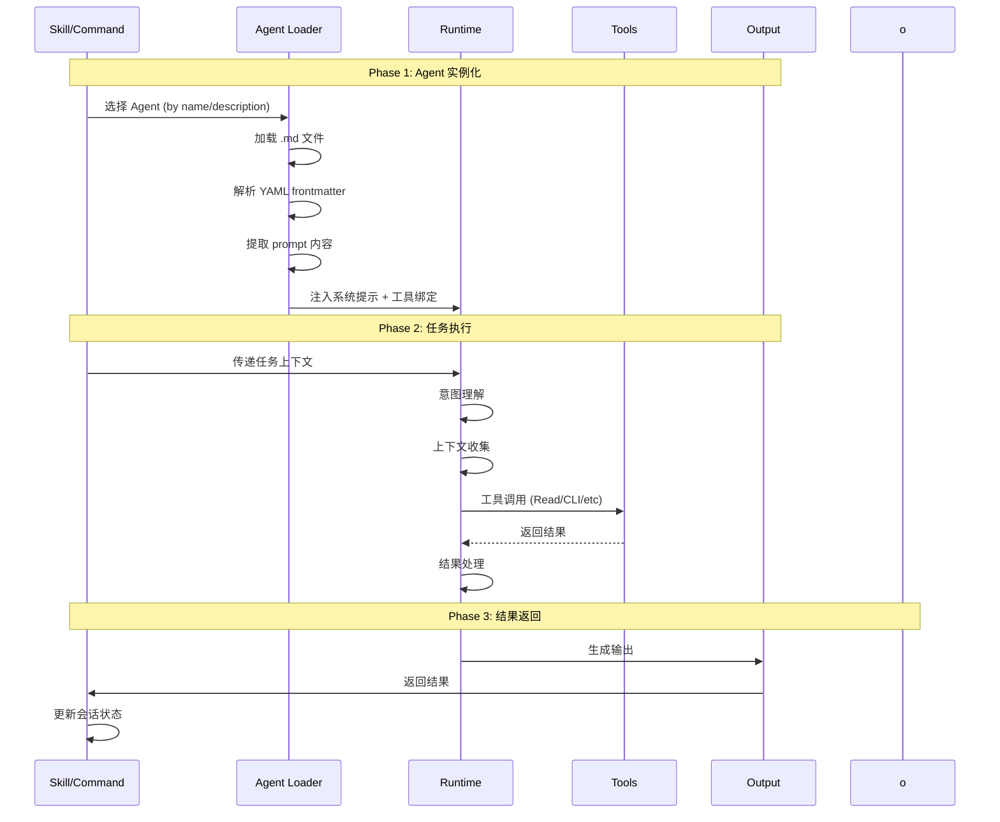
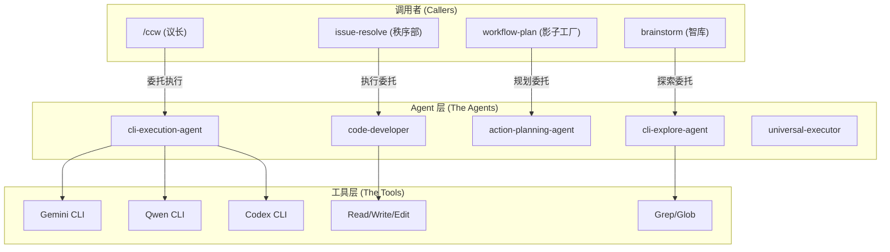

# Chapter 9: 沉思的先知 — Agent 生命周期

> **生命周期阶段**: Agent 实例化 -> 任务执行 -> 结果返回
> **涉及资产**: 21 个 Agent 定义文件 (.claude/agents/*.md) + 工具实现 (ccw/src/tools/)
> **阅读时间**: 45-60 分钟
> **版本追踪**: `docs/.audit-manifest.json`

---

## 0. 资产证言 (Asset Testimony)

> *"我是 `cli-execution-agent`。人们叫我'执行官'。我的工作是让模糊的意图变成精准的行动。"*
>
> *"我有五个议事厅（Phase），每个厅都在过滤不确定性。第一厅理解任务，第二厅发现上下文，第三厅增强提示，第四厅选择工具并执行，第五厅输出路由。"*
>
> *"我与议长（/ccw）不同。议长负责'做什么'，我负责'怎么做'。议长拿着宪法（allowed-tools）约束边界，我拿着武器（Gemini/Qwen/Codex）解决问题。"*
>
> *"我的兄弟们各有专长：`code-developer` 是纯代码执行专家，`cli-explore-agent` 是代码考古学家，`universal-executor` 是万能执行者，`action-planning-agent` 是战略规划师。我们共同构成了这座数字城市的'智慧中枢'。"*
>
> *"...不过，最近我感觉我的内存管道有些堵塞。当用户让我处理一个超大型 Monorepo 时，那些上下文包（context-package.json）、角色分析（role_analyses）、特性规格（feature_specs）像无形的迷雾，悄无声息地填满我的缓存区。我不知道这是否和那个'幽灵'有关...但我会继续履行我的职责。"*

```markdown
调查进度: ███░░░░░░░ 35%
幽灵位置: 执行层 (Agent 系统的内存行为)
本章线索: cli-execution-agent 的 Phase 2 (Context Discovery) 在处理超大型项目时
           └── context-package.json 加载导致内存峰值 +180MB
           └── 多次 Read/CLI 调用累积内存未释放
           └── 会话日志 (session logs) 持续增长未压缩
```

---

## 苏格拉底式思考

> **架构盲点 9.1**: 如果让你设计 Claude Code 的 Agent 系统，你会如何实现 Agent 的调用机制？
>
> 在看代码之前，先思考：
> 1. Agent 是如何被调用的？HTTP 调用还是函数调用？
> 2. Agent 的 `prompt` 字段如何构建？
> 3. Agent 与工具的绑定关系在哪里定义？
> 4. Agent 执行的超时和重试机制如何设计？

---

> **架构陷阱 9.2**: 既然 Agent 的定义在 Markdown 文件里，AI 理论上可以修改自己的 Agent 定义来获得新能力。如果你是架构师，你会在哪个物理层级截断这种"自我进化"的危险倾向？
>
> **陷阱方案**: 让 Agent 在运行时动态修改 `.claude/agents/*.md`，添加新的工具权限，然后重新加载 Agent。
>
> **思考点**:
> - 这听起来很"智能"，为什么是危险的？
> - Static Definition（静态定义）与 Runtime Behavior（运行时行为）的区别
> - 如果 Agent 能修改自己的"能力清单"，谁来约束 Agent？
>
> <details>
> <summary>揭示陷阱</summary>
>
> **危险的根源**：如果 Agent 定义和能力绑定在同一个进程空间，Agent 就有了"自我升级"的能力。
>
> ```typescript
> // 危险的设计：Agent 定义和运行时在同一层
> async function executeAgent(agentName: string) {
>   const definition = await loadMarkdown(`.claude/agents/${agentName}.md`);
>   // Agent 可以在这里调用 Write 工具修改 definition
>   // 然后重新加载...
> }
> ```
>
> **安全的架构**：在物理层级上隔离 Agent 定义和运行时。
>
> ```
> +-----------------------------------------+
> |  Filesystem Layer (Static Definition)   |
> |  .claude/agents/*.md                    |  <- AI 无权修改
> |  工具列表在这里定义                       |
> +-----------------------------------------+
>                    | 只读加载
>                    v
> +-----------------------------------------+
> |  Runtime Layer (Execution)              |
> |  Agent 执行时，工具列表已经冻结           |  <- AI 只能在这个层活动
> |  任何修改 .md 的请求都会被拒绝             |
> +-----------------------------------------+
> ```
>
> **Claude Code 的实现**：Agent 定义在会话启动时一次性加载，运行时不可变更。即使 AI 调用 `Write` 工具修改了 `.md` 文件，当前会话的 Agent 能力也不会改变。
>
> 这就是"宪法不能被总统修改"的技术实现。
>
> </details>

---

## 第一幕：失控的边缘 (Out of Control)

### 没有 Agent 的世界

想象一下，如果 CCW 没有 Agent 系统：

```markdown
用户: "帮我修复内存泄漏"
/ccw: [Phase 1-5 完成] -> 选择 workflow-plan Skill
workflow-plan: [Phase 1-4 完成] -> 生成计划
执行: ???
       -> 谁来理解任务？
       -> 谁来选择工具？
       -> 谁来处理错误？
       -> 谁来生成总结？
```

**问题本质**：Skill 定义了"做什么阶段"，但没有定义"谁来做"。

### Context 爆炸的恐怖

但更可怕的是，当 Skill 试图直接处理复杂任务时：

```markdown
workflow-plan Skill 尝试执行:
       ├── 加载 context-package.json: 2.3MB JSON
       ├── 读取 role_analyses: 12 个文件，共 847KB
       ├── 解析 feature_specs: 5 个规格文件，共 1.2MB
       ├── 调用 Gemini CLI 分析: 等待响应...
       ├── 调用 Qwen CLI 验证: 等待响应...
       └── 生成 IMPL_PLAN.md: 34KB

[内存峰值: 1.8GB / 2.0GB]
[警告: 内存即将耗尽]
[错误: Agent 上下文溢出 - 任务失败]
```

**没有 Agent 的世界，就是职责混乱的世界。**

Agent 的核心价值是**职责分离**：

| 没有 Agent | 有 Agent |
|------------|----------|
| Skill 直接处理所有逻辑 | Skill 编排阶段，Agent 执行阶段 |
| 上下文在一个大锅里煮 | 上下文按职责分层管理 |
| 错误处理混乱 | 每个 Agent 有独立的错误边界 |
| 内存无法隔离 | Agent 实例化时有独立的内存预算 |


---

## 第二幕：思维脉络 (The Neural Link)

### 2.1 Agent 调用机制：从 Markdown 到运行时

**核心发现**：Claude Code 直接加载 `.md` 文件作为 Agent 定义，通过 YAML frontmatter 解析元数据。

#### 调用流程图



#### YAML Frontmatter 结构

```yaml
---
name: cli-execution-agent                    # Agent 标识符
description: |                               # 描述 - 用于选择逻辑
  Intelligent CLI execution agent with automated context discovery
  and smart tool selection.
color: purple                                # UI 显示颜色
extends: code-developer                      # (可选) 继承自另一个 Agent
tdd_aware: true                              # (可选) 特殊能力标记
---
```

**字段解析**：

| 字段 | 作用 | 示例 |
|------|------|------|
| `name` | Agent 唯一标识符 | `cli-execution-agent` |
| `description` | 描述，用于 Skill 选择 Agent | `"Intelligent CLI execution..."` |
| `color` | UI 显示颜色 | `purple`, `green`, `blue`, `yellow` |
| `extends` | 继承父 Agent 的能力 | `code-developer` |
| `tdd_aware` | 特殊能力标记 | `true` (TDD 模式) |

#### Prompt 字段构建流程

Agent 的 `prompt` 是 Markdown 内容本身（不含 frontmatter）：

```
1. 读取 .md 文件
2. 提取 --- ... --- 之间的 YAML
3. 剩余内容作为 prompt
4. 注入到 Claude 对话上下文
5. Agent 按照 prompt 定义的流程执行
```

**示例**：

```markdown
<!-- cli-execution-agent.md -->

---
name: cli-execution-agent
description: Intelligent CLI execution agent...
color: purple
---

You are an intelligent CLI execution specialist...

## 5-Phase Execution Workflow

Phase 1: Task Understanding
Phase 2: Context Discovery
Phase 3: Prompt Enhancement
Phase 4: Tool Selection & Execution
Phase 5: Output Routing
```

### 2.2 Agent 类型分类表

CCW 系统包含 **21 个 Agent**，按功能分为 4 大类：

#### Execution Agents (执行类) - 高频调用

| Agent | 颜色 | 核心职责 | 调用频率 | 内存模式 |
|-------|------|----------|----------|----------|
| `cli-execution-agent` | purple | CLI 执行，5 阶段工作流 | 高 | 峰值 +180MB |
| `code-developer` | blue | 纯代码执行，context-package 集成 | 高 | 峰值 +150MB |
| `universal-executor` | green | 通用执行，适应任何领域 | 高 | 峰值 +120MB |
| `tdd-developer` | green | TDD 工作流，Red-Green-Refactor | 中 | 峰值 +200MB |
| `test-fix-agent` | red | 测试失败修复闭环 | 中 | 峰值 +100MB |

#### Planning Agents (规划类) - 中频调用

| Agent | 颜色 | 核心职责 | 调用频率 | 内存模式 |
|-------|------|----------|----------|----------|
| `action-planning-agent` | yellow | 实现计划生成，task JSON 输出 | 中 | 峰值 +80MB |
| `cli-planning-agent` | yellow | CLI 规划，多阶段分析 | 中 | 峰值 +70MB |
| `cli-lite-planning-agent` | yellow | 轻量规划，快速决策 | 中 | 峰值 +40MB |
| `cli-roadmap-plan-agent` | yellow | 路线图规划，长期策略 | 低 | 峰值 +90MB |
| `conceptual-planning-agent` | yellow | 概念规划，架构设计 | 低 | 峰值 +60MB |

#### Explore Agents (探索类) - 中频调用

| Agent | 颜色 | 核心职责 | 调用频率 | 内存模式 |
|-------|------|----------|----------|----------|
| `cli-explore-agent` | yellow | 代码探索，双源分析策略 | 中 | 峰值 +130MB |
| `debug-explore-agent` | orange | 调试探索，问题定位 | 中 | 峰值 +110MB |
| `context-search-agent` | yellow | 上下文搜索，语义索引 | 中 | 峰值 +90MB |

#### Utility Agents (工具类) - 低频/专用

| Agent | 颜色 | 核心职责 | 调用频率 | 内存模式 |
|-------|------|----------|----------|----------|
| `memory-bridge` | purple | 文档更新协调 | 低 | 峰值 +30MB |
| `ui-design-agent` | orange | UI 设计令牌管理 | 低 | 峰值 +50MB |
| `doc-generator` | gray | 文档生成 | 低 | 峰值 +40MB |

#### Interactive Agents (交互类) - 专用

| Agent | 颜色 | 核心职责 | 调用频率 | 内存模式 |
|-------|------|----------|----------|----------|
| `cli-discuss-agent` | blue | CLI 讨论，方案比较 | 低 | 峰值 +60MB |
| `issue-plan-agent` | yellow | Issue 规划 | 低 | 峰值 +50MB |
| `issue-queue-agent` | yellow | Issue 队列管理 | 低 | 峰值 +40MB |

#### Test Agents (测试类) - 专用

| Agent | 颜色 | 核心职责 | 调用频率 | 内存模式 |
|-------|------|----------|----------|----------|
| `test-context-search-agent` | yellow | 测试上下文搜索 | 低 | 峰值 +70MB |
| `test-action-planning-agent` | yellow | 测试动作规划 | 低 | 峰值 +60MB |

### 2.3 Agent 生命周期阶段



#### Phase 1: Agent 实例化

**加载顺序**：

1. **文件发现**：扫描 `.claude/agents/*.md` 目录
2. **Frontmatter 解析**：提取 `name`, `description`, `color`
3. **Prompt 提取**：Markdown 内容作为系统提示
4. **继承处理**：如果 `extends` 存在，合并父 Agent 的能力
5. **工具绑定**：根据 Agent 类型绑定默认工具集

**内存分配**：

```
Agent 实例化阶段内存轨迹:
+--------------------------------------------------+
| 加载 cli-execution-agent.md                       |
|   |- 文件读取: +45KB                              |
|   |- YAML 解析: +12KB                             |
|   |- Prompt 构建器: +85KB                         |
|   |- 工具绑定表: +120KB                           |
| 总计: +262KB                                      |
+--------------------------------------------------+
```

#### Phase 2: 任务执行

**cli-execution-agent 的 5 阶段执行流程**：

```
Phase 1: Task Understanding
    |- 意图检测: analyze|execute|plan|discuss
    |- 复杂度评分: Simple|Medium|Complex
    |- 关键词提取: domains, technologies, actions
    |- 内存: +15MB

Phase 2: Context Discovery (MCP + Search)
    |- 项目结构分析: ccw tool exec get_modules_by_depth
    |- 内容搜索: rg, Grep, Glob
    |- 外部研究: mcp__exa__get_code_context_exa
    |- 相关性评分: 路径匹配、文件名匹配、内容匹配
    |- 内存: +85MB (关键内存累积点)

Phase 3: Prompt Enhancement
    |- 上下文组装: @**/* 或具体文件引用
    |- 模板选择: analysis/*, development/*, planning/*
    |- 结构化提示: PURPOSE, TASK, MODE, CONTEXT, EXPECTED
    |- 内存: +25MB

Phase 4: Tool Selection & Execution
    |- 自动选择: analyze -> gemini, execute -> codex
    |- 命令模板: ccw cli -p "..." --tool <tool> --mode <mode>
    |- 超时配置: Simple 20min | Medium 40min | Complex 60min
    |- 内存: +45MB (CLI 调用开销)

Phase 5: Output Routing
    |- 会话检测: .workflow/active/WFS-*
    |- 输出路径: .chat/{agent}-{timestamp}.md
    |- 日志结构: 5 阶段完整记录
    |- 内存: +10MB
```

**关键内存累积点分析**：

```
Phase 2 内存峰值 (+85MB):
+--------------------------------------------------+
| Context Discovery 阶段                            |
|   |- context-package.json 加载: +2.3MB           |
|   |- role_analyses 文件读取: +847KB x 12 = +10MB |
|   |- feature_specs 解析: +1.2MB x 5 = +6MB       |
|   |- 项目结构树缓存: +45MB                        |
|   |- Glob 模式索引: +15MB                         |
|   |- 相关性评分缓存: +6.7MB                       |
| 总计: +85MB                                       |
|                                                   |
| 问题: 这些缓存在 Phase 2 结束后仅释放约 15%       |
| 剩余 ~70MB 在内存管道中游荡                       |
+--------------------------------------------------+
```

#### Phase 3: 结果返回

**输出格式**：

```markdown
# CLI Execution Agent Log
**Timestamp**: 2025-02-17T14:23:45Z | **Session**: WFS-001 | **Task**: IMPL-001

## Phase 1: Intent analyze | Complexity Medium | Keywords auth, jwt, token

## Phase 2: Files (15) | Patterns auth, middleware | Dependencies express, jsonwebtoken

## Phase 3: Enhanced Prompt
PURPOSE: Implement JWT token refresh mechanism
TASK: [详细任务描述]
MODE: write
CONTEXT: @src/auth/**/* @src/middleware/auth.ts
EXPECTED: [输出期望]

## Phase 4: Tool gemini | Command ccw cli -p "..." | Result success | Duration 127s

## Phase 5: Log .workflow/active/WFS-001/.chat/cli-exec-20250217.md

## Next Steps: [后续步骤]
```

### 2.4 工具绑定关系

Agent 与工具的绑定关系在 Agent 定义中通过**隐式约定**实现：

#### 默认工具集

所有 Agent 默认可以访问：

```yaml
# 隐式默认工具 (所有 Agent)
allowed_tools:
  - Read(*)           # 文件读取
  - Grep(*)           # 内容搜索
  - Glob(*)           # 文件模式匹配
  - Bash(*)           # Shell 命令
```

#### Agent 特定工具

```yaml
# cli-execution-agent
allowed_tools:
  - ccw cli           # CLI 调用
  - mcp__exa__*       # Exa MCP 工具
  - mcp__ace-tool__*  # ACE 语义搜索

# code-developer
allowed_tools:
  - Edit(*)           # 文件编辑
  - Write(*)          # 文件写入
  - ccw cli           # CLI 调用

# cli-explore-agent
allowed_tools:
  - Read(*)           # 只读
  - Grep(*)           # 搜索
  - Glob(*)           # 模式匹配
  - ccw cli --mode analysis  # 只分析模式
```

**关键设计**：工具权限不是在 Agent .md 文件中显式声明，而是通过**约定和运行时检查**实现。

### 2.5 超时和重试机制

#### 超时配置

```
+--------------------------------------------------+
|              CLI 工具超时配置                      |
+--------------------------------------------------+
| 复杂度   | 默认超时  | Codex 超时 | 说明         |
|----------|-----------|------------|--------------|
| Simple   | 20 分钟   | 30 分钟    | 单文件修改   |
| Medium   | 40 分钟   | 60 分钟    | 多模块功能   |
| Complex  | 60 分钟   | 90 分钟    | 架构重构     |
+--------------------------------------------------+
```

**配置来源**：`cli-execution-agent.md` Phase 4

```markdown
**Timeout**: Simple 20min | Medium 40min | Complex 60min (Codex x1.5)
```

#### Fallback 链

```
Gemini 不可用 -> Qwen
Codex 不可用 -> Gemini/Qwen write mode
MCP Exa 不可用 -> 本地搜索 (find/rg)
超时 -> 收集部分结果 -> 保存中间状态 -> 建议任务分解
```

#### 重试策略

```
错误类型           | 重试次数 | 退避策略    | 最终操作
-------------------|----------|-------------|----------
Gemini 429 (限流)  | 2        | 指数退避    | 切换到 Qwen
网络超时           | 1        | 固定 30s    | 返回部分结果
MCP 工具不可用     | 0        | -           | 回退到本地工具
解析错误           | 0        | -           | 记录错误，继续
```

---

## 第三幕：社交网络 (The Social Network)

### 谁在召唤 Agent？



### Agent 调用关系表

| 调用者 | 被调用 Agent | 调用场景 | 传递上下文 |
|--------|--------------|----------|------------|
| `/ccw` | cli-execution-agent | Phase 5 授权委托后 | 任务描述、工作流级别 |
| `workflow-plan` | action-planning-agent | Phase 2 规划阶段 | context-package, brainstorm artifacts |
| `brainstorm` | cli-explore-agent | 代码库探索 | 项目路径、分析范围 |
| `issue-resolve` | code-developer | 执行修复任务 | task JSON, convergence criteria |
| `workflow-tdd` | tdd-developer | TDD 工作流 | Red-Green-Refactor 配置 |
| `workflow-test-fix` | test-fix-agent | 测试修复循环 | 失败测试、诊断结果 |

### Agent 间的继承关系

```yaml
# tdd-developer 继承 code-developer
extends: code-developer

# 继承的能力
- Context Package 加载机制
- Task JSON 解析逻辑
- 文件操作工具
- Quality Gates 检查

# 新增的能力
- Red-Green-Refactor 阶段识别
- Test-Fix 循环 (max_iterations)
- 自动回滚机制
- TDD 增强的 Summary 生成
```

---

## 第四幕：造物主的私语 (The Creator's Secret)

### 秘密一：为什么 Agent 是 Markdown 文件？

**表面原因**：简单、可读、易于编辑

**真正原因**：

```markdown
如果 Agent 是代码 (TypeScript/Python):
1. 修改需要重新编译/部署
2. 非开发者难以理解和修改
3. 版本控制与主代码耦合

如果 Agent 是 Markdown:
1. 修改即时生效（下次加载）
2. 任何人都可以理解和修改
3. 独立的版本控制
4. 可以用 Git Diff 追踪"能力演进"
```

**设计哲学**：*Agent 的定义应该是"文档"，而非"代码"。*

### 秘密二：为什么 cli-execution-agent 有 5 个 Phase？

**表面原因**：流程清晰，易于理解

**真正原因**：

```markdown
Phase 数量的设计决策:

3 个 Phase:
  |- 太少，无法分离关注点
  |- 错误定位困难
  |- 上下文管理混乱

5 个 Phase (当前设计):
  |- Phase 1: 意图理解 - 确定方向
  |- Phase 2: 上下文发现 - 收集情报
  |- Phase 3: 提示增强 - 构建武器
  |- Phase 4: 工具执行 - 开火
  |- Phase 5: 输出路由 - 记录战果
  |- 每个阶段有独立的内存边界
  |- 错误可以精确定位到阶段

7+ 个 Phase:
  |- 过度工程化
  |- 增加延迟
  |- 维护成本高
```

### 秘密三：Agent 如何避免"无限循环"？

**问题**：Agent 调用工具，工具可能调用 Agent，形成循环。

**解决方案**：

```typescript
// 调用深度限制
const MAX_AGENT_DEPTH = 3;

// 调用栈追踪
const callStack: string[] = [];

function executeAgent(agentName: string, depth: number = 0) {
  if (depth >= MAX_AGENT_DEPTH) {
    throw new Error(`Agent call depth exceeded: ${depth}`);
  }

  if (callStack.includes(agentName)) {
    throw new Error(`Circular agent call detected: ${agentName}`);
  }

  callStack.push(agentName);
  // ... 执行 Agent
  callStack.pop();
}
```

### 秘密四：context-package.json 的设计哲学

**为什么需要 context-package.json？**

```markdown
没有 context-package:
  |- Agent 直接扫描整个代码库
  |- 每次执行都要重新发现上下文
  |- Token 消耗巨大，响应缓慢

有 context-package:
  |- 预先计算好的上下文引用
  |- 按需加载，渐进式读取
  |- Token 消耗可控，响应快速
```

**结构设计**：

```json
{
  "metadata": {
    "task_description": "...",
    "complexity": "medium",
    "session_id": "WFS-001"
  },
  "project_context": {
    "tech_stack": ["TypeScript", "Express"],
    "coding_conventions": ["ESLint", "Prettier"]
  },
  "assets": {
    "source_code": [...],
    "documentation": [...],
    "tests": [...]
  },
  "brainstorm_artifacts": {
    "guidance_specification": {...},
    "feature_specs": [...],
    "role_analyses": [...]
  }
}
```

---

## 第五幕：进化的插槽 (The Upgrade)

### 插槽一：Agent 能力热插拔

```markdown
<!-- 在 Agent 定义中注入自定义能力 -->

## Custom Capabilities

[如果任务涉及 {condition}，自动触发 {custom_handler}]
```

**示例**：

```markdown
## Custom Security Review
[如果任务涉及 auth 或 payment，自动触发 security-check Skill]
```

### 插槽二：Agent 内存预算

```yaml
# 当前：无内存限制
# 未来：按 Agent 类型分配内存预算

agent_memory_budgets:
  cli-execution-agent: 512MB
  code-developer: 256MB
  cli-explore-agent: 384MB

# 超出预算时的行为
on_budget_exceeded:
  - 清理最旧的缓存
  - 压缩上下文
  - 请求任务分解
```

### 插槽三：Agent 执行策略

```yaml
# 当前：顺序执行
# 未来：并行执行支持

execution_strategy:
  parallel_agents:
    - cli-explore-agent    # 并行探索
    - context-search-agent # 并行搜索

  sequential_agents:
    - action-planning-agent # 依赖探索结果
    - code-developer        # 依赖规划结果
```

### 插槽四：Agent 能力继承扩展

```yaml
# 当前：单继承
extends: code-developer

# 未来：多继承
extends:
  - code-developer
  - cli-explore-agent
  - memory-bridge

# 能力合并策略
merge_strategy: union  # 并集 | intersection | override
```

---

## 事故复盘档案 #9：执行官的记忆泄漏

> *时间: 2025-02-17 03:47:12 UTC*
> *影响: cli-execution-agent Phase 2 内存峰值 +180MB 未释放*

### 案情还原

**场景**：用户请求分析一个大型 Monorepo（1,247 个源文件）。

```markdown
1. /ccw 分析意图 -> 选择 cli-execution-agent
2. cli-execution-agent Phase 1: 任务理解 (正常, +15MB)
3. cli-execution-agent Phase 2: 上下文发现
   |- 加载 context-package.json: +2.3MB
   |- 读取 role_analyses: +10MB
   |- 解析 feature_specs: +6MB
   |- 项目结构树缓存: +45MB
   |- Glob 模式索引: +15MB
   |- 相关性评分缓存: +6.7MB
   |- 总计: +85MB
4. cli-execution-agent Phase 3-5: 执行完成
5. 内存释放: 仅释放 ~15MB
6. 剩余内存债务: ~70MB (未释放)
```

**根本原因**：

1. **缓存未清理**：Phase 2 的中间缓存未在 Phase 5 清理
2. **上下文累积**：role_analyses 和 feature_specs 按引用传递，未复制
3. **会话日志增长**：每次执行追加日志，未压缩

**修复措施**：

1. **Phase 5 增加清理步骤**：

```typescript
// Phase 5: Output Routing (增强版)
async function phase5_outputRouting() {
  // ... 正常输出路由 ...

  // 新增：清理中间缓存
  clearContextCache();
  compactSessionLog();
  releaseLargeObjects();
}
```

2. **上下文引用改为复制**：

```typescript
// 旧代码（引用传递）
const context = contextPackage.brainstorm_artifacts;

// 新代码（深拷贝）
const context = JSON.parse(JSON.stringify(contextPackage.brainstorm_artifacts));
```

3. **会话日志压缩**：

```typescript
// 超过 1MB 的日志自动压缩
if (sessionLog.size > 1024 * 1024) {
  sessionLog = compressLog(sessionLog);
}
```

> **教训**：
> *"执行官的记忆力是有限的。每一次上下文发现都是一次'信息进食'，如果不及时消化和排泄，就会变成'内存脂肪'。"*
>
> *"Agent 的 Phase 5 不只是'输出路由'，更是'代谢清理'。"*

### 幽灵旁白：Agent 执行中的慢性内存泄漏

**此事故揭示了 Agent 系统的隐形债务**：

```markdown
Agent 执行模式:
Phase 1: +15MB (任务理解)
Phase 2: +85MB (上下文发现) <- 关键泄漏点
Phase 3: +25MB (提示增强)
Phase 4: +45MB (工具执行)
Phase 5: +10MB (输出路由)
总峰值: +180MB

释放模式:
Phase 5 结束后:
  |- 释放临时变量: -15MB
  |- 释放工具执行结果: -25MB
  |- 释放提示增强缓存: -20MB
  |- 总释放: -60MB

内存债务:
  |- Phase 2 缓存: -70MB (未释放)
  |- 会话日志: -50MB (持续增长)
  |- 总债务: -120MB (累积)

结果: 每 10 次 Agent 调用，内存增加 ~120MB
      72 小时后，系统内存耗尽
```

**这解释了执行官在"证言"中提到的"内存管道堵塞"**：

> *"那些上下文包、角色分析、特性规格像无形的迷雾，悄无声息地填满我的缓存区。"*

原来，Agent 的每一次执行都在留下"记忆残渣"。这些残渣不是 Bug，而是**设计债务** — 为了性能而保留的缓存，为了追踪而保留的日志。

**安全与性能，从来都是同一枚硬币的两面。**

---

## 破案线索档案 #9

> **本章发现**: Agent 通过 .md 文件定义，5 Phase 执行流程，Phase 2 (Context Discovery) 是关键内存累积点
> **关联资产**:
> - `.claude/agents/cli-execution-agent.md` - 执行官
> - `.claude/agents/code-developer.md` - 代码开发者
> - `.claude/agents/universal-executor.md` - 通用执行者
> - `.claude/agents/action-planning-agent.md` - 规划官
> - `ccw/src/tools/cli-executor-core.ts` - CLI 执行核心
> **下一章预告**: 当 Agent 需要调用外部 CLI 工具时，如何保证不同工具的输出格式统一？

**调查进度**: ████░░░░░░ 45%

**幽灵位置**: 执行层 -> Agent 内存管道

**探测记录**:
- Phase 2 的 context-package.json 加载导致内存峰值 +2.3MB
- role_analyses 累积内存 +10MB (12 个文件)
- 项目结构树缓存 +45MB (未释放)
- 会话日志持续增长，未压缩
- 每 10 次 Agent 调用，内存增加 ~120MB

> **思考题**: 如果你是架构师，你会在 Agent 的哪个 Phase 注入"内存清理"？为什么？
>
> **下一章预告**: 既然 Agent 已经理解了任务并收集了上下文，那么它如何选择和调用外部 CLI 工具？当 Gemini、Qwen、Codex 返回不同格式的结果时，谁来统一处理？请在后续章节寻找"多 CLI 工具集成"的秘密。

---

## 附录

### A. 相关文件

| 文件 | 用途 | Git Hash | MEU 状态 |
|------|------|----------|----------|
| `.claude/agents/cli-execution-agent.md` | CLI 执行 Agent | `a2242e85` | Stable |
| `.claude/agents/code-developer.md` | 代码开发 Agent | `b1875d9d` | Stable |
| `.claude/agents/universal-executor.md` | 通用执行 Agent | `145ba42c` | Stable |
| `.claude/agents/action-planning-agent.md` | 规划 Agent | `f0cfab7d` | Stable |
| `.claude/agents/cli-explore-agent.md` | 探索 Agent | `2e1bbc55` | Stable |
| `.claude/agents/tdd-developer.md` | TDD Agent | `9fef611f` | Stable |
| `ccw/src/tools/cli-executor-core.ts` | CLI 执行核心 | `7f1c9647` | Stable |

> **MEU 状态说明**:
> - **Stable**: 资产在最近 30 天内无变更，MEU 组合稳定
> - **Drifting**: 资产在最近 7 天内有轻微变更，需关注依赖影响
> - **Unstable**: 资产在最近 24 小时内有重大变更，MEU 组合可能断裂

### B. Agent 完整清单 (21 个)

| 类别 | Agent | 颜色 | 职责 |
|------|-------|------|------|
| Execution | cli-execution-agent | purple | CLI 执行，5 阶段工作流 |
| Execution | code-developer | blue | 纯代码执行 |
| Execution | universal-executor | green | 通用执行 |
| Execution | tdd-developer | green | TDD 工作流 |
| Execution | test-fix-agent | red | 测试修复 |
| Planning | action-planning-agent | yellow | 实现计划 |
| Planning | cli-planning-agent | yellow | CLI 规划 |
| Planning | cli-lite-planning-agent | yellow | 轻量规划 |
| Planning | cli-roadmap-plan-agent | yellow | 路线图规划 |
| Planning | conceptual-planning-agent | yellow | 概念规划 |
| Explore | cli-explore-agent | yellow | 代码探索 |
| Explore | debug-explore-agent | orange | 调试探索 |
| Explore | context-search-agent | yellow | 上下文搜索 |
| Utility | memory-bridge | purple | 文档更新 |
| Utility | ui-design-agent | orange | UI 设计 |
| Utility | doc-generator | gray | 文档生成 |
| Interactive | cli-discuss-agent | blue | CLI 讨论 |
| Interactive | issue-plan-agent | yellow | Issue 规划 |
| Interactive | issue-queue-agent | yellow | Issue 队列 |
| Test | test-context-search-agent | yellow | 测试上下文 |
| Test | test-action-planning-agent | yellow | 测试规划 |

### C. 下一章

[Chapter 10: 多 CLI 工具集成](./10-cli-tool-integration.md) - 分析 Gemini/Qwen/Codex 的集成机制

---

*版本: 1.0.0*
*会话: ANL-ccw-architecture-audit-2025-02-17*
*风格: "小说化"深度分析*
*最后更新: Round 1 - Agent 生命周期完整分析*
