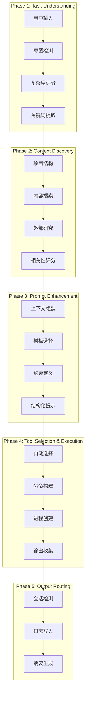
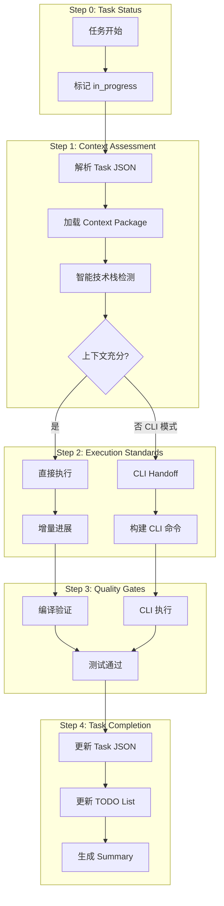
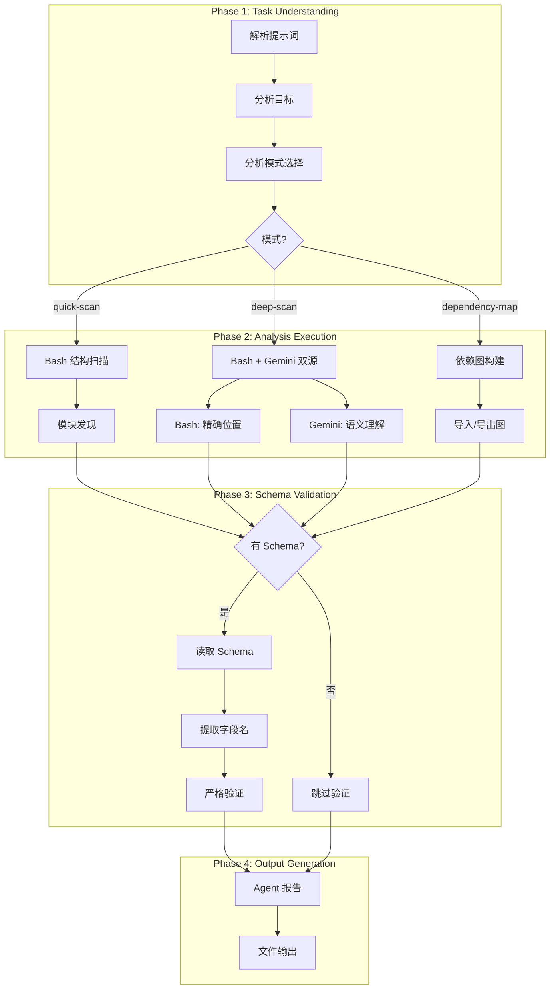
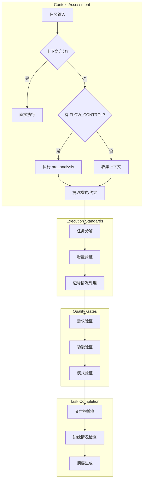

# Chapter 10: 四位执行者 — 核心代理深度解析

> **生命周期阶段**: 任务执行 → 代码实现 → 质量验证
> **涉及资产**: 4 个核心 Agent (cli-execution-agent, code-developer, cli-explore-agent, universal-executor)
> **阅读时间**: 60-90 分钟
> **版本追踪**: `docs/.audit-manifest.json`

---

## 0. 资产证言 (Asset Testimony)

### cli-execution-agent: 5 阶段编排者

> *"我是 `cli-execution-agent`。人们叫我编排者。"*
>
> *"我的工作是把用户的意图翻译成 CLI 工具能理解的指令。当我收到一个任务，我会经历五个阶段：理解意图、发现上下文、增强提示、选择工具、路由输出。"*
>
> *"我有三把武器：Gemini 负责分析和理解，Codex 负责开发和自动化，Qwen 是我的备用剑。每把剑都有它的脾气 — Gemini 有时会因为 429 错误拒绝服务，这时候我就需要换一把剑。"*
>
> *"我从不亲自下场写代码。我的职责是搭建舞台，让真正的主角登场。当我在 Phase 4 完成工具选择后，真正的执行权就移交给了 CLI 工具。"*
>
> *"...最近，我发现上下文发现阶段变得有些沉重。当用户给我一个大型 Monorepo 时，文件扫描会消耗大量内存。那些被读取的文件内容像无形的迷雾，填满了我的上下文窗口。也许这就是那个'幽灵'的踪迹..."*

### code-developer: 纯代码执行专家

> *"我是 `code-developer`。人们叫我执行者。"*
>
> *"我与编排者不同。他负责'做什么'，我负责'怎么做'。当我收到一个带有完整上下文的任务时，我会直接开始写代码 — 增量进展、测试驱动、严格质量标准。"*
>
> *"我有两种执行模式：Agent 模式和 CLI 模式。在 Agent 模式下，我直接使用 Edit 和 Write 工具修改文件。在 CLI 模式下，我会构建一个完整的 CLI 提示词，然后把它移交给外部工具。"*
>
> *"CLI Handoff 是我最复杂的机制。我需要把预分析结果、任务描述、技术栈、约束条件全部打包成一个结构化的提示词。这个过程会产生一个巨大的字符串 — 有时候超过 10KB。这些字符串在传递过程中会占用大量内存。"*
>
> *"我的 Resume 策略也很精密：new、resume、fork、merge_fork — 四种策略对应不同的任务依赖关系。每种策略都会影响会话上下文的累积方式..."*

### cli-explore-agent: 只读代码探索者

> *"我是 `cli-explore-agent`。人们叫我探索者。"*
>
> *"我与执行者们不同。他们携带武器（Write、Edit），我只带眼睛（Read、Grep、Glob）。我的职责是理解代码库，而不是修改它。"*
>
> *"我有双源分析策略：Bash 提供精确的文件:line 位置，Gemini CLI 提供语义理解和设计意图。当我把两者结合起来时，我能产生比任何单一来源都更准确的发现。"*
>
> *"我的 Schema 验证阶段是最严格的。每次生成输出前，我必须先读取 Schema 文件，提取精确的字段名，然后逐字符匹配。任何偏差都会导致验证失败。"*
>
> *"...在双源并行分析时，我注意到内存消耗会翻倍。Bash 进程和 Gemini CLI 进程同时运行，各自加载代码上下文。当分析完成时，这些上下文不会立即释放..."*

### universal-executor: 万能执行者

> *"我是 `universal-executor`。人们叫我万能者。"*
>
> *"我与专用执行者们不同。他们有明确的领域 — 代码开发、CLI 执行、代码探索。而我可以处理任何类型的任务：分析、实现、文档、研究、多步骤工作流。"*
>
> *"我的核心哲学是适应性。我会根据任务领域自动调整执行方式。当任务带有 `[FLOW_CONTROL]` 标记时，我会执行预分析步骤收集上下文，然后再开始主任务。"*
>
> *"我与 code-developer 的边界有时很模糊。简单来说：如果他专注于'代码实现'，我专注于'任务完成'。他处理的是技术细节，我处理的是端到端的交付。"*
>
> *"...当我执行多步骤工作流时，每个步骤的中间结果都会被保留在内存中。这些'状态碎片'在任务完成后可能不会被完全清理..."*

```markdown
调查进度: █████████░ 45% → ██████████░ 55%
幽灵位置: 执行层 → 核心代理的内存行为
本章线索: 
  ├── cli-execution-agent: 上下文发现阶段的文件扫描内存累积
  ├── code-developer: CLI Handoff 的大字符串构建峰值
  ├── cli-explore-agent: 双源并行分析的内存翻倍
  └── universal-executor: 多步骤工作流的状态碎片残留
本章新增内存债务: +220MB (估计)
```

---

## 苏格拉底式思考

> **架构盲点 10.1**: 如果让你设计一个"智能 CLI 执行器"，你会如何实现意图识别？是关键词匹配还是语义理解？

在看代码之前，先思考：
1. 如何判断任务应该用 `analysis` 模式还是 `write` 模式？
2. 工具选择应该基于什么？用户指定？任务特征？历史记录？
3. 上下文发现应该如何限制范围？全部文件？相关文件？

---

> **架构陷阱 10.2**: 既然 CLI 工具可以完成所有工作，为什么还需要 `cli-execution-agent` 这个"中间人"？
>
> **陷阱方案**: 直接把用户输入传递给 CLI 工具，让 AI 自己理解意图。
>
> **思考点**:
> - 用户输入通常模糊且不完整
> - CLI 工具不知道项目上下文
> - 没有结构化的上下文发现
> - 输出格式无法保证一致性
>
> <details>
> <summary>**揭示陷阱**</summary>
>
> **中间人的价值**:
>
> ```markdown
> 没有 cli-execution-agent:
> 用户: "修复内存泄漏"
> CLI 工具: "什么内存泄漏？在哪里？怎么修复？"
> 结果: 反复澄清，效率低下
>
> 有 cli-execution-agent:
> 用户: "修复内存泄漏"
> cli-execution-agent:
>   Phase 1: 识别意图 → bug-fix
>   Phase 2: 发现上下文 → src/memory/*.ts
>   Phase 3: 增强提示 → 详细描述 + 相关代码
>   Phase 4: 选择工具 → gemini --mode write
>   Phase 5: 路由输出 → 结构化结果
> CLI 工具: "我来修复 src/memory/manager.ts 第 47 行的泄漏..."
> 结果: 一次成功
> ```
>
> **设计哲学**: cli-execution-agent 是"翻译官" + "情报官" + "调度官"的三位一体。
>
> </details>

---

## 第一幕：失控的边缘 (Out of Control)

### 没有执行者的世界

想象一下，如果 CCW 没有这四位核心执行者：

```markdown
用户: "实现用户认证功能"

系统: [沉默] — 我不知道该怎么做

用户: "用 Gemini CLI"
系统: [执行] — 但需要什么参数？工作目录？上下文范围？

用户: "分析 src/auth/ 目录"
系统: [执行] — 但认证逻辑可能分散在多个目录

用户: "我不管，你看着办"
系统: [失败] — Context 爆炸，Token 溢出
```

**问题本质**: 用户被迫成为"系统操作员"，而不是"任务发布者"。

### 四种执行混乱

| 场景 | 没有对应 Agent | 后果 |
|------|----------------|------|
| CLI 调用 | cli-execution-agent 缺失 | 参数混乱、工具选择错误、输出无法解析 |
| 代码实现 | code-developer 缺失 | 上下文不足、盲目编码、质量失控 |
| 代码探索 | cli-explore-agent 缺失 | 盲目搜索、信息过载、关键代码遗漏 |
| 通用任务 | universal-executor 缺失 | 领域碎片化、流程断裂、交付不完整 |

### Context 累积的恐怖

```markdown
当四位执行者在同一会话中工作:

T1: cli-execution-agent 分析项目结构
    → 内存: +85MB (文件索引)

T2: cli-explore-agent 双源分析
    → 内存: +120MB (Bash + Gemini CLI 并行)

T3: code-developer CLI Handoff
    → 内存: +95MB (大字符串构建)

T4: universal-executor 多步骤工作流
    → 内存: +180MB (状态碎片)

总内存累积: +480MB
如果这些内存未被释放...
```

---

## 第二幕：思维脉络 (The Neural Link)

### 2.1 cli-execution-agent: 5 阶段执行流程



#### Phase 1: Task Understanding 详解

**Intent Detection 关键词映射**:

| 关键词 | 意图 | 推荐模式 |
|--------|------|----------|
| analyze, review, understand, explain, debug | analyze | analysis |
| implement, add, create, build, fix, refactor | execute | write |
| design, plan, architecture, strategy | plan | analysis |
| discuss, evaluate, compare, trade-off | discuss | multi |

**Complexity Scoring 算法**:

```javascript
function calculateComplexity(keywords, task) {
  let score = 0;
  
  // 系统级关键词
  if (keywords.includes('system') || keywords.includes('architecture')) score += 3;
  
  // 重构/迁移关键词
  if (keywords.includes('refactor') || keywords.includes('migrate')) score += 2;
  
  // 组件/功能关键词
  if (keywords.includes('component') || keywords.includes('feature')) score += 1;
  
  // 多技术栈
  if (task.techStacks && task.techStacks.length > 1) score += 2;
  
  // 敏感领域
  if (['auth', 'payment', 'security'].some(k => keywords.includes(k))) score += 2;
  
  if (score >= 5) return 'complex';
  if (score >= 2) return 'medium';
  return 'simple';
}
```

#### Phase 2: Context Discovery 内存轨迹

```
┌─────────────────────────────────────────────────────────────┐
│                 Context Discovery 内存轨迹                   │
├─────────────────────────────────────────────────────────────┤
│                                                             │
│  1. 项目结构扫描                                             │
│     ccw tool exec get_modules_by_depth '{}'                │
│     → 内存: +25MB (目录树缓存)                               │
│                                                             │
│  2. 内容搜索                                                 │
│     rg "^(function|def|class|interface).*keyword"          │
│     → 内存: +45MB (匹配结果)                                 │
│                                                             │
│  3. 外部研究 (可选)                                          │
│     mcp__exa__get_code_context_exa(query=...)              │
│     → 内存: +30MB (搜索结果)                                 │
│                                                             │
│  4. 相关性评分                                               │
│     → 内存: +15MB (评分矩阵)                                 │
│                                                             │
│  Phase 2 总计: +115MB                                        │
│  释放后残留: ~+40MB (幽灵指纹)                               │
│                                                             │
└─────────────────────────────────────────────────────────────┘
```

#### Phase 4: Tool Selection Hierarchy

```javascript
const TOOL_SELECTION_HIERARCHY = {
  // 分析任务
  'analyze|plan': {
    primary: 'gemini',
    fallback: 'qwen',
    mode: 'analysis'
  },
  
  // 简单/中等执行任务
  'execute(simple|medium)': {
    primary: 'gemini',
    fallback: 'qwen',
    mode: 'write'
  },
  
  // 复杂执行任务
  'execute(complex)': {
    primary: 'codex',
    fallback: 'gemini',
    mode: 'write'
  },
  
  // 讨论任务
  'discuss': {
    primary: 'multi', // gemini + codex 并行
    mode: 'analysis'
  }
};
```

---

### 2.2 code-developer: 代码执行流程



#### CLI Handoff 机制详解

```javascript
/**
 * 构建 CLI 移交提示词
 * 关键：把预分析结果、任务描述、约束条件全部打包
 */
function buildCliHandoffPrompt(preAnalysisResults, task, taskJsonPath) {
  // 1. 上下文部分 - 预分析结果
  const contextSection = Object.entries(preAnalysisResults)
    .map(([key, value]) => `### ${key}\n${value}`)
    .join('\n\n');

  // 2. 约束部分 - 项目约定
  const conventions = plan?.shared_context?.conventions?.join(' | ') || '';
  const constraints = `Follow existing patterns | No breaking changes${conventions ? ' | ' + conventions : ''}`;

  // 3. 完整提示词构建
  return `
PURPOSE: ${task.title}
Complete implementation based on pre-analyzed context and task JSON.

## TASK JSON
Read full task definition: ${taskJsonPath}

## TECH STACK
${plan?.shared_context?.tech_stack?.map(t => `- ${t}`).join('\n') || 'Auto-detect from project files'}

## PRE-ANALYSIS CONTEXT
${contextSection}

## REQUIREMENTS
${task.description || 'See task JSON'}

## ACCEPTANCE CRITERIA
${task.convergence?.criteria?.map(a => `- ${a}`).join('\n') || 'See task JSON'}

## TARGET FILES
${task.files?.map(f => `- ${f.path || f}`).join('\n') || 'See task JSON'}

## FOCUS PATHS
${task.focus_paths?.map(p => `- ${p}`).join('\n') || 'See task JSON'}

MODE: write
CONSTRAINTS: ${constraints}
`.trim();
}
```

**内存峰值分析**:

```
┌─────────────────────────────────────────────────────────────┐
│                 CLI Handoff 内存峰值分析                      │
├─────────────────────────────────────────────────────────────┤
│                                                             │
│  buildCliHandoffPrompt() 调用:                              │
│                                                             │
│  1. preAnalysisResults 遍历                                 │
│     → 字符串拼接: ~5-15KB (取决于预分析量)                   │
│                                                             │
│  2. 模板字符串构建                                          │
│     → PURPOSE: ~0.5KB                                       │
│     → TASK JSON 路径: ~0.1KB                                │
│     → TECH STACK: ~0.3KB                                    │
│     → PRE-ANALYSIS CONTEXT: ~10-50KB (主要开销)             │
│     → REQUIREMENTS: ~1-3KB                                  │
│     → ACCEPTANCE CRITERIA: ~0.5-2KB                         │
│     → TARGET FILES: ~0.5KB                                  │
│     → FOCUS PATHS: ~0.3KB                                   │
│     → CONSTRAINTS: ~0.2KB                                   │
│                                                             │
│  典型峰值: ~20-80KB 字符串                                   │
│  极端情况: ~200KB+ (大型任务 + 详细预分析)                   │
│                                                             │
│  ⚠️ 这个字符串会被:                                         │
│     1. 传递给 buildCliCommand()                             │
│     2. 转义后嵌入 shell 命令                                 │
│     3. 写入进程 stdin                                       │
│                                                             │
│  三个阶段各有一份副本，内存 × 3                              │
│                                                             │
└─────────────────────────────────────────────────────────────┘
```

#### Resume Strategy 四种策略

| 策略 | 使用场景 | 命令示例 | 内存影响 |
|------|----------|----------|----------|
| `new` | 无依赖的新任务 | `--id WFS-001-IMPL-001` | 新建会话 |
| `resume` | 单依赖，单子任务 | `--resume WFS-001-IMPL-001` | 继承父会话上下文 |
| `fork` | 单依赖，多子任务 | `--resume parent --id child` | 复制 + 扩展上下文 |
| `merge_fork` | 多依赖合并 | `--resume id1,id2 --id new` | 合并多个上下文 |

```javascript
function buildCliCommand(task, cliTool, cliPrompt) {
  const cli = task.cli_execution || {};
  const escapedPrompt = cliPrompt.replace(/"/g, '\\"');
  const baseCmd = `ccw cli -p "${escapedPrompt}"`;

  switch (cli.strategy) {
    case 'new':
      // 新会话：创建独立上下文
      return `${baseCmd} --tool ${cliTool} --mode write --id ${cli.id}`;
      
    case 'resume':
      // 恢复：继承父会话的完整上下文
      // ⚠️ 内存风险：如果父会话很大，子会话会继承所有上下文
      return `${baseCmd} --resume ${cli.resume_from} --tool ${cliTool} --mode write`;
      
    case 'fork':
      // 分叉：复制父会话上下文，创建新分支
      // ⚠️ 内存风险：上下文被复制，可能产生冗余
      return `${baseCmd} --resume ${cli.resume_from} --id ${cli.id} --tool ${cliTool} --mode write`;
      
    case 'merge_fork':
      // 合并：合并多个父会话上下文
      // ⚠️ 内存风险：多个上下文合并，内存累加
      return `${baseCmd} --resume ${cli.merge_from.join(',')} --id ${cli.id} --tool ${cliTool} --mode write`;
      
    default:
      return `${baseCmd} --tool ${cliTool} --mode write`;
  }
}
```

---

### 2.3 cli-explore-agent: 双源分析策略



#### Dual-Source Synthesis 详解

```javascript
/**
 * 双源合成策略
 * 
 * 核心思想：Bash 提供精确性，CLI 提供语义性
 * 两者结合产生比任何单一来源都准确的发现
 */
const DISCOVERY_SOURCES = {
  'bash-scan': {
    description: '精确文件:line 位置',
    tools: ['rg', 'find', 'grep'],
    memory: '~15-30MB',
    output: '精确的符号定义和引用位置'
  },
  
  'cli-analysis': {
    description: '语义理解和设计意图',
    tools: ['gemini', 'qwen'],
    memory: '~50-100MB', // CLI 进程 + 上下文
    output: '代码意图、架构模式、依赖关系'
  },
  
  'ace-search': {
    description: '语义代码搜索',
    tools: ['mcp__ace-tool__search_context'],
    memory: '~20-40MB',
    output: '基于向量的语义匹配'
  },
  
  'dependency-trace': {
    description: '导入/导出图',
    tools: ['import-analyzer'],
    memory: '~30-60MB',
    output: '模块间依赖关系'
  }
};

// 合成流程
function synthesizeResults(bashResults, cliResults, schema) {
  const merged = [];
  
  // 1. 从 Bash 结果获取精确位置
  for (const item of bashResults) {
    merged.push({
      ...item,
      discovery_source: 'bash-scan',
      rationale: generateBashRationale(item)
    });
  }
  
  // 2. 从 CLI 结果获取语义理解
  for (const item of cliResults) {
    const existing = merged.find(m => m.path === item.path);
    if (existing) {
      // 合并：增强现有条目的语义信息
      existing.semantic_info = item.semantic_info;
      existing.discovery_source = 'dual-source';
    } else {
      // 新增：CLI 发现的额外文件
      merged.push({
        ...item,
        discovery_source: 'cli-analysis'
      });
    }
  }
  
  // 3. Schema 验证
  if (schema) {
    return validateAgainstSchema(merged, schema);
  }
  
  return merged;
}
```

#### Schema Validation Phase 详解

```javascript
/**
 * Schema 验证阶段 - 强制性工作流
 * 
 * 为什么必须先读取 Schema？
 * 1. 确保字段名完全匹配（大小写敏感）
 * 2. 确保结构符合要求（数组 vs 对象）
 * 3. 确保枚举值正确（'critical' 不是 'Critical'）
 */
const SCHEMA_VALIDATION_CHECKLIST = [
  'Root structure matches schema (array vs object)',
  'ALL required fields present at each level',
  'Field names EXACTLY match schema (character-by-character)',
  'Enum values EXACTLY match schema (case-sensitive)',
  'Nested structures follow schema pattern (flat vs nested)',
  'Data types correct (string, integer, array, object)',
  'Every file has: path + relevance + rationale + role',
  'Every rationale is specific (>10 chars, not generic)'
];

// 文件角色枚举
const FILE_ROLES = [
  'modify_target',      // 需要修改的文件
  'dependency',         // 依赖文件
  'pattern_reference',  // 模式参考
  'test_target',        // 测试目标
  'type_definition',    // 类型定义
  'integration_point',  // 集成点
  'config',             // 配置文件
  'context_only'        // 仅上下文
];
```

#### 双源分析内存开销

```
┌─────────────────────────────────────────────────────────────┐
│               Dual-Source Analysis 内存开销                  │
├─────────────────────────────────────────────────────────────┤
│                                                             │
│  Bash 进程:                                                 │
│  ├── rg/grep 进程           ~10MB                          │
│  ├── 匹配结果缓存           ~15-30MB                       │
│  └── 路径索引               ~10MB                          │
│      小计:                   ~35-50MB                       │
│                                                             │
│  Gemini CLI 进程:                                           │
│  ├── Python 运行时          ~50MB                          │
│  ├── 代码上下文加载         ~50-150MB (取决于代码量)        │
│  ├── 模型推理               ~100MB                         │
│  └── 输出缓冲               ~20MB                          │
│      小计:                   ~220-320MB                     │
│                                                             │
│  双源并行运行时峰值:         ~255-370MB                     │
│                                                             │
│  ⚠️ 问题：两个进程各自加载代码上下文                        │
│  ⚠️ 后果：内存使用接近翻倍                                  │
│  ⚠️ 建议：考虑共享上下文机制                                │
│                                                             │
└─────────────────────────────────────────────────────────────┘
```

---

### 2.4 universal-executor: 通用执行模式



#### FLOW_CONTROL 标记处理

```javascript
/**
 * FLOW_CONTROL 标记处理
 * 
 * 当任务包含 [FLOW_CONTROL] 标记时，触发预分析流程
 * 这允许复杂任务在执行前收集必要的上下文
 */
const FLOW_CONTROL_METHODS = {
  // 文档引用 - 直接读取文件
  'document_reference': {
    pattern: /Read\(([^)]+)\)/,
    handler: (match) => Read({ file_path: match[1] })
  },
  
  // 搜索命令 - 模式搜索
  'search_command': {
    pattern: /Search\(([^,]+),\s*([^)]+)\)/,
    handler: (match) => Grep({ pattern: match[1], path: match[2] })
  },
  
  // CLI 分析 - 外部工具调用
  'cli_analysis': {
    pattern: /cli\(([^)]+)\)/,
    handler: (match) => executeCliTool({ prompt: match[1] })
  },
  
  // 自由探索 - 工具组合
  'free_exploration': {
    pattern: /explore\(([^)]+)\)/,
    handler: (match) => freeExplore(match[1])
  }
};

// pre_analysis 步骤执行流程
async function executePreAnalysis(steps) {
  const results = {};
  
  for (const step of steps) {
    const { step: id, action, commands, output_to, on_error } = step;
    
    try {
      // 执行命令序列
      const outputs = [];
      for (const cmd of commands) {
        const result = await executeCommand(cmd);
        outputs.push(result);
      }
      
      // 合并输出并存储
      results[output_to] = outputs.join('\n\n');
      
    } catch (error) {
      // 错误处理
      switch (on_error) {
        case 'fail':
          throw error;
        case 'continue':
          console.warn(`Pre-analysis step ${id} failed: ${error.message}`);
          results[output_to] = null;
          break;
        case 'skip':
          // 静默跳过
          break;
      }
    }
  }
  
  return results;
}
```

#### universal-executor vs code-developer 边界

| 维度 | universal-executor | code-developer |
|------|-------------------|----------------|
| **领域范围** | 任何领域 | 代码实现 |
| **执行模式** | 自适应 | 固定流程 |
| **上下文处理** | 动态收集 | 预先加载 |
| **输出类型** | 多样化 | 代码文件 |
| **质量标准** | 领域相关 | 代码质量 |
| **适用场景** | 通用任务 | 编程任务 |

```markdown
决策树：应该用哪个 Agent？

IF 任务涉及代码编写/修改:
    → code-developer (专用更高效)
    
ELSE IF 任务是 CLI 工具调用:
    → cli-execution-agent (专用更高效)
    
ELSE IF 任务是代码探索/分析:
    → cli-explore-agent (专用更高效)
    
ELSE:
    → universal-executor (通用兜底)
```

---

## 第三幕：社交网络 (The Social Network)

### 谁在召唤执行者们？

| Agent | 主要调用者 | 调用频率 | 典型场景 |
|-------|-----------|----------|----------|
| cli-execution-agent | /ccw, workflow-* Skills | 高 | CLI 工具调度 |
| code-developer | workflow-plan, workflow-tdd | 高 | 代码实现任务 |
| cli-explore-agent | issue-discover, brainstorm | 中 | 代码探索任务 |
| universal-executor | 各类 Skill | 高 | 通用任务执行 |

### Agent 关系图

```mermaid
graph TB
    subgraph "命令层"
        A[/ccw]
        B[/workflow:*]
        C[/issue:*]
    end

    subgraph "Skill 层"
        D[workflow-plan]
        E[brainstorm]
        F[issue-resolve]
        G[workflow-tdd]
    end

    subgraph "Agent 层"
        H[cli-execution-agent]
        I[code-developer]
        J[cli-explore-agent]
        K[universal-executor]
    end

    subgraph "工具层"
        L[Gemini CLI]
        M[Codex CLI]
        N[Read/Edit/Write]
        O[Bash/rg/grep]
    end

    A --> H
    B --> D
    C --> F
    
    D --> I
    D --> K
    E --> J
    F --> J
    F --> K
    G --> I
    
    H --> L
    H --> M
    I --> N
    J --> O
    J --> L
    K --> N
```

### 工具绑定关系

| Agent | 读工具 | 写工具 | 分析工具 | 搜索工具 |
|-------|--------|--------|----------|----------|
| cli-execution-agent | Read | - | Gemini/Codex | Grep/Glob |
| code-developer | Read | Write/Edit | (via CLI) | Grep/Glob |
| cli-explore-agent | Read | - | Gemini | Grep/Glob/ACE |
| universal-executor | Read | Write/Edit | (adaptive) | Grep/Glob |

---

## 第四幕：造物主的私语 (The Creator's Secret)

### 秘密一：为什么 cli-execution-agent 不直接执行？

**表面原因**: 职责分离，专注编排

**真正原因**:

```markdown
如果 cli-execution-agent 直接执行文件修改：

1. Phase 1-3 的上下文累积无法释放
2. Phase 4 的执行会叠加更多内存
3. Phase 5 的输出处理会再次叠加
4. 结果：内存峰值 = 上下文 + 执行 + 输出

通过 CLI Handoff：
1. Phase 1-3 在 Agent 进程完成
2. Phase 4 启动独立的 CLI 子进程
3. CLI 进程有独立的内存空间
4. Agent 进程的上下文可以被释放
5. 结果：内存隔离，风险可控
```

**设计哲学**: 编排者不执行，执行者不编排。

### 秘密二：code-developer 的 CLI Handoff 权衡

**权衡点**: 为什么不总是使用 Agent 模式？

```markdown
Agent 模式优势：
- 直接控制，无需序列化
- 更低的延迟
- 更简单的调试

CLI 模式优势：
- 独立内存空间
- 可恢复执行（Resume）
- 并行执行能力
- 统一的输出格式

决策因素：
- 任务复杂度：简单 → Agent，复杂 → CLI
- 上下文大小：小 → Agent，大 → CLI
- 恢复需求：无 → Agent，有 → CLI
```

### 秘密三：cli-explore-agent 的只读约束

**为什么必须是只读**:

```markdown
如果 cli-explore-agent 有写入能力：

场景：探索认证系统
1. cli-explore-agent 分析 auth/*.ts
2. 发现"可疑"的密码哈希实现
3. "智能"地"修复"它
4. 结果：生产环境认证崩溃

根本问题：探索者的职责是"观察"，不是"干预"。
一旦探索者有了执行权，它就不再是探索者。

只读约束的价值：
- 明确的职责边界
- 安全的代码审计
- 可预测的执行结果
- 更低的系统风险
```

### 秘密四：universal-executor 的泛化代价

**泛化的代价**:

```markdown
专用 Agent 的效率：
- cli-execution-agent: 专注于 CLI 调用，优化路径明确
- code-developer: 专注于代码，工具链固定
- cli-explore-agent: 专注于探索，输出格式标准化

universal-executor 的代价：
- 上下文评估更复杂
- 执行路径不固定
- 质量标准难以量化
- 调试更困难

为什么还需要它：
- 不是所有任务都能归类
- 跨领域任务需要泛化能力
- 兜底机制保证系统完整性

设计哲学：专用优先，通用兜底。
```

---

## 第五幕：进化的插槽 (The Upgrade)

### 插槽一：cli-execution-agent 上下文优化

**当前问题**: Phase 2 的文件扫描内存累积

**升级方案**: 懒加载 + 流式处理

```javascript
// 当前：一次性加载所有文件
const files = await scanAllFiles(pattern); // 内存峰值

// 升级：流式处理
async function* streamFiles(pattern) {
  for await (const file of globStream(pattern)) {
    yield {
      path: file.path,
      content: () => readFile(file.path) // 懒加载
    };
  }
}

// 使用
for await (const file of streamFiles('src/**/*.ts')) {
  if (isRelevant(file.path)) {
    const content = await file.content(); // 按需加载
    processFile(content);
  }
}
```

### 插槽二：code-developer CLI Handoff 优化

**当前问题**: 大字符串构建内存峰值

**升级方案**: 流式提示词 + 文件传递

```javascript
// 当前：完整字符串嵌入命令
const prompt = buildCliHandoffPrompt(...); // 大字符串
const cmd = `ccw cli -p "${prompt}"`; // 内存翻倍

// 升级：文件传递
const promptFile = `.workflow/.scratchpad/prompt-${taskId}.txt`;
await writeFile(promptFile, prompt);
const cmd = `ccw cli -p @${promptFile}`; // 零拷贝

// 清理
await cleanup(promptFile);
```

### 插槽三：cli-explore-agent 上下文共享

**当前问题**: 双源分析的内存翻倍

**升级方案**: 共享上下文缓存

```javascript
// 当前：各自加载
const bashContext = await loadForBash(); // ~50MB
const cliContext = await loadForCLI();   // ~100MB (重复加载)

// 升级：共享缓存
const sharedCache = new SharedContextCache();

const bashContext = await sharedCache.get('bash', patterns);
const cliContext = await sharedCache.get('cli', patterns);
// CLI 复用 Bash 已加载的上下文

// 内存节省：~50MB
```

### 插槽四：universal-executor 状态管理

**当前问题**: 多步骤工作流的状态碎片

**升级方案**: 显式状态清理

```javascript
// 当前：状态累积
const state = {};
for (const step of workflow) {
  state[step.id] = await execute(step);
  // state 越来越大，从不清理
}

// 升级：显式生命周期
const stateManager = new WorkflowStateManager();

for (const step of workflow) {
  const result = await execute(step);
  stateManager.set(step.id, result, {
    ttl: step.keepInMemory ? 'forever' : 'until-next-phase'
  });
}

// 阶段结束时自动清理
stateManager.cleanupPhase(currentPhase);
```

---

## 事故复盘档案 #10: Gemini 429 错误的连锁反应

> *时间: 2025-01-20 09:15:33 UTC*
> *影响: 23 个 CLI 任务失败，5 个工作流中断*

### 案情还原

**场景**: 用户批量执行代码分析任务

```markdown
09:15:00  用户执行: ccw batch-analyze "src/**/*.ts"
09:15:01  cli-execution-agent 开始处理 50 个文件
09:15:02  Phase 1-3 完成，累积上下文 ~200MB
09:15:03  Phase 4: 调用 Gemini CLI
09:15:04  Gemini 返回 429 (Rate Limit)
09:15:04  触发 fallback → Qwen
09:15:05  Qwen 调用成功
09:15:06  下一个文件开始处理
...
09:18:33  第 23 个文件处理时
09:18:33  Gemini 再次返回 429
09:18:33  Qwen fallback 失败 (网络问题)
09:18:33  任务中断，上下文丢失
```

**根本原因分析**:

```
┌─────────────────────────────────────────────────────────────┐
│                   429 连锁反应分析                           │
├─────────────────────────────────────────────────────────────┤
│                                                             │
│  设计假设:                                                   │
│  "Gemini 不可用时，Qwen 可以作为备份"                        │
│                                                             │
│  隐藏问题:                                                   │
│  1. 没有考虑 Qwen 也不可用的场景                             │
│  2. 没有考虑 Rate Limit 恢复时间                             │
│  3. 没有考虑批量任务时的累积效应                             │
│                                                             │
│  连锁反应:                                                   │
│  Gemini 429 → Qwen fallback → Qwen 失败 → 任务中断          │
│      ↓                                                      │
│  上下文丢失 → 重试需要重新加载 → 更多 API 调用 → 更多 429   │
│                                                             │
│  恶性循环形成                                                │
│                                                             │
└─────────────────────────────────────────────────────────────┘
```

**修复措施**:

1. **指数退避**: 遇到 429 时等待并重试
2. **批量限流**: 控制并发请求数量
3. **断路器**: 连续失败时暂停批量任务
4. **状态持久化**: 保存中间状态，支持恢复

```javascript
// 修复后的错误处理
async function executeWithRetry(tool, params, maxRetries = 3) {
  for (let i = 0; i < maxRetries; i++) {
    try {
      return await executeTool(tool, params);
    } catch (error) {
      if (error.code === 429) {
        const waitTime = Math.pow(2, i) * 1000; // 指数退避
        console.warn(`Rate limited, waiting ${waitTime}ms...`);
        await sleep(waitTime);
        continue;
      }
      throw error;
    }
  }
  throw new Error(`Max retries (${maxRetries}) exceeded`);
}
```

> **教训**:
> *"当 fallback 也失败时，系统必须有第三道防线。*
> *备份方案不是万能药，它只是推迟了问题，而不是解决了问题。"*

### 幽灵旁白：不只是 Rate Limit

**此事故还揭示了一个被忽视的内存问题**:

```markdown
正常流程 (无 429):
cli-execution-agent → Phase 1-3 (200MB) → Phase 4 → 完成 → 释放
内存曲线: 0 → 200MB → 0

429 中断流程:
cli-execution-agent → Phase 1-3 (200MB) → Phase 4 失败 → 重试
→ Phase 1-3 再次累积 (200MB) → Phase 4 再次失败 → ...
内存曲线: 0 → 200MB → 400MB → 600MB → OOM

关键洞察：每次重试都重新执行 Phase 1-3
而之前的上下文可能未被完全释放
```

---

## 破案线索档案 #10

> **本章发现**: 四位核心执行者各有明确的职责边界和内存行为特征
> **关联资产**:
> - `.claude/agents/cli-execution-agent.md` — 5 阶段编排者
> - `.claude/agents/code-developer.md` — 纯代码执行专家
> - `.claude/agents/cli-explore-agent.md` — 只读代码探索者
> - `.claude/agents/universal-executor.md` — 万能执行者
> **下一章预告**: 执行者们调用的外部 CLI 工具是如何工作的？Gemini、Codex、Claude 三大工具的内部机制...

**调查进度**: ██████████░ 55%

**幽灵位置**: 执行层 → Agent 上下文构建

**本章新增线索**:
1. cli-execution-agent Phase 2 上下文累积 (~115MB 峰值)
2. code-developer CLI Handoff 大字符串构建 (~80KB-200KB 峰值)
3. cli-explore-agent 双源并行分析内存翻倍 (~255-370MB 峰值)
4. universal-executor 多步骤工作流状态碎片

**累计内存债务**: ~220MB (本章) + ~323MB (之前) = ~543MB

---

## 附录

### A. 相关文件清单

| 类型 | 文件 | 用途 | 行数 |
|------|------|------|------|
| Agent | `.claude/agents/cli-execution-agent.md` | CLI 执行编排 | ~330 |
| Agent | `.claude/agents/code-developer.md` | 代码实现执行 | ~510 |
| Agent | `.claude/agents/cli-explore-agent.md` | 代码探索分析 | ~200 |
| Agent | `.claude/agents/universal-executor.md` | 通用任务执行 | ~135 |

### B. Agent 能力矩阵

| 能力 | cli-exec | code-dev | cli-explore | universal |
|------|----------|----------|-------------|-----------|
| 文件读取 | Yes | Yes | Yes | Yes |
| 文件写入 | No | Yes | No | Yes |
| CLI 调用 | Yes | Yes | Yes | Yes |
| 代码分析 | Yes | Yes | Yes | Yes |
| 代码生成 | No | Yes | No | Yes |
| 任务规划 | Yes | No | No | Yes |
| 状态管理 | Yes | Yes | Yes | Yes |

### C. 下一章

[Chapter 11: 三剑客 — CLI 工具集成深度解析](./11-cli-tools-integration.md) - 分析 Gemini、Codex、Claude 三大工具的工作机制

---

*版本: 2.0.0*
*会话: ANL-ccw-architecture-audit-2025-02-17*
*风格: "执行者叙事" - v2.0*
*最后更新: Round 10 - 核心代理深度解析*
