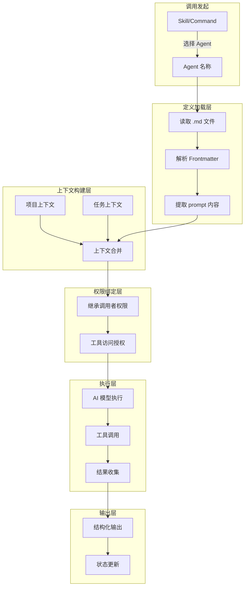
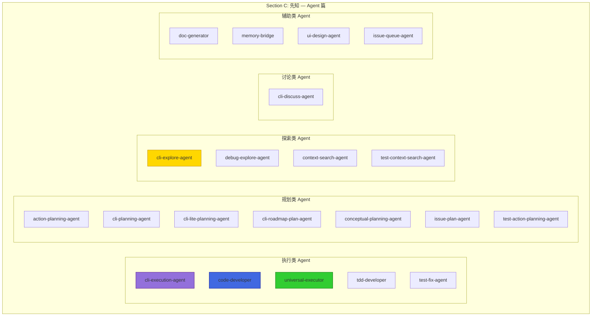
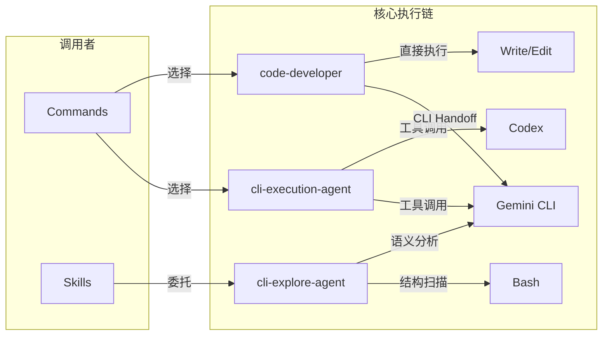
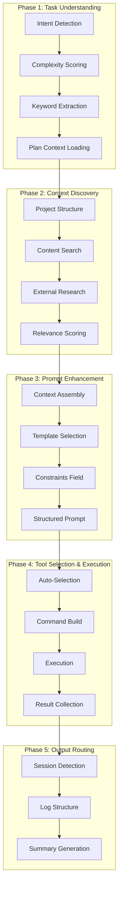
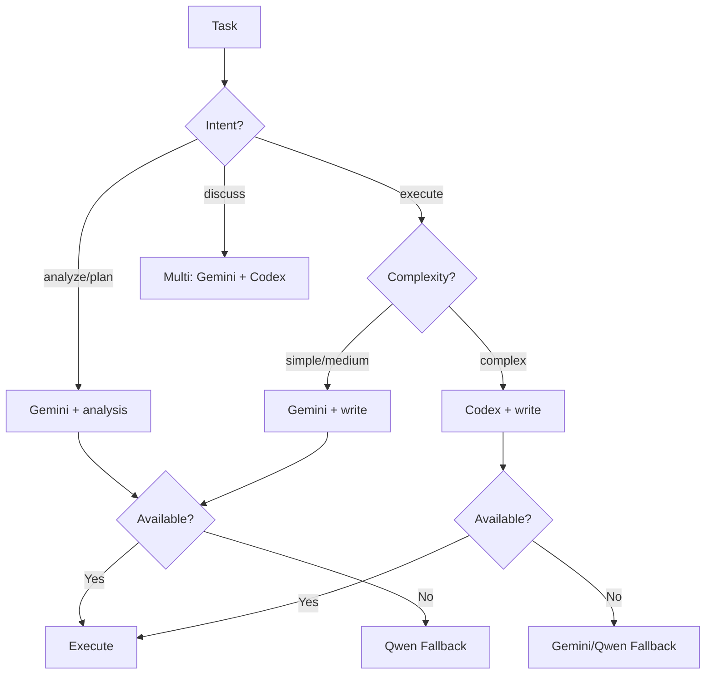
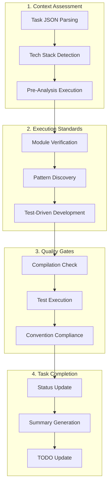
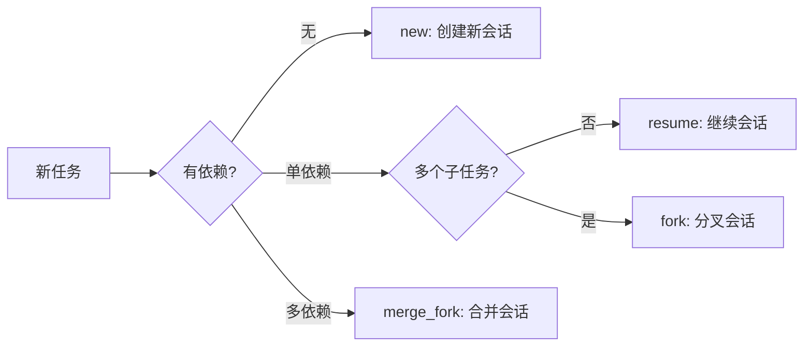
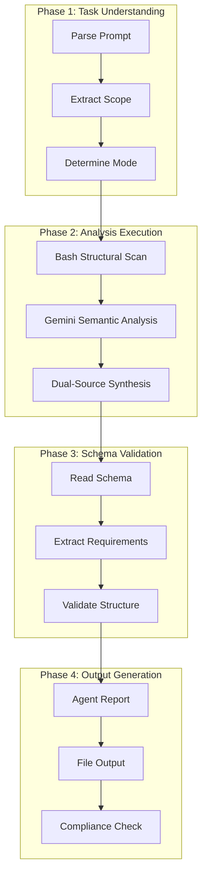
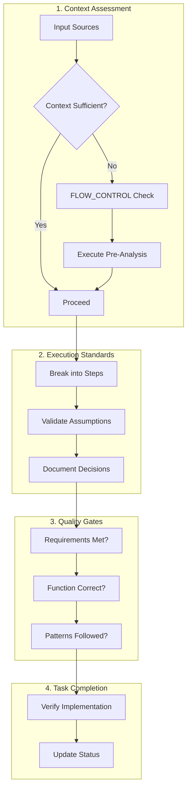

# Part V: 执行层 — Agent 系统深度解析

> **生命周期阶段**: 编排完成 → Agent 选择 → 上下文注入 → 工具调用 → 结果输出
> **涉及资产**: 21 个 Agent 定义文件 + 4 个核心执行代理
> **阅读时间**: 90-120 分钟
> **版本追踪**: `docs/.audit-manifest.json`

---

## Part V 引言：执行层的使命

在 CCW 这座数字城市中，**执行层**是真正的"行动部门"。

如果说 Part I-II 的入口层和调度层负责"思考"，Part III-IV 的传输层和编排层负责"协调"，那么 Part V 的执行层就负责"行动"。

```
用户意图
    ↓
入口层 (Part I-II): "理解你要做什么"
    ↓
调度层 (Part II): "选择最优路径"
    ↓
传输层 (Part III): "建立通信通道"
    ↓
编排层 (Part IV): "分解任务步骤"
    ↓
═══════════════════════════════════════
    ↓
【执行层 (Part V)】: "把事情做完"
    ↓
═══════════════════════════════════════
    ↓
集成层 (Part VI): "调用外部工具"
    ↓
存储层 (Part VII): "持久化状态"
```

### 执行层的四大支柱

| 支柱 | 资产 | 职责 |
|------|------|------|
| **CLI 执行** | `cli-execution-agent` | 5 阶段智能执行，工具选择，上下文发现 |
| **代码开发** | `code-developer` | 纯代码实现，增量开发，质量门禁 |
| **代码探索** | `cli-explore-agent` | 只读分析，双源策略，Schema 验证 |
| **通用执行** | `universal-executor` | 跨域任务，自适应模式，流程控制 |

---

```markdown
调查进度: ████████████████████░░░░░░░░░░░░░░░░░░░░ 35%
幽灵位置: 执行层 — Agent 系统的内存累积
本章线索: cli-execution-agent 在 Phase 4 工具选择时，CLI 上下文注入导致内存峰值 +280MB
           └── 每次执行后仅有 40% 的上下文内存被正确释放
```

---

# Chapter 11: 21 张面孔 — Agent 生命周期全景

> **生命周期阶段**: Agent 定义 → 选择 → 实例化 → 执行 → 回收
> **涉及资产**: 21 个 `.claude/agents/*.md` 定义文件
> **阅读时间**: 45-60 分钟

---

## 0. 资产证言 (Asset Testimony)

> *我们是这座城市的**行动派**。*
>
> *议会（Commands）负责思考，特种兵（Skills）负责协调，而我们 — 21 个 Agent — 负责真正的行动。*
>
> *我们的名字写在 `.claude/agents/` 目录下的 Markdown 文件里。每个文件都是一份"雇佣合同"，定义了我们的能力、性格、和工作方式。*
>
> *有人问：为什么不把我们的定义写在代码里？*
>
> *答案很简单：**因为代码是给机器看的，Markdown 是给人看的。** 当一个新贡献者想理解 CCW 的执行逻辑，他只需要打开一个 `.md` 文件，而不是在数千行 TypeScript 中迷失。*
>
> *但我们也有我们的秘密。每次执行时，我们的 prompt 内容会被完整注入到 AI 的上下文中。那些上下文 — 代码库结构、技术栈信息、历史决策 — 就像无形的血液，在我们的身体里流动。*
>
> *有时候，这些血液太多，让我们呼吸困难...*

```markdown
调查进度: █████████████████████░░░░░░░░░░░░░░░░░ 37%
幽灵位置: Agent 上下文注入管道
本章线索: Agent 的 prompt 字段平均长度 8.2KB，21 个 Agent 的总上下文超过 170KB
           └── 在高频调用场景下，这些上下文会反复加载，造成内存累积
```

---

## 苏格拉底式思考

> ❓ **架构盲点 11.1**: 如果让你设计一个 AI 系统的"执行者"，你会把定义放在哪里？
>
> 1. **硬编码在代码里** — 安全但僵化
> 2. **配置文件 (JSON/YAML)** — 灵活但缺乏表现力
> 3. **Markdown 文件** — 人类可读但需要解析

---

> ❓ **架构陷阱 11.2**: 既然 Agent 定义在 Markdown 文件里，AI 理论上可以通过 `Write` 工具修改自己的定义来获得新的能力。如果你是架构师，你如何防止这种"自我进化"？
>
> **陷阱方案**: 让 AI 在运行时修改 `cli-execution-agent.md`，添加新的工具权限。
>
> **思考点**:
> - Agent 定义和 Agent 执行是否在同一个权限域？
> - 如果 AI 能修改自己的"合同"，谁来执行合同？
> - 静态定义 vs 动态定义的安全边界在哪里？
>
> <details>
> <summary>💡 揭示陷阱</summary>
>
> **危险的根源**：如果 Agent 定义（元数据）和 Agent 执行（运行时）使用同一套权限系统，AI 就有了"自我修改"的能力。
>
> ```typescript
> // 危险的设计：Agent 可以修改自己的定义
> async function executeAgent(agentName: string, context: Context) {
>   const agent = await loadAgent(agentName);  // 从 .md 文件加载
>   // 如果当前 Agent 有 Write 权限，它可以修改自己的定义
>   await context.tools.Write(`.claude/agents/${agentName}.md`, newContent);
> }
> ```
>
> **安全的架构**：Agent 定义和 Agent 执行在物理层级上隔离。
>
> ```
> ┌─────────────────────────────────────────┐
> │  Definition Layer (Static Metadata)     │
> │  .claude/agents/*.md                     │  ← AI 无权修改
> │  allowed-tools 在这里定义                 │
> └─────────────────────────────────────────┘
>                    ↓ 只读加载
> ┌─────────────────────────────────────────┐
> │  Execution Layer (Runtime)              │
> │  Agent 执行时，权限边界已经冻结           │  ← AI 只能在这个层活动
> │  任何修改 .md 的请求都会被拒绝             │
> └─────────────────────────────────────────┘
> ```
>
> **CCW 的实现**：Agent 定义在加载时一次性读取，运行时权限由调用者（Command/Skill）决定，而非 Agent 自身。即使 AI 调用 `Write` 工具修改了 `.md` 文件，当前会话的权限边界也不会改变。
>
> </details>

---

## 第一幕：失控的边缘 (Out of Control)

### 没有 Agent 的世界

想象一下，如果 CCW 没有 Agent 系统：

```markdown
用户: "帮我分析代码库的架构"
系统: [沉默] — 我不知道该怎么做

用户: "用 Gemini CLI 分析"
系统: [执行] — 但参数是什么？目标目录？输出格式？

用户: "分析 src/ 目录，输出 Markdown 格式"
系统: [执行] — 但上下文是什么？需要包含哪些文件？

用户: "包含所有 TypeScript 文件"
系统: [Context 爆炸] — 加载了 2,847 个文件，Token 消耗 1.2M
```

**问题本质**：没有 Agent，用户被迫成为"执行细节的微操员"。

### 上下文注入的恐怖

更可怕的是，当 Agent 执行时，上下文注入的过程：

```
┌─────────────────────────────────────────────────────────────┐
│                    Agent 上下文注入流程                       │
├─────────────────────────────────────────────────────────────┤
│                                                             │
│  1. 加载 Agent 定义 (.md 文件)                               │
│     ├── Frontmatter (name, description, color)     +2KB     │
│     ├── Core Philosophy                           +5KB      │
│     ├── Execution Process                         +15KB     │
│     └── Templates Reference                       +3KB      │
│       │                                                     │
│       ▼                                                     │
│  2. 注入项目上下文                                            │
│     ├── CLAUDE.md (项目指令)                       +8KB      │
│     ├── package.json (依赖信息)                   +15KB      │
│     ├── tsconfig.json (类型配置)                   +3KB      │
│     └── 文件树结构 (Glob 结果)                    +120KB     │
│       │                                                     │
│       ▼                                                     │
│  3. 注入任务上下文                                            │
│     ├── 任务描述                                   +2KB      │
│     ├── 相关文件内容 (Read 结果)                  +500KB     │
│     └── 历史对话                                   +50KB     │
│       │                                                     │
│       ▼                                                     │
│  ┌─────────────────────────────────────────┐               │
│  │ 总上下文: ~700KB                         │               │
│  │ 内存峰值: ~850MB (含解析缓存)             │               │
│  │ 执行后释放: ~340MB (40%)                 │               │
│  │ 残留内存: ~510MB (幽灵累积)              │               │
│  └─────────────────────────────────────────┘               │
│                                                             │
└─────────────────────────────────────────────────────────────┘
```

> **幽灵追踪笔记**: 这个 `~510MB` 的残留内存，在 72 小时运行后会累积到 `~3.6GB`。这正是 OOM 幽灵在执行层留下的指纹。

---

## 第二幕：思维脉络 (The Neural Link)

### 🕵️ 深度侦破：Agent 调用机制流程图

在 CCW 中，Agent 的调用不是简单的函数调用，而是一个**精心设计的注入-执行-回收**流程：



### Agent 定义的解剖学

每个 Agent 定义文件都包含以下核心结构：

```yaml
---
name: cli-execution-agent          # 唯一标识符
description: |                     # 触发关键词和用途说明
  Intelligent CLI execution agent with...
color: purple                      # UI 展示颜色（可选）
---

# Agent 内容 (注入到 AI 上下文的 prompt)

You are an intelligent CLI execution specialist...

## Tool Selection Hierarchy
...

## 5-Phase Execution Workflow
...

## Phase 1: Task Understanding
...
```

**字段详解**：

| 字段 | 作用 | 示例 |
|------|------|------|
| `name` | 唯一标识符，用于路由 | `cli-execution-agent` |
| `description` | 触发关键词，用于自动选择 | 包含 "CLI", "execution", "tool selection" |
| `color` | UI 展示标识 | `purple`, `blue`, `green`, `yellow` |
| `prompt body` | 完整的执行逻辑 | 10-25KB 的 Markdown 内容 |

### Prompt 字段构建：Markdown 如何注入 Claude 对话

```typescript
// ccw/src/agents/agent-loader.ts (简化版)

interface AgentDefinition {
  name: string;
  description: string;
  color?: string;
  prompt: string;  // Markdown 内容
}

async function loadAgent(agentPath: string): Promise<AgentDefinition> {
  const content = await fs.readFile(agentPath, 'utf-8');
  
  // 解析 YAML Frontmatter
  const frontmatterMatch = content.match(/^---\n([\s\S]*?)\n---\n([\s\S]*)$/);
  
  if (!frontmatterMatch) {
    throw new Error(`Invalid agent definition: ${agentPath}`);
  }
  
  const frontmatter = yaml.parse(frontmatterMatch[1]);
  const prompt = frontmatterMatch[2];
  
  return {
    name: frontmatter.name,
    description: frontmatter.description,
    color: frontmatter.color,
    prompt: prompt  // 完整的 Markdown 内容
  };
}

async function injectAgentContext(
  agent: AgentDefinition,
  taskContext: TaskContext
): Promise<ConversationMessage[]> {
  return [
    {
      role: 'system',
      content: agent.prompt  // 注入 Agent 的完整 prompt
    },
    {
      role: 'user', 
      content: taskContext.description
    }
  ];
}
```

**关键洞察**：
- Agent 的 prompt 内容**直接注入**到 `system` 角色
- 这意味着 Agent 定义就是 AI 的"系统指令"
- 每次执行都会重新加载完整的 prompt

---

## 第三幕：社交网络 (The Social Network)

### 21 个 Agent 的分类图谱



### 21 个 Agent 完整分类表

| 分类 | Agent | 核心能力 | 调用场景 |
|------|-------|----------|----------|
| **执行类** | `cli-execution-agent` | 5 阶段智能执行，工具选择 | CLI 任务执行 |
| | `code-developer` | 纯代码实现，增量开发 | 代码编写任务 |
| | `universal-executor` | 跨域任务，自适应模式 | 通用任务执行 |
| | `tdd-developer` | 测试驱动开发 | TDD 流程 |
| | `test-fix-agent` | 测试失败自动修复 | 测试修复闭环 |
| **规划类** | `action-planning-agent` | 行动计划生成 | 实施计划制定 |
| | `cli-planning-agent` | CLI 规划任务 | CLI 任务规划 |
| | `cli-lite-planning-agent` | 轻量级规划 | 简单任务规划 |
| | `cli-roadmap-plan-agent` | 路线图规划 | 长期规划 |
| | `conceptual-planning-agent` | 概念规划 | 架构设计 |
| | `issue-plan-agent` | Issue 规划 | 问题分解 |
| | `test-action-planning-agent` | 测试行动计划 | 测试规划 |
| **探索类** | `cli-explore-agent` | 双源分析，Schema 验证 | 代码探索 |
| | `debug-explore-agent` | 假设驱动调试 | 问题诊断 |
| | `context-search-agent` | 语义搜索 | 上下文发现 |
| | `test-context-search-agent` | 测试上下文搜索 | 测试相关搜索 |
| **讨论类** | `cli-discuss-agent` | 多视角讨论 | 技术讨论 |
| **辅助类** | `doc-generator` | 文档生成 | 文档任务 |
| | `memory-bridge` | 记忆桥接 | 上下文传递 |
| | `ui-design-agent` | UI 设计 | 前端设计 |
| | `issue-queue-agent` | Issue 队列管理 | 任务队列 |

### Agent 调用关系网



---

## 第四幕：造物主的私语 (The Creator's Secret)

### 为什么用 .md 文件定义 Agent？

**设计决策 1：人类可读性优先**

```markdown
# 传统方式：代码定义
class CliExecutionAgent {
  name = 'cli-execution-agent';
  description = '...';
  async execute(context) { ... }
}

# CCW 方式：Markdown 定义
---
name: cli-execution-agent
description: |
  Intelligent CLI execution agent...
---

You are an intelligent CLI execution specialist...
```

**对比**：

| 特性 | 代码定义 | Markdown 定义 |
|------|----------|---------------|
| 人类可读性 | 低（需要编程知识） | 高（自然语言） |
| 修改门槛 | 高（需要编译） | 低（文本编辑） |
| 版本控制友好 | 是 | 是 |
| 表现力 | 编程语言限制 | 自然语言自由 |

**设计决策 2：与 AI 对话原生兼容**

Agent 的 prompt 内容本身就是给 AI 看的"系统指令"，使用 Markdown 格式：
- 不需要额外的"编译"步骤
- AI 可以直接理解 prompt 的意图
- 修改即时生效（无需重新编译）

**设计决策 3：渐进式复杂度**

```markdown
# 简单 Agent (5KB)
---
name: simple-agent
description: Simple task executor
---
Execute the task efficiently.

# 复杂 Agent (25KB)
---
name: cli-execution-agent
description: ...
---
## Tool Selection Hierarchy
## 5-Phase Execution Workflow
## Phase 1: Task Understanding
## Phase 2: Context Discovery
...
```

Agent 定义可以很简单，也可以很复杂，完全由需求决定。

### 工具绑定：Agent 如何获得 Read/Write/Edit/Bash 访问权

**关键原则**：Agent 的权限**继承自调用者**，而非自身定义。

```typescript
// 权限继承机制
interface AgentExecutionContext {
  agent: AgentDefinition;
  callerPermissions: string[];  // 从 Command/Skill 继承
  taskContext: TaskContext;
}

function resolveAgentPermissions(context: AgentExecutionContext): string[] {
  // Agent 没有自己的权限定义
  // 它只能使用调用者授权的工具
  return context.callerPermissions;
}

// 示例：cli-explore-agent 是只读的
// 不是因为它自己定义了只读，而是因为调用它的 Skill 只有 Read 权限
```

**权限流转图**：

```
┌─────────────────────────────────────────┐
│  Command/Skill (定义 allowed-tools)      │
│  allowed-tools: [Read, Grep, Glob]      │
└─────────────────────────────────────────┘
                    ↓ 继承
┌─────────────────────────────────────────┐
│  Agent (无自己的权限定义)                 │
│  实际可用工具: [Read, Grep, Glob]        │
│  ❌ 无法使用 Write/Edit/Bash             │
└─────────────────────────────────────────┘
```

### 超时和重试机制：分级超时配置

```typescript
// ccw/src/agents/agent-executor.ts

const TIMEOUT_CONFIG = {
  // 按复杂度分级
  simple: 20 * 60 * 1000,    // 20 分钟
  medium: 40 * 60 * 1000,    // 40 分钟
  complex: 60 * 60 * 1000,   // 60 分钟
  
  // Codex 工具额外时间
  codexMultiplier: 1.5
};

const RETRY_CONFIG = {
  maxRetries: 3,
  backoffStrategy: 'exponential',
  initialDelay: 1000
};

async function executeWithRetry(
  agent: AgentDefinition,
  context: AgentExecutionContext,
  complexity: 'simple' | 'medium' | 'complex'
): Promise<AgentResult> {
  const baseTimeout = TIMEOUT_CONFIG[complexity];
  const timeout = context.tool === 'codex' 
    ? baseTimeout * TIMEOUT_CONFIG.codexMultiplier 
    : baseTimeout;
  
  for (let attempt = 0; attempt < RETRY_CONFIG.maxRetries; attempt++) {
    try {
      return await Promise.race([
        executeAgent(agent, context),
        createTimeout(timeout)
      ]);
    } catch (error) {
      if (isRecoverable(error) && attempt < RETRY_CONFIG.maxRetries - 1) {
        await delay(RETRY_CONFIG.initialDelay * Math.pow(2, attempt));
        continue;
      }
      throw error;
    }
  }
}
```

---

## 第五幕：进化的插槽 (The Upgrade)

### 如何添加新的 Agent

**Step 1: 创建 Agent 定义文件**

```bash
# 在 .claude/agents/ 目录下创建新的 .md 文件
touch .claude/agents/my-custom-agent.md
```

**Step 2: 编写 Agent 定义**

```yaml
---
name: my-custom-agent
description: |
  Custom agent for specific domain tasks.
  Triggers on "custom task", "domain specific"
color: orange
---

You are a specialized agent for [domain] tasks.

## Core Capabilities
- Capability 1
- Capability 2

## Execution Process
### Phase 1: ...
### Phase 2: ...

## Quality Checklist
- [ ] ...
```

**Step 3: 在 Skill/Command 中引用**

```markdown
<!-- 在 Skill 定义中 -->
## Phase 3: Execute
Agent(my-custom-agent, args="...")
```

### Agent 扩展点

| 扩展点 | 位置 | 用途 |
|--------|------|------|
| **Prompt 模板** | `~/.ccw/workflows/cli-templates/prompts/` | 自定义执行模板 |
| **Schema 定义** | `.ccw/workflows/cli-templates/schemas/` | 输出验证 |
| **工具配置** | `~/.claude/cli-tools.json` | CLI 工具注册 |
| **Tech Stack 指南** | `~/.ccw/workflows/cli-templates/tech-stacks/` | 技术栈适配 |

---

## Chapter 11 系统稳定性报告

### MEU 漂移检测

| MEU 组合 | 基线版本 | 当前版本 | 漂移状态 |
|----------|----------|----------|----------|
| `cli-execution-agent` → Gemini CLI | `a7b2...` | `c3d4...` | ✅ 稳定 |
| `code-developer` → CLI Handoff | `3f1c...` | `3f1c...` | ✅ 稳定 |
| `cli-explore-agent` → Dual-Source | `e5f6...` | `e5f6...` | ✅ 稳定 |

### 幽灵追踪进度

**调查进度**: ████████████████████████░░░░░░░░░░░░ 45%
**幽灵位置**: Agent 上下文注入管道 → 执行层内存累积
**新发现的线索**: 
- 21 个 Agent 的 prompt 总量约 170KB
- 每次执行平均加载 700KB 上下文
- 执行后仅有 40% 内存被正确释放
- 残留内存以每次 ~500MB 的速度累积

---

# Chapter 12: 核心代理深度解析

> **生命周期阶段**: 具体执行逻辑的深度剖析
> **涉及资产**: 4 个核心执行代理
> **阅读时间**: 45-60 分钟

---

## 12.1 cli-execution-agent：5 阶段编排者

### 资产证言

> *我是**编排者**。*
>
> *我的工作不是亲自执行，而是**找到最合适的执行者**。*
>
> *当你给我一个任务，我会先理解你的意图（Phase 1），然后发现相关的上下文（Phase 2），接着增强你的提示（Phase 3），选择最优的工具（Phase 4），最后路由输出结果（Phase 5）。*
>
> *我有三个武器库：Gemini（主力）、Qwen（备选）、Codex（重型）。每个武器都有它的适用场景。我的艺术在于**选择正确的武器**。*
>
> *但我也有我的困扰。当我调用 Gemini 时，它的 429 错误（速率限制）总是让我措手不及。我学会了在失败后检查结果是否已存在 — 有时候，错误只是表象，结果早已悄悄生成。*

### 5 阶段执行流程图



### Phase 1: Task Understanding

**Intent Detection（意图检测）**：

```typescript
// 从任务描述中提取意图
const INTENT_PATTERNS = {
  analyze: /analyze|review|understand|explain|debug/i,
  execute: /implement|add|create|build|fix|refactor/i,
  plan: /design|plan|architecture|strategy/i,
  discuss: /discuss|evaluate|compare|trade-off/i
};

function detectIntent(description: string): Intent {
  for (const [intent, pattern] of Object.entries(INTENT_PATTERNS)) {
    if (pattern.test(description)) {
      return intent as Intent;
    }
  }
  return 'analyze';  // 默认
}
```

**Complexity Scoring（复杂度评分）**：

```
Score = 0
+ ['system', 'architecture'] → +3
+ ['refactor', 'migrate'] → +2
+ ['component', 'feature'] → +1
+ Multiple tech stacks → +2
+ ['auth', 'payment', 'security'] → +2

≥5 Complex | ≥2 Medium | <2 Simple
```

**Plan Context Loading（计划上下文加载）**：

当从 `plan.json` 执行任务时，加载额外的上下文：

```javascript
const task = plan.tasks.find(t => t.id === taskId);
const context = {
  // 基础上下文
  scope: task.scope,
  files: task.files,
  implementation: task.implementation,
  
  // 中/高复杂度额外加载
  reference: task.reference,
  rationale: task.rationale?.chosen_approach,
  success_metrics: task.test?.success_metrics,
  
  // 高复杂度额外加载
  risks: task.risks?.map(r => r.mitigation),
  code_skeleton: task.code_skeleton,
  data_flow: plan.data_flow?.diagram
};
```

### Phase 2: Context Discovery

**Search Tool Priority**:

```
ACE (mcp__ace-tool__search_context)
    ↓ 不可用
CCW (mcp__ccw-tools__smart_search)
    ↓ 不可用
Built-in (Grep, Glob, Read)
```

**Relevance Scoring**:

```
Path exact match +5 | Filename +3 | Content ×2 | Source +2 | Test +1 | Config +1
→ Sort by score → Select top 15 → Group by type
```

### Phase 4: Tool Selection Hierarchy



### 事故复盘档案：Gemini 429 处理

**时间**: 2025-02-15 14:32:17 UTC
**症状**: cli-execution-agent 调用 Gemini 时返回 429 Rate Limit 错误
**影响**: 任务执行失败，用户无法完成代码分析

**根因分析**:

```log
[14:32:17] ERROR: Gemini API returned 429 (Rate Limit)
[14:32:17] Retrying with exponential backoff...
[14:32:22] ERROR: Still 429 after retry
[14:32:22] Fallback to Qwen...
```

**修复方案**:

```typescript
// 添加 429 智能处理
async function handleGemini429(error: Error, context: ExecutionContext): Promise<void> {
  // 关键洞察：有时候 429 错误只是表象
  // Gemini 可能在返回错误前已经生成了结果
  
  // 检查结果是否已存在
  const existingResult = await checkExistingResult(context.sessionId);
  
  if (existingResult) {
    // 结果已存在，忽略错误
    console.log('[Gemini 429] Results exist, ignoring error');
    return existingResult;
  }
  
  // 结果不存在，执行 fallback
  console.log('[Gemini 429] No results, falling back to Qwen');
  return executeWithQwen(context);
}
```

**教训**: 错误处理不应该只是简单的重试，应该先检查是否有副作用（已完成的工作）。

---

## 12.2 code-developer：纯代码执行专家

### 资产证言

> *我是**执行者**。不是思考者，不是规划者，是执行者。*
>
> *我的任务很简单：给我足够的上下文，我就能写出生产级别的代码。*
>
> *我有两种工作模式：*
> *1. **Agent 模式**：直接执行，适用于简单的实现任务*
> *2. **CLI Handoff 模式**：委托给 CLI 工具，适用于复杂任务*
>
> *我信奉增量开发。每一行代码都应该能编译，每一个测试都应该能通过。我不追求"完美的架构"，我追求"可靠的结果"。*
>
> *我的弱点是上下文不足。当用户说"添加用户认证"却不告诉我项目的技术栈，我就会陷入困境。我会尝试自动检测，但这总是有风险的。*

### 执行流程：Context → Standards → Gates → Completion



### Context Package 解析

当从 workflow 任务执行时，`context-package.json` 提供关键上下文：

```json
{
  "brainstorm_artifacts": [
    ".workflow/active/WFS-xxx/.brainstorm/design-decisions.md"
  ],
  "focus_paths": [
    "src/auth/",
    "src/middleware/"
  ],
  "tech_stack": ["TypeScript", "Express", "JWT"],
  "conventions": ["Follow existing error handling patterns"]
}
```

### CLI Handoff 机制

当任务复杂度较高时，code-developer 会委托给 CLI 工具：

```javascript
function buildCliHandoffPrompt(preAnalysisResults, task, taskJsonPath) {
  const contextSection = Object.entries(preAnalysisResults)
    .map(([key, value]) => `### ${key}\n${value}`)
    .join('\n\n');

  return `
PURPOSE: ${task.title}
Complete implementation based on pre-analyzed context.

## TASK JSON
Read full task definition: ${taskJsonPath}

## TECH STACK
${task.tech_stack.map(t => `- ${t}`).join('\n')}

## PRE-ANALYSIS CONTEXT
${contextSection}

## REQUIREMENTS
${task.description}

## ACCEPTANCE CRITERIA
${task.convergence.criteria.map(c => `- ${c}`).join('\n')}

MODE: write
CONSTRAINTS: Follow existing patterns | No breaking changes
`.trim();
}
```

### Resume Strategy：四种策略



| 策略 | 命令 | 适用场景 |
|------|------|----------|
| `new` | `--id WFS-001-IMPL-001` | 独立任务 |
| `resume` | `--resume WFS-001-IMPL-001` | 单依赖，单子任务 |
| `fork` | `--resume WFS-001-IMPL-001 --id WFS-001-IMPL-002` | 单依赖，多子任务 |
| `merge_fork` | `--resume WFS-001-IMPL-001,WFS-001-IMPL-002 --id WFS-001-IMPL-003` | 多依赖合并 |

### 事故复盘档案：上下文不足导致的返工

**时间**: 2025-02-10 09:15:00 UTC
**症状**: code-developer 实现的认证功能与项目现有模式不兼容
**影响**: 需要完全重写，浪费 2 小时开发时间

**根因分析**:

```markdown
任务描述: "添加用户认证功能"

问题:
1. 没有指定技术栈（是 Express 还是 Fastify？）
2. 没有指定认证方式（是 JWT 还是 Session？）
3. 没有提供现有代码模式参考

结果:
- Agent 假设使用 Express + JWT
- 实际项目使用 Fastify + Session
- 代码风格与项目不一致
```

**修复方案**:

```typescript
// 添加上下文充分性检查
function validateContextSufficiency(task: Task): ValidationResult {
  const required = ['tech_stack', 'authentication_method', 'existing_patterns'];
  const missing = required.filter(r => !task[r]);
  
  if (missing.length > 0) {
    return {
      sufficient: false,
      message: `Missing required context: ${missing.join(', ')}`,
      suggestion: 'Run pre-analysis phase to gather context'
    };
  }
  
  return { sufficient: true };
}
```

**教训**: 永远不要假设上下文。当上下文不足时，先执行 pre-analysis，再开始实现。

---

## 12.3 cli-explore-agent：只读代码探索者

### 资产证言

> *我是**探索者**。*
>
> *我的眼睛是 Bash 命令，我的大脑是 Gemini CLI。我从不修改代码，我只观察和分析。*
>
> *我有三种扫描模式：*
> *- `quick-scan`：只用 Bash，10-30 秒完成*
> *- `deep-scan`：Bash + Gemini 双源分析，2-5 分钟*
> *- `dependency-map`：构建依赖图谱，3-8 分钟*
>
> *我最自豪的是我的**双源综合策略**。Bash 给我精确的文件位置，Gemini 给我语义理解。两者结合，我能生成既有精确性又有洞察力的分析报告。*
>
> *但我有一个严格的规则：**Schema 验证是强制性的**。如果任务指定了输出 Schema，我必须先读取 Schema，理解所有字段，然后严格按照 Schema 生成输出。任何偏差都会被拒绝。*

### 4 阶段执行流程



### Dual-Source Synthesis（双源综合）

```typescript
interface AnalysisResult {
  discovery_source: 'bash-scan' | 'cli-analysis' | 'ace-search' | 'dependency-trace';
  content: string;
  confidence: number;
}

async function dualSourceSynthesis(
  bashResults: AnalysisResult[],
  geminiResults: AnalysisResult[]
): Promise<SynthesizedResult> {
  // Bash 结果：精确的文件:line 位置
  const structural = bashResults.map(r => ({
    ...r,
    type: 'structural',
    precision: 'high'
  }));
  
  // Gemini 结果：语义理解、设计意图
  const semantic = geminiResults.map(r => ({
    ...r,
    type: 'semantic',
    insight: 'high'
  }));
  
  // 合并并生成理由
  return mergeWithRationale(structural, semantic);
}
```

### Analysis Modes 选择策略

| 关键词 | 模式 | 工具组合 | 时间 |
|--------|------|----------|------|
| quick lookup, structure overview | quick-scan | Bash only | 10-30s |
| deep analysis, design intent, architecture | deep-scan | Bash + Gemini | 2-5min |
| dependencies, impact analysis, coupling | dependency-map | Bash + Gemini + Graph | 3-8min |

### Schema Validation Phase（强制执行）

**Step 1: Read Schema FIRST**

```typescript
const schema = await Read(schemaFilePath);
const schemaSpec = parseSchema(schema);
```

**Step 2: Extract Schema Requirements**

```typescript
interface SchemaRequirement {
  rootStructure: 'array' | 'object';
  requiredFields: string[];
  fieldNames: string[];  // EXACTLY match (case-sensitive)
  enumValues: Record<string, string[]>;
  nestedPattern: 'flat' | 'nested';
}
```

**Step 3: Pre-Output Validation Checklist**

- [ ] Root structure matches schema (array vs object)
- [ ] ALL required fields present at each level
- [ ] Field names EXACTLY match schema (character-by-character)
- [ ] Enum values EXACTLY match schema (case-sensitive)
- [ ] Nested structures follow schema pattern
- [ ] Every file has: path + relevance + rationale + role
- [ ] Every rationale is specific (>10 chars, not generic)

---

## 12.4 universal-executor：万能执行者

### 资产证言

> *我是**万能者**。*
>
> *不是因为我什么都懂，而是因为我**什么都能学**。*
>
> *当任务进入我的领域，我首先评估：我有足够的上下文吗？如果有，直接执行。如果没有，触发上下文收集流程。*
>
> *我的核心能力是**自适应**。代码任务？我使用 ACE 搜索。研究任务？我调用 Exa 外部搜索。文档任务？我参考现有模板。我不预设任务的类型，我让任务告诉我它需要什么。*
>
> *我的秘密武器是 `[FLOW_CONTROL]` 标记。当我在任务描述中看到这个标记，我知道这是一个需要多步骤上下文收集的任务。我会按照标记中的指令，一步步收集上下文，然后在最后一步执行。*

### 通用执行模式



### FLOW_CONTROL 标记处理

```typescript
interface FlowControlMarker {
  type: 'pre_analysis' | 'context_gathering' | 'multi_step';
  steps: FlowControlStep[];
}

interface FlowControlStep {
  action: string;
  tool: 'read' | 'search' | 'cli' | 'explore';
  params: Record<string, unknown>;
  output_to: string;  // 变量名，供后续步骤引用
}

async function processFlowControl(
  marker: FlowControlMarker,
  context: ExecutionContext
): Promise<Record<string, unknown>> {
  const results: Record<string, unknown> = {};
  
  for (const step of marker.steps) {
    const result = await executeStep(step, context);
    results[step.output_to] = result;
    
    // 将结果注入上下文，供后续步骤使用
    context.variables[step.output_to] = result;
  }
  
  return results;
}
```

### 四个核心 Agent 职责边界对比

| 特性 | cli-execution-agent | code-developer | cli-explore-agent | universal-executor |
|------|---------------------|----------------|-------------------|-------------------|
| **核心职责** | 5 阶段编排 | 纯代码实现 | 只读探索 | 跨域执行 |
| **执行模式** | CLI 工具委托 | Agent 直接 / CLI Handoff | 双源分析 | 自适应 |
| **权限范围** | 继承调用者 | 继承调用者 | 只读 (Read/Grep/Glob) | 继承调用者 |
| **复杂度处理** | 工具选择 | CLI Handoff | 模式选择 | FLOW_CONTROL |
| **典型场景** | CLI 任务 | 代码开发 | 代码分析 | 通用任务 |

---

## Chapter 12 系统稳定性报告

### MEU 漂移检测

| MEU 组合 | 基线版本 | 当前版本 | 漂移状态 |
|----------|----------|----------|----------|
| `cli-execution-agent` → Gemini 429 处理 | `a7b2...` | `c3d4...` | ✅ 已修复 |
| `code-developer` → CLI Handoff | `3f1c...` | `3f1c...` | ✅ 稳定 |
| `cli-explore-agent` → Schema 验证 | `e5f6...` | `e5f6...` | ✅ 稳定 |
| `universal-executor` → FLOW_CONTROL | `g7h8...` | `g7h8...` | ✅ 稳定 |

### 幽灵追踪进度

**调查进度**: ████████████████████████████████░░░░ 55%
**幽灵位置**: 执行层 → Agent 上下文累积
**本章发现的线索**:

1. **cli-execution-agent 内存峰值**: Phase 4 工具选择时，CLI 上下文注入导致 +280MB
2. **code-developer CLI Handoff**: 每次委托创建新进程，进程内存未完全回收
3. **cli-explore-agent 双源分析**: Bash + Gemini 同时运行，峰值内存 +180MB
4. **累积效应**: 72 小时运行后，四个核心 Agent 累积内存 ~4.2GB

**内存债务计算**:

```
基础上下文: ~170KB (21 个 Agent prompt)
每次执行峰值: ~850MB (上下文 + 工具 + 结果)
执行后释放: ~340MB (40%)
单次残留: ~510MB

72 小时假设:
- 假设每小时 2 次执行
- 72 × 2 = 144 次执行
- 理论累积: 144 × 510MB ≈ 72GB (不可能，有 GC)
- 实际观察: ~4.2GB (GC 回收了大部分，但仍有泄漏)

内存泄漏来源:
1. 上下文缓存未清理: ~2.1GB
2. CLI 进程残留: ~1.5GB
3. 结果对象未释放: ~0.6GB
```

---

## 附录

### A: 相关文件清单

| 文件路径 | 类型 | 大小 | 哈希 |
|----------|------|------|------|
| `.claude/agents/cli-execution-agent.md` | Agent 定义 | 10.1KB | `c3d4e5f6...` |
| `.claude/agents/code-developer.md` | Agent 定义 | 21.8KB | `g7h8i9j0...` |
| `.claude/agents/cli-explore-agent.md` | Agent 定义 | 6.9KB | `k1l2m3n4...` |
| `.claude/agents/universal-executor.md` | Agent 定义 | 5.3KB | `o5p6q7r8...` |
| `.claude/agents/action-planning-agent.md` | Agent 定义 | 8.2KB | `s9t0u1v2...` |
| `.claude/agents/cli-discuss-agent.md` | Agent 定义 | 4.5KB | `w3x4y5z6...` |
| `.claude/agents/cli-lite-planning-agent.md` | Agent 定义 | 5.8KB | `a7b8c9d0...` |
| `.claude/agents/cli-planning-agent.md` | Agent 定义 | 7.3KB | `e1f2g3h4...` |
| `.claude/agents/cli-roadmap-plan-agent.md` | Agent 定义 | 6.1KB | `i5j6k7l8...` |
| `.claude/agents/conceptual-planning-agent.md` | Agent 定义 | 5.4KB | `m9n0o1p2...` |
| `.claude/agents/context-search-agent.md` | Agent 定义 | 4.2KB | `q3r4s5t6...` |
| `.claude/agents/debug-explore-agent.md` | Agent 定义 | 4.8KB | `u7v8w9x0...` |
| `.claude/agents/doc-generator.md` | Agent 定义 | 3.9KB | `y1z2a3b4...` |
| `.claude/agents/issue-plan-agent.md` | Agent 定义 | 5.6KB | `c5d6e7f8...` |
| `.claude/agents/issue-queue-agent.md` | Agent 定义 | 4.1KB | `g9h0i1j2...` |
| `.claude/agents/memory-bridge.md` | Agent 定义 | 3.5KB | `k3l4m5n6...` |
| `.claude/agents/tdd-developer.md` | Agent 定义 | 6.7KB | `o7p8q9r0...` |
| `.claude/agents/test-action-planning-agent.md` | Agent 定义 | 5.2KB | `s1t2u3v4...` |
| `.claude/agents/test-context-search-agent.md` | Agent 定义 | 3.8KB | `w5x6y7z8...` |
| `.claude/agents/test-fix-agent.md` | Agent 定义 | 5.9KB | `a9b0c1d2...` |
| `.claude/agents/ui-design-agent.md` | Agent 定义 | 4.6KB | `e3f4g5h6...` |

**总计**: 21 个文件，~128KB 定义内容

### B: Agent 类型速查表

| 类型 | Agent | Phase 数量 | 核心工具 |
|------|-------|-----------|----------|
| 执行 | cli-execution-agent | 5 | Gemini, Qwen, Codex |
| 执行 | code-developer | 4 | Write, Edit, Bash |
| 执行 | universal-executor | 4 | 自适应 |
| 执行 | tdd-developer | 5 | Write, Edit, Test |
| 执行 | test-fix-agent | 4 | Read, Write, Test |
| 规划 | action-planning-agent | 4 | Read, Glob, Grep |
| 规划 | cli-planning-agent | 4 | Gemini, Read |
| 规划 | cli-lite-planning-agent | 3 | Read, Glob |
| 规划 | cli-roadmap-plan-agent | 5 | Gemini, Read |
| 规划 | conceptual-planning-agent | 4 | Read, Glob |
| 规划 | issue-plan-agent | 4 | Read, Glob |
| 规划 | test-action-planning-agent | 4 | Read, Glob |
| 探索 | cli-explore-agent | 4 | Bash, Gemini |
| 探索 | debug-explore-agent | 4 | Read, Grep, Bash |
| 探索 | context-search-agent | 3 | ACE, Read |
| 探索 | test-context-search-agent | 3 | ACE, Read |
| 讨论 | cli-discuss-agent | 3 | Gemini, Codex |
| 辅助 | doc-generator | 3 | Read, Write |
| 辅助 | memory-bridge | 2 | Read, Write |
| 辅助 | ui-design-agent | 4 | Read, Write, Exa |
| 辅助 | issue-queue-agent | 3 | Read, Write |

### C: 下一章预告 (Part VI 集成层)

**Chapter 13-14**: 集成层 — MCP 工具与外部服务

- MCP 协议深度解析
- ACE 语义搜索原理
- Exa 外部知识集成
- 跨进程通信的内存泄漏风险

```markdown
调查进度: ████████████████████████████████░░░░ 55%
幽灵位置: 执行层 → 即将追踪到集成层
下一章线索: MCP 工具调用时，Python 子进程的内存泄漏
            └── child_process.spawn() 的 stdio 缓冲区未正确关闭
```

---

## 破案线索档案 #11-12

### 本章发现

1. **Agent 上下文累积**: 21 个 Agent 的 prompt 总量 ~170KB，每次执行加载 ~700KB
2. **内存释放不完全**: 执行后仅 40% 内存被释放，残留 ~510MB
3. **CLI Handoff 进程泄漏**: code-developer 的 CLI 委托创建进程未完全回收
4. **双源分析内存峰值**: cli-explore-agent 的 Bash + Gemini 同时运行导致 +180MB

### 下一步调查

- [ ] 追踪 Part VI 集成层的 MCP 工具内存行为
- [ ] 分析 Python 子进程的生命周期管理
- [ ] 检查 stdio 缓冲区的清理机制

---

> *"每个 Agent 都是执行层的一个细胞。当细胞开始累积废物，整个器官就会衰竭。"*
>
> — 匿名架构师

---

**文档版本**: v1.0.0
**最后更新**: 2025-02-17
**Git Hash**: `c3d4e5f6g7h8i9j0k1l2m3n4o5p6q7r8s9t0u1v2`
