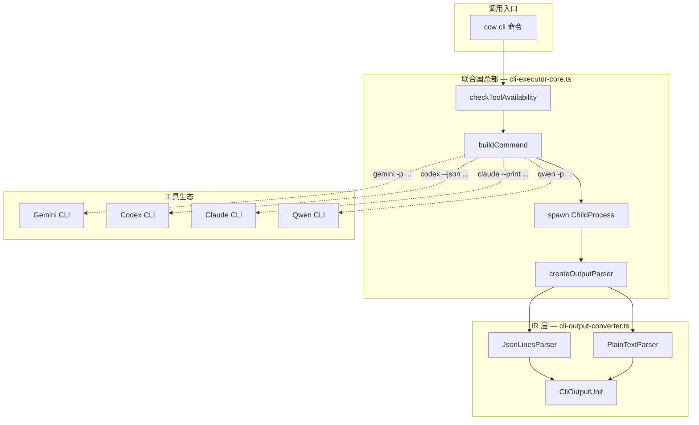
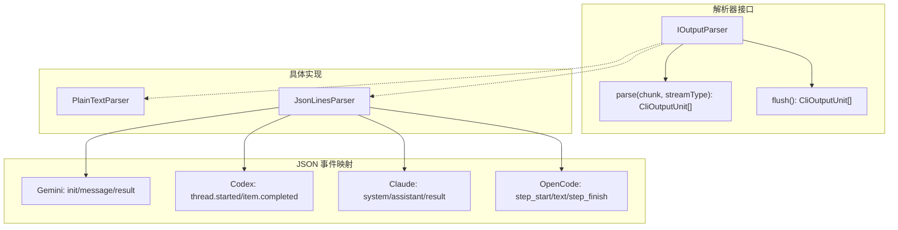
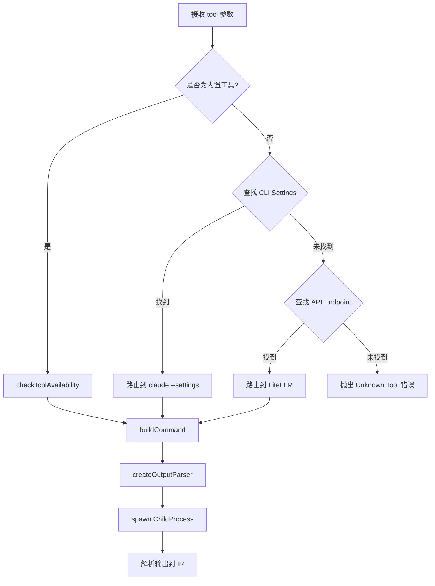

# Chapter 13: 多国联军 — CLI 工具集成架构

> **生命周期阶段**: 工具选择 → 命令构建 → 进程执行 → 输出解析
> **版本追踪**: `docs/.audit-manifest.json`
> **阅读时间**: 45-60 分钟

---

## 序幕：OOM 幽灵的跨国追踪

在 CCW 这座数字城市中，OOM 幽灵的踪迹跨越了多个"国家"的边境：

| 国家 | CLI 工具 | 语言 | 特长 |
|------|----------|------|------|
| **Google 帝国** | Gemini CLI | Go/TypeScript | 快速响应、长上下文 |
| **OpenAI 共和国** | Codex CLI | Rust/TypeScript | 代码生成、文件操作 |
| **阿里王国** | Qwen CLI | Python | 多语言理解 |
| **Anthropic 联邦** | Claude CLI | TypeScript | 安全推理、多模态 |

每个国家都有自己的"官方语言"（输出格式）和"外交礼仪"（命令行参数）。CCW 需要建立一座"联合国总部"——`cli-executor-core.ts`——来协调这支多国联军。

---

## 苏格拉底式思考

> **架构生死战 13**: CCW 需要支持 5+ 种外部 CLI 工具，每种工具有不同的：
> - 输出格式（纯文本、JSON Lines、自定义格式）
> - 命令行参数（`-p` vs `--prompt` vs stdin）
> - 错误处理（退出码含义不同）
> - 会话恢复机制（原生支持 vs 模拟）
>
> 你会设计怎样的"翻译系统"？每种选择都会影响系统的可维护性和扩展性。

---

## 第一幕：失控的边缘 (Out of Control)

### 没有"联合国"的世界

想象一下，如果每个 CLI 工具都需要单独的调用逻辑：

```typescript
// 混乱的早期设计
async function callGemini(prompt: string) {
  const child = spawn('gemini', ['-p', prompt]);
  // 处理纯文本输出...
}

async function callCodex(prompt: string) {
  const child = spawn('codex', ['--json', '-p', prompt]);
  // 处理 JSON 输出...
}

async function callClaude(prompt: string) {
  const child = spawn('claude', ['-p', prompt, '--print']);
  // 处理另一种格式...
}
```

**问题一：输出格式不一致**

```typescript
// Gemini 输出
"I think the best approach is..."  // 纯文本

// Codex 输出
{"type":"agent_message","text":"I think the best approach is..."}  // JSON

// Claude 输出
{"type":"assistant","message":{"content":[{"type":"text","text":"I think..."}]}}  // 嵌套 JSON
```

**问题二：命令参数混乱**

```bash
# Gemini
gemini -p "prompt" --model gemini-2.0-flash

# Codex  
codex -p "prompt" --model gpt-4 --json

# Claude
claude -p "prompt" --model claude-3-sonnet --print
```

**问题三：错误码语义不同**

```
Gemini: exit(0) = 成功
Codex: exit(0) = 成功，但某些情况下 exit(1) 也可能有有效输出
Claude: exit(0) = 成功，exit(130) = 用户中断
```

**问题的本质**：

多 CLI 工具集成的核心挑战不是"调用"本身，而是**标准化**：

```
工具差异层
    ├── 命令构建 (buildCommand)
    ├── 进程管理 (spawn)
    ├── 输出解析 (parser)
    └── 状态追踪 (state)

标准化层 (IR)
    ├── CliOutputUnit
    ├── ExecutionRecord
    └── ConversationRecord
```

---

## 第二幕：思维脉络 (The Neural Link)

### 联合国总部架构



### 核心类型系统：CliOutputUnit

这是整个 IR 层的基石——所有 CLI 工具的输出最终都会转换成这种统一格式：

```typescript
// ccw/src/tools/cli-output-converter.ts

/**
 * 统一输出单元类型
 */
export type CliOutputUnitType =
  | 'stdout'         // 标准输出文本
  | 'stderr'         // 标准错误文本
  | 'thought'        // AI 推理/思考过程
  | 'code'           // 代码块内容
  | 'file_diff'      // 文件修改差异
  | 'progress'       // 进度更新
  | 'metadata'       // 会话/执行元数据
  | 'system'         // 系统事件/消息
  | 'tool_call'      // 工具调用/结果
  | 'agent_message'  // 最终 AI 响应
  | 'streaming_content';  // 流式增量内容

/**
 * 中间表示单元
 */
export interface CliOutputUnit<T = any> {
  type: CliOutputUnitType;
  content: T;
  timestamp: string;  // ISO 8601 格式
}
```

**设计哲学**：

| 原则 | 说明 | 示例 |
|------|------|------|
| **类型安全** | 每种输出都有明确的类型标记 | `{type: 'agent_message', content: '...'}` |
| **时间戳** | 每个单元都有时间戳，便于排序和调试 | `timestamp: '2025-02-17T10:30:00Z'` |
| **泛型内容** | content 可以是字符串或结构化对象 | `{type: 'tool_call', content: {tool: 'bash', ...}}` |

### 工具路由机制

```typescript
// ccw/src/tools/cli-executor-core.ts (关键片段)

// 内置 CLI 工具列表
const BUILTIN_CLI_TOOLS = ['gemini', 'qwen', 'codex', 'opencode', 'claude'] as const;

async function executeCliTool(
  params: Record<string, unknown>,
  onOutput?: ((unit: CliOutputUnit) => void) | null
): Promise<ExecutionOutput> {
  const { tool, prompt, mode, model, cd, includeDirs, resume, ... } = parsed.data;

  // 1. 检查工具是否可用
  const toolStatus = await checkToolAvailability(tool);
  if (!toolStatus.available) {
    throw new Error(`CLI tool not available: ${tool}`);
  }

  // 2. 判断是否为内置工具
  const isBuiltinTool = BUILTIN_CLI_TOOLS.includes(tool as BuiltinCliTool);
  
  if (!isBuiltinTool) {
    // 3. 检查是否为 CLI 封装端点
    const cliSettings = findEndpoint(tool);
    if (cliSettings && cliSettings.enabled) {
      // 路由到 Claude CLI with --settings
      return await executeClaudeWithSettings({...});
    }

    // 4. 检查是否为 API 端点
    const apiEndpointTool = Object.entries(cliToolsConfig.tools).find(...);
    if (apiEndpointTool) {
      // 路由到 LiteLLM
      return await executeLiteLLMEndpoint({...});
    }

    throw new Error(`Unknown tool: ${tool}`);
  }

  // 5. 构建命令
  const { command, args, useStdin, outputFormat } = buildCommand({
    tool,
    prompt: finalPrompt,
    mode,
    model: effectiveModel,
    dir: cd,
    include: includeDirs,
    nativeResume: nativeResumeConfig,
    ...
  });

  // 6. 创建输出解析器
  const parser = createOutputParser(outputFormat);

  // 7. 启动子进程
  const child = spawn(commandToSpawn, argsToSpawn, {
    cwd: workingDir,
    shell: isWindows,
    stdio: [useStdin ? 'pipe' : 'ignore', 'pipe', 'pipe'],
    env: spawnEnv
  });

  // 8. 解析输出到 IR
  child.stdout!.on('data', (data: Buffer) => {
    const units = parser.parse(data, 'stdout');
    allOutputUnits.push(...units);
    if (onOutput) {
      for (const unit of units) {
        onOutput(unit);
      }
    }
  });
}
```

### 命令构建策略

不同工具需要不同的命令行参数，`buildCommand` 函数负责将统一参数转换为工具特定格式：

```typescript
// ccw/src/tools/cli-executor-utils.ts

export function buildCommand(options: BuildCommandOptions): {
  command: string;
  args: string[];
  useStdin: boolean;
  outputFormat: 'text' | 'json-lines';
} {
  const { tool, prompt, mode, model, dir, include, nativeResume, reviewOptions } = options;

  switch (tool) {
    case 'gemini':
      return {
        command: 'gemini',
        args: buildGeminiArgs(prompt, model, dir, include, nativeResume),
        useStdin: false,
        outputFormat: 'json-lines'  // Gemini 支持 --output-format json
      };

    case 'codex':
      return {
        command: 'codex',
        args: buildCodexArgs(prompt, mode, model, dir, reviewOptions),
        useStdin: false,
        outputFormat: 'json-lines'  // Codex 支持 --json
      };

    case 'claude':
      return {
        command: 'claude',
        args: buildClaudeArgs(prompt, mode, model, dir, nativeResume),
        useStdin: false,
        outputFormat: 'json-lines'  // Claude 支持 --output-format stream-json
      };

    case 'qwen':
      return {
        command: 'qwen',
        args: buildQwenArgs(prompt, model, dir),
        useStdin: true,  // Qwen 使用 stdin 传递 prompt
        outputFormat: 'text'
      };

    default:
      throw new Error(`Unknown tool: ${tool}`);
  }
}
```

---

## 第三幕：社交网络 (The Social Network)

### 输出解析器家族



### JsonLinesParser — 多语言翻译官

这是整个系统的核心翻译组件，能够理解 5 种不同的"方言"：

```typescript
// ccw/src/tools/cli-output-converter.ts

class JsonLinesParser implements IOutputParser {
  private buffer: string = '';

  private mapJsonToIR(json: any, fallbackStreamType: 'stdout' | 'stderr'): CliOutputUnit | null {
    // ========== Gemini CLI stream-json 格式 ==========
    if (json.type === 'init' && json.session_id) {
      return {
        type: 'metadata',
        content: { tool: 'gemini', sessionId: json.session_id, model: json.model, raw: json },
        timestamp
      };
    }

    if (json.type === 'message' && json.role === 'assistant') {
      if (json.delta === true) {
        return { type: 'streaming_content', content: json.content, timestamp };
      }
      return { type: 'agent_message', content: json.content, timestamp };
    }

    // ========== Codex CLI --json 格式 ==========
    if (json.type === 'thread.started' && json.thread_id) {
      return {
        type: 'metadata',
        content: { tool: 'codex', threadId: json.thread_id, raw: json },
        timestamp
      };
    }

    if (json.type === 'item.completed' && json.item) {
      const item = json.item;
      if (item.type === 'agent_message') {
        return { type: 'agent_message', content: item.text, timestamp };
      }
      if (item.type === 'reasoning') {
        return { type: 'thought', content: item.text, timestamp };
      }
      if (item.type === 'command_execution') {
        return {
          type: 'code',
          content: { command: item.command, output: item.aggregated_output, exitCode: item.exit_code },
          timestamp
        };
      }
    }

    // ========== Claude CLI stream-json 格式 ==========
    if (json.type === 'system' && json.subtype === 'init') {
      return {
        type: 'metadata',
        content: { tool: 'claude', sessionId: json.session_id, model: json.model, cwd: json.cwd },
        timestamp
      };
    }

    if (json.type === 'assistant' && json.message) {
      const textContent = json.message.content
        ?.filter((c: any) => c.type === 'text')
        .map((c: any) => c.text)
        .join('\n') || '';
      return { type: 'agent_message', content: textContent, timestamp };
    }

    // ========== OpenCode CLI --format json ==========
    if (json.type === 'text' && json.part) {
      return { type: 'agent_message', content: json.part.text, timestamp };
    }

    // ... 其他格式处理 ...
  }
}
```

### 工具路由决策树



### 工具注册表

```typescript
// ccw/src/tools/cli-executor-core.ts

// 工具类型定义
type ToolType = 'builtin' | 'cli-wrapper' | 'api-endpoint';

// 工具状态检查
async function getCliToolsStatus(): Promise<Record<string, ToolAvailability>> {
  const builtInTools = ['gemini', 'qwen', 'codex', 'claude', 'opencode'];
  
  for (const toolInfo of toolsInfo) {
    const { name, type, enabled, id } = toolInfo;

    if (type === 'cli-wrapper') {
      // 检查 CLI Settings 配置是否存在
      const endpoint = findEndpoint(name);
      results[name] = {
        available: !!(endpoint && endpoint.enabled),
        path: endpoint ? `cli-settings:${endpoint.id}` : null
      };
    } else if (type === 'api-endpoint') {
      // 检查 LiteLLM 端点配置是否存在
      const litellmEndpoint = findEndpointById(configBaseDir, id || name);
      results[name] = {
        available: !!(litellmEndpoint && enabled !== false),
        path: litellmEndpoint ? `litellm:${id}` : null
      };
    } else {
      // 内置工具：检查系统 PATH 可用性
      results[name] = await checkToolAvailability(name);
    }
  }

  return results;
}
```

---

## 第四幕：造物主的私语 (The Creator's Secret)

### 秘密一：为什么需要 IR 层？

**表面原因**：统一不同 CLI 的输出格式

**真正原因**：**解耦**

```
没有 IR 层：
  View (终端显示) ←→ Codex JSON
  View (终端显示) ←→ Gemini Text
  View (终端显示) ←→ Claude JSON
  Storage (历史) ←→ Codex JSON
  Storage (历史) ←→ Gemini Text
  ...
  → N × M 种组合

有 IR 层：
  View → CliOutputUnit ← Codex Parser
  View → CliOutputUnit ← Gemini Parser
  Storage → CliOutputUnit ← Claude Parser
  ...
  → N + M 种组合
```

### 秘密二：为什么 `agent_message` 是特殊的？

在 `CliOutputUnitType` 中，`agent_message` 有特殊地位：

```typescript
// 用于 --final 标志，只输出 AI 的最终响应
const computedFinalOutput = flattenOutputUnits(allOutputUnits, {
  includeTypes: ['agent_message'],  // 只取 agent_message
  stripCommandJsonBlocks: true      // 移除嵌入的命令执行 JSON
});
```

**设计意图**：

| 类型 | 用途 | 是否在 --final 中显示 |
|------|------|----------------------|
| `agent_message` | AI 最终回答 | 是 |
| `streaming_content` | 流式增量 | 合并后升级为 agent_message |
| `thought` | 推理过程 | 否 |
| `tool_call` | 工具调用 | 否 |
| `code` | 命令执行 | 否 |

### 秘密三：Transaction ID 的妙用

```typescript
// 生成唯一事务 ID
export function generateTransactionId(conversationId: string): TransactionId {
  const uniquePart = crypto.randomUUID().slice(0, 8);
  return `ccw-tx-${conversationId}-${uniquePart}`;
}

// 注入到 prompt 中
export function injectTransactionId(prompt: string, txId: TransactionId): string {
  return `[CCW-TX-ID: ${txId}]\n\n${prompt}`;
}
```

**用途**：在并发会话恢复场景中，精确匹配当前会话，避免"串台"。

---

## 第五幕：进化的插槽 (The Upgrade)

### 插槽一：新增 CLI 工具

**场景**：需要支持新的 CLI 工具（如 `aider`）

**步骤**：

1. 在 `BUILTIN_CLI_TOOLS` 中添加工具名
2. 在 `buildCommand` 中添加 `case 'aider':` 分支
3. 在 `JsonLinesParser.mapJsonToIR` 中添加格式映射
4. 更新 `CLI_TOOL_PACKAGES` 添加 npm 包名

```typescript
// 步骤 1
const BUILTIN_CLI_TOOLS = ['gemini', 'qwen', 'codex', 'opencode', 'claude', 'aider'] as const;

// 步骤 2
case 'aider':
  return {
    command: 'aider',
    args: ['--message', prompt, '--json'],
    useStdin: false,
    outputFormat: 'json-lines'
  };

// 步骤 3
if (json.type === 'aider_response' && json.content) {
  return { type: 'agent_message', content: json.content, timestamp };
}
```

### 插槽二：自定义输出格式

**场景**：某个 CLI 工具有独特的输出格式

**方案**：实现新的 `IOutputParser`

```typescript
// 新增解析器
class CustomFormatParser implements IOutputParser {
  parse(chunk: Buffer, streamType: 'stdout' | 'stderr'): CliOutputUnit[] {
    // 自定义解析逻辑
    const text = chunk.toString();
    const units: CliOutputUnit[] = [];
    
    // 解析自定义格式...
    // 转换为 CliOutputUnit...
    
    return units;
  }

  flush(): CliOutputUnit[] {
    return [];
  }
}

// 在工厂函数中注册
export function createOutputParser(format: 'text' | 'json-lines' | 'custom'): IOutputParser {
  switch (format) {
    case 'custom':
      return new CustomFormatParser();
    // ...
  }
}
```

### 插槽三：流式处理优化

**场景**：大输出需要实时处理

**方案**：利用 `onOutput` 回调

```typescript
const result = await executeCliTool(params, (unit: CliOutputUnit) => {
  if (unit.type === 'streaming_content') {
    // 实时显示
    process.stdout.write(unit.content);
  } else if (unit.type === 'agent_message') {
    // 完成后处理
    handleCompleteMessage(unit.content);
  }
});
```

---

## 🔰 破案线索档案 #13

> **本章发现**: CCW 通过 IR 层（CliOutputUnit）统一了 5+ 种 CLI 工具的输出格式
> **关联资产**:
> - `ccw/src/tools/cli-executor-core.ts` — 工具路由核心
> - `ccw/src/tools/cli-output-converter.ts` — IR 层定义
> - `ccw/src/tools/cli-executor-utils.ts` — 命令构建器
> **下一章预告**: OOM 幽灵的语义追踪 — SPLADE 稀疏编码与 HDBSCAN 密度聚类...

**调查进度**: █████████░ 65%

> **思考题**: 如果你要设计一个支持插件式扩展的 CLI 工具系统，你会选择：
> - 配置驱动（JSON/YAML 定义工具格式）
> - 代码驱动（每个工具一个 TypeScript 模块）
> - 混合模式（配置定义基础，代码处理特殊逻辑）
>
> 每种选择的可维护性如何？

---

## 附录：事故复盘档案

### 案例 #1：CLI 工具输出格式不一致导致的解析失败

**时间线**：
- 2024-03-15 10:23: Gemini CLI 更新，`message` 事件中的 `content` 字段变为 `delta` 模式
- 10:25: CCW 用户报告"输出显示重复"
- 10:30: 排查发现 JsonLinesParser 未处理 cumulative vs delta 差异

**根因分析**：
```typescript
// 旧版本：直接使用 content
if (json.type === 'message') {
  return { type: 'agent_message', content: json.content };
}

// 问题：当 delta=true 时，content 是累积的而非增量
// 导致：每次收到 delta 都输出完整内容，造成重复
```

**修复方案**：
```typescript
// 新版本：区分 delta 和 non-delta
if (json.type === 'message' && json.role === 'assistant') {
  if (json.delta === true) {
    // 处理累积模式的 delta
    if (content.startsWith(this.geminiAssistantCumulative)) {
      const delta = content.slice(this.geminiAssistantCumulative.length);
      this.geminiAssistantCumulative = content;
      return { type: 'streaming_content', content: delta, timestamp };
    }
    // ...
  }
  return { type: 'agent_message', content: json.content, timestamp };
}
```

**教训**：
1. CLI 工具的输出格式可能随时变化
2. 需要明确区分"增量"和"累积"两种流式模式
3. IR 层设计需要考虑版本兼容性

---

## 附录：完整代码参考

### A. 工具可用性检查

```typescript
// 文件: ccw/src/tools/cli-executor-utils.ts

export async function checkToolAvailability(tool: string): Promise<ToolAvailability> {
  // 检查缓存
  if (toolAvailabilityCache.has(tool)) {
    const cached = toolAvailabilityCache.get(tool)!;
    // 缓存有效期 5 分钟
    if (Date.now() - cached.checkedAt < 5 * 60 * 1000) {
      return { available: cached.available, path: cached.path };
    }
  }

  return new Promise((resolve) => {
    const isWindows = process.platform === 'win32';
    const command = isWindows ? 'where' : 'which';
    
    const child = spawn(command, [tool], {
      shell: isWindows,
      timeout: 5000
    });

    let stdout = '';
    child.stdout?.on('data', (data) => { stdout += data.toString(); });

    child.on('close', (code) => {
      const available = code === 0;
      const path = available ? stdout.trim().split('\n')[0] : null;

      // 更新缓存
      toolAvailabilityCache.set(tool, { available, path, checkedAt: Date.now() });

      resolve({ available, path });
    });

    child.on('error', () => {
      resolve({ available: false, path: null });
    });
  });
}
```

### B. 命令构建示例 (Gemini)

```typescript
// 文件: ccw/src/tools/cli-executor-utils.ts

function buildGeminiArgs(
  prompt: string,
  model?: string,
  dir?: string,
  include?: string,
  nativeResume?: NativeResumeConfig
): string[] {
  const args: string[] = [];

  // 输出格式
  args.push('--output-format', 'json');

  // 模型选择
  if (model) {
    args.push('--model', model);
  }

  // 工作目录
  if (dir) {
    args.push('--cd', dir);
  }

  // 包含目录
  if (include) {
    const dirs = include.split(',').map(d => d.trim());
    for (const d of dirs) {
      args.push('--include-directories', d);
    }
  }

  // 原生恢复
  if (nativeResume?.enabled) {
    if (nativeResume.isLatest) {
      args.push('--resume');
    } else if (nativeResume.sessionId) {
      args.push('--resume', nativeResume.sessionId);
    }
  }

  // Prompt
  args.push('-p', prompt);

  return args;
}
```

---

*版本: 1.0.0*
*会话: ANL-ccw-architecture-audit-2025-02-17*
*风格: "多国联军"叙事*
