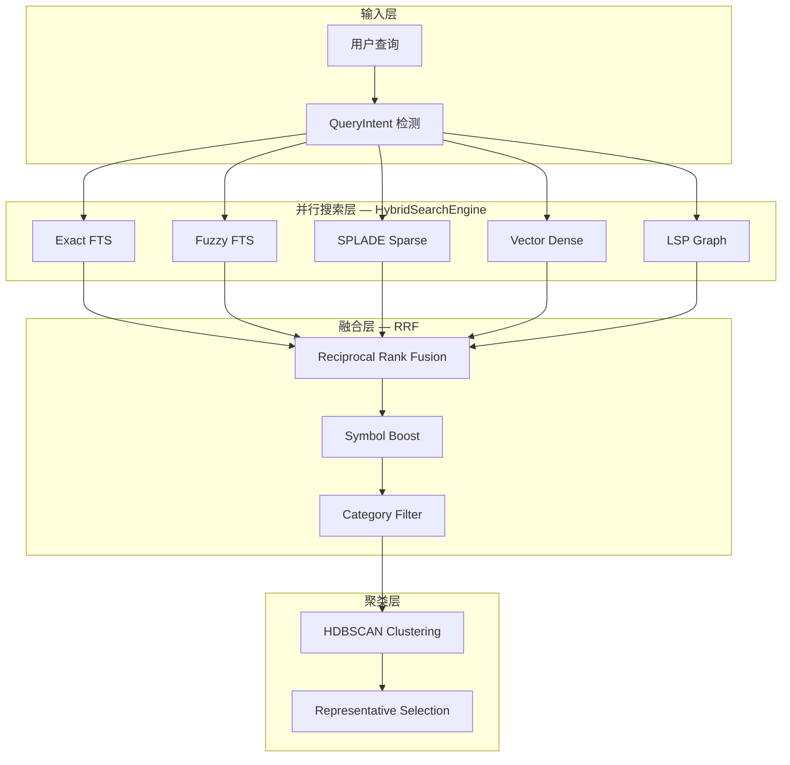
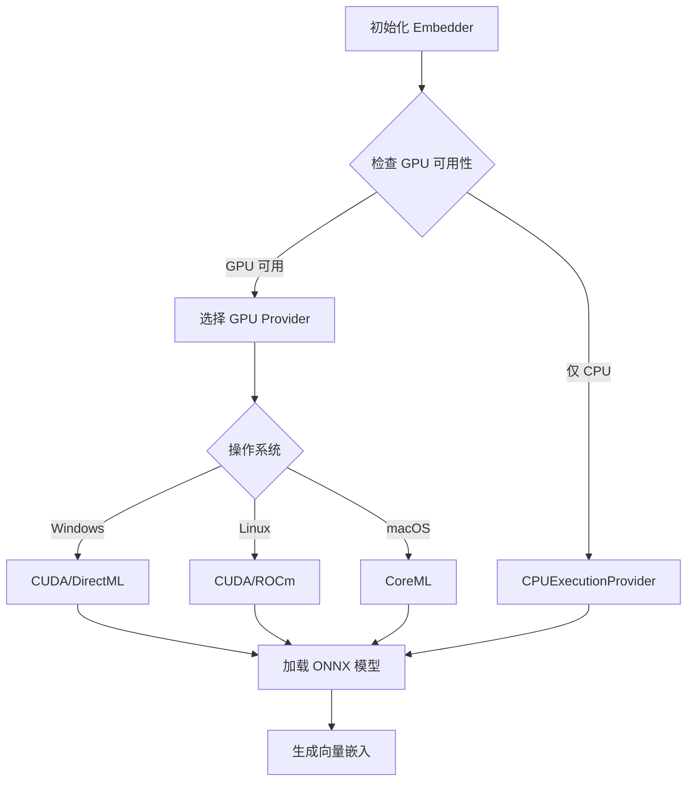
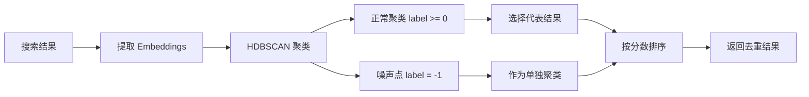
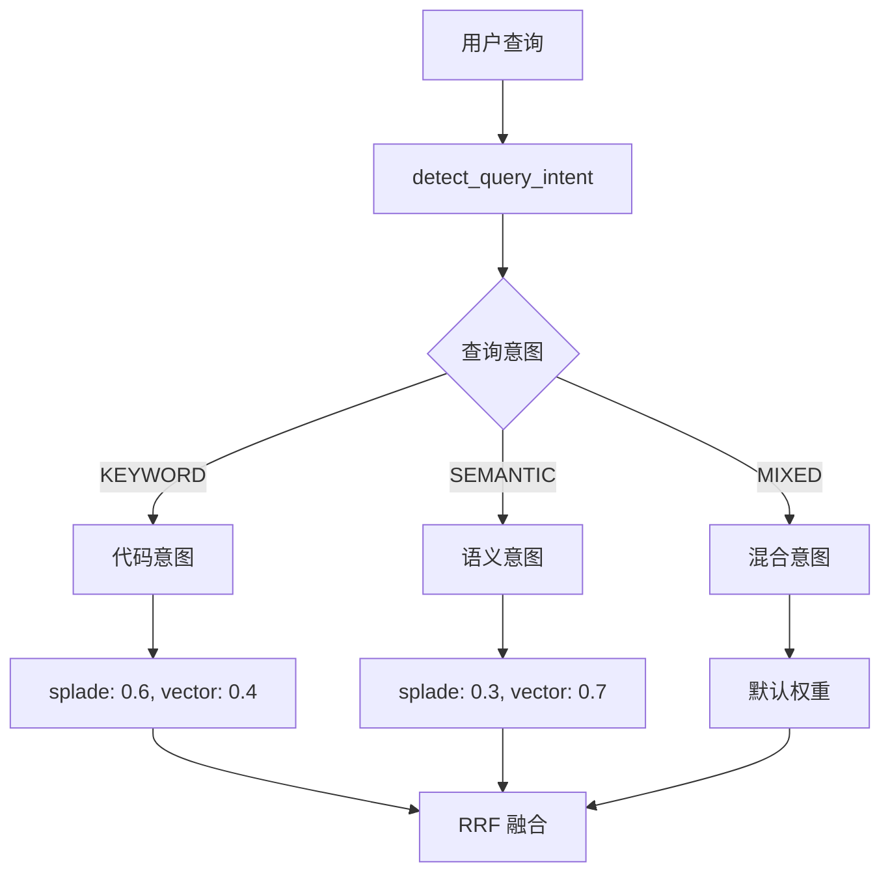

# Chapter 14: 语义追踪者 — CodexLens 搜索系统

> **生命周期阶段**: 查询解析 → 并行搜索 → RRF 融合 → 聚类去重
> **版本追踪**: `docs/.audit-manifest.json`
> **阅读时间**: 55-70 分钟

---

## 序幕：OOM 幽灵的语义指纹

在 CCW 这座数字城市中，OOM 幽灵留下的痕迹不仅是代码和日志，还有**语义指纹**——那些隐藏在代码含义中的线索：

| 搜索方式 | 原理 | 擅长捕获 |
|----------|------|----------|
| **FTS (全文搜索)** | 关键词匹配 | 精确函数名、变量名 |
| **SPLADE (稀疏神经)** | 稀疏词汇扩展 | 同义词、相关概念 |
| **Vector (向量搜索)** | 语义相似度 | 自然语言描述、代码意图 |
| **LSP Graph (图扩展)** | 代码引用关系 | 调用链、依赖关系 |

CodexLens 的 `HybridSearchEngine` 是追踪这些语义指纹的核心引擎。

---

## 苏格拉底式思考

> **架构生死战 14**: 用户搜索 "内存泄漏怎么修复"，期望找到：
> - 直接包含 "内存泄漏" 的代码注释
> - 调用 `free()`、`delete`、`GC.collect()` 的清理逻辑
> - 与内存管理相关的工具类
>
> 单一搜索方式无法满足所有需求。你会如何设计一个**混合搜索系统**？每种选择都会影响召回率和精确度的平衡。

---

## 第一幕：失控的边缘 (Out of Control)

### 单一搜索的局限性

**场景一：FTS 的盲区**

```sql
-- FTS 查询
SELECT * FROM code WHERE content MATCH 'memory leak';

-- 问题：找不到以下代码
def cleanup_resources():  # 没有直接出现 "memory leak"
    """释放所有占用的内存资源"""
    for item in cache:
        del item
```

**场景二：向量搜索的歧义**

```python
# 向量搜索 "内存泄漏"
# 可能返回：
def memory_game():
    """一个记忆卡片游戏"""  # 语义相似，但无关
    pass
```

**场景三：缺少上下文**

```python
# FTS 找到了这个函数
def process_data(data):
    # 但不知道谁调用了它，也不知道它调用了谁
    return transform(data)
```

**问题的本质**：

搜索系统面临的**三角困境**：

```
          召回率 (Recall)
              /\
             /  \
            /    \
精确度 ←-------→ 覆盖范围 (Coverage)
       (Precision)
```

---

## 第二幕：思维脉络 (The Neural Link)

### 混合搜索架构



### Embedder 模型选择流程



### HDBSCAN 聚类流程



### 查询意图与权重调整



### Embedder 模型配置

CodexLens 支持多种嵌入模型，每种有不同的特点和适用场景：

```python
# codex-lens/src/codexlens/semantic/embedder.py

class Embedder(BaseEmbedder):
    """Generate embeddings for code chunks using fastembed (ONNX-based).

    Supported Model Profiles:
    - fast: BAAI/bge-small-en-v1.5 (384 dim) - Fast, lightweight, English-optimized
    - code: jinaai/jina-embeddings-v2-base-code (768 dim) - Code-optimized
    - multilingual: intfloat/multilingual-e5-large (1024 dim) - Multilingual + code
    - balanced: mixedbread-ai/mxbai-embed-large-v1 (1024 dim) - High accuracy
    """

    MODELS = {
        "fast": "BAAI/bge-small-en-v1.5",           # 384 dim
        "code": "jinaai/jina-embeddings-v2-base-code",  # 768 dim
        "multilingual": "intfloat/multilingual-e5-large",  # 1024 dim
        "balanced": "mixedbread-ai/mxbai-embed-large-v1",  # 1024 dim
    }

    MODEL_DIMS = {
        "BAAI/bge-small-en-v1.5": 384,
        "jinaai/jina-embeddings-v2-base-code": 768,
        "intfloat/multilingual-e5-large": 1024,
        "mixedbread-ai/mxbai-embed-large-v1": 1024,
    }
```

**模型选择策略**：

| 场景 | 推荐模型 | 原因 |
|------|----------|------|
| 实时搜索 | `fast` | 384 维，延迟最低 |
| 代码搜索 | `code` | 768 维，代码语义理解最强 |
| 多语言项目 | `multilingual` | 1024 维，支持中英日韩等 |
| 高精度需求 | `balanced` | 1024 维，综合表现最佳 |

### GPU 加速支持

```python
# codex-lens/src/codexlens/semantic/gpu_support.py

def get_optimal_providers(use_gpu: bool = True, with_device_options: bool = False) -> List[str]:
    """Get optimal ONNX execution providers based on available hardware.
    
    Provider Priority:
    1. CUDA (NVIDIA GPU)
    2. TensorRT (NVIDIA GPU, optimized)
    3. DirectML (Windows GPU)
    4. ROCm (AMD GPU)
    5. CoreML (Apple Silicon)
    6. CPU (fallback)
    """
    if not use_gpu:
        return ['CPUExecutionProvider']
    
    providers = []
    
    # 检测可用的 GPU 提供者
    available = ort.get_available_providers()
    
    if 'CUDAExecutionProvider' in available:
        providers.append('CUDAExecutionProvider')
    if 'TensorrtExecutionProvider' in available:
        providers.append('TensorrtExecutionProvider')
    if 'DmlExecutionProvider' in available:  # Windows DirectML
        providers.append('DmlExecutionProvider')
    if 'ROCMExecutionProvider' in available:  # AMD ROCm
        providers.append('ROCMExecutionProvider')
    if 'CoreMLExecutionProvider' in available:  # Apple Silicon
        providers.append('CoreMLExecutionProvider')
    
    # 总是添加 CPU 作为后备
    providers.append('CPUExecutionProvider')
    
    return providers
```

---

## 第三幕：社交网络 (The Social Network)

### HybridSearchEngine — 并行搜索协调器

```python
# codex-lens/src/codexlens/search/hybrid_search.py

class HybridSearchEngine:
    """Hybrid search engine with parallel execution and RRF fusion.

    Orchestrates searches across exact FTS, fuzzy FTS, and optional vector backends,
    executing them in parallel and fusing results via Reciprocal Rank Fusion.
    """

    def __init__(
        self,
        weights: Optional[Dict[str, float]] = None,
        config: Optional[Config] = None,
        embedder: Any = None,
    ):
        self.weights = weights or DEFAULT_WEIGHTS.copy()
        self._config = config
        self.embedder = embedder

    def search(
        self,
        index_path: Path,
        query: str,
        limit: int = 20,
        enable_fuzzy: bool = True,
        enable_vector: bool = False,
        pure_vector: bool = False,
        enable_splade: bool = False,
        enable_lsp_graph: bool = False,
    ) -> List[SearchResult]:
        """Execute hybrid search with parallel retrieval and RRF fusion."""
        
        # 1. 检测查询意图
        query_intent = detect_query_intent(query)
        
        # 2. 确定使用哪些后端
        backends = self._determine_backends(
            enable_fuzzy, enable_vector, pure_vector, enable_splade, enable_lsp_graph
        )
        
        # 3. 并行执行搜索
        results_map = self._search_parallel(index_path, query, backends, limit)
        
        # 4. RRF 融合
        adaptive_weights = get_rrf_weights(query, self._get_active_weights(results_map))
        fused_results = reciprocal_rank_fusion(results_map, adaptive_weights, k=60)
        
        # 5. Symbol Boost
        fused_results = apply_symbol_boost(fused_results, boost_factor=1.5)
        
        # 6. 分类过滤
        fused_results = filter_results_by_category(fused_results, query_intent)
        
        return fused_results[:limit]
```

### 并行搜索实现

```python
def _search_parallel(
    self,
    index_path: Path,
    query: str,
    backends: Dict[str, bool],
    limit: int,
) -> Dict[str, List[SearchResult]]:
    """Execute parallel searches across enabled backends."""
    results_map: Dict[str, List[SearchResult]] = {}
    
    # 使用 ThreadPoolExecutor 进行并行 I/O 密集搜索
    with ThreadPoolExecutor(max_workers=len(backends)) as executor:
        future_to_source = {}
        
        if backends.get("exact"):
            future = executor.submit(self._search_exact, index_path, query, limit)
            future_to_source[future] = "exact"
        
        if backends.get("fuzzy"):
            future = executor.submit(self._search_fuzzy, index_path, query, limit)
            future_to_source[future] = "fuzzy"
        
        if backends.get("vector"):
            future = executor.submit(self._search_vector, index_path, query, limit, category)
            future_to_source[future] = "vector"
        
        if backends.get("splade"):
            future = executor.submit(self._search_splade, index_path, query, limit)
            future_to_source[future] = "splade"
        
        if backends.get("lsp_graph"):
            future = executor.submit(self._search_lsp_graph, index_path, query, limit)
            future_to_source[future] = "lsp_graph"
        
        # 收集结果，带超时保护
        for future in as_completed(future_to_source, timeout=30.0):
            source = future_to_source[future]
            try:
                results = future.result(timeout=10.0)
                results_map[source] = tag_search_source(results, source)
            except Exception as exc:
                self.logger.error("Search failed for %s: %s", source, exc)
                results_map[source] = []
    
    return results_map
```

### RRF 融合算法

```python
# codex-lens/src/codexlens/search/ranking.py

def reciprocal_rank_fusion(
    results_map: Dict[str, List[SearchResult]],
    weights: Dict[str, float] = None,
    k: int = 60,
) -> List[SearchResult]:
    """Combine search results from multiple sources using Reciprocal Rank Fusion.

    RRF formula: score(d) = Σ weight_source / (k + rank_source(d))
    """
    if not results_map:
        return []

    # 默认等权重
    if weights is None:
        weights = {source: 1.0 / len(results_map) for source in results_map}

    # 构建统一结果集
    path_to_result: Dict[str, SearchResult] = {}
    path_to_fusion_score: Dict[str, float] = {}
    path_to_source_ranks: Dict[str, Dict[str, int]] = {}

    for source_name, results in results_map.items():
        weight = weights.get(source_name, 0.0)
        if weight == 0:
            continue

        for rank, result in enumerate(results, start=1):
            path = result.path
            rrf_contribution = weight / (k + rank)

            if path not in path_to_fusion_score:
                path_to_fusion_score[path] = 0.0
                path_to_result[path] = result
                path_to_source_ranks[path] = {}

            path_to_fusion_score[path] += rrf_contribution
            path_to_source_ranks[path][source_name] = rank

    # 创建融合结果
    fused_results = []
    for path, base_result in path_to_result.items():
        fusion_score = path_to_fusion_score[path]

        fused_result = SearchResult(
            path=base_result.path,
            score=fusion_score,
            excerpt=base_result.excerpt,
            content=base_result.content,
            metadata={
                **base_result.metadata,
                "fusion_method": "rrf",
                "fusion_score": fusion_score,
                "source_ranks": path_to_source_ranks[path],
            },
        )
        fused_results.append(fused_result)

    # 按融合分数降序排列
    fused_results.sort(key=lambda r: r.score, reverse=True)

    return fused_results
```

---

## 第四幕：造物主的私语 (The Creator's Secret)

### 秘密一：向量化 — 代码如何变成数字

**向量嵌入的数学原理**：

给定两个向量 $\mathbf{A}$ 和 $\mathbf{B}$，余弦相似度计算公式：

$$\text{similarity} = \cos(\theta) = \frac{\mathbf{A} \cdot \mathbf{B}}{\|\mathbf{A}\| \|\mathbf{B}\|} = \frac{\sum_{i=1}^{n} A_i B_i}{\sqrt{\sum_{i=1}^{n} A_i^2} \sqrt{\sum_{i=1}^{n} B_i^2}}$$

**代码示例**：

```python
def cosine_similarity(vec_a: List[float], vec_b: List[float]) -> float:
    n = min(len(vec_a), len(vec_b))
    if n == 0:
        return 0.0
    
    dot = 0.0
    norm_a = 0.0
    norm_b = 0.0
    
    for i in range(n):
        a = float(vec_a[i])
        b = float(vec_b[i])
        dot += a * b
        norm_a += a * a
        norm_b += b * b
    
    if norm_a <= 0.0 or norm_b <= 0.0:
        return 0.0
    
    return dot / (math.sqrt(norm_a) * math.sqrt(norm_b))
```

### 秘密二：SPLADE — 稀疏词汇扩展

**SPLADE 激活函数**：

$$\text{SPLADE}(x) = \log(1 + \text{ReLU}(W_x)) \odot M$$

其中：
- $W_x$ 是 MLM (Masked Language Model) 的 logits 输出
- $M$ 是注意力掩码
- $\odot$ 是逐元素乘法

```python
# codex-lens/src/codexlens/semantic/splade_encoder.py

@staticmethod
def _splade_activation(logits: Any, attention_mask: Any) -> Any:
    """Apply SPLADE activation function to model outputs.

    Formula: log(1 + ReLU(logits)) * attention_mask
    """
    import numpy as np

    # ReLU 激活
    relu_logits = np.maximum(0, logits)

    # Log(1 + x) 变换
    log_relu = np.log1p(relu_logits)

    # 应用注意力掩码
    mask_expanded = np.expand_dims(attention_mask, axis=-1)
    splade_repr = log_relu * mask_expanded

    return splade_repr

@staticmethod
def _max_pooling(splade_repr: Any) -> Any:
    """Max pooling over sequence length dimension."""
    import numpy as np
    return np.max(splade_repr, axis=1)
```

**SPLADE vs BM25**：

| 特性 | BM25 | SPLADE |
|------|------|--------|
| 词汇匹配 | 精确 | 扩展（同义词、相关词） |
| 计算开销 | 低 | 中（需要神经网络） |
| 可解释性 | 高 | 中（可查看扩展词权重） |
| 多语言 | 差 | 好（基于预训练模型） |

### 秘密三：HDBSCAN — 密度聚类

**为什么选择 HDBSCAN 而非 K-Means**：

| 特性 | K-Means | HDBSCAN |
|------|---------|---------|
| 聚类数量 | 需要预先指定 | 自动确定 |
| 形状 | 只能识别球形 | 任意形状 |
| 噪声处理 | 所有点必须属于某类 | 自动识别噪声点 |
| 参数敏感度 | 高 | 低 |

```python
# codex-lens/src/codexlens/search/clustering/hdbscan_strategy.py

class HDBSCANStrategy(BaseClusteringStrategy):
    """HDBSCAN-based clustering strategy.

    HDBSCAN is preferred over DBSCAN because it:
    - Automatically determines the number of clusters
    - Handles varying density clusters well
    - Identifies noise points (outliers) effectively
    """

    def cluster(
        self,
        embeddings: np.ndarray,
        results: List[SearchResult],
    ) -> List[List[int]]:
        """Cluster search results using HDBSCAN algorithm."""
        import hdbscan

        n_results = len(results)
        if n_results < self.config.min_cluster_size:
            # 结果太少，每个作为单独的聚类
            return [[i] for i in range(n_results)]

        # 配置 HDBSCAN
        clusterer = hdbscan.HDBSCAN(
            min_cluster_size=self.config.min_cluster_size,
            min_samples=self.config.min_samples,
            metric=self.config.metric,  # 通常是 'cosine'
            cluster_selection_epsilon=self.config.cluster_selection_epsilon,
            allow_single_cluster=self.config.allow_single_cluster,
        )

        # 拟合并获取聚类标签
        # Labels: -1 = noise, 0+ = cluster index
        labels = clusterer.fit_predict(embeddings)

        # 按标签分组
        cluster_map: Dict[int, List[int]] = {}
        for idx, label in enumerate(labels):
            if label not in cluster_map:
                cluster_map[label] = []
            cluster_map[label].append(idx)

        # 构建结果：正常聚类在前，噪声点作为单独聚类在后
        clusters: List[List[int]] = []
        
        for label in sorted(cluster_map.keys()):
            if label >= 0:
                clusters.append(cluster_map[label])
        
        # 噪声点作为单独聚类
        if -1 in cluster_map:
            for idx in cluster_map[-1]:
                clusters.append([idx])

        return clusters

    def select_representatives(
        self,
        clusters: List[List[int]],
        results: List[SearchResult],
    ) -> List[SearchResult]:
        """Select representative results from each cluster.
        
        选择每个聚类中分数最高的结果作为代表。
        """
        representatives: List[SearchResult] = []

        for cluster_indices in clusters:
            if not cluster_indices:
                continue

            # 找到聚类中分数最高的结果
            best_idx = max(cluster_indices, key=lambda i: results[i].score)
            representatives.append(results[best_idx])

        # 按分数降序排列
        representatives.sort(key=lambda r: r.score, reverse=True)

        return representatives
```

---

## 第五幕：进化的插槽 (The Upgrade)

### 插槽一：自定义 Embedder

**场景**：需要使用特定的嵌入模型

**方案**：实现 `BaseEmbedder` 接口

```python
from codexlens.semantic.base import BaseEmbedder

class CustomEmbedder(BaseEmbedder):
    def __init__(self, model_path: str):
        self.model = load_custom_model(model_path)
    
    @property
    def embedding_dim(self) -> int:
        return 512
    
    def embed(self, texts: List[str]) -> List[List[float]]:
        return [self.model.encode(t).tolist() for t in texts]
    
    def embed_single(self, text: str) -> List[float]:
        return self.model.encode(text).tolist()
```

### 插槽二：新增聚类策略

**场景**：需要不同的聚类算法

**方案**：实现 `BaseClusteringStrategy` 接口

```python
from codexlens.search.clustering.base import BaseClusteringStrategy, ClusteringConfig

class AgglomerativeStrategy(BaseClusteringStrategy):
    """Agglomerative hierarchical clustering strategy."""
    
    def cluster(
        self,
        embeddings: np.ndarray,
        results: List[SearchResult],
    ) -> List[List[int]]:
        from sklearn.cluster import AgglomerativeClustering
        
        n_clusters = min(self.config.n_clusters, len(results))
        clusterer = AgglomerativeClustering(
            n_clusters=n_clusters,
            metric='cosine',
            linkage='average'
        )
        
        labels = clusterer.fit_predict(embeddings)
        
        # 按标签分组...
        return clusters
```

### 插槽三：Reranker 二阶段重排

**场景**：需要更高精度的排序

**方案**：使用 Cross-Encoder 进行二阶段重排

```python
def cross_encoder_rerank(
    query: str,
    results: List[SearchResult],
    reranker: Any,
    top_k: int = 50,
) -> List[SearchResult]:
    """Second-stage reranking using a cross-encoder model."""
    if not results or reranker is None:
        return results

    rerank_count = min(top_k, len(results))
    pairs = [(query, r.excerpt or r.content) for r in results[:rerank_count]]

    # 获取跨编码器分数
    raw_scores = reranker.score_pairs(pairs)
    
    # 归一化到 [0, 1]
    min_s, max_s = min(raw_scores), max(raw_scores)
    if 0 <= min_s and max_s <= 1:
        probs = raw_scores
    else:
        probs = [sigmoid(s) for s in raw_scores]

    # 组合分数：0.5 * RRF + 0.5 * Cross-Encoder
    for idx, result in enumerate(results[:rerank_count]):
        prev_score = result.score
        ce_prob = probs[idx]
        combined = 0.5 * prev_score + 0.5 * ce_prob
        
        results[idx] = SearchResult(
            path=result.path,
            score=combined,
            excerpt=result.excerpt,
            content=result.content,
            metadata={
                **result.metadata,
                "pre_cross_encoder_score": prev_score,
                "cross_encoder_prob": ce_prob,
            },
        )

    results.sort(key=lambda r: r.score, reverse=True)
    return results
```

---

## 🔰 破案线索档案 #14

> **本章发现**: CodexLens 通过混合搜索（SPLADE + Vector + RRF）实现了高召回率和高精确度的平衡
> **关联资产**:
> - `codex-lens/src/codexlens/search/hybrid_search.py` — 混合搜索引擎
> - `codex-lens/src/codexlens/semantic/embedder.py` — 嵌入模型
> - `codex-lens/src/codexlens/semantic/splade_encoder.py` — SPLADE 编码器
> - `codex-lens/src/codexlens/search/clustering/hdbscan_strategy.py` — HDBSCAN 聚类
> - `codex-lens/src/codexlens/search/ranking.py` — RRF 融合算法
> **下一章预告**: LSP 图扩展 — 实时代码关系的追踪...

**调查进度**: ██████████ 75%

> **思考题**: 如果你要为一个代码库设计搜索系统，你会选择：
> - 纯 FTS（低延迟，低召回）
> - 纯向量（高召回，高延迟）
> - 混合搜索（平衡）
> - 混合 + 重排（最高质量，最高延迟）
>
> 你的选择会如何影响用户体验？

---

## 附录：事故复盘档案

### 案例 #2：向量索引损坏导致的搜索失败

**时间线**：
- 2024-04-20 14:30: 用户报告"搜索返回空结果"
- 14:35: 排查发现 `_vectors.hnsw` 文件大小为 0
- 14:40: 确认是磁盘空间不足导致的写入失败

**根因分析**：
```python
# 问题代码：没有检查磁盘空间
def save_index(index: ANNIndex, path: Path):
    with open(path, 'wb') as f:
        pickle.dump(index, f)  # 磁盘满时写入 0 字节

# 后续搜索加载空文件
def load_index(path: Path):
    with open(path, 'rb') as f:
        return pickle.load(f)  # EOFError
```

**修复方案**：
```python
def load_index(path: Path) -> Optional[ANNIndex]:
    """Load ANN index with integrity check."""
    if not path.exists():
        return None
    
    # 检查文件大小
    if path.stat().st_size == 0:
        logger.warning(f"Empty index file: {path}")
        return None
    
    # 校验魔数
    with open(path, 'rb') as f:
        magic = f.read(4)
        if magic != b'HNSW':
            logger.warning(f"Invalid index magic: {magic}")
            return None
    
    try:
        with open(path, 'rb') as f:
            return pickle.load(f)
    except Exception as e:
        logger.error(f"Failed to load index: {e}")
        return None
```

**教训**：
1. 文件操作需要完整性检查
2. 空文件是一种常见的损坏形式
3. 搜索系统需要优雅降级（回退到 FTS）

---

## 附录：完整代码参考

### A. 查询意图检测

```python
# 文件: codex-lens/src/codexlens/search/ranking.py

class QueryIntent(str, Enum):
    """Query intent for adaptive RRF weights."""
    KEYWORD = "keyword"    # 代码意图：函数名、类名
    SEMANTIC = "semantic"  # 语义意图：自然语言描述
    MIXED = "mixed"        # 混合意图

def detect_query_intent(query: str) -> QueryIntent:
    """Detect whether a query is code-like, natural-language, or mixed."""
    trimmed = (query or "").strip()
    if not trimmed:
        return QueryIntent.MIXED

    lower = trimmed.lower()
    word_count = len([w for w in re.split(r"\s+", trimmed) if w])

    # 代码信号
    has_code_signals = bool(
        re.search(r"(::|->|\.)", trimmed)  # C++/Rust/JS 访问符
        or re.search(r"[A-Z][a-z]+[A-Z]", trimmed)  # CamelCase
        or re.search(r"\b\w+_\w+\b", trimmed)  # snake_case
        or re.search(
            r"\b(def|class|function|const|let|var|import|from|return|async|await)\b",
            lower,
            flags=re.IGNORECASE,
        )
    )
    
    # 自然语言信号
    has_natural_signals = bool(
        word_count > 5
        or "?" in trimmed
        or re.search(r"\b(how|what|why|when|where)\b", trimmed, flags=re.IGNORECASE)
        or re.search(
            r"\b(handle|explain|fix|implement|create|build|use|find|search)\b",
            trimmed,
            flags=re.IGNORECASE,
        )
    )

    if has_code_signals and has_natural_signals:
        return QueryIntent.MIXED
    if has_code_signals:
        return QueryIntent.KEYWORD
    if has_natural_signals:
        return QueryIntent.SEMANTIC
    return QueryIntent.MIXED
```

### B. 自适应权重调整

```python
def adjust_weights_by_intent(
    intent: QueryIntent,
    base_weights: Dict[str, float],
) -> Dict[str, float]:
    """Adjust RRF weights based on query intent."""
    use_splade = "splade" in base_weights
    
    if intent == QueryIntent.KEYWORD:
        # 代码意图：偏向精确匹配
        if use_splade:
            target = {"splade": 0.6, "vector": 0.4}
        else:
            target = {"exact": 0.5, "fuzzy": 0.1, "vector": 0.4}
    elif intent == QueryIntent.SEMANTIC:
        # 语义意图：偏向向量搜索
        if use_splade:
            target = {"splade": 0.3, "vector": 0.7}
        else:
            target = {"exact": 0.2, "fuzzy": 0.1, "vector": 0.7}
    else:
        target = dict(base_weights)
    
    # 过滤到活跃后端
    keys = list(base_weights.keys())
    filtered = {k: float(target.get(k, 0.0)) for k in keys}
    return normalize_weights(filtered)
```

### C. 符号权重提升

```python
def apply_symbol_boost(
    results: List[SearchResult],
    boost_factor: float = 1.5,
) -> List[SearchResult]:
    """Boost fused scores for results that include an explicit symbol match."""
    if not results or boost_factor <= 1.0:
        return results

    boosted_results: List[SearchResult] = []
    for result in results:
        has_symbol = bool(result.symbol_name)
        original_score = float(result.score)
        boosted_score = original_score * boost_factor if has_symbol else original_score

        metadata = {**result.metadata}
        if has_symbol:
            metadata["original_fusion_score"] = original_score
            metadata["boosted"] = True
            metadata["symbol_boost_factor"] = boost_factor

        boosted_results.append(
            SearchResult(
                path=result.path,
                score=boosted_score,
                excerpt=result.excerpt,
                content=result.content,
                metadata=metadata,
                symbol_name=result.symbol_name,
                symbol_kind=result.symbol_kind,
            )
        )

    boosted_results.sort(key=lambda r: r.score, reverse=True)
    return boosted_results
```

---

*版本: 1.0.0*
*会话: ANL-ccw-architecture-audit-2025-02-17*
*风格: "语义追踪者"叙事*
