# Chapter 15: SQLite Database Design

> Ghost clue: "Database is locked" - A whisper from the OOM ghost, echoing through the corridors of concurrent access...

## Prologue: The Persistence Paradox

In the depths of CCW's architecture, where execution traces dissolve into digital ether, there lies a persistent realm - a sanctuary of SQLite databases that refuse to forget. This chapter unveils the design of CCW's storage layer, where conversations are immortalized, executions are traced, and the OOM ghost occasionally stirs from its slumber.

The ghost first appeared in Chapter 1, a specter born of memory exhaustion. But as we venture deeper, we discover its true nature: a manifestation of data persistence struggles, where locks collide and transactions rollback.

---

## 15.1 The Database Landscape

CCW's storage architecture is built upon SQLite - a choice that balances simplicity, reliability, and performance. Let us map the database territories.

### 15.1.1 Database Distribution Map


### 15.1.2 The Three Pillars of Persistence

CCW maintains three distinct database categories:

| Database | Location | Purpose |
|----------|----------|---------|
| `history.db` | `~/.ccw/projects/{id}/cli-history/` | CLI conversation persistence |
| `memory.db` | `~/.ccw/projects/{id}/memory/` | Memory embeddings storage |
| `_index.db` | `{directory}/.codexlens/` | Per-directory code indexing |
| `_vectors_meta.db` | `{project-root}/.codexlens/` | Centralized vector metadata |

---

## 15.2 CLI History Database Schema

The `history.db` is the heart of CCW's execution tracking. It captures every conversation, every turn, every moment of AI-human interaction.

### 15.2.1 Schema Architecture


### 15.2.2 The Conversations Table

The primary table for multi-turn conversation tracking:

```sql
CREATE TABLE IF NOT EXISTS conversations (
  id TEXT PRIMARY KEY,
  created_at TEXT NOT NULL,
  updated_at TEXT NOT NULL,
  tool TEXT NOT NULL,
  model TEXT DEFAULT 'default',
  mode TEXT DEFAULT 'analysis',
  category TEXT DEFAULT 'user',
  total_duration_ms INTEGER DEFAULT 0,
  turn_count INTEGER DEFAULT 0,
  latest_status TEXT DEFAULT 'success',
  prompt_preview TEXT,
  parent_execution_id TEXT,
  FOREIGN KEY (parent_execution_id) REFERENCES conversations(id) ON DELETE SET NULL
);
```

**Key Design Decisions:**

1. **TEXT for Timestamps**: Using ISO 8601 strings instead of INTEGER for human readability
2. **Denormalized `prompt_preview`**: Quick listing without JOIN to turns table
3. **Self-referencing `parent_execution_id`**: Supports fork/retry scenarios

### 15.2.3 The Turns Table

Individual conversation turns with full output capture:

```sql
CREATE TABLE IF NOT EXISTS turns (
  id INTEGER PRIMARY KEY AUTOINCREMENT,
  conversation_id TEXT NOT NULL,
  turn_number INTEGER NOT NULL,
  timestamp TEXT NOT NULL,
  prompt TEXT NOT NULL,
  duration_ms INTEGER DEFAULT 0,
  status TEXT DEFAULT 'success',
  exit_code INTEGER,
  stdout TEXT,
  stderr TEXT,
  truncated INTEGER DEFAULT 0,
  cached INTEGER DEFAULT 0,
  stdout_full TEXT,
  stderr_full TEXT,
  parsed_output TEXT,
  final_output TEXT,
  FOREIGN KEY (conversation_id) REFERENCES conversations(id) ON DELETE CASCADE,
  UNIQUE(conversation_id, turn_number)
);
```

**Output Storage Strategy:**

| Field | Purpose | When Used |
|-------|---------|-----------|
| `stdout` / `stderr` | Truncated output (first N chars) | Always stored |
| `stdout_full` / `stderr_full` | Complete output | When `cached = 1` |
| `parsed_output` | Filtered intermediate content | For display |
| `final_output` | Agent message only | For `--final` flag |

---

## 15.3 Native Session Mapping

CCW maintains a bridge between its execution IDs and native session identifiers from underlying AI tools.

### 15.3.1 Mapping Table Schema

```sql
CREATE TABLE IF NOT EXISTS native_session_mapping (
  ccw_id TEXT PRIMARY KEY,
  tool TEXT NOT NULL,
  native_session_id TEXT NOT NULL,
  native_session_path TEXT,
  project_hash TEXT,
  transaction_id TEXT,
  created_at TEXT DEFAULT CURRENT_TIMESTAMP,
  UNIQUE(tool, native_session_id)
);
```

### 15.3.2 Session ID Translation Flow

```mermaid
sequenceDiagram
    participant User
    participant CCW as CCW CLI
    participant History as history.db
    participant Native as Native Tool<br/>(Gemini/Qwen)
    
    User->>CCW: Execute prompt
    CCW->>Native: Send request
    Native-->>CCW: Native session UUID
    CCW->>History: Save conversation
    CCW->>History: Store mapping<br/>(ccw_id ↔ native_session_id)
    
    User->>CCW: Request history detail
    CCW->>History: Lookup conversation
    History-->>CCW: Return with native_session_id
    CCW->>Native: Parse session file
    Native-->>CCW: Full conversation content
    CCW-->>User: Enriched display
```



---

## 15.4 Full-Text Search Architecture

CCW implements FTS5 for efficient content searching across conversation history.

### 15.4.1 FTS5 Virtual Table

```sql
CREATE VIRTUAL TABLE IF NOT EXISTS turns_fts USING fts5(
  prompt,
  stdout,
  content='turns',
  content_rowid='id'
);
```

### 15.4.2 Automatic Index Maintenance

```sql
-- Insert trigger
CREATE TRIGGER IF NOT EXISTS turns_ai AFTER INSERT ON turns BEGIN
  INSERT INTO turns_fts(rowid, prompt, stdout) 
  VALUES (new.id, new.prompt, new.stdout);
END;

-- Delete trigger
CREATE TRIGGER IF NOT EXISTS turns_ad AFTER DELETE ON turns BEGIN
  INSERT INTO turns_fts(turns_fts, rowid, prompt, stdout) 
  VALUES('delete', old.id, old.prompt, old.stdout);
END;

-- Update trigger
CREATE TRIGGER IF NOT EXISTS turns_au AFTER UPDATE ON turns BEGIN
  INSERT INTO turns_fts(turns_fts, rowid, prompt, stdout) 
  VALUES('delete', old.id, old.prompt, old.stdout);
  INSERT INTO turns_fts(rowid, prompt, stdout) 
  VALUES (new.id, new.prompt, new.stdout);
END;
```

---

## 15.5 WAL Mode and Thread Safety

The ghost of "database is locked" haunts those who ignore concurrency.

### 15.5.1 WAL Configuration

```typescript
// From cli-history-store.ts
this.db = new Database(this.dbPath);
this.db.pragma('journal_mode = WAL');
this.db.pragma('synchronous = NORMAL');
this.db.pragma('busy_timeout = 5000');  // Wait up to 5 seconds for locks
```

**WAL Mode Benefits:**

1. **Concurrent Reads**: Multiple readers don't block each other
2. **Better Write Concurrency**: Readers don't block writers
3. **Crash Recovery**: More durable than rollback journal

### 15.5.2 Retry Logic for SQLITE_BUSY

```typescript
private withRetry<T>(operation: () => T, maxRetries = 3, baseDelay = 100): T {
  let lastError: Error | null = null;

  for (let attempt = 0; attempt <= maxRetries; attempt++) {
    try {
      return operation();
    } catch (err) {
      const error = err as Error;
      if (error.message?.includes('SQLITE_BUSY') || 
          error.message?.includes('database is locked')) {
        lastError = error;
        if (attempt < maxRetries) {
          // Exponential backoff: 100ms, 200ms, 400ms
          const delay = baseDelay * Math.pow(2, attempt);
          // Sync sleep using Atomics
          const sharedBuffer = new SharedArrayBuffer(4);
          const sharedArray = new Int32Array(sharedBuffer);
          Atomics.wait(sharedArray, 0, 0, delay);
        }
      } else {
        throw error;
      }
    }
  }
  throw lastError || new Error('Operation failed after retries');
}
```

---

## 15.6 Codex Lens Storage Layer

The Codex Lens component maintains separate SQLite databases for code indexing.

### 15.6.1 Directory Index Schema (dir_index.py)


### 15.6.2 Vector Metadata Store (vector_meta_store.py)


**Key Design:**

- **O(1) Chunk Lookup**: Direct access by chunk ID without traversing all `_index.db` files
- **Binary Vector Storage**: Compact representation for cascade search
- **Source Tracking**: Each chunk knows its origin `_index.db`

---

## 15.7 Schema Migration Strategy

CCW implements incremental schema migrations without breaking existing data.

### 15.7.1 Migration Pattern

```typescript
private migrateSchema(): void {
  try {
    // Check if columns exist
    const tableInfo = this.db.prepare('PRAGMA table_info(conversations)').all();
    const hasCategory = tableInfo.some(col => col.name === 'category');
    
    if (!hasCategory) {
      console.log('[CLI History] Migrating database: adding category column...');
      this.db.exec(`ALTER TABLE conversations ADD COLUMN category TEXT DEFAULT 'user';`);
      this.db.exec(`CREATE INDEX IF NOT EXISTS idx_conversations_category ON conversations(category);`);
      console.log('[CLI History] Migration complete: category column added');
    }
  } catch (err) {
    console.error('[CLI History] Migration error:', err.message);
    // Don't throw - allow the store to continue working with existing schema
  }
}
```

### 15.7.2 Migration Safety Principles

1. **Non-Destructive**: Never drop columns or tables
2. **Default Values**: New columns always have safe defaults
3. **Continue on Error**: Migration failures don't crash the application
4. **Idempotent**: Safe to run multiple times

---

## 15.8 Native Module Loading (db-loader.ts)

The `db-loader.ts` module handles better-sqlite3 loading with native module error handling.

### 15.8.1 Error Detection Pattern

```typescript
function showNativeModuleWarning(error: Error): void {
  if (warningShown) return;
  warningShown = true;

  const isVersionMismatch = error.message?.includes('NODE_MODULE_VERSION') ||
    (error as any).code === 'ERR_DLOPEN_FAILED';

  if (isVersionMismatch) {
    console.error(
      '\n[CCW] better-sqlite3 native module version mismatch.\n' +
      '  The module was compiled for a different Node.js version.\n' +
      '  Fix: run one of the following commands:\n' +
      '    npm rebuild better-sqlite3\n' +
      '    npm install better-sqlite3 --build-from-source\n'
    );
  }
}
```

### 15.8.2 Graceful Degradation

```typescript
export function loadDatabase(): typeof import('better-sqlite3') | null {
  try {
    const Database = require('better-sqlite3');
    return Database;
  } catch (error: any) {
    showNativeModuleWarning(error);
    return null;  // Return null instead of throwing
  }
}
```

---

## 15.9 Incident Archive: The 17 Transactions Rolled Back

> Ghost clue: In the logs of a production deployment, a cryptic message appeared: "17 transactions rolled back". The OOM ghost had struck again.

### 15.9.1 Incident Analysis

**Symptoms:**
- Intermittent `SQLITE_BUSY` errors
- Transaction rollbacks during concurrent CLI executions
- Data inconsistency in conversation records

**Root Cause:**
Multiple CLI processes attempting simultaneous writes without proper lock handling. The `busy_timeout` was initially set too low (500ms).

**Resolution:**

1. **Increased `busy_timeout`**: Changed from 500ms to 5000ms
2. **Added retry logic**: Implemented exponential backoff with `withRetry()` wrapper
3. **Singleton cache**: Ensured single database connection per project

```typescript
// Singleton instance cache - keyed by normalized project ID
const storeCache = new Map<string, CliHistoryStore>();

export function getHistoryStore(baseDir: string): CliHistoryStore {
  const cacheKey = getProjectId(baseDir);
  if (!storeCache.has(cacheKey)) {
    storeCache.set(cacheKey, new CliHistoryStore(baseDir));
  }
  return storeCache.get(cacheKey)!;
}
```

### 15.9.2 Prevention Measures


---

## 15.10 Python SQLite Configuration (Codex Lens)

The Python storage layer mirrors TypeScript's configuration with thread-safe patterns.

### 15.10.1 Thread-Local Connections

```python
# From vector_meta_store.py
def _get_connection(self) -> sqlite3.Connection:
    conn = getattr(self._local, "conn", None)
    if conn is None:
        conn = sqlite3.connect(
            str(self.db_path),
            timeout=30.0,
            check_same_thread=True,
        )
        conn.row_factory = sqlite3.Row
        conn.execute("PRAGMA journal_mode=WAL")
        conn.execute("PRAGMA synchronous=NORMAL")
        conn.execute("PRAGMA mmap_size=1073741824")  # 1GB mmap
        self._local.conn = conn
    return conn
```

### 15.10.2 Thread Safety with RLock

```python
def __init__(self, db_path: Path | str) -> None:
    self.db_path = Path(db_path)
    # Thread-safe connection management
    self._lock = threading.RLock()  # Reentrant lock
    self._local = threading.local()  # Thread-local storage
```

---

## 15.11 Index Strategy

Efficient queries require thoughtful indexing.

### 15.11.1 Primary Indexes

```sql
-- Conversations table indexes
CREATE INDEX IF NOT EXISTS idx_conversations_tool ON conversations(tool);
CREATE INDEX IF NOT EXISTS idx_conversations_status ON conversations(latest_status);
CREATE INDEX IF NOT EXISTS idx_conversations_category ON conversations(category);
CREATE INDEX IF NOT EXISTS idx_conversations_updated ON conversations(updated_at DESC);
CREATE INDEX IF NOT EXISTS idx_conversations_created ON conversations(created_at DESC);

-- Turns table indexes
CREATE INDEX IF NOT EXISTS idx_turns_conversation ON turns(conversation_id);
CREATE INDEX IF NOT EXISTS idx_turns_timestamp ON turns(timestamp DESC);

-- Native session indexes
CREATE INDEX IF NOT EXISTS idx_native_tool_session ON native_session_mapping(tool, native_session_id);
CREATE INDEX IF NOT EXISTS idx_native_session_id ON native_session_mapping(native_session_id);
```

### 15.11.2 Index Usage Analysis

| Query Pattern | Index Used | Performance |
|---------------|------------|-------------|
| List by tool | `idx_conversations_tool` | O(log n) |
| Filter by status | `idx_conversations_status` | O(log n) |
| Recent conversations | `idx_conversations_updated` | O(log n) |
| Full-text search | `turns_fts` | O(n) but optimized |

---

## 15.12 Data Type Conventions

CCW follows consistent conventions for SQLite data types.

### 15.12.1 Type Mapping

| TypeScript Type | SQLite Type | Example |
|-----------------|-------------|---------|
| `string` | `TEXT` | IDs, timestamps, prompts |
| `number` | `INTEGER` | Durations, counts |
| `boolean` | `INTEGER` (0/1) | `truncated`, `cached` |
| `object` | `TEXT` (JSON) | `metadata`, `patterns` |
| `Uint8Array` | `BLOB` | Binary vectors |

### 15.12.2 Timestamp Format

All timestamps use ISO 8601 format:
```
2025-02-17T14:30:45.123Z
```

---

## Epilogue: The Ghost Remembers

As we conclude this chapter, the OOM ghost stirs once more. In the depths of `history.db`, every conversation is preserved - every prompt, every response, every error. The ghost is not merely a specter of memory; it is the aggregate of all stored experiences, a digital consciousness emerging from structured data.

The `SQLITE_BUSY` error was its first whisper. As we continue our journey, we shall discover more manifestations - in file systems, in workflow directories, in the very fabric of CCW's persistence layer.

*Next: Chapter 16 - File System Workflow, where the ghost explores the `.workflow/` directory structure...*

---

## References

- `ccw/src/utils/db-loader.ts` - Native module loading
- `ccw/src/tools/cli-history-store.ts` - CLI history schema
- `ccw/src/tools/cli-executor-state.ts` - State management types
- `codex-lens/src/codexlens/storage/dir_index.py` - Directory index schema
- `codex-lens/src/codexlens/storage/vector_meta_store.py` - Vector metadata schema
- `ccw/src/config/storage-paths.ts` - Path configuration
