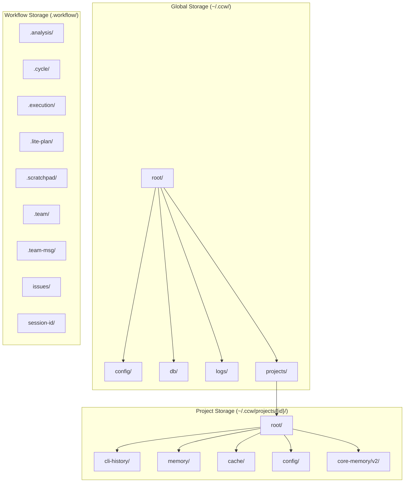

# Chapter 16: File System Workflow

> Ghost clue: The `.workflow/` directory - a labyrinth where execution traces are preserved, and the OOM ghost occasionally reshapes files during concurrent writes...

## Prologue: The Persistence Palace

If SQLite databases are the memory banks of CCW, the `.workflow/` directory is its working studio - a place where plans are drafted, executions are tracked, and the OOM ghost occasionally rearranges the furniture. This chapter explores the file system layer that supports CCW's workflow orchestration.

The ghost has been spotted here before. In the aftermath of concurrent writes, files sometimes emerge corrupted - half-written plans, truncated session logs, and the infamous "file already exists" errors that haunt developers at midnight.

---

## 16.1 The .workflow/ Directory Structure

The `.workflow/` directory is CCW's project-local workspace, distinct from the centralized storage in `~/.ccw/`.

### 16.1.1 Directory Tree Overview

```
.workflow/
├── .analysis/           # Analysis session storage
│   └── ANL-*/           # Analysis directories by ID
├── .cycle/              # Cycle execution tracking
│   └── cycle-*.json     # Cycle state files
├── .execution/          # Execution state management
│   └── exec-*.json      # Execution records
├── .lite-plan/          # Lightweight planning storage
│   └── plan-*.md        # Quick plan documents
├── .scratchpad/         # Temporary working files
│   └── *.tmp            # Ephemeral data
├── .team/               # Multi-agent coordination
│   └── team-*.json      # Team configuration
├── .team-msg/           # Inter-agent messaging
│   └── msg-*.json       # Message queue files
├── issues/              # Issue management
│   ├── ISS-*.json       # Issue definitions
│   └── SOL-*.json       # Solution records
└── [session-id]/        # Workflow session directories
    ├── workflow-session.json  # Session metadata
    ├── IMPL_PLAN.md           # Implementation plan
    ├── TODO_LIST.md           # Progress tracking
    ├── .task/                 # Task definitions
    │   └── IMPL-*.json        # Task JSON files
    └── .summaries/            # Task summaries
        └── IMPL-*-summary.md  # Completion summaries
```

### 16.1.2 Directory Lifecycle Diagram


---

## 16.2 Storage Paths Configuration

The `storage-paths.ts` module defines centralized storage configuration.

### 16.2.1 Global vs Project Storage



### 16.2.2 StoragePaths Interface

```typescript
export interface ProjectPaths {
  /** Project root in CCW storage */
  root: string;
  /** CLI history directory */
  cliHistory: string;
  /** CLI history database file */
  historyDb: string;
  /** Memory store directory */
  memory: string;
  /** Memory store database file */
  memoryDb: string;
  /** Cache directory */
  cache: string;
  /** Dashboard cache file */
  dashboardCache: string;
  /** Config directory */
  config: string;
  /** CLI config file */
  cliConfig: string;
  /** Memory V2 paths */
  memoryV2: {
    root: string;
    rolloutSummaries: string;
    rawMemories: string;
    memoryMd: string;
    skills: string;
  };
}
```

---

## 16.3 Path Resolution and Hierarchy

CCW supports hierarchical project storage, allowing child projects to nest under parent storage.

### 16.3.1 Hierarchy Detection

```typescript
export interface HierarchyInfo {
  /** Current path's ID (flat form) */
  currentId: string;
  /** Parent directory's ID (if exists) */
  parentId: string | null;
  /** Relative path from parent */
  relativePath: string;
}
```

### 16.3.2 Path to Folder Name Conversion

```typescript
function pathToFolderName(absolutePath: string): string {
  let normalized = absolutePath;

  // Handle WSL path: /mnt/c/path -> C:/path
  const wslMatch = normalized.match(/^\/mnt\/([a-z])\/(.*)/i);
  if (wslMatch) {
    normalized = `${wslMatch[1].toUpperCase()}:/${wslMatch[2]}`;
  }

  // Normalize separators to forward slash
  normalized = normalized.replace(/\\/g, '/');

  // Lowercase for case-insensitive filesystems (Windows, macOS)
  if (process.platform === 'win32' || process.platform === 'darwin') {
    normalized = normalized.toLowerCase();
  }

  // Convert to folder-safe name
  let folderName = normalized
    .replace(/^([a-z]):\/*/i, '$1--')   // C:/ -> C--
    .replace(/^\/+/, '')                 // Remove leading slashes
    .replace(/\/+/g, '-')                // / -> -
    .replace(/[<>:"|?*]/g, '_')          // Invalid chars -> _
    .replace(/-$/g, '');                 // Trim trailing dash

  // Limit length to avoid filesystem issues
  if (folderName.length > 100) {
    const hash = createHash('sha256').update(normalized).digest('hex').substring(0, 8);
    folderName = folderName.substring(0, 90) + '_' + hash;
  }

  return folderName || 'unknown';
}
```

**Path Conversion Examples:**

| Input Path | Output Folder Name |
|------------|-------------------|
| `D:\Claude_dms3` | `D--Claude_dms3` |
| `/home/user/project` | `home-user-project` |
| `/mnt/d/Claude_dms3` | `D--Claude_dms3` |
| `C:\Users\name\My Project` | `C--users-name-my-project` |

---

## 16.4 Atomic Write Operations

File corruption is a manifestation of the OOM ghost's wrath. CCW implements atomic writes to prevent this.

### 16.4.1 Atomic Write Pattern


### 16.4.2 Implementation in cli-executor-state.ts

```typescript
/**
 * Ensure history directory exists (uses centralized storage)
 */
export function ensureHistoryDir(baseDir: string): string {
  const paths = StoragePaths.project(baseDir);
  ensureStorageDir(paths.cliHistory);
  return paths.cliHistory;
}

/**
 * Save conversation to SQLite (atomic transaction)
 */
export function saveConversation(baseDir: string, conversation: ConversationRecord): void {
  try {
    const store = getSqliteStoreSync(baseDir);
    store.saveConversation(conversation);
  } catch {
    // If sync not available, queue for async save
    saveConversationAsync(baseDir, conversation).catch(err => {
      console.error('[CLI Executor] Failed to save conversation:', err.message);
    });
  }
}
```

### 16.4.3 Directory Ensure Pattern

```typescript
export function ensureStorageDir(dirPath: string): void {
  if (!existsSync(dirPath)) {
    mkdirSync(dirPath, { recursive: true });
  }
}
```

---

## 16.5 Workflow Session Directory

Each workflow session creates its own directory structure.

### 16.5.1 Session Directory Structure

```
.workflow/
└── WFS-[session-id]/
    ├── workflow-session.json    # Session metadata
    ├── IMPL_PLAN.md             # Implementation plan
    ├── TODO_LIST.md             # Progress tracking
    ├── .task/                   # Task definitions
    │   ├── IMPL-001.json        # Task 1 definition
    │   ├── IMPL-002.json        # Task 2 definition
    │   └── IMPL-001.1.json      # Subtask definition
    └── .summaries/              # Completion summaries
        ├── IMPL-001-summary.md  # Task 1 summary
        └── IMPL-002-summary.md  # Task 2 summary
```

### 16.5.2 Session Metadata Schema

```typescript
interface WorkflowSession {
  id: string;                    // WFS-[timestamp]
  status: 'pending' | 'in_progress' | 'completed' | 'failed';
  created_at: string;
  updated_at: string;
  project_path: string;
  plan_type: 'brainstorm' | 'planning' | 'execution';
  tasks_total: number;
  tasks_completed: number;
  tasks_failed: number;
  status_history: Array<{
    from: string;
    to: string;
    changed_at: string;
  }>;
}
```

---

## 16.6 Child Project Scanning

CCW supports hierarchical project structures with automatic child project discovery.

### 16.6.1 Child Project Info

```typescript
export interface ChildProjectInfo {
  /** Absolute path to the child project */
  projectPath: string;
  /** Relative path from parent project */
  relativePath: string;
  /** Project ID */
  projectId: string;
  /** Storage paths for this child project */
  paths: ProjectPaths;
}
```

### 16.6.2 Recursive Scanning

```typescript
export async function scanChildProjectsAsync(projectPath: string): Promise<ChildProjectInfo[]> {
  const absolutePath = resolve(projectPath);
  const parentId = getProjectId(absolutePath);
  const parentStorageDir = join(getCCWHome(), 'projects', parentId);

  if (!existsSync(parentStorageDir)) {
    return [];
  }

  const children: ChildProjectInfo[] = [];

  async function scanDirectoryAsync(dir: string, relativePath: string): Promise<void> {
    if (!existsSync(dir)) return;

    try {
      const entries = await readdir(dir, { withFileTypes: true });

      const promises = entries
        .filter(entry => entry.isDirectory())
        .map(async (entry) => {
          const fullPath = join(dir, entry.name);
          const currentRelPath = relativePath ? `${relativePath}/${entry.name}` : entry.name;

          // Check if this directory contains project data
          const dataMarkers = ['cli-history', 'memory', 'cache', 'config'];
          const hasData = dataMarkers.some(marker => existsSync(join(fullPath, marker)));

          if (hasData) {
            // This is a child project
            const childProjectPath = join(absolutePath, currentRelPath.replace(/\//g, sep));
            const childId = getProjectId(childProjectPath);

            children.push({
              projectPath: childProjectPath,
              relativePath: currentRelPath,
              projectId: childId,
              paths: getProjectPaths(childProjectPath)
            });
          }

          // Continue scanning subdirectories (skip data directories)
          if (!dataMarkers.includes(entry.name)) {
            await scanDirectoryAsync(fullPath, currentRelPath);
          }
        });

      await Promise.all(promises);
    } catch (error) {
      if (process.env.DEBUG) {
        console.error(`[scanChildProjectsAsync] Failed to scan ${dir}:`, error);
      }
    }
  }

  await scanDirectoryAsync(parentStorageDir, '');

  return children;
}
```

---

## 16.7 Migration from Legacy Storage

CCW supports automatic migration from legacy flat storage to hierarchical storage.

### 16.7.1 Migration Flow


### 16.7.2 Migration Implementation

```typescript
function migrateToHierarchical(legacyDir: string, targetDir: string): void {
  console.log(`\n🔄 检测到旧存储结构，开始迁移...`);
  console.log(`  从: ${legacyDir}`);
  console.log(`  到: ${targetDir}`);

  try {
    // 1. Create target directory
    mkdirSync(targetDir, { recursive: true });

    // 2. Migrate each subdirectory
    const subDirs = ['cli-history', 'memory', 'cache', 'config'];
    for (const subDir of subDirs) {
      const source = join(legacyDir, subDir);
      const target = join(targetDir, subDir);

      if (existsSync(source)) {
        try {
          // Try atomic rename first (fastest, same filesystem)
          renameSync(source, target);
          console.log(`  ✓ 迁移 ${subDir}`);
        } catch (error: any) {
          // Fallback to copy-delete
          if (error.code === 'EPERM' || error.code === 'EXDEV' || error.code === 'EBUSY') {
            cpSync(source, target, { recursive: true, force: true });
            if (existsSync(target)) {
              rmSync(source, { recursive: true, force: true });
              console.log(`  ✓ 迁移 ${subDir} (copy-delete)`);
            }
          }
        }
      }
    }

    // 3. Verify migration integrity
    const verified = verifyMigration(targetDir, subDirs);
    if (!verified) {
      throw new Error('迁移验证失败');
    }

    // 4. Delete old directory
    rmSync(legacyDir, { recursive: true, force: true });
    console.log(`✅ 迁移完成并清理旧数据\n`);

  } catch (error: any) {
    console.error(`❌ 迁移失败: ${error.message}`);
    rollbackMigration(legacyDir, targetDir);
    throw error;
  }
}
```

---

## 16.8 File Lifecycle Management

### 16.8.1 File State Transitions


### 16.8.2 Cleanup Strategy

| File Type | Retention | Cleanup Trigger |
|-----------|-----------|-----------------|
| Session logs | 30 days | Daily cleanup |
| Temp files | 24 hours | Hourly cleanup |
| Analysis results | 7 days | On session complete |
| Completed tasks | 90 days | Manual cleanup |

---

## 16.9 Incident Archive: The Concurrent Write Corruption

> Ghost clue: A developer's workstation showed garbled task definitions after a power outage. The OOM ghost had rearranged bytes during an interrupted write.

### 16.9.1 Incident Analysis

**Symptoms:**
- Task JSON files with truncated content
- Invalid JSON syntax errors
- Missing task dependencies

**Root Cause:**
Power failure during atomic write operation. The rename was interrupted, leaving both temp and target files in inconsistent states.

**Resolution:**

1. **Backup Before Write**: Create `.bak` file before modifications
2. **Write-Ahead Log**: Record intended changes before executing
3. **Recovery Detection**: Check for incomplete operations on startup

```typescript
function safeWriteFile(path: string, content: string): void {
  const tempPath = `${path}.tmp`;
  const backupPath = `${path}.bak`;
  
  // 1. Create backup
  if (existsSync(path)) {
    copyFileSync(path, backupPath);
  }
  
  // 2. Write to temp file
  writeFileSync(tempPath, content);
  
  // 3. Atomic rename
  renameSync(tempPath, path);
  
  // 4. Remove backup
  if (existsSync(backupPath)) {
    unlinkSync(backupPath);
  }
}
```

### 16.9.2 Recovery Flow


---

## 16.10 Global vs Local Storage Decision Matrix

### 16.10.1 Storage Location Strategy

```mermaid
flowchart TD
    DATA[Data to Store] --> TYPE{Data Type?}
    
    TYPE -->|CLI History| GLOBAL[~/.ccw/projects/{id}/]
    TYPE -->|Memory| GLOBAL
    TYPE -->|Cache| GLOBAL
    TYPE -->|Config| SPLIT{Project-Specific?}
    
    SPLIT -->|Yes| GLOBAL
    SPLIT -->|No| GLOBAL_ROOT[~/.ccw/config/]
    
    TYPE -->|Workflow Session| LOCAL[.workflow/{session}/]
    TYPE -->|Analysis Results| LOCAL
    TYPE -->|Team Coordination| LOCAL
    
    TYPE -->|Temporary| SCRATCH[.workflow/.scratchpad/]
```

### 16.10.2 Decision Table

| Data Type | Location | Rationale |
|-----------|----------|-----------|
| CLI Execution History | `~/.ccw/projects/{id}/cli-history/` | Persistent, shared across clones |
| Memory Embeddings | `~/.ccw/projects/{id}/memory/` | Large, centrally managed |
| Workflow Session | `.workflow/WFS-{id}/` | Project-local, transient |
| Analysis Results | `.workflow/.analysis/` | Project-local, referenceable |
| Team Messages | `.workflow/.team-msg/` | Ephemeral, coordination |
| Scratchpad | `.workflow/.scratchpad/` | Temporary, cleanup-safe |

---

## 16.11 File Consistency Guarantees

### 16.11.1 Consistency Levels

| Operation | Consistency Level | Mechanism |
|-----------|-------------------|-----------|
| Database writes | ACID | SQLite transactions |
| JSON file writes | Atomic | Temp + rename |
| Directory creation | Atomic | `mkdir recursive` |
| Migration | Best-effort | Copy + verify + delete |

### 16.11.2 Failure Handling

```typescript
function withErrorHandling<T>(
  operation: () => T,
  fallback: () => T,
  logger: (error: Error) => void
): T {
  try {
    return operation();
  } catch (error) {
    logger(error as Error);
    return fallback();
  }
}
```

---

## 16.12 Memory V2 Storage Structure

The Memory V2 system uses a structured directory layout.

### 16.12.1 Memory V2 Paths

```typescript
memoryV2: {
  root: join(projectDir, 'core-memory', 'v2'),
  rolloutSummaries: join(projectDir, 'core-memory', 'v2', 'rollout_summaries'),
  rawMemories: join(projectDir, 'core-memory', 'v2', 'raw_memories.md'),
  memoryMd: join(projectDir, 'core-memory', 'v2', 'MEMORY.md'),
  skills: join(projectDir, 'core-memory', 'v2', 'skills'),
}
```

### 16.12.2 Memory File Structure

```
core-memory/
└── v2/
    ├── raw_memories.md      # Concatenated raw memories
    ├── MEMORY.md            # Consolidated memory file
    ├── rollout_summaries/   # Rollout-based summaries
    │   └── *.md
    └── skills/              # Skill-specific memories
        └── *.md
```

---

## 16.13 Legacy Path Detection

CCW maintains backward compatibility with legacy storage locations.

### 16.13.1 Legacy Path Definitions

```typescript
export const LegacyPaths = {
  /** Old recent paths file location */
  recentPaths: () => join(homedir(), '.ccw-recent-paths.json'),

  /** Old project-local CLI history */
  cliHistory: (projectPath: string) => join(projectPath, '.workflow', '.cli-history'),

  /** Old project-local memory store */
  memory: (projectPath: string) => join(projectPath, '.workflow', '.memory'),

  /** Old project-local cache */
  cache: (projectPath: string) => join(projectPath, '.workflow', '.ccw-cache'),

  /** Old project-local CLI config */
  cliConfig: (projectPath: string) => join(projectPath, '.workflow', 'cli-config.json'),
};
```

### 16.13.2 Legacy Detection

```typescript
export function isLegacyStoragePresent(projectPath: string): boolean {
  return (
    existsSync(LegacyPaths.cliHistory(projectPath)) ||
    existsSync(LegacyPaths.memory(projectPath)) ||
    existsSync(LegacyPaths.cache(projectPath)) ||
    existsSync(LegacyPaths.cliConfig(projectPath))
  );
}
```

---

## 16.14 Storage Initialization

### 16.14.1 Global Storage Initialization

```typescript
export function initializeGlobalStorage(): void {
  ensureStorageDir(GlobalPaths.config());
  ensureStorageDir(GlobalPaths.databases());
  ensureStorageDir(GlobalPaths.logs());
}
```

### 16.14.2 Project Storage Initialization

```typescript
export function initializeProjectStorage(projectPath: string): void {
  const paths = getProjectPaths(projectPath);
  ensureStorageDir(paths.cliHistory);
  ensureStorageDir(paths.memory);
  ensureStorageDir(paths.cache);
  ensureStorageDir(paths.config);
  ensureStorageDir(paths.memoryV2.root);
  ensureStorageDir(paths.memoryV2.rolloutSummaries);
  ensureStorageDir(paths.memoryV2.skills);
}
```

---

## Epilogue: The Ghost's Filing Cabinet

As we close this chapter, the OOM ghost retreats to its filing cabinet - the `.workflow/` directory. Here, it maintains records of every plan, every execution, every moment of AI-human collaboration. The ghost does not forget; it merely reorganizes.

The files in `.workflow/` are more than data; they are the ghost's memory palace. Each directory is a room, each file a memory. When corruption occurs, the ghost mourns - and then rebuilds from backups.

*Next: Chapter 17 - The Cache Layer, where transient data finds its temporary home...*

---

## References

- `ccw/src/config/storage-paths.ts` - Central path configuration
- `ccw/src/tools/cli-executor-state.ts` - State persistence
- `ccw/src/tools/cli-history-store.ts` - History database
- `.workflow/` - Workflow session storage
- `~/.ccw/` - Centralized storage location
