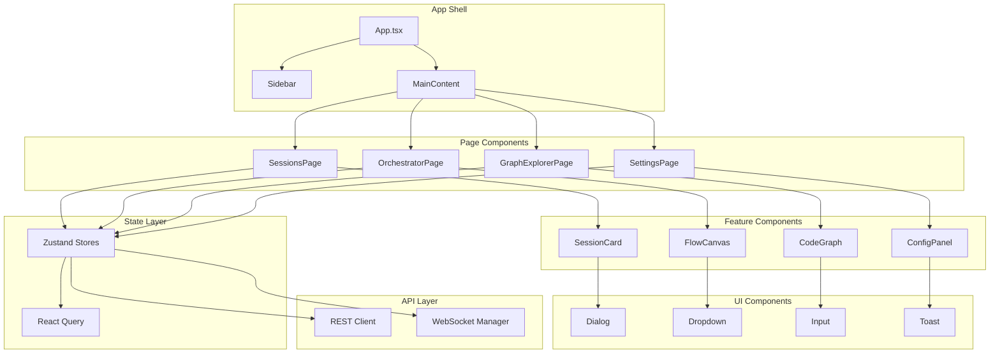

# Chapter 17: React Dashboard Architecture

> **Part**: VIII - Frontend System
> **Version**: 1.0
> **Last Updated**: 2025-02-18

---

## Overview

CCW Dashboard is a React-based single-page application that provides real-time visualization and management of workflow sessions, CLI executions, and code exploration. This chapter analyzes the 68 page components, state management strategy, and communication protocols.

### Key Statistics

| Metric | Value |
|--------|-------|
| Total Pages | 68 |
| State Stores | 15 (Zustand) |
| Route Modules | 36 |
| Components | 100+ |
| WebSocket Events | 20+ |

---

## Architecture Blind Spot

> **Question 17.1**: Why does the Dashboard use both HTTP REST API and WebSocket communication?

<details>
<summary>Design Rationale</summary>

The dual-protocol approach serves different purposes:

| Protocol | Use Case | Rationale |
|----------|----------|-----------|
| **HTTP REST** | Initial data load, CRUD operations | Stateless, cacheable, simple error handling |
| **WebSocket** | Real-time updates, CLI streams | Low latency, server-push, bidirectional |

**Key Insight**: The system uses HTTP for "request-response" patterns (fetching sessions, configuration) and WebSocket for "event-stream" patterns (CLI output, execution progress). This separation optimizes for both reliability and responsiveness.

</details>

---

## Page Component Classification

The 68 page components are organized into 7 functional categories:

### 1. Session Management (10 pages)

| Page | Path | Description |
|------|------|-------------|
| `SessionsPage` | `/sessions` | Session list with filters |
| `SessionDetailPage` | `/sessions/:id` | Single session detail |
| `FixSessionPage` | `/sessions/fix/:id` | Fix session workflow |
| `ReviewSessionPage` | `/sessions/review/:id` | Review session workflow |
| `HistoryPage` | `/history` | Historical sessions |
| `LiteTasksPage` | `/lite-tasks` | Lite task overview |
| `LiteTaskDetailPage` | `/lite-tasks/:id` | Lite task detail |
| `CliViewerPage` | `/cli/:id` | CLI execution viewer |
| `CliSessionSharePage` | `/cli/share/:id` | Shared CLI session |
| `TerminalDashboardPage` | `/terminals` | Multi-terminal view |

### 2. Workflow Orchestration (8 pages)

| Page | Path | Description |
|------|------|-------------|
| `OrchestratorPage` | `/orchestrator` | Visual flow editor |
| `ExecutionMonitorPage` | `/execution` | Execution monitoring |
| `QueuePage` | `/queue` | Issue queue management |
| `IssueHubPage` | `/issues/hub` | Issue hub dashboard |
| `IssueManagerPage` | `/issues` | Issue management |
| `DiscoveryPage` | `/discovery` | Issue discovery panel |
| `LoopMonitorPage` | `/loops` | Loop execution monitor |
| `TeamPage` | `/team` | Team collaboration |

### 3. Code Exploration (5 pages)

| Page | Path | Description |
|------|------|-------------|
| `ExplorerPage` | `/explorer` | File/code explorer |
| `GraphExplorerPage` | `/graph` | Code graph visualization |
| `MemoryPage` | `/memory` | Memory/embeddings viewer |
| `ProjectOverviewPage` | `/project` | Project overview |
| `PromptHistoryPage` | `/prompts` | Prompt history |

### 4. Configuration Management (12 pages)

| Page | Path | Description |
|------|------|-------------|
| `SettingsPage` | `/settings` | General settings |
| `ApiSettingsPage` | `/api-settings` | API endpoint configuration |
| `CommandsManagerPage` | `/commands` | Slash command management |
| `SkillsManagerPage` | `/skills` | Skill management |
| `McpManagerPage` | `/mcp` | MCP server management |
| `CodexLensManagerPage` | `/codexlens` | CodexLens configuration |
| `HookManagerPage` | `/hooks` | Hook management |
| `RulesManagerPage` | `/rules` | Rules management |
| `EndpointsPage` | `/endpoints` | API endpoints |
| `InstallationsPage` | `/installations` | CLI installations |
| `RulesManagerPage` | `/rules` | Custom rules |

### 5. Dashboard & Home (3 pages)

| Page | Path | Description |
|------|------|-------------|
| `HomePage` | `/` | Main dashboard |
| `NotFoundPage` | `*` | 404 page |
| `TickerDemo` | `/demo/ticker` | Demo page |

### 6. Orchestrator Sub-components (10 pages)

Located in `/pages/orchestrator/`:

- `FlowCanvas.tsx` - ReactFlow canvas
- `FlowToolbar.tsx` - Toolbar controls
- `NodePalette.tsx` - Node type palette
- `PropertyPanel.tsx` - Node property editor
- `LeftSidebar.tsx` - Left navigation
- `ExecutionMonitor.tsx` - Real-time execution view
- `TemplateLibrary.tsx` - Flow templates
- `InlineTemplatePanel.tsx` - Template panel
- `InteractionModeToggle.tsx` - Mode switcher
- `ResizeHandle.tsx` - Panel resize handle

### 7. Session Detail Sub-components (6 pages)

Located in `/pages/session-detail/`:

- `SummaryTab.tsx` - Session summary
- `ContextTab.tsx` - Context information
- `ImplPlanTab.tsx` - Implementation plan
- `TaskListTab.tsx` - Task list view
- `ReviewTab.tsx` - Review findings
- `ConflictTab.tsx` - Conflict detection

### 8. Graph Explorer Sub-components (8 pages)

Located in `/pages/graph-explorer/`:

- `nodes/ClassNode.tsx` - Class node renderer
- `nodes/FunctionNode.tsx` - Function node renderer
- `nodes/ModuleNode.tsx` - Module node renderer
- `nodes/VariableNode.tsx` - Variable node renderer
- `edges/CallsEdge.tsx` - Call relationship edge
- `edges/ImportsEdge.tsx` - Import relationship edge
- `edges/InheritsEdge.tsx` - Inheritance edge

---

## State Management Strategy

CCW Dashboard uses **Zustand** as the primary state management library, chosen for its simplicity, TypeScript support, and minimal boilerplate.

### Store Architecture

```
stores/
├── index.ts                    # Barrel export
├── appStore.ts                 # Theme, locale, UI state
├── workflowStore.ts            # Workflow session data
├── configStore.ts              # CLI tools, API endpoints
├── notificationStore.ts        # Toasts, WebSocket status
├── flowStore.ts                # Orchestrator flow state
├── executionStore.ts           # Execution monitoring
├── viewerStore.ts              # Multi-pane viewer
├── orchestratorStore.ts        # Plan/step management
├── sessionManagerStore.ts      # Session grid layout
├── queueExecutionStore.ts      # Queue execution tracking
├── terminalPanelStore.ts       # Terminal panel state
├── terminalGridStore.ts        # Terminal grid layout
├── cliSessionStore.ts          # CLI session state
├── cliStreamStore.ts           # CLI stream data
└── issueQueueIntegrationStore.ts  # Issue-queue linking
```

### Store Selection Patterns

Each store exports:
1. **Hook**: `useXxxStore()` - Main store hook
2. **Selectors**: `selectXxx()` - Memoized selectors
3. **Types**: Exported TypeScript interfaces

```typescript
// Example: appStore.ts exports
export const useAppStore = create<AppStore>()(...);

// Selectors for common access patterns
export const selectTheme = (state: AppStore) => state.theme;
export const selectResolvedTheme = (state: AppStore) => state.resolvedTheme;
export const selectLocale = (state: AppStore) => state.locale;
```

### Persistence Strategy

Selected stores use `zustand/persist` middleware:

| Store | Persisted Fields | Storage Key |
|-------|------------------|-------------|
| `appStore` | theme, locale, dashboardLayout, themeSlots | `ccw-app-store` |
| `notificationStore` | persistentNotifications | `ccw_notifications` |

---

## Communication Protocols

### HTTP REST API

The backend exposes 36 route modules under `ccw/src/core/routes/`:

| Route Module | Endpoints | Purpose |
|--------------|-----------|---------|
| `dashboard-routes.ts` | `/api/dashboard/init`, `/api/workflow-status-counts` | Dashboard initialization |
| `session-routes.ts` | `/api/sessions/*` | Session CRUD |
| `cli-routes.ts` | `/api/cli/*` | CLI execution |
| `graph-routes.ts` | `/api/graph/*` | Code graph queries |
| `memory-routes.ts` | `/api/memory/*` | Memory operations |
| `issue-routes.ts` | `/api/issues/*` | Issue management |
| `mcp-routes.ts` | `/api/mcp/*` | MCP operations |
| `skills-routes.ts` | `/api/skills/*` | Skill operations |
| `hooks-routes.ts` | `/api/hooks/*` | Hook management |

### WebSocket Events

The Dashboard maintains a WebSocket connection for real-time updates:

```typescript
// WebSocket status states
type WebSocketStatus = 'connected' | 'connecting' | 'disconnected' | 'error';

// Key event types
interface WebSocketMessage {
  type: 'session_update' | 'cli_output' | 'execution_progress' | 'a2ui_notification';
  payload: unknown;
  timestamp: string;
}
```

### Protocol Decision Matrix

| Scenario | Protocol | Rationale |
|----------|----------|-----------|
| Initial page load | HTTP | Cacheable, resumable |
| Session list refresh | HTTP | Stateless, idempotent |
| CLI execution stream | WebSocket | Real-time, bidirectional |
| Orchestrator execution | WebSocket | Progress updates |
| A2UI notifications | WebSocket | Server-push required |
| Configuration save | HTTP | CRUD pattern |
| Memory search | HTTP | Query-response |

---

## Component Hierarchy



---

## Key Design Decisions

### 1. Zustand over Redux

**Decision**: Use Zustand for state management instead of Redux.

**Rationale**:
- Minimal boilerplate (no actions, reducers, sagas)
- Built-in TypeScript support
- Selective re-rendering via selectors
- Persist middleware built-in
- Smaller bundle size

### 2. ReactFlow for Orchestrator

**Decision**: Use ReactFlow library for visual workflow orchestration.

**Rationale**:
- Mature, well-documented library
- Built-in node/edge rendering
- Drag-and-drop support
- Mini-map and controls included
- Custom node types supported

### 3. WebSocket for Real-time

**Decision**: Use WebSocket for CLI output streaming.

**Rationale**:
- Lower latency than polling
- Server-initiated messages
- Native browser support
- Automatic reconnection handling

### 4. Component Co-location

**Decision**: Place feature-specific components alongside pages.

**Rationale**:
- Easier code navigation
- Clear ownership boundaries
- Simplified imports
- Better code splitting

---

## Performance Optimizations

### 1. Selective State Subscription

```typescript
// Bad: Subscribes to entire store
const store = useAppStore();

// Good: Subscribes to specific value
const theme = useAppStore(selectTheme);
```

### 2. Memoized Selectors

```typescript
// Selectors are stable references
export const selectTheme = (state: AppStore) => state.theme;
```

### 3. Code Splitting

Routes are lazy-loaded using React.lazy:

```typescript
const SessionsPage = React.lazy(() => import('./pages/SessionsPage'));
```

### 4. Virtualization

Long lists use virtualization (e.g., session lists, file trees) to minimize DOM nodes.

---

## Extension Points

### Adding a New Page

1. Create component in `pages/NewPage.tsx`
2. Add to `pages/index.ts` exports
3. Register route in App.tsx
4. Add navigation item in Sidebar

### Adding a New Store

1. Create `stores/newStore.ts` with Zustand pattern
2. Export hook, selectors, and types
3. Add to `stores/index.ts` barrel export
4. Use in components via `useNewStore()`

### Adding a New Route

1. Create `src/core/routes/new-routes.ts`
2. Export `handleNewRoutes()` function
3. Register in main router
4. Add corresponding frontend API client

---

## Summary

The CCW Dashboard architecture follows a **unidirectional data flow** pattern with Zustand stores as the single source of truth. The dual HTTP/WebSocket communication strategy optimizes for both reliability (CRUD operations) and responsiveness (real-time updates). The 68 pages are organized into 8 functional categories, each with clear responsibilities and extension points.

---

**Next**: [Chapter 18: Testing Strategy](./ch18-testing-strategy.md)
