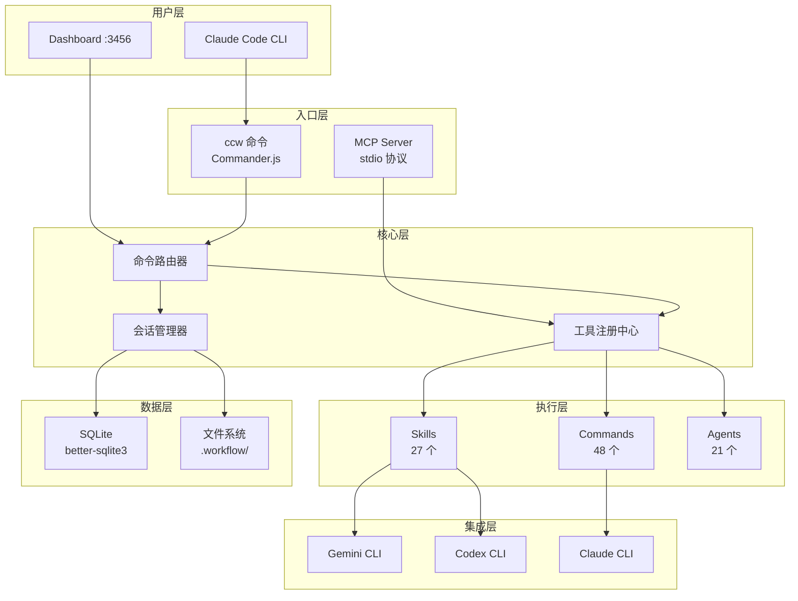

# CCW 知识库

> **Claude-Code-Workflow 官方文档**
> **版本**: 6.3.54
> **最后更新**: 2025-02-15

---

## 项目简介

**Claude-Code-Workflow (CCW)** 是一个为 Claude Code 构建的智能工作流增强系统。它通过以下核心能力提升开发效率：

- **意图驱动执行** - 自动分析任务意图，选择最优工作流
- **多级工作流** - 从快速修复到架构设计的 4 级复杂度支持
- **多模型协作** - 支持 Gemini、Codex、Claude 等多 CLI 工具协同
- **MCP 工具集** - 提供 20+ 增强工具（文件操作、代码搜索、会话管理等）
- **Dashboard 可视化** - Web 界面实时监控工作流状态

---

## 系统架构



---

## 快速开始

### 安装

```bash
# 克隆仓库
git clone https://github.com/your-org/Claude-Code-Workflow.git
cd Claude-Code-Workflow

# 安装依赖
npm install

# 全局安装 CCW CLI
npm run install:global
```

### 基本使用

```bash
# 启动 Dashboard
ccw view

# 在 Claude Code 中使用工作流
/ccw "添加用户认证功能"
/ccw-plan "重构支付模块"
/ccw-test

# 使用 CLI 工具进行代码分析
ccw cli -p "分析这个模块的架构" --tool gemini --mode analysis
```

### 核心命令速查

| 命令 | 用途 | 示例 |
|------|------|------|
| `/ccw` | 主工作流入口 | `/ccw "实现新功能"` |
| `/ccw-plan` | 规划模式 | `/ccw-plan "重构计划"` |
| `/ccw-test` | 测试模式 | `/ccw-test` |
| `/ccw-debug` | 调试模式 | `/ccw-debug "连接超时问题"` |
| `/issue:new` | 创建 Issue | `/issue:new "修复登录 Bug"` |
| `/workflow:session:start` | 启动会话 | `/workflow:session:start "任务名"` |

---

## 学习路径

### 初级 (Level 1-2)

适合刚接触 CCW 的用户，掌握基本概念和常用命令。

1. **理解架构** - 阅读 [系统架构](architecture.md) 了解整体设计
2. **尝试基础命令** - 使用 `/ccw` 执行简单任务
3. **探索 Skills** - 学习 [workflow-lite-plan](skills/workflow-lite-plan.md) 等轻量级技能

**推荐任务**:
- 配置文件修改
- 单文件功能添加
- 简单 Bug 修复

### 中级 (Level 2-3)

适合有基础的用户，掌握 Issue 工作流和多模块开发。

1. **会话管理** - 学习 [Session 命令](commands/workflow/session/start.md)
2. **Issue 工作流** - 掌握 Issue 生命周期管理
3. **多 CLI 协作** - 使用 Gemini/Codex 进行代码分析

**推荐任务**:
- 多模块功能开发
- 技术债务清理
- 测试覆盖率提升

### 高级 (Level 3-4)

适合熟练用户，掌握团队协作和架构设计。

1. **团队生命周期** - 学习 [team-lifecycle](skills/team-lifecycle.md) 多角色协作
2. **自定义 Skills** - 使用 [skill-generator](skills/skill-generator.md) 创建自定义技能
3. **架构探索** - 使用 [brainstorm](skills/brainstorm.md) 进行架构头脑风暴

**推荐任务**:
- 新系统架构设计
- 跨团队协作项目
- 工作流定制开发

---

## 核心概念

### 工作流级别 (Workflow Levels)

CCW 支持 4 级工作流复杂度，自动根据任务意图选择：

| 级别 | 名称 | 适用场景 | 典型命令链 |
|------|------|----------|------------|
| 1 | lite-lite-lite | 快速修复、配置更改 | 单步执行 |
| 2 | lite-plan / lite-fix | 单模块功能、Bug 修复 | plan → execute |
| 3 | plan / tdd-plan | 多模块开发、TDD | plan → verify → execute → review |
| 4 | brainstorm:auto-parallel | 架构设计、新功能探索 | brainstorm → plan → execute |

### 最小执行单元 (Minimum Execution Unit)

**定义**: 必须作为原子组一起执行的命令集合。

**示例**:
```
【lite-plan → lite-execute】  // 规划和执行是一个原子单元
【test-fix-gen → test-cycle-execute】  // 测试生成和执行是一个原子单元
```

**意义**:
- 防止中间状态不一致
- 保证用户体验完整性
- 错误处理以单元为单位

### 三大执行组件

| 组件 | 数量 | 用途 | 文档 |
|------|------|------|------|
| **Skills** | 27 | 工作流编排器，定义多阶段执行流程 | [Skills 索引](skills/_index.md) |
| **Commands** | 48 | 单一职责命令，执行具体操作 | [Commands 索引](commands/_index.md) |
| **Agents** | 21 | 智能代理，执行特定领域任务 | [Agents 索引](agents/_index.md) |

---

## 文档覆盖率

| 类别 | 总数 | 已文档化 | 覆盖率 |
|------|------|----------|--------|
| Skills | 27 | 27 | 100% |
| Commands | 48 | 48 | 100% |
| Agents | 21 | 21 | 100% |

---

## 常用命令速查表

### 工作流命令

```bash
# 自动选择工作流
/ccw "任务描述"

# 明确指定工作流级别
/ccw "快速添加日志"              # → Level 1
/ccw "实现用户认证"              # → Level 2
/ccw "重构支付系统架构"          # → Level 3
/ccw "头脑风暴: 新的通知系统"     # → Level 4
```

### Issue 工作流

```bash
/issue:new "问题描述"           # 创建 Issue
/issue:plan                    # 批量规划
/issue:queue                   # 形成执行队列
/issue:execute                 # 执行队列
```

### 会话管理

```bash
/workflow:session:start "任务"  # 启动会话
/workflow:session:list          # 列出会话
/workflow:session:resume        # 恢复会话
/workflow:session:complete      # 完成会话
```

### CLI 工具

```bash
# 代码分析
ccw cli -p "分析代码" --tool gemini --mode analysis

# 代码实现
ccw cli -p "实现功能" --tool codex --mode write

# 代码审查
ccw cli --tool codex --mode review --uncommitted
```

---

## 导航

### 核心文档

- [系统架构](architecture.md) - 深入理解 CCW 内部设计

### 参考索引

- [Commands 索引](commands/_index.md) - 全部 48 个命令
- [Skills 索引](skills/_index.md) - 全部 27 个技能
- [Agents 索引](agents/_index.md) - 全部 21 个代理

### 集成文档

- [MCP 工具](mcp/mcp-tools.md) - Model Context Protocol 集成
- [CLI 工具](cli/cli-tools.md) - Gemini、Codex、Claude 集成

---

## 贡献指南

文档更新流程：

1. 修改 `.claude/` 目录下的源文件
2. 运行 `npx ts-node scripts/coverage-check.ts` 检查覆盖率
3. 确保 100% 覆盖率后提交 PR

---

*由 CCW 知识系统自动生成*
*会话: TLS-ccw-deep-learn-2025-02-15*
