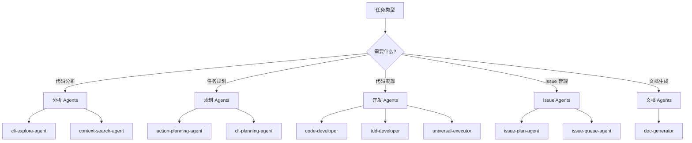
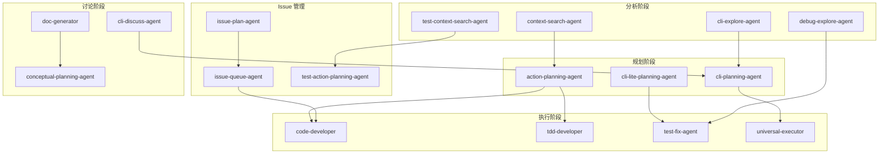

# Agents 索引

> **总数**: 21 个
> **最后更新**: 2025-02-15

---

## 概述

Agents 是 CCW 的智能代理，执行特定领域的任务。每个 Agent：

- 定义在 `.claude/agents/` 目录下
- 使用 YAML frontmatter 声明元数据
- 通过 Task 工具调用

---

## 分类索引

### CLI 相关 (3)

多 CLI 协作的智能代理。

| Agent | 描述 | 能力 | 文档 |
|-------|------|------|------|
| **cli-discuss-agent** | 多 CLI 协作讨论 | 交叉验证、综合分析 | [详情](cli-discuss-agent.md) |
| **cli-planning-agent** | 基于 CLI 的规划执行 | 任务 JSON 生成、分析 | [详情](cli-planning-agent.md) |
| **cli-execution-agent** | 智能 CLI 执行 | 上下文发现、工具选择 | [详情](cli-execution-agent.md) |

### 规划 (2)

任务规划和分解。

| Agent | 描述 | 能力 | 文档 |
|-------|------|------|------|
| **action-planning-agent** | 纯执行规划 | 分阶段实施计划 | [详情](action-planning-agent.md) |
| **cli-lite-planning-agent** | 通用轻量规划 | Schema 驱动计划 JSON | [详情](cli-lite-planning-agent.md) |

### 分析 (4)

代码和上下文分析。

| Agent | 描述 | 能力 | 文档 |
|-------|------|------|------|
| **context-search-agent** | 上下文收集 | 多层发现 | [详情](context-search-agent.md) |
| **cli-explore-agent** | 代码库探索 | 双源分析 | [详情](cli-explore-agent.md) |
| **debug-explore-agent** | 假设驱动调试 | NDJSON 日志、验证 | [详情](debug-explore-agent.md) |
| **test-context-search-agent** | 测试上下文收集 | 覆盖率分析 | [详情](test-context-search-agent.md) |

### 开发 (4)

代码开发和测试。

| Agent | 描述 | 能力 | 文档 |
|-------|------|------|------|
| **code-developer** | 纯代码执行 | TDD 感知、增量进度 | [详情](code-developer.md) |
| **tdd-developer** | TDD 代码执行 | Red-Green-Refactor 循环 | [详情](tdd-developer.md) |
| **test-fix-agent** | 测试执行和修复 | 自迭代修复 | [详情](test-fix-agent.md) |
| **universal-executor** | 通用任务执行 | 多领域适应 | [详情](universal-executor.md) |

### Issue 管理 (3)

Issue 生命周期管理。

| Agent | 描述 | 能力 | 文档 |
|-------|------|------|------|
| **issue-plan-agent** | Issue 探索和规划 | 闭环方案生成 | [详情](issue-plan-agent.md) |
| **issue-queue-agent** | 解决方案排序 | DAG 并行编排 | [详情](issue-queue-agent.md) |
| **test-action-planning-agent** | 测试规划 | L0-L3 测试层 | [详情](test-action-planning-agent.md) |

### 文档 (2)

文档生成和规划。

| Agent | 描述 | 能力 | 文档 |
|-------|------|------|------|
| **doc-generator** | 文档生成 | 预分析、模板综合 | [详情](doc-generator.md) |
| **conceptual-planning-agent** | 单角色规划 | 角色特定分析 | [详情](conceptual-planning-agent.md) |

### 审查 (1)

代码审查和路线图。

| Agent | 描述 | 能力 | 文档 |
|-------|------|------|------|
| **cli-roadmap-plan-agent** | 路线图规划 | JSONL 输出、收敛标准 | [详情](cli-roadmap-plan-agent.md) |

---

## Agent 选择指南

### 按任务类型选择



### 按复杂度选择

| 复杂度 | 推荐 Agent | 替代 Agent |
|--------|------------|------------|
| 简单任务 | cli-lite-planning-agent | action-planning-agent |
| 中等任务 | cli-planning-agent | issue-plan-agent |
| 复杂任务 | cli-discuss-agent | tdd-developer |
| 探索任务 | cli-explore-agent | debug-explore-agent |

---

## 协作关系图



---

## Agent 结构

Agents 定义在 `.claude/agents/*.md`，格式如下：

```yaml
---
name: agent-name
description: Agent 描述
tools: [Read, Write, Edit, Bash, Task]
model: opus | sonnet | haiku
---

# 系统提示词

Agent 的行为定义...
```

### 元数据字段

| 字段 | 描述 | 必需 |
|------|------|------|
| `name` | Agent 唯一标识 | 是 |
| `description` | 简短描述 | 是 |
| `tools` | 允许的工具列表 | 是 |
| `model` | 默认模型 (opus/sonnet/haiku) | 否 |

---

## 调用方式

Agents 通过 Task 工具调用：

```javascript
Task({
  subagent_type: "general-purpose",
  prompt: "Execute as {agent-name}: {task}"
})
```

### 调用示例

```javascript
// 调用 cli-explore-agent 进行代码探索
Task({
  subagent_type: "general-purpose",
  prompt: "Execute as cli-explore-agent: 探索认证模块的架构"
})

// 调用 tdd-developer 进行 TDD 开发
Task({
  subagent_type: "general-purpose",
  prompt: "Execute as tdd-developer: 使用 TDD 实现用户注册功能"
})

// 调用 issue-plan-agent 进行 Issue 规划
Task({
  subagent_type: "general-purpose",
  prompt: "Execute as issue-plan-agent: 规划 Issue-123 的解决方案"
})
```

---

## 能力矩阵

| Agent | 读取 | 写入 | 执行 | 分析 | 规划 | 测试 |
|-------|:----:|:----:|:----:|:----:|:----:|:----:|
| cli-discuss-agent | ✓ | - | - | ✓ | - | - |
| cli-planning-agent | ✓ | ✓ | - | ✓ | ✓ | - |
| cli-execution-agent | ✓ | ✓ | ✓ | ✓ | - | - |
| action-planning-agent | ✓ | ✓ | - | ✓ | ✓ | - |
| cli-lite-planning-agent | ✓ | ✓ | - | ✓ | ✓ | - |
| context-search-agent | ✓ | - | - | ✓ | - | - |
| cli-explore-agent | ✓ | - | - | ✓ | - | - |
| debug-explore-agent | ✓ | - | ✓ | ✓ | - | - |
| test-context-search-agent | ✓ | - | - | ✓ | - | ✓ |
| code-developer | ✓ | ✓ | ✓ | - | - | ✓ |
| tdd-developer | ✓ | ✓ | ✓ | - | - | ✓ |
| test-fix-agent | ✓ | ✓ | ✓ | - | - | ✓ |
| universal-executor | ✓ | ✓ | ✓ | ✓ | ✓ | ✓ |
| issue-plan-agent | ✓ | ✓ | - | ✓ | ✓ | - |
| issue-queue-agent | ✓ | ✓ | - | ✓ | ✓ | - |
| test-action-planning-agent | ✓ | ✓ | - | ✓ | ✓ | ✓ |
| doc-generator | ✓ | ✓ | - | ✓ | - | - |
| conceptual-planning-agent | ✓ | ✓ | - | ✓ | ✓ | - |
| cli-roadmap-plan-agent | ✓ | ✓ | - | ✓ | ✓ | - |

---

## 最佳实践

### 1. 选择正确的 Agent

- **简单任务** → `cli-lite-planning-agent`
- **复杂规划** → `action-planning-agent`
- **代码探索** → `cli-explore-agent`
- **TDD 开发** → `tdd-developer`
- **Issue 解决** → `issue-plan-agent`

### 2. 组合使用 Agents

```
cli-explore-agent → action-planning-agent → code-developer → test-fix-agent
```

### 3. 理解 Agent 能力

- 检查 `tools` 字段了解 Agent 可以使用的工具
- 检查 `model` 字段了解默认模型
- 阅读系统提示词理解 Agent 行为

### 4. 使用通用执行器

对于不确定的任务，使用 `universal-executor`：

```javascript
Task({
  subagent_type: "general-purpose",
  prompt: "Execute as universal-executor: {任何任务}"
})
```

---

## 相关文档

- [Skills 索引](../skills/_index.md)
- [Commands 索引](../commands/_index.md)
- [系统架构](../architecture.md)

---

*由 CCW 知识系统自动生成*
