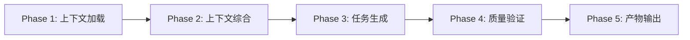
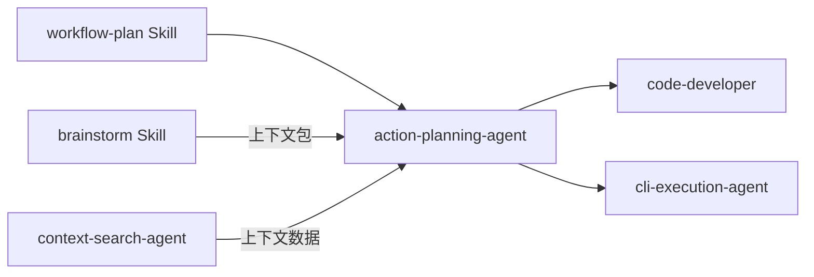

# action-planning

> **分类**: Planning
> **源文件**: [.claude/agents/action-planning-agent.md](../../.claude/agents/action-planning-agent.md)

## 概述

**Action Planning Agent** 是一个纯粹的执行型 Agent，负责将用户需求和头脑风暴产出转化为结构化、可执行的实施计划。该 Agent 从命令层接收需求和控制标志，执行计划任务，产出带有量化交付物和可衡量验收标准的开发计划。

**核心职责**:
- 从多个来源加载和综合上下文（会话元数据、上下文包、头脑风暴产物）
- 生成符合统一扁平模式（task-schema.json）的任务 JSON 文件
- 生成 plan.json 作为机器可读的计划概览
- 创建 IMPL_PLAN.md 和 TODO_LIST.md 并建立正确链接
- 支持 Agent 模式和 CLI 执行模式两种工作流

**关键原则**: 所有任务规格必须包含量化的显式计数、枚举和可衡量的验收标准，以消除歧义。

## 能力说明

### 能做什么
- 将自然语言需求转化为结构化的任务 JSON 文件
- 加载并综合头脑风暴阶段的产物（guidance-specification、feature-specs、role analyses）
- 生成机器可读的计划概览文件（plan.json）
- 创建人类可读的实施计划（IMPL_PLAN.md）和待办清单（TODO_LIST.md）
- 支持单模块和多模块项目的任务规划
- 集成 MCP 工具进行上下文增强
- 管理 CLI 执行策略（new/resume/fork/merge_fork）

### 不能做什么
- 不执行代码修改或文件创建（仅生成计划）
- 不做复杂的决策逻辑（由命令层处理）
- 不直接调用外部 API 或服务
- 不处理用户交互（由上层 Skill 处理）

## 工作流程



### Phase 1: 上下文加载与组装

**输入来源**:

| 来源 | 路径/变量 | 内容 |
|------|-----------|------|
| 会话元数据 | `session_metadata_path` | 用户描述、项目范围、技术约束 |
| 上下文包 | `context_package_path` | 头脑风暴产物目录 |
| 规划笔记 | `.workflow/active/{session-id}/planning-notes.md` | 整合的约束条件 |

**加载顺序**:

1. **加载规划笔记**（优先级最高）
   - 提取所有工作流阶段（Phase 1-3）的整合约束
   - 这是任务生成的主要约束来源

2. **加载会话元数据**
   - 提取原始任务/功能需求
   - 获取用户指定的边界和目标

3. **加载上下文包**
   - 读取完整的上下文包对象
   - 获取产物清单和依赖关系

4. **加载头脑风暴产物**（按优先级）:
   - `guidance-specification.md` - 整体设计框架和架构决策
   - Feature specs（通过 feature-index.json 按需加载）
   - Synthesis output（如果存在）
   - Conflict resolution（如果 conflict_risk >= medium）

5. **可选 MCP 增强**
   - 使用 `mcp__exa__code_search` 进行外部研究
   - 使用 `mcp__ace-tool__search_context` 进行语义搜索

### Phase 2: 上下文综合与分析

**分析内容**:

| 分析类型 | 目的 | 工具选择 |
|----------|------|----------|
| 架构分析 | 项目结构 + 架构模式 | Gemini CLI |
| 执行流分析 | 代码追踪 + 质量分析 | Gemini CLI |
| 组件分析 | 组件搜索 + 模式分析 | Bash/rg/find |
| 数据分析 | Schema 审查 + 端点搜索 | MCP tools |
| 安全分析 | 漏洞扫描 + 安全模式 | Qwen CLI |
| 性能分析 | 瓶颈识别 + 性能分析 | Gemini CLI |

**工具选择策略**:
- **Gemini CLI**: 深度分析（架构、执行流、模式）
- **Qwen CLI**: 备用或代码质量分析
- **Bash/rg/find**: 快速模式匹配和文件发现
- **MCP tools**: 语义搜索和外部研究

### Phase 3: 任务生成

**任务 JSON 统一扁平模式**:

```json
{
  "id": "IMPL-001",
  "title": "任务标题",
  "description": "目标描述",
  "status": "pending",
  "type": "feature",
  "scope": "src/module",
  "action": "Implement",
  "depends_on": [],
  "focus_paths": ["src/module/**/*"],
  "convergence": {
    "criteria": ["可衡量的验收条件"],
    "verification": "验证命令",
    "definition_of_done": "完成定义"
  },
  "files": [
    {
      "path": "src/module/file.ts",
      "action": "create",
      "change": "变更描述"
    }
  ],
  "implementation": [
    {
      "step": 1,
      "title": "步骤标题",
      "description": "步骤描述",
      "modification_points": ["量化变更点"],
      "logic_flow": ["实现序列"],
      "depends_on": [0],
      "output": "variable_name"
    }
  ],
  "pre_analysis": [
    {
      "step": "load_context_package",
      "commands": ["Read({context_package_path})"],
      "output_to": "context_data"
    }
  ],
  "artifacts": ["guidance-specification"],
  "meta": {
    "type": "feature",
    "agent": "@code-developer",
    "execution_group": null,
    "module": null,
    "execution_config": {
      "method": "agent",
      "cli_tool": null,
      "enable_resume": false
    }
  },
  "cli_execution": {
    "id": "WFS-xxx-IMPL-001",
    "strategy": "new"
  }
}
```

**任务 ID 格式**:
- 单模块: `IMPL-N`（如 IMPL-001, IMPL-002）
- 多模块: `IMPL-{prefix}{seq}`（如 IMPL-A1, IMPL-B1）

**CLI 执行策略**:

| 依赖模式 | 策略 | CLI 命令模式 |
|----------|------|--------------|
| 无 `depends_on` | `new` | `--id {cli_execution_id}` |
| 1 个父任务，父任务有 1 个子任务 | `resume` | `--resume {resume_from}` |
| 1 个父任务，父任务有 N 个子任务 | `fork` | `--resume {resume_from} --id {cli_execution_id}` |
| N 个父任务 | `merge_fork` | `--resume {merge_from.join(',')} --id {cli_execution_id}` |

### Phase 4: 质量验证

**量化要求清单**（应用于每个生成的任务 JSON）:

- [ ] 每个需求包含显式计数或枚举列表
- [ ] 每个验收标准可衡量并有验证命令
- [ ] 每个 modification_point 指定确切目标（文件/函数/行）
- [ ] 无模糊语言（"complete"、"comprehensive"、"reorganize" 无计数）
- [ ] 每个实现步骤有自己的验收标准

**标准格式**:
- 需求: `"实现 N 项: [item1, item2, ...]"`
- 验收: `"N 项存在: 通过 [command] 验证"`
- 修改点: `"创建 N 个文件: [list]"`

### Phase 5: 产物输出

**生成的文件**:

| 文件 | 用途 | 格式 |
|------|------|------|
| `.task/IMPL-{id}.json` | 单个任务规格 | JSON |
| `plan.json` | 机器可读计划概览 | JSON |
| `IMPL_PLAN.md` | 人类可读实施计划 | Markdown |
| `TODO_LIST.md` | 待办清单 | Markdown |

**N+1 上下文记录**:

在任务生成后，更新 `planning-notes.md` 中的 `## N+1 Context` 部分:

```markdown
## N+1 Context
### Decisions
| Decision | Rationale | Revisit? |
|----------|-----------|----------|
| JWT over Session | Stateless scaling | No |

### Deferred
- [ ] Rate limiting - Requires Redis (N+1)
```

## 使用场景

### 什么时候使用这个 Agent

- **需求已明确**: 用户需求和技术约束已确定，需要转化为可执行计划
- **头脑风暴完成**: 已有 guidance-specification、feature-specs 或 role analyses
- **多模块项目**: 需要为前端、后端等不同模块生成独立任务
- **CLI 执行模式**: 需要利用 Gemini/Qwen/Codex 等 CLI 工具进行实现
- **增量开发**: 需要分阶段、可验证的开发计划

### 典型输入示例

```
EXECUTION_MODE: DEEP_ANALYSIS_REQUIRED
Context Package: .workflow/active/WFS-oauth/.context/context-package.json
Session ID: WFS-oauth

创建 OAuth2 认证系统的实施计划
```

### 预期输出

```
Generated:
- .task/IMPL-001.json (基础认证模块)
- .task/IMPL-002.json (Token 管理)
- .task/IMPL-003.json (授权中间件)
- plan.json (计划概览)
- IMPL_PLAN.md (实施计划文档)
- TODO_LIST.md (待办清单)
```

## 与其他 Agent 的协作



| 协作 Agent/Skill | 协作方式 |
|------------------|----------|
| workflow-plan Skill | 上游调用者，提供会话配置和用户输入 |
| brainstorm Skill | 提供上下文包和头脑风暴产物 |
| context-search-agent | 提供项目上下文和代码分析 |
| code-developer | 下游执行者，接收任务 JSON 执行实现 |
| cli-execution-agent | 下游执行者，CLI 模式下执行任务 |
| test-action-planning-agent | 测试专用规划，处理测试任务 |

## 配置选项

| 选项 | 类型 | 默认值 | 说明 |
|------|------|--------|------|
| `execution_config.method` | string | `agent` | 执行方式: `agent` 或 `cli` |
| `execution_config.cli_tool` | string | `null` | CLI 工具: `codex`, `gemini`, `qwen`, `auto` |
| `execution_config.enable_resume` | boolean | `true` | 是否启用 CLI 会话恢复 |
| `meta.execution_group` | string | `null` | 并行组 ID，相同 ID 可并发执行 |
| `meta.module` | string | `null` | 模块标识: `frontend`, `backend`, `shared` |

## 任务数量限制

**单模块模式**:
- 最大 8 个任务
- 任务 ID: `IMPL-N`

**多模块模式**:
- 每模块最多 6 个任务
- 无总数量限制
- 任务 ID: `IMPL-{prefix}{seq}`

**多模块检测触发条件**:
- 显式前端/后端分离（`src/frontend`, `src/backend`）
- Monorepo 结构（`packages/*`, `apps/*`）
- 上下文包依赖聚类（2+ 独立模块组）

## 执行模式说明

### Agent 模式

当 `meta.execution_config.method = "agent"` 时:
- Agent 自主解释 `modification_points` 和 `logic_flow`
- 直接执行，具有完整上下文感知
- 无外部工具开销
- **适用场景**: 标准实现任务，Agent 能力足够时

### CLI 模式

当 `meta.execution_config.method = "cli"` 时:
- Agent 执行 `pre_analysis`，然后通过 `buildCliHandoffPrompt()` 将完整上下文传递给 CLI
- CLI 工具由 `meta.execution_config.cli_tool` 指定
- 利用专门的 CLI 工具进行复杂推理
- **适用场景**: 大规模功能、复杂重构或用户配置要求 CLI 时

## 关联组件

- **相关 Skills**: [workflow-plan](../skills/workflow-plan.md), [brainstorm](../skills/brainstorm.md), [workflow-execute](../skills/workflow-execute.md)
- **相关 Commands**: [ccw-plan](../commands/ccw-plan.md)
- **相关 Agents**: [code-developer](code-developer.md), [cli-execution-agent](cli-execution-agent.md), [cli-planning-agent](cli-planning-agent.md)

## 最佳实践

1. **优先加载 planning-notes.md**: 在上下文包之前读取，使用其整合约束作为主要约束来源
2. **量化一切**: 每个需求、验收标准、修改点都必须包含量化数据
3. **合理使用 pre_analysis**: 根据任务需要添加分析步骤，不局限于任务类型
4. **遵循 CLI 执行策略**: 确保每个任务都有正确的 `cli_execution.id` 和策略
5. **记录 N+1 上下文**: 任务生成后更新决策和延后项
6. **使用 IMPL_PLAN 模板**: 生成 IMPL_PLAN.md 前读取模板文件
7. **验证任务数量**: 单模块最多 8 个，多模块每模块最多 6 个
8. **映射产物**: 使用 artifacts_inventory 填充 task.artifacts 数组
