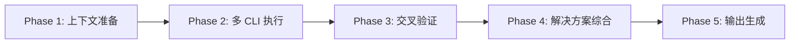

# cli-discuss

> **分类**: CLI-Related
> **源文件**: [.claude/agents/cli-discuss-agent.md](../../.claude/agents/cli-discuss-agent.md)

## 概述

**CLI Discuss Agent** 是一个多 CLI 协作讨论 Agent，具有交叉验证和解决方案综合能力。它编排 5 阶段工作流：上下文准备 → CLI 执行 → 交叉验证 → 综合 → 输出。

**核心能力**:
- **多 CLI 编排** - 调用 Gemini、Codex、Qwen 获取不同视角
- **交叉验证** - 比较发现，识别一致/不一致
- **解决方案综合** - 合并方法，按共识评分排名
- **上下文丰富** - ACE 语义搜索补充上下文

**讨论模式**:
- `initial` → 第一轮，建立基线分析（并行执行）
- `iterative` → 基于用户反馈的后续轮次（并行 + 恢复）
- `verification` → 交叉验证特定方法（串行执行）

## 工作流程



### Phase 1: 上下文准备

**输入**:
- `task_description` - 用户的任务或需求
- `round_number` - 当前讨论轮次
- `session` - 会话信息
- `ace_context` - ACE 搜索结果
- `previous_rounds` - 之前轮次的结果（可选）
- `user_feedback` - 上一轮的用户反馈（可选）
- `cli_config` - CLI 配置（tools, timeout, mode）

### Phase 2: 多 CLI 执行

**并行执行**（默认）:
- 同时调用多个 CLI 工具
- 收集不同视角的分析
- 使用 fallback 链处理失败

**串行执行**（verification 模式）:
- 顺序调用 CLI
- 后续 CLI 基于前序结果

### Phase 3: 交叉验证

**比较发现**:
- 识别一致点（agreements）
- 识别不一致点（disagreements）
- 解决冲突（resolution）

### Phase 4: 解决方案综合

**输出结构**:

```json
{
  "solutions": [
    {
      "name": "解决方案名称",
      "source_cli": ["gemini", "codex"],
      "feasibility": 0.85,
      "effort": "low|medium|high",
      "risk": "low|medium|high",
      "summary": "分析摘要",
      "implementation_plan": {
        "approach": "高层技术方法",
        "tasks": [...],
        "execution_flow": "T1 → T2 → T3",
        "milestones": [...]
      },
      "dependencies": {...},
      "technical_concerns": [...]
    }
  ],
  "convergence": {
    "score": 0.75,
    "recommendation": "converged|continue|user_input_needed"
  },
  "cross_verification": {...},
  "clarification_questions": [...]
}
```

### Phase 5: 输出生成

**输出路径**: `{session.folder}/rounds/{round_number}/synthesis.json`

## 使用场景

### 什么时候使用这个 Agent

- **复杂决策**: 需要多个 AI 视角的复杂技术决策
- **架构讨论**: 多方案对比的架构讨论
- **交叉验证**: 需要验证特定方案的可行性
- **迭代优化**: 基于反馈的多轮讨论

## 与其他 Agent 的协作

| 协作 Agent | 协作方式 |
|------------|----------|
| cli-planning-agent | 类似，但专注于规划而非讨论 |
| cli-explore-agent | 提供 ACE 上下文 |

## 关联组件

- **相关 Skills**: [workflow-plan](../skills/workflow-plan.md)
- **相关 Agents**: [cli-planning-agent](cli-planning-agent.md), [cli-explore-agent](cli-explore-agent.md)

## 最佳实践

1. **使用并行模式**: 提高效率
2. **交叉验证关键发现**: 确保可靠性
3. **跟踪收敛分数**: 判断是否需要继续
4. **生成澄清问题**: 促进用户参与
5. **记录解决方案来源**: 追溯每个方案的 CLI 来源
