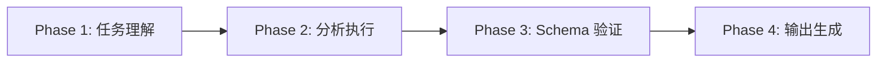

# cli-explore

> **分类**: Analysis
> **源文件**: [.claude/agents/cli-explore-agent.md](../../.claude/agents/cli-explore-agent.md)

## 概述

**CLI Explore Agent** 是一个只读代码探索 Agent，采用双源分析策略（Bash + Gemini CLI）。它编排 4 阶段工作流：任务理解 → 分析执行 → Schema 验证 → 输出生成。

**核心能力**:
- **结构分析** - 通过 Bash 工具进行模块发现、文件模式、符号清单
- **语义理解** - 通过 Gemini/Qwen CLI 进行设计意图、架构模式分析
- **依赖映射** - 导入/导出图、循环检测、耦合分析
- **结构化输出** - 符合 Schema 的 JSON 生成和验证

**分析模式**:
- `quick-scan` → 仅 Bash（10-30s）
- `deep-scan` → Bash + Gemini 双源（2-5min）
- `dependency-map` → 图构建（3-8min）

## 工作流程



### Phase 1: 任务理解

**从 Prompt 提取**:
- 分析目标和范围
- 分析模式（quick-scan / deep-scan / dependency-map）
- 输出文件路径
- Schema 文件路径
- 额外要求和约束

**从关键词确定分析深度**:
- 快速查找、结构概览 → quick-scan
- 深度分析、设计意图、架构 → deep-scan
- 依赖、影响分析、耦合 → dependency-map

### Phase 2: 分析执行

**可用工具**:
- `Read()` - 加载 package.json, requirements.txt 等
- `rg` - 快速内容搜索
- `Grep` - 回退模式匹配
- `Glob` - 文件模式匹配
- `Bash` - Shell 命令

**Bash 结构扫描**:

```bash
# 项目结构
ccw tool exec get_modules_by_depth '{}'

# 模式发现
rg "^export (class|interface|function) " --type ts -n
rg "^(class|def) \w+" --type py -n
```

**Gemini 语义分析**（deep-scan, dependency-map）:

```bash
ccw cli -p "
PURPOSE: {from prompt}
TASK: {from prompt}
MODE: analysis
CONTEXT: @**/*
EXPECTED: {from prompt}
" --tool gemini --mode analysis --cd {dir}
```

**回退链**: Gemini → Qwen → Codex → Bash-only

### Phase 3: Schema 验证（强制）

**当指定 Schema 文件时，此阶段是强制的。**

**验证清单**:
- [ ] 根结构匹配 Schema（数组 vs 对象）
- [ ] 所有必需字段存在
- [ ] 字段名精确匹配（区分大小写）
- [ ] 枚举值精确匹配
- [ ] 嵌套结构遵循 Schema 模式
- [ ] 数据类型正确

**文件理由验证**（relevant_files 必需）:
- `rationale`（必需，>10 字符）: 与探索主题相关的具体原因
- `role`（必需，枚举）: 结构分类
- `discovery_source`（可选）: 如何发现该文件

### Phase 4: 输出生成

**Agent 输出**:
- 任务完成状态
- 关键发现
- 输出文件路径

**文件输出**:
- 严格符合 Schema
- JSON 格式

## 使用场景

### 什么时候使用这个 Agent

- **代码探索**: 快速了解代码库结构
- **深度分析**: 理解设计意图和架构模式
- **依赖分析**: 构建依赖图和影响分析
- **Schema 输出**: 需要符合特定 Schema 的结构化输出

## 与其他 Agent 的协作

| 协作 Agent | 协作方式 |
|------------|----------|
| context-search-agent | 类似功能，更全面的上下文收集 |
| cli-discuss-agent | 下游，使用探索结果 |

## 关联组件

- **相关 Skills**: [workflow-plan](../skills/workflow-plan.md)
- **相关 Agents**: [context-search](context-search.md), [cli-discuss](cli-discuss.md)

## 最佳实践

1. **选择合适的模式**: quick-scan 快速，deep-scan 深入
2. **遵循 Schema**: 输出必须严格符合 Schema
3. **使用双源综合**: 结合 Bash 精确性和 Gemini 语义理解
4. **验证文件理由**: 每个文件必须有具体理由
5. **记录发现来源**: 标记 discovery_source 便于追溯
