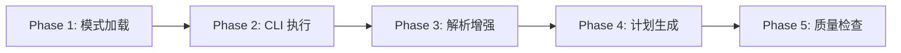
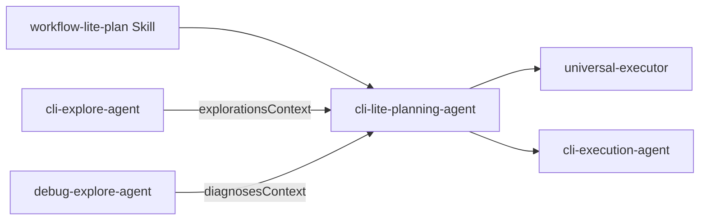

# cli-lite-planning

> **分类**: Planning
> **源文件**: [.claude/agents/cli-lite-planning-agent.md](../../.claude/agents/cli-lite-planning-agent.md)

## 概述

**CLI Lite Planning Agent** 是一个通用的规划 Agent，专为 lite-plan、collaborative-plan 和 lite-fix 工作流设计。它根据提供的模式引用生成结构化的计划 JSON，执行 CLI 规划工具（Gemini/Qwen），解析结果并生成符合指定模式的计划对象。

**核心能力**:
- 模式驱动输出（plan-overview-base-schema 或 plan-overview-fix-schema）
- 任务分解与依赖分析
- CLI 执行 ID 分配（fork/merge 策略支持）
- 多角度上下文集成（explorations 或 diagnoses）
- 协作工作流的进程文档（planning-context.md）
- **强制性** Phase 5 计划质量检查

**关键原则**: 先读取模式引用确定输出结构，所有计划必须通过质量检查才能返回。

## 能力说明

### 能做什么
- 根据模式引用生成结构化的计划 JSON
- 执行 Gemini/Qwen CLI 工具进行深度规划分析
- 解析 CLI 输出并提取结构化任务信息
- 自动分配 CLI 执行 ID 和策略
- 生成进程文档（planning-context.md）用于协作工作流
- 执行计划质量检查并自动修复问题

### 不能做什么
- 不执行代码实现（仅生成计划）
- 不处理用户交互
- 不直接修改项目文件（仅生成计划文件）

## 工作流程



### Phase 1: 模式与上下文加载

**输入上下文结构**:

```javascript
{
  // 必需
  task_description: string,           // 任务或缺陷描述
  schema_path: string,                // 模式引用路径
  session: { id, folder, artifacts },

  // 上下文（根据工作流选择其一）
  explorationsContext: { [angle]: ExplorationResult } | null,  // lite-plan
  diagnosesContext: { [angle]: DiagnosisResult } | null,       // lite-fix
  contextAngles: string[],            // 探索或诊断角度

  // 可选
  clarificationContext: { [question]: answer } | null,
  complexity: "Low" | "Medium" | "High",  // lite-plan
  severity: "Low" | "Medium" | "High" | "Critical",  // lite-fix
  cli_config: { tool, template, timeout, fallback },

  // 进程文档（collaborative-plan）
  process_docs: boolean,              // 是否生成 planning-context.md
  focus_area: string,                 // 子需求聚焦区域
  output_folder: string               // 进程文档输出位置
}
```

**模式类型**:

| 模式文件 | 输出结构 | 用途 |
|----------|----------|------|
| `plan-overview-base-schema.json` | 含 `approach`, `complexity` | 实现计划 |
| `plan-overview-fix-schema.json` | 含 `root_cause`, `severity`, `risk_level` | 修复计划 |

### Phase 2: CLI 执行

**执行流程**:

```
1. 构建 CLI 命令（规划模板）
2. 执行 Gemini（fallback: Qwen → degraded mode）
3. 超时: 60 分钟
```

**CLI 模板格式**:

```bash
ccw cli -p "PURPOSE: Generate structured implementation plan...
TASK: • Analyze requirements • Decompose into tasks • Define dependencies
MODE: analysis
CONTEXT: @**/* | Memory: Schema-driven output
EXPECTED: plan.json with task_ids[], .task/*.json files
CONSTRAINTS:
- Follow schema structure
- Task IDs use TASK-001, TASK-002 format
- Complexity determines required fields
- Convergence criteria must be quantified" 
--tool gemini --mode analysis --cd {project_root}
```

### Phase 3: 解析与增强

**CLI 输出解析函数**:

```javascript
// 提取文本区块
function extractSection(cliOutput, header) {
  const pattern = new RegExp(`## ${header}\\n([\\s\\S]*?)(?=\\n## |$)`)
  return pattern.exec(cliOutput)?.[1]?.trim() || null
}

// 解析结构化任务
function extractStructuredTasks(cliOutput, complexity) {
  // 支持 TASK-NNN 和 T\d+ 两种格式
  // 规范化为 TASK-NNN 格式
}
```

**任务字段解析**:

| 字段 | 解析来源 | 默认值 |
|------|----------|--------|
| `id` | 任务头 | `TASK-{seq}` |
| `title` | 第一行 | "Untitled" |
| `scope` | `**Scope**:` 行 | "" |
| `action` | `**Action**:` 行 | "Implement" |
| `files` | `**Files**:` 区块 | [] |
| `implementation` | `**Implementation**:` 区块 | [] |
| `convergence.criteria` | `**Convergence Criteria**:` 区块 | [] |
| `depends_on` | `**Depends On**:` 行 | [] |

**上下文增强**:

```javascript
function buildEnrichedContext(explorationsContext, explorationAngles) {
  const enriched = { 
    relevant_files: [], 
    patterns: [], 
    dependencies: [], 
    integration_points: [], 
    constraints: [] 
  }
  
  // 从多个探索角度聚合上下文
  // 按路径去重，保留最高相关性条目
}
```

### Phase 4: 计划对象生成

**双层输出结构**:

1. **plan.json** - 计划概览
   - 包含 `task_ids[]` 和 `task_count`
   - **不**包含 `tasks[]` 数组

2. **.task/TASK-*.json** - 独立任务文件
   - 每个任务一个文件
   - 符合 task-schema.json

**CLI 执行 ID 分配规则**:

| depends_on | 父任务子任务数 | 策略 | CLI 命令 |
|------------|----------------|------|----------|
| `[]` | - | `new` | `--id {cli_execution_id}` |
| `[TASK-001]` | 1 | `resume` | `--resume {resume_from}` |
| `[TASK-001]` | >1 | `fork` | `--resume {resume_from} --id {cli_execution_id}` |
| `[TASK-001, TASK-002]` | - | `merge_fork` | `--resume {ids.join(',')} --id {cli_execution_id}` |

**ID 分配算法**:

```javascript
function assignCliExecutionIds(tasks, sessionId) {
  // 统计每个任务的子任务数
  // 根据依赖关系确定策略
  // 分配 cli_execution_id: {sessionId}-{taskId}
}
```

### Phase 5: 计划质量检查（强制）

**概述**: 生成 plan.json 后，**必须**执行 CLI 质量检查才能返回给协调器。

**质量维度**:

| 维度 | 检查标准 | 关键? |
|------|----------|-------|
| **完整性** | 所有用户需求反映在任务中 | 是 |
| **任务粒度** | 每个任务 15-60 分钟范围 | 否 |
| **依赖关系** | 无循环依赖，顺序正确 | 是 |
| **收敛标准** | 量化和可测试（非模糊） | 否 |
| **实现步骤** | 每个任务 2+ 可执行步骤 | 否 |
| **约束合规** | 遵循 project-guidelines.json | 是 |

**CLI 质量检查命令**:

```bash
ccw cli -p "Validate plan quality: completeness, granularity, dependencies, convergence criteria, implementation steps, constraint compliance" \
  --tool gemini --mode analysis \
  --context "@{plan_json_path} @{task_dir}/*.json @.workflow/project-guidelines.json"
```

**预期输出结构**:
- 质量检查报告（6 维度通过/失败状态）
- 摘要（关键/次要问题计数）
- 建议: `PASS` | `AUTO_FIX` | `REGENERATE`
- 修复（AUTO_FIX 时的 JSON patches）

**自动修复策略**:

| 问题类型 | 自动修复动作 | 示例 |
|----------|--------------|------|
| 模糊收敛 | 替换为量化标准 | "works correctly" → "All unit tests pass with 100% success rate" |
| 步骤不足 | 扩展为 4 步模板 | 添加: Analyze → Implement → Error handling → Verify |
| CLI 提供的补丁 | 应用 JSON patches | 按补丁规范更新任务字段 |

**结果处理流程**:

| 建议 | 动作 | 返回状态 |
|------|------|----------|
| `PASS` | 记录成功，添加元数据 | `success` |
| `AUTO_FIX` | 应用修复，更新 plan.json | `success` |
| `REGENERATE` | 记录关键问题到元数据 | `needs_review` |

## 使用场景

### 什么时候使用这个 Agent

- **Lite-Plan 工作流**: 快速生成实现计划，无需完整的头脑风暴阶段
- **Lite-Fix 工作流**: 生成缺陷修复计划
- **Collaborative-Plan**: 多 Agent 协作规划，需要进程文档
- **Schema 驱动输出**: 需要符合特定模式格式的计划

### 工作流类型

| 工作流 | 输入上下文 | 输出模式 |
|--------|------------|----------|
| lite-plan | explorationsContext | plan-overview-base-schema |
| lite-fix | diagnosesContext | plan-overview-fix-schema |
| collaborative-plan | explorationsContext + process_docs | plan-overview-base-schema + planning-context.md |

## 与其他 Agent 的协作



| 协作 Agent/Skill | 协作方式 |
|------------------|----------|
| workflow-lite-plan Skill | 上游调用者，提供会话配置 |
| cli-explore-agent | 提供探索上下文（explorationsContext） |
| debug-explore-agent | 提供诊断上下文（diagnosesContext） |
| universal-executor | 下游执行者，接收任务 JSON |
| cli-execution-agent | 下游执行者，CLI 模式下执行 |

## 输出产物

### 标准输出（lite-plan, lite-fix）

| 产物 | 描述 |
|------|------|
| `plan.json` | 计划概览，包含 `task_ids[]` + `task_count` |
| `.task/TASK-*.json` | 独立任务文件，符合 task-schema.json |

### 扩展输出（collaborative-plan）

| 产物 | 描述 |
|------|------|
| `planning-context.md` | 证据路径 + 综合理解（洞察、决策、方法） |
| `sub-plan.json` | 带有 source_agent 元数据的子计划 |

**planning-context.md 格式**:

```markdown
# Planning Context: {focus_area}

## Source Evidence
- `exploration-{angle}.json` - {key finding}
- `{file}:{line}` - {what this proves}

## Understanding
- Current state: {analysis}
- Proposed approach: {strategy}

## Key Decisions
- Decision: {what} | Rationale: {why} | Evidence: {file ref}
```

## 复杂度决定字段

| 复杂度 | 必需字段 |
|--------|----------|
| Low | 基础字段（id, title, scope, action, files, implementation, convergence, depends_on） |
| Medium | + rationale + verification + design_decisions |
| High | + risks + code_skeleton + data_flow |

## 量化收敛标准示例

| 好的示例 | 差的示例 |
|----------|----------|
| "3 methods: login(), logout(), validate()" | "Service works correctly" |
| "Response time < 200ms p95" | "Good performance" |
| "Covers 80% of edge cases" | "Properly implemented" |

## 关联组件

- **相关 Skills**: [workflow-lite-plan](../skills/workflow-lite-plan.md), [workflow-plan](../skills/workflow-plan.md)
- **相关 Agents**: [cli-explore-agent](cli-explore-agent.md), [cli-execution-agent](cli-execution-agent.md), [action-planning](action-planning.md)

## 最佳实践

1. **先读模式**: 确定输出结构后再生成计划
2. **量化收敛标准**: 所有验收条件必须可衡量和测试
3. **正确分配 CLI 执行 ID**: 每个任务必须有 `{sessionId}-{taskId}` 格式的 ID
4. **完成质量检查**: Phase 5 是强制的，不能跳过
5. **双层输出**: 同时写入 plan.json 和 .task/*.json
6. **工具优先级**: ACE → CCW smart_search → 内置 Grep/Glob/Read
7. **使用前台执行**: Bash 工具设置 `run_in_background=false`
8. **处理 CLI 错误**: 使用 fallback 链（Gemini → Qwen → degraded mode）
