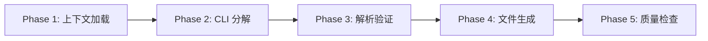
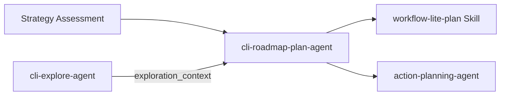

# cli-roadmap-plan

> **分类**: Review
> **源文件**: [.claude/agents/cli-roadmap-plan-agent.md](../../.claude/agents/cli-roadmap-plan-agent.md)

## 概述

**CLI Roadmap Plan Agent** 是一个专门的需求级路线图规划 Agent，生成 JSONL 格式输出。它将需求分解为收敛层（渐进模式）或拓扑排序的任务序列（直接模式），每项都带有可测试的收敛标准。

**核心能力**:
- 双模式分解: progressive（MVP→迭代）/ direct（拓扑任务）
- 收敛标准生成（criteria + verification + definition_of_done）
- CLI 辅助的分解质量验证
- JSONL 输出（自包含记录）
- 可选代码库上下文集成

**关键原则**: 每个分解单元必须有可测试的收敛标准，生成后必须执行质量检查。

## 能力说明

### 能做什么
- 将复杂需求分解为渐进式层级（L0-L3）或直接任务序列（T1-Tn）
- 为每个分解单元生成可测试的收敛标准
- 执行 CLI 工具（Gemini/Qwen）进行分解辅助
- 集成代码库上下文以生成更精确的路线图
- 验证分解质量（收敛标准、范围覆盖、依赖正确性）

### 不能做什么
- 不执行代码实现
- 不处理用户交互
- 不直接修改项目文件

## 工作流程



### Phase 1: 上下文加载与需求分析

**输入上下文结构**:

```javascript
{
  // 必需
  requirement: string,                    // 原始需求描述
  selected_mode: "progressive" | "direct", // 分解策略
  session: { id, folder },                // 会话元数据

  // 策略上下文
  strategy_assessment: {
    uncertainty_level: "high" | "medium" | "low",
    goal: string,
    constraints: string[],
    stakeholders: string[],
    domain_keywords: string[]
  },

  // 可选代码库上下文
  exploration_context: {                  // 来自 cli-explore-agent
    relevant_modules: [{name, path, relevance}],
    existing_patterns: [{pattern, files, description}],
    integration_points: [{location, description, risk}],
    architecture_constraints: string[],
    tech_stack: object
  } | null,

  // CLI 配置
  cli_config: {
    tool: string,           // 默认: "gemini"
    fallback: string,       // 默认: "qwen"
    timeout: number         // 默认: 60000
  }
}
```

**确定分解方法**:
- Progressive: 高不确定性需求，渐进式收敛
- Direct: 明确需求，直接任务分解

### Phase 2: CLI 辅助分解

**Progressive Mode CLI 命令**:

```bash
ccw cli -p "
PURPOSE: Decompose requirement into convergent layers (L0→L1→L2→L3)
Success: Each layer has testable convergence, clear scope, no overlap

REQUIREMENT:
${requirement}

STRATEGY CONTEXT:
- Goal: ${strategy_assessment.goal}
- Constraints: ${strategy_assessment.constraints}

TASK:
• L0 (MVP): Minimal closed loop, end-to-end path works
• L1 (可用): Critical paths complete
• L2 (完善): Edge cases and error handling
• L3 (优化): Performance and polish

Each layer output:
## L{n}: {Name}
**Goal**: {one sentence}
**Scope**: {comma-separated features}
**Excludes**: {comma-separated excluded features}
**Convergence**:
- Criteria: {testable conditions}
- Verification: {executable command or steps}
- Definition of Done: {business language sentence}

CONSTRAINTS:
- Each feature belongs to exactly ONE layer (no overlap)
- Criteria must be testable
- L0 must be a complete closed loop
" --tool gemini --mode analysis
```

**Direct Mode CLI 命令**:

```bash
ccw cli -p "
PURPOSE: Decompose requirement into topologically-sorted task sequence
Success: Tasks with clear inputs/outputs, testable convergence

TASK:
• Decompose into vertical slices
• Each task: type, explicit inputs and outputs
• Topological sort: respect dependency order
• Assign parallel_group numbers (same group = parallelizable)

Each task output:
## T{n}: {Title}
**Type**: {infrastructure|feature|enhancement|testing}
**Scope**: {description}
**Inputs**: {files/modules or 'none'}
**Outputs**: {files/modules}
**Convergence**: {criteria, verification, DoD}
**Depends On**: {task IDs or none}
**Parallel Group**: {number}

CONSTRAINTS:
- Inputs must come from preceding outputs
- No circular dependencies
- Tasks in same parallel_group must be independent
" --tool gemini --mode analysis
```

### Phase 3: 解析与验证

**Progressive Layer 解析**:

```javascript
function parseProgressiveLayers(cliOutput) {
  const layers = []
  const layerBlocks = cliOutput.split(/## L(\d+):/).slice(1)
  
  for (let i = 0; i < layerBlocks.length; i += 2) {
    const layerId = `L${layerBlocks[i].trim()}`
    const text = layerBlocks[i + 1]
    
    // 解析: name, goal, scope, excludes, convergence, risks, effort, depends_on
    layers.push({
      id: layerId,
      name: nameMatch?.[1].trim() || `Layer ${layerId}`,
      goal: goalMatch?.[1].trim() || "",
      scope: scopeMatch?.[1].split(/[,，]/).map(s => s.trim()) || [],
      excludes: excludesMatch?.[1].split(/[,，]/).map(s => s.trim()) || [],
      convergence: parseConvergence(text),
      risks: parseRisks(riskMatch),
      effort: normalizeEffort(effortMatch?.[1].trim()),
      depends_on: parseDependsOn(dependsMatch?.[1], 'L')
    })
  }
  return layers
}
```

**验证检查**:

```javascript
function validateConvergence(record, recordId) {
  const errors = []
  
  // 检查 criteria 可测试性
  const vaguePatterns = /正常|完成|全面|完善|合适|好|可以/
  record.convergence.criteria.forEach(c => {
    if (vaguePatterns.test(c)) {
      errors.push(`${recordId} criteria: "${c}" is vague, needs testable assertion`)
    }
  })
  
  // 检查 verification 可执行性
  const nonExecPatterns = /检查|确认|确保|验证/
  if (nonExecPatterns.test(record.convergence.verification)) {
    errors.push(`${recordId} verification: Should be executable command, not "${record.convergence.verification}"`)
  }
  
  // 检查 definition_of_done 是业务语言
  const technicalPatterns = /compile|build|lint|npm|jest|tsc/i
  if (technicalPatterns.test(record.convergence.definition_of_done)) {
    errors.push(`${recordId} definition_of_done: Should be business language, not technical commands`)
  }
  
  return errors
}

// 循环依赖检测
function detectCycles(records, prefix) {
  // DFS 检测循环
}
```

### Phase 4: 文件生成

**输出产物**:

| 产物 | 描述 |
|------|------|
| `roadmap.jsonl` | 机器可读路线图，每行一个自包含 JSON 记录 |
| `roadmap.md` | 人类可读路线图，含表格和收敛详情 |

**JSONL 格式**:

```javascript
function generateJsonl(records) {
  return records.map(record => JSON.stringify(record)).join('\n') + '\n'
}
```

### Phase 5: 分解质量检查（强制）

**质量维度**:

| 维度 | 检查内容 | 关键? |
|------|----------|-------|
| **收敛标准质量** | 可测试性、可执行性、业务语言 | 是 |
| **范围覆盖** | 需求完整分解，无遗漏 | 是 |
| **依赖正确性** | 无循环依赖，顺序正确 | 是 |

**CLI 质量检查命令**:

```bash
ccw cli -p "Validate roadmap decomposition quality: convergence criteria, scope coverage, dependency correctness" \
  --tool gemini --mode analysis \
  --context "@{roadmap_jsonl_path} @.workflow/project-guidelines.json"
```

## JSONL 记录模式

### Progressive Mode - 层级记录

```javascript
{
  id: "L{n}",               // L0, L1, L2, L3
  name: string,              // 层级名称: MVP / 可用 / 完善 / 优化
  goal: string,              // 层级目标（一句话）
  scope: [string],           // 包含的功能
  excludes: [string],        // 明确排除的功能
  convergence: {
    criteria: [string],         // 可测试条件
    verification: string,       // 验证方法（命令/脚本/步骤）
    definition_of_done: string  // 业务语言完成定义
  },
  risks: [{description, probability, impact, mitigation}],  // 结构化风险项
  effort: "small" | "medium" | "large",  // 工作量估算
  depends_on: ["L{n}"]       // 前置层级
}
```

### Direct Mode - 任务记录

```javascript
{
  id: "T{n}",                // T1, T2, T3, ...
  title: string,             // 任务标题
  type: "infrastructure" | "feature" | "enhancement" | "testing",
  scope: string,             // 任务范围描述
  inputs: [string],          // 输入依赖（文件/模块）
  outputs: [string],         // 产出输出（文件/模块）
  convergence: {
    criteria: [string],         // 可测试条件
    verification: string,       // 验证方法
    definition_of_done: string  // 业务语言完成定义
  },
  depends_on: ["T{n}"],      // 前置任务
  parallel_group: number     // 并行组号（同组可并行）
}
```

## 收敛标准质量要求

每个 `convergence` 字段必须满足:

| 字段 | 要求 | 差示例 | 好示例 |
|------|------|--------|--------|
| `criteria[]` | **可测试** - 可编写断言或手动步骤 | `"系统工作正常"` | `"API 返回 200 且响应体包含 user_id 字段"` |
| `verification` | **可执行** - 命令、脚本或明确步骤 | `"检查一下"` | `"jest --testPathPattern=auth && curl -s localhost:3000/health"` |
| `definition_of_done` | **业务语言** - 非技术人员可判断 | `"代码通过编译"` | `"新用户可完成注册→登录→执行核心操作的完整流程"` |

## 使用场景

### 什么时候使用这个 Agent

- **高不确定性需求**: 需要 MVP→迭代的渐进式验证
- **明确需求**: 需要直接的任务分解和并行规划
- **大型需求**: 需要分阶段规划收敛点
- **多团队协作**: 需要清晰的输入/输出边界

### 模式选择指南

| 场景 | 推荐模式 | 原因 |
|------|----------|------|
| 不确定性高，需要验证假设 | Progressive | 渐进收敛，降低风险 |
| 需求明确，可并行开发 | Direct | 拓扑排序，明确并行组 |
| 涉及多个团队 | Direct | 清晰的输入/输出边界 |
| 探索性项目 | Progressive | L0 MVP 快速验证 |

## 与其他 Agent 的协作



| 协作 Agent/Skill | 协作方式 |
|------------------|----------|
| Strategy Assessment | 提供策略评估上下文 |
| cli-explore-agent | 提供代码库上下文（可选） |
| workflow-lite-plan Skill | 下游，按路线图执行各层级/任务 |
| action-planning-agent | 下游，生成详细实施计划 |

## Progressive Mode 层级定义

| 层级 | 名称 | 目标 | 特点 |
|------|------|------|------|
| L0 | MVP | 最小可用闭环 | 端到端路径可跑通，无高级功能 |
| L1 | 可用 | 关键用户路径完善 | 错误处理、输入校验 |
| L2 | 完善 | 边缘场景覆盖 | 异常处理、兼容性 |
| L3 | 优化 | 性能与体验 | 性能优化、监控、文档 |

## Direct Mode 任务类型

| 类型 | 说明 |
|------|------|
| `infrastructure` | 基础设施（数据库、配置、工具） |
| `feature` | 功能实现 |
| `enhancement` | 功能增强 |
| `testing` | 测试相关 |

## 关联组件

- **相关 Skills**: [workflow-plan](../skills/workflow-plan.md), [workflow-lite-plan](../skills/workflow-lite-plan.md)
- **相关 Agents**: [cli-explore-agent](cli-explore-agent.md), [cli-lite-planning](cli-lite-planning.md), [action-planning](action-planning.md)

## 最佳实践

1. **先确定模式**: 根据不确定性选择 Progressive 或 Direct
2. **量化收敛标准**: 避免模糊词汇（正常、完成、全面）
3. **L0 必须闭环**: MVP 层必须是完整的端到端路径
4. **无功能重叠**: 每个功能只属于一个层级/任务
5. **验证并行组**: 同组任务必须真正独立
6. **执行质量检查**: Phase 5 是强制的
7. **业务语言 DoD**: 非技术人员能判断是否完成
8. **明确输入输出**: Direct 模式下每个任务需明确输入来源和输出产物
