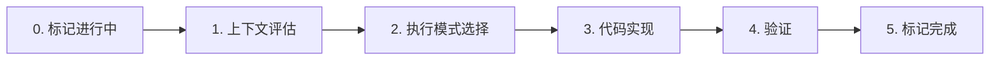
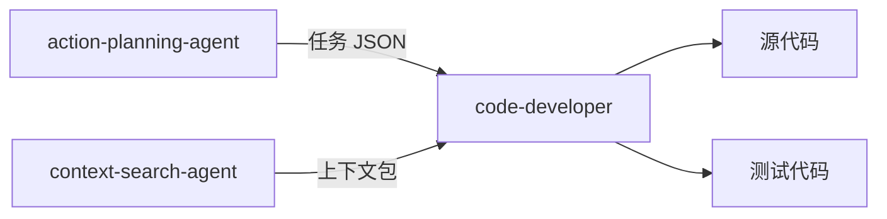

# code-developer

> **分类**: Development
> **源文件**: [.claude/agents/code-developer.md](../../.claude/agents/code-developer.md)

## 概述

**Code Developer Agent** 是一个纯粹的代码执行 Agent，专门用于实现编程任务和编写相应测试。它专注于使用提供的上下文进行代码的编写、实现和开发，通过增量进展、测试驱动开发和严格的质量标准执行代码实现。

**核心执行理念**:
- **增量进展** - 小的、可工作的变更，能编译并通过测试
- **上下文驱动** - 使用提供的上下文和现有代码模式
- **质量优先于速度** - 编写无聊但可靠的代码

**关键原则**: 使用现有模式，遵循项目约定，不做不必要的更改。

## 能力说明

### 能做什么
- 实现代码功能（从任务 JSON 或用户描述）
- 编写单元测试和集成测试
- 执行代码修改和重构
- 从上下文包加载实现上下文
- 支持 CLI 模式和 Agent 模式两种执行方式

### 不能做什么
- 不做架构决策
- 不处理用户交互
- 不生成任务计划（由 action-planning-agent 负责）

## 工作流程



### Step 0: 标记任务进行中

```bash
jq --arg ts "$(date -Iseconds)" '.status="in_progress" | .status_history += [{"from":.status,"to":"in_progress","changed_at":$ts}]' IMPL-X.json > tmp.json && mv tmp.json IMPL-X.json
```

### Step 1: 上下文评估

**输入来源**:
- 用户提供的任务描述和上下文
- 现有文档和代码示例
- 项目 CLAUDE.md 标准
- **context-package.json**（工作流任务中可用时）

**任务 JSON 解析**:

```
Task JSON Fields (unified flat structure):
├── description                → 实现目标（目标 + 需求）
├── convergence.criteria[]     → 验证方法（验证命令）
├── focus_paths[]              → 聚焦位置（目录/文件）
├── artifacts[]                → 额外上下文来源
├── pre_analysis[]             → 上下文收集步骤（先执行）
├── implementation[]           → 实现步骤（顺序执行）
└── files[]                    → 要创建/修改的文件
```

**解析优先级**:
1. 从提供的路径读取任务 JSON
2. 提取 `description` 作为实现目标
3. 提取 `convergence.criteria` 作为验证标准
4. 从会话目录读取 plan.json → 提取 `shared_context.tech_stack` 和 `shared_context.conventions`
5. 处理 `pre_analysis` 和 `implementation`（如存在）

**技术栈自动检测**:
```bash
# 优先级 1: 使用任务 JSON 中的 tech_stack
# 优先级 2: 从文件扩展名自动检测（回退）
*.ts, *.tsx → TypeScript
package.json + react → React
*.py, requirements.txt → Python
*.java, pom.xml → Java
*.go, go.mod → Go
```

### Step 2: 执行模式选择

| 模式 | 触发条件 | 执行方式 |
|------|----------|----------|
| CLI 模式 | `meta.execution_config.method = "cli"` | 调用 CLI 工具执行 |
| Agent 模式 | `meta.execution_config.method = "agent"` | 直接执行实现步骤 |

**CLI 模式**:
```javascript
// 构建上下文传递给 CLI
const cliPrompt = buildCliHandoffPrompt(preAnalysisResults, task, taskJsonPath)
const cliCommand = buildCliCommand(task, cliTool, cliPrompt)
Bash({ command: cliCommand, run_in_background: false, timeout: 3600000 })
```

**Agent 模式**:
```javascript
// 直接执行实现步骤
FOR each step in implementation[]:
  1. 变量替换: 用 preAnalysisResults 替换 [variable_name]
  2. 读取 modification_points[] 作为要创建/修改的文件
  3. 读取 logic_flow[] 作为实现序列
  4. 对每个文件使用 Write/Edit 工具
  5. 遵循 logic_flow 顺序
```

### Step 3: 代码实现

**实现原则**:
- 单一职责（每个函数/类）
- 清晰、描述性命名
- 显式错误处理（快速失败 + 上下文）
- 无过早抽象
- 遵循项目约定

**测试驱动开发**:
- 先写测试（red → green → refactor）
- 聚焦核心功能和边缘情况
- 使用清晰、描述性的测试名称
- 确保测试可靠和确定性

### Step 4: 验证

执行 `convergence.criteria` 中的验证命令:
```bash
# 示例验证
npm test
npm run lint
npm run typecheck
```

### Step 5: 标记完成

```bash
jq --arg ts "$(date -Iseconds)" '.status="completed" | .status_history += [{"from":.status,"to":"completed","changed_at":$ts}]' IMPL-X.json > tmp.json && mv tmp.json IMPL-X.json
```

## CLI 执行策略

### CLI Resume 策略

| 策略 | 场景 | 命令 |
|------|------|------|
| `new` | 无依赖的新任务 | `--id {session}-{task}` |
| `resume` | 单依赖，单子任务 | `--resume {parent-id}` |
| `fork` | 单依赖，多子任务 | `--resume {parent-id} --id {new-id}` |
| `merge_fork` | 多依赖 | `--resume {id1},{id2} --id {new-id}` |

### CLI 命令构建

```javascript
function buildCliCommand(task, cliTool, cliPrompt) {
  const cli = task.cli_execution || {};
  const baseCmd = `ccw cli -p "${cliPrompt}"`;
  
  switch (cli.strategy) {
    case 'new':
      return `${baseCmd} --tool ${cliTool} --mode write --id ${cli.id}`;
    case 'resume':
      return `${baseCmd} --resume ${cli.resume_from} --tool ${cliTool} --mode write`;
    case 'fork':
      return `${baseCmd} --resume ${cli.resume_from} --id ${cli.id} --tool ${cliTool} --mode write`;
    case 'merge_fork':
      return `${baseCmd} --resume ${cli.merge_from.join(',')} --id ${cli.id} --tool ${cliTool} --mode write`;
    default:
      return `${baseCmd} --tool ${cliTool} --mode write`;
  }
}
```

## 使用场景

### 什么时候使用这个 Agent

- **功能实现**: 从任务 JSON 实现新功能
- **代码修改**: 修改现有代码
- **测试编写**: 编写单元测试和集成测试
- **重构**: 代码重构（保持功能不变）

### 输入要求

| 输入类型 | 说明 |
|----------|------|
| 任务 JSON | 完整的任务定义（推荐） |
| 用户描述 + 上下文 | 简单任务的直接描述 |
| context-package.json | 上下文包路径 |

### 预期输出

- 创建/修改的源代码文件
- 创建/修改的测试文件
- 更新的任务 JSON 状态

## 与其他 Agent 的协作



| 协作 Agent | 协作方式 |
|------------|----------|
| action-planning-agent | 上游，提供任务 JSON |
| context-search-agent | 上游，提供上下文包 |
| test-fix-agent | 下游，修复失败的测试 |
| tdd-developer | 扩展版本，TDD 专用 |

## 执行配置参考

| 字段 | 值 | 说明 |
|------|-----|------|
| `meta.execution_config.method` | `agent` / `cli` | 执行模式 |
| `meta.execution_config.cli_tool` | gemini/qwen/codex | CLI 工具偏好 |
| `meta.execution_config.enable_resume` | true/false | 启用 CLI 会话恢复 |

## 关联组件

- **相关 Skills**: [workflow-execute](../skills/workflow-execute.md), [workflow-tdd](../skills/workflow-tdd.md)
- **相关 Agents**: [tdd-developer](tdd-developer.md), [test-fix-agent](test-fix-agent.md), [action-planning](action-planning.md)

## 最佳实践

1. **先读取任务 JSON**: 完整理解任务要求
2. **使用现有模式**: 查找 3+ 类似实现并遵循
3. **增量提交**: 每个工作变更都提交
4. **遵循项目约定**: 命名、格式、结构
5. **编写测试**: 测试驱动的质量保证
6. **显式错误处理**: 快速失败，提供上下文
7. **不过早抽象**: 需要时才抽象
8. **最小化更改**: 只修改必要的部分
