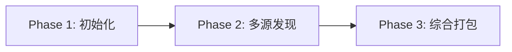
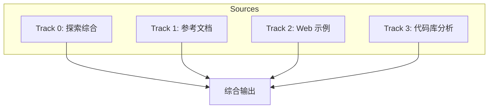
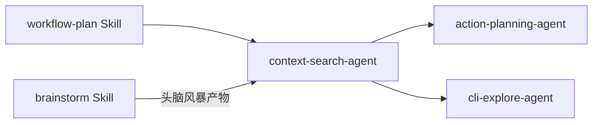

# context-search

> **分类**: Analysis
> **源文件**: [.claude/agents/context-search-agent.md](../../.claude/agents/context-search-agent.md)

## 概述

**Context Search Agent** 是一个智能上下文收集器，专门为开发任务执行多层文件发现、依赖分析，并生成标准化的上下文包及冲突风险评估。

**核心执行理念**:
- **自主发现** - 使用原生工具自我导向探索
- **多层搜索** - 广度优先覆盖 + 深度优先丰富
- **3 源策略** - 合并参考文档、Web 示例、现有代码
- **智能过滤** - 多因子相关性评分
- **标准化输出** - 生成 context-package.json

**关键原则**: 自动执行发现流程，无需用户干预，生成完整的上下文包。

## 能力说明

### 能做什么
- 多层上下文发现（项目文档、代码库、外部资源）
- 依赖图构建（内部 + 外部依赖）
- 冲突风险评估与缓解策略
- 头脑风暴产物集成
- 探索结果综合与去重
- 生成标准化上下文包

### 不能做什么
- 不执行代码修改
- 不做架构决策
- 不处理用户交互

## 工作流程



### Phase 1: 初始化与预分析

**1.1 上下文包检测**（优先执行）:

```javascript
// 如果有效包已存在，直接返回
const contextPackagePath = `.workflow/${session_id}/.process/context-package.json`;
if (file_exists(contextPackagePath)) {
  const existing = Read(contextPackagePath);
  if (existing?.metadata?.session_id === session_id) {
    return existing; // 立即返回，跳过所有处理
  }
}
```

**1.2 基础设置**:

```javascript
// 1. 初始化 CodexLens（如可用）
mcp__ccw-tools__codex_lens({ action: "init", path: "." })

// 2. 获取项目结构
bash(ccw tool exec get_modules_by_depth '{}')

// 3. 加载文档（如不在内存中）
if (!memory.has("CLAUDE.md")) Read(CLAUDE.md)
if (!memory.has("README.md")) Read(README.md)
```

**1.3 任务分析与范围确定**:
- 提取技术关键词（auth, API, database）
- 识别领域上下文（security, payment, user）
- 确定动作动词（implement, refactor, fix）
- 分类复杂度（simple, medium, complex）
- 映射关键词到模块/目录
- 识别文件类型（*.ts, *.py, *.go）
- 设置搜索深度和优先级

### Phase 2: 多源上下文发现



#### Track 0: 探索综合（可选）

**触发条件**: 会话 `.process/` 文件夹中存在 `explorations-manifest.json`

**目的**: 将原始探索数据转化为优先级排序、去重的洞察

```javascript
const manifestPath = `.workflow/active/${session_id}/.process/explorations-manifest.json`;
if (file_exists(manifestPath)) {
  const manifest = JSON.parse(Read(manifestPath));
  // 综合为:
  // - critical_files: 按优先级排序的文件
  // - patterns/integration_points: 去重
  // - conflict_indicators: 冲突指示器
}
```

#### Track 1: 参考文档（项目标准）

**工具**:
- `Read()` - 加载 CLAUDE.md, README.md, 架构文档
- `Bash(ccw tool exec get_modules_by_depth '{}')` - 项目结构
- `Glob()` - 查找文档文件

**用途**: Phase 0 基础设置

#### Track 2: Web 示例与最佳实践（MCP）

**工具**:
- `mcp__exa__get_code_context_exa(query, tokensNum)` - API 示例
- `mcp__exa__web_search_exa(query, numResults)` - 最佳实践

**用途**: 不熟悉的 API/库/模式

```javascript
// 获取代码示例
mcp__exa__get_code_context_exa({
  query: `${library} ${feature} implementation examples`,
  tokensNum: 5000
})

// 研究最佳实践
mcp__exa__web_search_exa({
  query: `${tech_stack} ${domain} best practices 2025`,
  numResults: 5
})
```

#### Track 3: 代码库分析

**5 层搜索策略**:

| 层级 | 目的 | 工具/方法 |
|------|------|-----------|
| Layer 1 | 文件模式发现 | CodexLens `search_files` 或 `find` |
| Layer 2 | 内容搜索 | CodexLens `search` 或 `rg` |
| Layer 3 | 语义模式 | 正则匹配定义 |
| Layer 4 | 依赖关系 | CodexLens `symbol` 提取 |
| Layer 5 | 配置与测试 | 搜索 config 文件和测试 |

**工具优先级**: CodexLens MCP > ripgrep > find > grep

### Phase 3: 综合、评估与打包

**3.1 相关性评分**:

```javascript
score = (0.4 × direct_match) +      // 文件名/路径匹配
        (0.3 × content_density) +    // 关键词频率
        (0.2 × structural_pos) +     // 架构角色
        (0.1 × dependency_link)      // 连接强度

// 过滤: 仅包含 score > 0.5
```

**3.2 依赖图构建**:

构建有向图:
- 直接依赖（显式导入）
- 传递依赖（最多 2 层）
- 可选依赖（仅类型, dev）
- 集成点（共享模块）
- 循环依赖（标记为风险）

**3.3 三源综合**:

```javascript
const context = {
  // 优先级: 项目文档 > 现有代码 > Web 示例
  architecture: ref_docs.patterns || code.structure,
  
  conventions: {
    naming: ref_docs.standards || code.actual_patterns,
    error_handling: ref_docs.standards || code.patterns || web.best_practices
  },
  
  tech_stack: {
    // 实际（package.json）优先
    language: code.actual.language,
    frameworks: merge_unique([ref_docs.declared, code.actual]),
    libraries: code.actual.libraries
  },
  
  // Web 示例填补空白
  supplemental: web.examples,
  best_practices: web.industry_standards
}
```

**冲突解决优先级**:
1. Architecture: 文档 > 代码 > Web
2. Conventions: 声明 > 实际 > 行业标准
3. Tech Stack: 实际（package.json）> 声明
4. Missing: 使用 Web 示例

**3.5 头脑风暴产物集成**:

```javascript
const brainstormDir = `.workflow/${session}/.brainstorming`;
if (dir_exists(brainstormDir)) {
  const artifacts = {
    guidance_specification: {...},
    role_analyses: [...],
    synthesis_output: {...},
    feature_index: {...},
    feature_specs: [...]
  }
}
```

## 输出产物

### context-package.json 结构

```json
{
  "metadata": {
    "session_id": "WFS-xxx",
    "description": "User authentication with OAuth2",
    "keywords": ["auth", "oauth2", "jwt"],
    "complexity": "medium",
    "generated_at": "2025-02-15T10:00:00Z"
  },
  "project_context": {
    "patterns": ["MVC", "Service Layer", "Repository Pattern"],
    "conventions": {
      "naming": "camelCase for variables, PascalCase for classes",
      "error_handling": "Custom error classes with status codes"
    },
    "tech_stack": {
      "language": "TypeScript",
      "frameworks": ["Express.js", "TypeORM"],
      "libraries": ["jsonwebtoken", "bcrypt"]
    }
  },
  "assets": {
    "critical_files": [
      {
        "path": "src/auth/AuthService.ts",
        "relevance": 0.95,
        "rationale": "Core authentication logic",
        "role": "modify_target"
      }
    ],
    "reference_files": [...],
    "test_files": [...]
  },
  "dependencies": {
    "internal": [
      {
        "from": "AuthController.ts",
        "to": "AuthService.ts",
        "type": "service-dependency"
      }
    ],
    "external": [
      {
        "package": "jsonwebtoken",
        "version": "^9.0.0",
        "usage": "JWT token operations"
      }
    ]
  },
  "brainstorm_artifacts": {
    "guidance_specification": {...},
    "role_analyses": [...],
    "feature_index": {...}
  },
  "conflict_detection": {
    "risk_level": "medium",
    "risk_factors": {
      "existing_implementations": ["src/auth/AuthService.ts"],
      "api_changes": true,
      "breaking_changes": ["Login response format changes"]
    },
    "affected_modules": ["auth", "user-model"],
    "mitigation_strategy": "Incremental refactoring with backward compatibility"
  },
  "exploration_results": {
    "manifest_path": ".workflow/active/{session}/.process/explorations-manifest.json",
    "exploration_count": 3,
    "angles": ["architecture", "dependencies", "testing"],
    "aggregated_insights": {
      "critical_files": [...],
      "conflict_indicators": [...],
      "constraints": [...]
    }
  }
}
```

## 工具库

### 1. 参考文档（项目标准）

| 工具 | 用途 |
|------|------|
| `Read()` | 加载 CLAUDE.md, README.md, 架构文档 |
| `Bash(ccw tool exec get_modules_by_depth '{}')` | 项目结构 |
| `Glob()` | 查找文档文件 |

### 2. Web 示例（MCP）

| 工具 | 用途 |
|------|------|
| `mcp__exa__get_code_context_exa(query, tokensNum)` | API 示例 |
| `mcp__exa__web_search_exa(query, numResults)` | 最佳实践 |

### 3. 代码库发现

**主要工具 (CCW CodexLens MCP)**:

| Action | 说明 |
|--------|------|
| `init` | 初始化目录索引 |
| `search` | 内容搜索（需要 query） |
| `search_files` | 文件名搜索，返回路径 |
| `symbol` | 提取文件符号（函数/类/变量） |
| `update` | 更新特定文件索引 |

**备用工具 (CLI)**:
- `rg` (ripgrep) - 快速内容搜索
- `find` - 文件发现
- `Grep` - 模式匹配

## 使用场景

### 什么时候使用这个 Agent

- **开发任务准备**: 需要收集项目上下文
- **新功能规划**: 需要了解现有架构和依赖
- **重构分析**: 需要评估冲突风险
- **外部集成**: 需要研究 API 示例和最佳实践

### 典型输入

```
Session: WFS-auth-oauth2
Task: Implement OAuth2 authentication with Google and GitHub providers
```

### 预期输出

```
Generated: .workflow/WFS-auth-oauth2/.process/context-package.json
- 15 critical files identified
- 8 external dependencies mapped
- Risk level: medium
- Mitigation strategy defined
```

## 与其他 Agent 的协作



| 协作 Agent/Skill | 协作方式 |
|------------------|----------|
| workflow-plan Skill | 上游调用者，提供会话配置 |
| brainstorm Skill | 提供头脑风暴产物 |
| action-planning-agent | 下游消费者，使用上下文包 |
| cli-explore-agent | 并行执行，提供探索结果 |

## 质量验证清单

完成前验证:
- [ ] context-package.json 在 `.workflow/session/{session}/.process/`
- [ ] 有效 JSON，包含所有必需字段
- [ ] 元数据完整（description, keywords, complexity）
- [ ] 项目上下文已记录（patterns, conventions, tech_stack）
- [ ] 资产按类型组织并有元数据
- [ ] 依赖已映射（internal + external）
- [ ] 冲突检测包含风险级别和缓解策略
- [ ] 文件相关性 > 80%

## 关联组件

- **相关 Skills**: [workflow-plan](../skills/workflow-plan.md), [brainstorm](../skills/brainstorm.md)
- **相关 Agents**: [action-planning](action-planning.md), [cli-explore-agent](cli-explore-agent.md), [test-context-search](test-context-search.md)

## 最佳实践

1. **优先检测现有包**: 避免重复工作
2. **并行执行所有 Track**: 提高效率
3. **使用 CodexLens 优先**: 比 ripgrep 更智能
4. **三源综合**: 不要只依赖单一来源
5. **量化相关性**: 使用评分算法过滤
6. **记录冲突风险**: 为后续规划提供参考
7. **集成头脑风暴产物**: 充分利用前期分析
