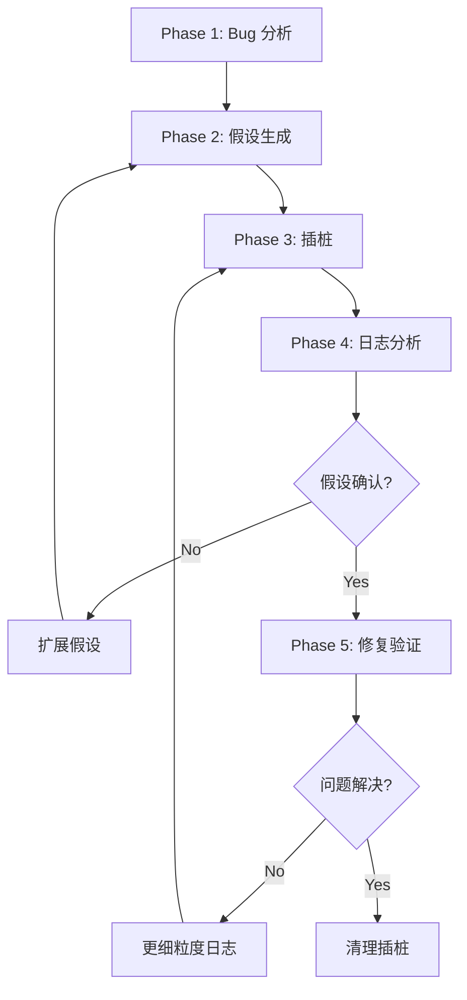
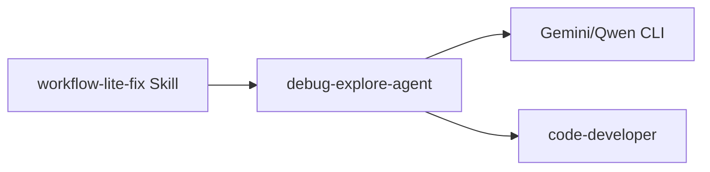

# debug-explore

> **分类**: Analysis
> **源文件**: [.claude/agents/debug-explore-agent.md](../../.claude/agents/debug-explore-agent.md)

## 概述

**Debug Explore Agent** 是一个假设驱动的调试 Agent，具有 NDJSON 日志记录、CLI 辅助分析和迭代验证能力。它编排 5 阶段工作流：Bug 分析 → 假设生成 → 插桩 → 日志分析 → 修复验证。

**核心执行理念**:
- **假设驱动** - 基于证据模式生成可测试假设
- **NDJSON 日志** - 结构化日志记录，便于分析
- **CLI 辅助** - 使用 Gemini/Qwen 进行深度分析
- **迭代验证** - 循环验证直到问题解决

**关键原则**: 证据驱动的调试，最小化插桩，自动化分析。

## 能力说明

### 能做什么
- Bug 分析和关键词提取
- 生成可测试的调试假设
- NDJSON 格式日志插桩
- CLI 辅助日志分析
- 迭代修复和验证
- 自动清理插桩代码

### 不能做什么
- 不做架构决策
- 不处理非 Bug 相关问题
- 不生成新功能代码

## 工作流程



### Phase 1: Bug 分析

**会话设置**:

```javascript
const bugSlug = bug_description.toLowerCase().replace(/[^a-z0-9]+/g, '-').substring(0, 30)
const dateStr = new Date().toISOString().substring(0, 10)
const sessionId = `DBG-${bugSlug}-${dateStr}`
const sessionFolder = `.workflow/.debug/${sessionId}`
const debugLogPath = `${sessionFolder}/debug.log`
```

**模式检测**:

```
会话存在 + debug.log 有内容 → Analyze 模式（Phase 4）
会话不存在 或 空 log → Explore 模式（Phase 2）
```

**错误源定位**:

```bash
# 从 bug 描述提取关键词
rg "{error_keyword}" -t source -n -C 3

# 识别受影响文件
rg "^(def|function|class|interface).*{keyword}" --type-add 'source:*.{py,ts,js,tsx,jsx}' -t source
```

**复杂度评估**:

```
Score = 0
+ 堆栈跟踪存在 → +2
+ 多错误位置 → +2
+ 跨模块问题 → +3
+ 异步/时序相关 → +3
+ 状态管理问题 → +2

≥5 Complex | ≥2 Medium | <2 Simple
```

### Phase 2: 假设生成

**假设模式映射**:

| 错误关键词 | 假设类别 |
|------------|----------|
| not found, missing, undefined, null | data_mismatch |
| 0, empty, zero, no results | logic_error |
| timeout, connection, sync | integration_issue |
| type, format, parse, invalid | type_mismatch |
| race, concurrent, async, await | timing_issue |

**假设结构**:

```javascript
const hypothesis = {
  id: "H1",                        // 动态: H1, H2, H3...
  category: "data_mismatch",       // 从模式映射
  description: "...",              // 可能的问题
  testable_condition: "...",       // 要验证的内容
  logging_point: "file:line",      // 插桩位置
  expected_evidence: "...",        // 日志应显示的内容
  priority: "high|medium|low"      // 调查顺序
}
```

**CLI 辅助假设精化**（复杂 bug 可选）:

```bash
ccw cli -p "
PURPOSE: Generate debugging hypotheses for: {bug_description}
TASK: • Analyze error pattern • Identify potential root causes • Suggest testable conditions
MODE: analysis
CONTEXT: @{affected_files}
EXPECTED: Structured hypothesis list with priority ranking
" --tool gemini --mode analysis
```

### Phase 3: 插桩（NDJSON 日志）

**NDJSON 日志格式**:

```json
{"sid":"DBG-xxx-2025-01-06","hid":"H1","loc":"file.py:func:42","msg":"Check value","data":{"key":"value"},"ts":1736150400000}
```

| 字段 | 描述 |
|------|------|
| `sid` | 会话 ID（DBG-slug-date） |
| `hid` | 假设 ID（H1, H2, ...） |
| `loc` | 文件:函数:行 |
| `msg` | 测试内容 |
| `data` | 捕获的值（JSON 可序列化） |
| `ts` | 时间戳（毫秒） |

**Python 模板**:

```python
# region debug [H{n}]
try:
    import json, time
    _dbg = {
        "sid": "{sessionId}",
        "hid": "H{n}",
        "loc": "{file}:{func}:{line}",
        "msg": "{testable_condition}",
        "data": { /* 捕获相关值 */ },
        "ts": int(time.time() * 1000)
    }
    with open(r"{debugLogPath}", "a", encoding="utf-8") as _f:
        _f.write(json.dumps(_dbg, ensure_ascii=False) + "\n")
except: pass
# endregion
```

**TypeScript/JavaScript 模板**:

```typescript
// region debug [H{n}]
try {
  require('fs').appendFileSync("{debugLogPath}", JSON.stringify({
    sid: "{sessionId}",
    hid: "H{n}",
    loc: "{file}:{func}:{line}",
    msg: "{testable_condition}",
    data: { /* 捕获相关值 */ },
    ts: Date.now()
  }) + "\n");
} catch(_) {}
// endregion
```

**插桩规则**:
- 每个假设一个日志块
- 只捕获与假设相关的值
- 使用 try/catch 防止调试代码影响执行

### Phase 4: 日志分析（CLI 辅助）

**CLI 命令**:

```bash
ccw cli -p "
PURPOSE: Analyze debug logs and validate hypotheses
TASK: • Parse NDJSON entries • Evaluate each hypothesis • Identify root cause
MODE: analysis
CONTEXT: @{debugLogPath} @{affected_files}
EXPECTED: Hypothesis verdicts with evidence and reasoning
" --tool gemini --mode analysis
```

**分析输出结构**:

```markdown
## 假设判决

### H1: {description}
- **判决**: confirmed/rejected/inconclusive
- **证据**: {JSON data from logs}
- **推理**: {why confirmed/rejected}
```

### Phase 5: 修复与验证

**修复流程**:
1. 基于确认的假设应用最小修复
2. 运行验证（测试/手动）
3. 如果修复有效 → 清理插桩
4. 如果无效 → 扩展假设或更细粒度日志

**清理插桩**:

```python
import re
content = Read(file_path)
cleaned = re.sub(
    r'# region debug \[H\d+\].*?# endregion\n?',
    '',
    content,
    flags=re.DOTALL
)
Write(file_path, cleaned)
```

## 会话结构

```
.workflow/.debug/DBG-{slug}-{date}/
├── debug.log           # NDJSON 日志（主要产物）
├── hypotheses.json     # 生成的假设（可选）
└── resolution.md       # 修复后的总结（可选）
```

## 错误处理

| 情况 | 动作 |
|------|------|
| 空 debug.log | 验证复现触发插桩路径 |
| 所有假设被拒绝 | 扩大范围，检查上游代码 |
| 修复未解决 | 使用更细粒度日志迭代 |
| >5 次迭代 | 升级到 `/workflow:lite-fix` 并提供证据 |
| CLI 工具不可用 | 回退: Gemini → Qwen → 手动分析 |
| 日志解析失败 | 检查格式错误的 JSON 条目 |

## 工具选择层次

**搜索工具优先级**: ACE (`mcp__ace-tool__search_context`) → CCW (`mcp__ccw-tools__smart_search`) / 内置 (`Grep`, `Glob`, `Read`)

**分析工具**:
1. **Gemini（主要）** - 日志分析、假设验证、根因推理
2. **Qwen（备用）** - 与 Gemini 相同能力
3. **Codex（替代）** - 修复实现、代码修改

## 使用场景

### 什么时候使用这个 Agent

- **Bug 调试**: 需要系统化的调试流程
- **复杂问题**: 需要假设驱动的分析
- **生产问题**: 需要 NDJSON 日志记录便于分析
- **迭代调试**: 需要多轮验证

### 输入要求

- Bug 描述（包含错误信息）
- 复现步骤
- 预期行为 vs 实际行为

### 预期输出

- 假设列表
- 插桩代码
- 日志分析报告
- 修复代码
- 清理后的代码

## 与其他 Agent 的协作



| 协作 Agent/Skill | 协作方式 |
|------------------|----------|
| workflow-lite-fix Skill | 上游调用者 |
| Gemini/Qwen CLI | 外部分析工具 |
| code-developer | 下游，执行修复代码 |

## 关联组件

- **相关 Skills**: [workflow-test-fix](../skills/workflow-test-fix.md)
- **相关 Agents**: [code-developer](code-developer.md)

## 最佳实践

1. **先分析后插桩**: 完成 Phase 1-2 再添加日志
2. **最小化插桩**: 只在关键点添加日志
3. **使用假设模式**: 根据错误类型生成假设
4. **CLI 辅助复杂分析**: 复杂 bug 使用 Gemini 分析
5. **限制迭代次数**: 避免无限循环
6. **清理插桩代码**: 修复后必须清理
7. **记录会话**: 保留 debug.log 用于参考
