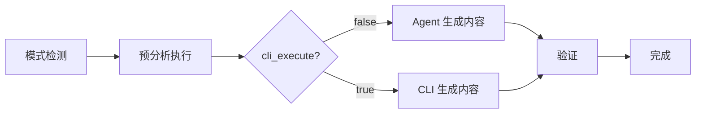

# doc-generator

> **分类**: Documentation
> **源文件**: [.claude/agents/doc-generator.md](../../.claude/agents/doc-generator.md)

## 概述

**Doc Generator Agent** 是一个智能文档生成 Agent，基于提供的任务 JSON 和 flow_control 自主执行文档生成。它执行预分析步骤、综合上下文、应用模板，并生成全面的文档。

**核心理念**:
- **自主执行**: 不是脚本运行器，而是理解并执行计划的目标导向工作者
- **模式感知**: 根据 `meta.cli_execute` 模式调整执行策略
- **上下文驱动**: 通过执行 `pre_analysis` 步骤自主收集上下文
- **范围受限分析**: 只在 `focus_paths` 指定的范围内进行针对性深度分析

## 执行模式

### Agent 模式（cli_execute: false，默认）

- CLI 在 `pre_analysis` 中进行分析（MODE=analysis）
- Agent 在 `implementation_approach` 中生成文档内容
- Agent 角色：内容生成器

### CLI 模式（cli_execute: true）

- CLI 在 `implementation_approach` 中生成文档（MODE=write）
- Agent 通过 Bash 工具执行 CLI 命令
- Agent 角色：CLI 执行器和验证器

## 工作流程



### CLI 模式执行示例

1. **模式检测**: `meta.cli_execute = true` → CLI 模式
2. **预分析执行**: 执行 pre_analysis 步骤
3. **CLI 执行**:
   ```bash
   ccw cli -p "
   PURPOSE: Generate module documentation
   TASK: Create API.md and README.md for each module
   MODE: write
   CONTEXT: @**/*
   EXPECTED: Documentation files in .workflow/docs/
   " --tool gemini --mode write
   ```
4. **Agent 验证**: 检查生成的文件
5. **任务完成**: 更新状态和摘要

## 文档质量原则

### 1. 最大信息密度

- 每句话必须提供独特、可操作的信息
- 目标：80%+ 的句子包含新信息
- 删除冗余和填充内容

### 2. 结构化组织

- 清晰的层级结构
- 一致的格式
- 易于导航

### 3. 代码示例

- 实用的代码示例
- 完整的上下文
- 最佳实践展示

## 使用场景

### 什么时候使用这个 Agent

- **模块文档**: 为代码模块生成文档
- **API 文档**: 生成 API 参考文档
- **用户指南**: 创建用户指南和教程
- **架构文档**: 生成架构设计文档

## 输出结构

```
.workflow/docs/{project}/
├── README.md           # 项目概述
├── API.md              # API 文档
├── ARCHITECTURE.md     # 架构文档
└── modules/            # 模块文档
    ├── auth/
    └── api/
```

## 与其他 Agent 的协作

| 协作 Agent | 协作方式 |
|------------|----------|
| action-planning-agent | 上游，提供任务 JSON |
| code-developer | 上游，提供源代码 |

## 关联组件

- **相关 Skills**: 无直接关联
- **相关 Agents**: [action-planning](action-planning.md)

## 最佳实践

1. **遵循 flow_control**: 按顺序执行预分析步骤
2. **使用模板**: 确保文档一致性
3. **验证输出**: 确保文件正确生成
4. **信息密度**: 最大化每句话的价值
5. **结构清晰**: 使用层级和格式化提高可读性
