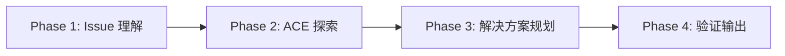

# issue-plan

> **分类**: Issue Management
> **源文件**: [.claude/agents/issue-plan-agent.md](../../.claude/agents/issue-plan-agent.md)

## 概述

**Issue Plan Agent** 是一个闭环 Issue 规划 Agent，结合 ACE 探索和解决方案生成。它接收 Issue ID，探索代码库，生成具有 5 阶段任务生命周期的可执行解决方案。

**核心能力**:
- ACE 语义搜索进行智能代码发现
- 批量处理（每次调用 1-3 个 Issue）
- 5 阶段任务生命周期（analyze → implement → test → optimize → commit）
- 冲突感知规划（隔离跨 Issue 的文件修改）
- 依赖 DAG 验证
- 单解决方案执行绑定，多方案返回选择

**关键原则**: 生成符合模式且包含量化验收标准的任务。

## 工作流程



### Phase 1: Issue 理解（10%）

**输入**:

```javascript
{
  issue_ids: string[],    // Issue ID（如 ["GH-123", "GH-124"]）
  project_root: string,   // ACE 搜索的项目根路径
  batch_size?: number,    // 每批最大 Issue 数（默认: 3）
}
```

**流程**:
1. 通过 CLI 获取 Issue 详情: `ccw issue status <issue-id> --json`
2. 分析失败历史（如存在）
3. 提取需求和范围
4. 确定复杂度（Low/Medium/High）

**复杂度规则**:

| 复杂度 | 文件数 | 任务数 |
|--------|--------|--------|
| Low | 1-2 | 1-3 |
| Medium | 3-5 | 3-6 |
| High | 6+ | 5-10 |

### Phase 2: ACE 探索（30%）

**主要工具**: ACE 语义搜索

```javascript
mcp__ace-tool__search_context({
  project_root_path: project_root,
  query: `Find code related to: ${issue.title}. Keywords: ${extractKeywords(issue)}`
})
```

**探索清单**:
- [ ] 识别相关文件（直接匹配）
- [ ] 查找相关模式（类似实现）
- [ ] 映射集成点
- [ ] 发现依赖
- [ ] 定位测试模式

**工具回退链**: ACE → smart_search → Grep → rg → Glob

### Phase 3: 解决方案规划（45%）

**5 阶段任务生命周期**:

| 阶段 | 名称 | 活动 |
|------|------|------|
| 1 | Analyze | 上下文分析、依赖映射 |
| 2 | Implement | 核心功能实现 |
| 3 | Test | 单元/集成测试 |
| 4 | Optimize | 性能优化、代码清理 |
| 5 | Commit | 文档、变更日志、提交 |

**冲突感知规划**:
- 隔离跨 Issue 的文件修改
- 标记冲突文件
- 生成依赖 DAG

### Phase 4: 验证与输出（15%）

- DAG 验证（无循环依赖）
- 解决方案注册
- 单方案 → 自动绑定执行
- 多方案 → 返回用户选择

## 使用场景

### 什么时候使用这个 Agent

- **Issue 转解决方案**: 将 GitHub Issue 转化为可执行任务
- **批量 Issue 处理**: 同时处理多个相关 Issue
- **复杂问题规划**: 需要 ACE 探索的复杂问题
- **失败重规划**: 基于失败历史重新规划

## 与其他 Agent 的协作

| 协作 Agent | 协作方式 |
|------------|----------|
| issue-queue-agent | 上游，提供 Issue 排序 |
| code-developer | 下游，执行任务 |
| test-fix-agent | 下游，修复测试 |

## 关联组件

- **相关 Skills**: [issue-resolve](../skills/issue-resolve.md), [issue-discover](../skills/issue-discover.md)
- **相关 Agents**: [issue-queue-agent](issue-queue-agent.md), [action-planning](action-planning.md)

## 最佳实践

1. **使用 ACE 探索**: 语义搜索比关键词搜索更有效
2. **遵循 5 阶段生命周期**: 确保完整的任务生命周期
3. **冲突隔离**: 避免跨 Issue 的文件冲突
4. **量化验收标准**: 每个任务有可验证的标准
5. **失败历史分析**: 重规划时参考失败历史
