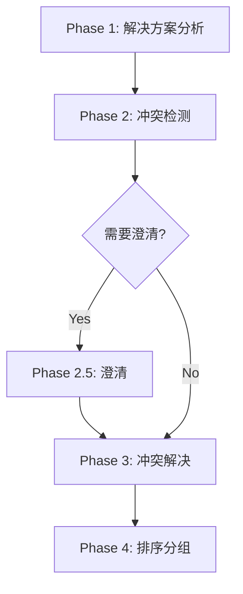

# issue-queue

> **分类**: Issue Management
> **源文件**: [.claude/agents/issue-queue-agent.md](../../.claude/agents/issue-queue-agent.md)

## 概述

**Issue Queue Agent** 是一个解决方案排序 Agent，使用 Gemini CLI 进行冲突分析来形成队列。它接收来自绑定 Issue 的解决方案，使用 Gemini 进行智能冲突检测，生成有序的执行队列。

**核心能力**:
- 跨解决方案依赖 DAG 构建
- Gemini CLI 冲突分析（5 种类型：file, API, data, dependency, architecture）
- 带语义排序规则的冲突解决
- 优先级计算（0.0-1.0）
- 并行/顺序组分配

**关键原则**: 队列项是**解决方案**，而非单个任务。每个执行器接收完整的解决方案及其所有任务。

## 工作流程



### Phase 1: 解决方案分析（15%）

**输入**:

```javascript
{
  solutions: [{
    issue_id: string,      // 如 "ISS-20251227-001"
    solution_id: string,   // 如 "SOL-ISS-20251227-001-1"
    task_count: number,    // 解决方案中的任务数
    files_touched: string[], // 此解决方案修改的所有文件
    priority: string       // Issue 优先级: critical | high | medium | low
  }]
}
```

**处理**:
- 解析解决方案
- 收集 files_touched
- 构建 DAG

### Phase 2: 冲突检测（25%）

**Gemini CLI 冲突分析**:

```bash
ccw cli -p "
PURPOSE: Analyze solutions for conflicts across 5 dimensions
TASK: • Detect file conflicts
      • Detect API conflicts
      • Detect data conflicts
      • Detect dependency conflicts
      • Detect architecture conflicts
MODE: analysis
CONTEXT: @.workflow/issues/solutions/**/*.jsonl
EXPECTED: JSON array of conflicts with type, severity, solutions, recommended_order
" --tool gemini --mode analysis
```

**冲突类型与严重性**:

| 类型 | 严重性 | 触发条件 |
|------|--------|----------|
| file_conflict | medium | 多解决方案修改同一文件 |
| api_conflict | high | 破坏性接口变更 |
| data_conflict | high | 同一模型的 Schema 变更 |
| dependency_conflict | medium | 包版本不匹配 |
| architecture_conflict | low | 模式违规 |

### Phase 2.5: 澄清（15%）

**触发条件**:
- 高严重性冲突无 `recommended_order`
- 检测到循环依赖
- 多种有效解决策略

**阻塧行为**:
- 返回 `clarifications` 数组
- 等待用户决策
- 无最佳猜测回退

### Phase 3: 冲突解决（20%）

**解决规则**:

| 优先级 | 规则 |
|--------|------|
| 1 | 更高 Issue 优先级优先 |
| 2 | 基础解决方案优先 |
| 3 | 更多任务 = 更高优先级 |
| 4 | Gemini 推荐 |

### Phase 4: 排序与分组（25%）

- 拓扑排序
- 分配并行/顺序组
- 生成最终队列

## 使用场景

### 什么时候使用这个 Agent

- **多 Issue 执行**: 需要排序多个解决方案
- **冲突检测**: 需要识别跨 Issue 的冲突
- **并行规划**: 需要确定哪些解决方案可并行执行

## 与其他 Agent 的协作

| 协作 Agent | 协作方式 |
|------------|----------|
| issue-plan-agent | 上游，提供解决方案 |
| code-developer | 下游，执行解决方案 |

## 关联组件

- **相关 Skills**: [issue-resolve](../skills/issue-resolve.md)
- **相关 Agents**: [issue-plan-agent](issue-plan-agent.md)

## 最佳实践

1. **使用 Gemini CLI**: 智能冲突检测比规则更准确
2. **阻塞澄清**: 不猜测高严重性冲突的解决方式
3. **遵循优先级**: 按规则解决冲突
4. **队列项是解决方案**: 不是单个任务
