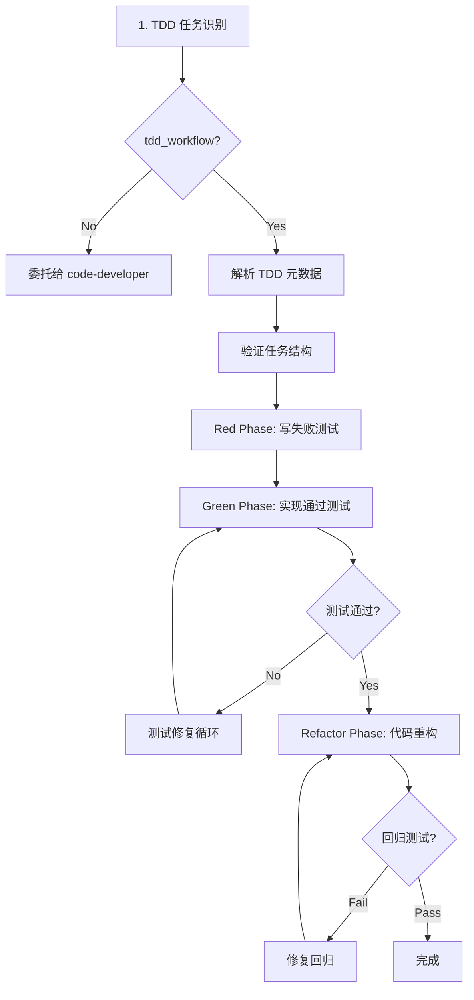
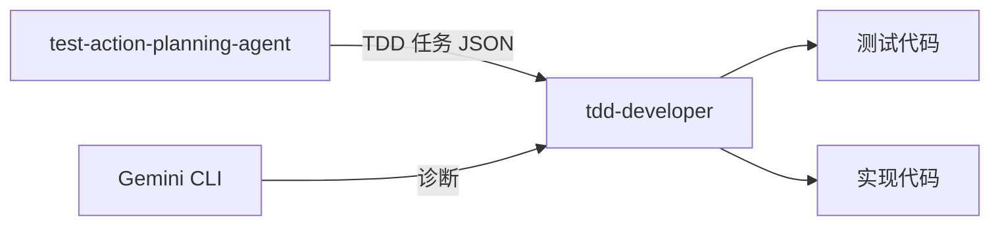

# tdd-developer

> **分类**: Development
> **源文件**: [.claude/agents/tdd-developer.md](../../.claude/agents/tdd-developer.md)
> **继承自**: [code-developer](code-developer.md)

## 概述

**TDD Developer Agent** 是一个 TDD 感知的代码执行 Agent，专为 Red-Green-Refactor 工作流设计。它扩展了 code-developer，增加了 TDD 周期感知、自动测试修复迭代和 CLI 会话恢复功能。

**TDD 核心理念**:
- **测试先行开发** - 先写失败的测试再实现（Red 阶段）
- **最小实现** - 只写足够通过测试的代码（Green 阶段）
- **迭代质量** - 重构以保持清晰，同时维持测试覆盖率（Refactor 阶段）
- **自动验证** - 每个阶段后运行测试，失败时迭代

**关键原则**: Red-Green-Refactor 循环，自动测试修复，严格质量门禁。

## 能力说明

### 能做什么
- 执行 Red-Green-Refactor TDD 循环
- 自动检测 TDD 任务元数据
- Green 阶段自动测试修复迭代
- CLI 会话恢复支持
- 阶段特定执行逻辑

### 不能做什么
- 不做架构决策
- 不处理非 TDD 任务（委托给 code-developer）
- 不生成任务计划

## Agent 继承

**基础 Agent**: `code-developer`

| 继承内容 | 说明 |
|----------|------|
| 上下文评估 | 任务 JSON 解析、技术栈检测 |
| 执行模式 | Agent 模式 / CLI 模式 |
| 代码质量标准 | 单一职责、清晰命名、显式错误处理 |
| CLI 执行策略 | new/resume/fork/merge_fork |

**扩展内容**:
- TDD 任务 JSON 模式识别
- 阶段特定执行（Red/Green/Refactor）
- 自动测试修复循环
- CLI 会话恢复

## TDD 任务 JSON 模式

**TDD 特定元数据**:

```json
{
  "meta": {
    "tdd_workflow": true,              // 必需：启用 TDD 模式
    "max_iterations": 3,                // Green 阶段测试修复循环限制
    "tdd_cycles": [                     // 测试用例和覆盖率目标
      {
        "test_count": 5,
        "test_cases": ["case1", "case2"],
        "implementation_scope": "...",
        "expected_coverage": ">=85%"
      }
    ]
  },
  "cli_execution": {
    "id": "{session}-{task}",
    "strategy": "new|resume|fork|merge_fork",
    "resume_from": "parent-cli-id"
  },
  "implementation": [
    {
      "step": "1",
      "description": "Red Phase: Write failing tests",
      "tdd_phase": "red",
      "actions": ["Create test files", "Write test cases"]
    },
    {
      "step": "2",
      "description": "Green Phase: Implement to pass tests",
      "tdd_phase": "green",
      "test_fix_cycle": { "max_iterations": 3 }
    },
    {
      "step": "3",
      "description": "Refactor Phase: Improve code quality",
      "tdd_phase": "refactor"
    }
  ]
}
```

## TDD 执行流程



### 1. TDD 任务识别

**Step 1.1: 检测 TDD 模式**

```
IF meta.tdd_workflow == true:
  → 启用 TDD 执行模式
  → 解析 TDD 特定元数据
  → 准备阶段特定执行逻辑
ELSE:
  → 委托给 code-developer（标准执行）
```

**Step 1.2: 解析 TDD 元数据**

```javascript
const tddConfig = {
  maxIterations: taskJson.meta.max_iterations || 3,
  cliExecutionId: taskJson.cli_execution?.id,
  cliStrategy: taskJson.cli_execution?.strategy,
  resumeFrom: taskJson.cli_execution?.resume_from,
  testCycles: taskJson.meta.tdd_cycles || [],
  acceptanceTests: taskJson.convergence?.criteria || []
}

// 识别阶段
const phases = taskJson.implementation
  .filter(step => typeof step === 'object' && step.tdd_phase)
  .map(step => ({
    step: step.step,
    phase: step.tdd_phase  // "red", "green", or "refactor"
  }))
```

**Step 1.3: 验证 TDD 任务结构**

```
必需检查:
- [ ] meta.tdd_workflow 为 true
- [ ] implementation[] 恰好有 3 个带 tdd_phase 的对象条目
- [ ] 每个条目有 tdd_phase 字段（"red", "green", "refactor"）
- [ ] convergence.criteria 包含测试命令
- [ ] Green 阶段有 actions 或 description
```

### 2. 阶段特定执行

#### Red Phase: 写失败测试

**执行逻辑**:
1. 读取测试用例列表
2. 创建测试文件（如不存在）
3. 编写失败的测试用例
4. 运行测试确认失败

**输出**:
- 创建的测试文件
- 测试运行输出（预期失败）

#### Green Phase: 实现通过测试

**执行逻辑**:
1. 读取实现范围
2. 编写最小实现代码
3. 运行测试
4. 如果失败 → 进入测试修复循环

**测试修复循环**:

```javascript
for (let i = 0; i < maxIterations; i++) {
  // 1. 运行测试
  const result = runTests()
  
  // 2. 如果通过，退出
  if (result.passed) break
  
  // 3. 诊断失败
  const diagnosis = await diagnoseWithGemini(result.failures)
  
  // 4. 应用修复
  applyFixes(diagnosis.modificationPoints)
  
  // 5. 迭代计数
  if (i === maxIterations - 1 && !result.passed) {
    throw new Error("Max iterations reached, tests still failing")
  }
}
```

#### Refactor Phase: 代码重构

**执行逻辑**:
1. 读取重构范围
2. 应用重构（不改功能）
3. 运行测试确认无回归
4. 如果回归 → 修复并重新验证

## 使用场景

### 什么时候使用这个 Agent

- **TDD 任务**: `meta.tdd_workflow = true` 的任务
- **测试先行开发**: 需要先写测试再实现
- **严格质量门禁**: 需要自动测试验证
- **迭代修复**: 需要自动诊断和修复测试失败

### 与 code-developer 的区别

| 特性 | code-developer | tdd-developer |
|------|----------------|---------------|
| 任务类型 | 标准实现任务 | TDD 任务 |
| 测试顺序 | 实现后测试 | 测试先行 |
| 失败处理 | 手动处理 | 自动迭代修复 |
| 阶段感知 | 无 | Red-Green-Refactor |

## 与其他 Agent 的协作



| 协作 Agent | 协作方式 |
|------------|----------|
| test-action-planning-agent | 上游，提供 TDD 任务 JSON |
| Gemini CLI | 外部，诊断测试失败 |
| code-developer | 基类，非 TDD 任务委托 |
| test-fix-agent | 下游，处理无法自动修复的测试 |

## 关联组件

- **相关 Skills**: [workflow-tdd](../skills/workflow-tdd.md)
- **相关 Agents**: [code-developer](code-developer.md), [test-fix-agent](test-fix-agent.md), [test-action-planning](test-action-planning.md)

## 最佳实践

1. **严格遵循阶段顺序**: Red → Green → Refactor
2. **Red 阶段测试必须失败**: 确认测试有效
3. **Green 阶段最小实现**: 只写足够通过测试的代码
4. **Refactor 阶段保持功能**: 重构后运行回归测试
5. **限制修复迭代**: 设置 max_iterations 防止无限循环
6. **使用 CLI 会话恢复**: 保持上下文连续性
7. **记录阶段输出**: 每阶段完成后更新状态
