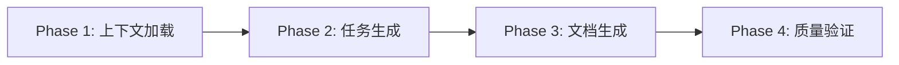

# test-action-planning

> **分类**: Issue Management
> **源文件**: [.claude/agents/test-action-planning-agent.md](../../.claude/agents/test-action-planning-agent.md)
> **继承自**: [action-planning](action-planning.md)

## 概述

**Test Action Planning Agent** 是继承自 action-planning-agent 的专门化 Agent，用于生成测试规划文档。它从测试需求分析结果生成测试任务 JSON（IMPL-001, IMPL-001.3, IMPL-001.5, IMPL-002），包含渐进式 L0-L3 测试层级、AI 代码验证和项目特定模板。

**核心能力**:
- 渐进式 L0-L3 测试层级（Static, Unit, Integration, E2E）
- AI 代码问题检测（L0.5）及 CRITICAL/ERROR/WARNING 严重级别
- 项目类型模板（React, Node API, CLI, Library, Monorepo）
- 测试反模式检测与质量门禁
- 层级完整性阈值和覆盖率目标

**关键原则**: 所有测试规格必须遵循渐进式 L0-L3 层级，包含量化需求、明确覆盖率目标和可衡量的质量门禁。

## 能力说明

### 能做什么
- 从 TEST_ANALYSIS_RESULTS.md 加载测试需求
- 生成符合 L0-L3 层级规范的测试任务 JSON
- 配置 AI 代码问题检测（7 大类问题）
- 设置质量门禁（代码验证 + 测试质量）
- 应用项目类型特定模板

### 不能做什么
- 不直接执行测试
- 不修改源代码
- 不处理用户交互

## Agent 继承

**基础 Agent**: `@action-planning-agent`

| 继承内容 | 说明 |
|----------|------|
| 6 字段 JSON 模式 | id, title, status, context_package_path, cli_execution_id, meta |
| 上下文加载流程 | 会话元数据、上下文包、头脑风暴产物 |
| 文档生成流程 | IMPL_PLAN.md, TODO_LIST.md |
| CLI 执行策略 | new/resume/fork/merge_fork |

**扩展内容**:
- 测试特定 meta 字段
- flow_control 测试扩展
- 质量门禁规格

## 渐进式测试层级 (L0-L3)


### L0: 静态分析

| 子层级 | 名称 | 检查内容 |
|--------|------|----------|
| L0.1 | Compilation | tsc --noEmit, babel parse, 无语法错误 |
| L0.2 | Import Validity | 包存在, 路径解析, 无循环依赖 |
| L0.3 | Type Safety | 无 'any' 滥用, 泛型正确, null 检查 |
| L0.4 | Lint Rules | ESLint/Prettier, 命名规范 |
| L0.5 | AI Issues | 幻觉导入, 占位符, Mock 泄漏等 |

### L1: 单元测试

| 子层级 | 名称 | 测试内容 |
|--------|------|----------|
| L1.1 | Happy Path | 正常输入 → 预期输出 |
| L1.2 | Negative Path | 无效输入 → 正确错误/拒绝 |
| L1.3 | Edge Cases | null, undefined, empty, 边界值 |
| L1.4 | State Changes | 有状态代码的前后断言 |
| L1.5 | Async Behavior | Promise 解析, 超时, 取消 |

### L2: 集成测试

| 子层级 | 名称 | 测试内容 |
|--------|------|----------|
| L2.1 | Module Wiring | 依赖正确注入 |
| L2.2 | API Contracts | 请求/响应 schema 验证 |
| L2.3 | Database Ops | CRUD 操作, 事务, 回滚 |
| L2.4 | External APIs | Mock 外部服务, 重试逻辑 |
| L2.5 | Failure Modes | 超时, 不可用, 限流, 熔断器 |

### L3: E2E 测试（可选）

| 子层级 | 名称 | 测试内容 |
|--------|------|----------|
| L3.1 | Critical Paths | 登录, 结账, 核心流程 |
| L3.2 | Cross-Module | 跨多模块功能 |
| L3.3 | Performance | 响应时间, 内存阈值 |
| L3.4 | Accessibility | WCAG 合规, 屏幕阅读器 |

## AI 代码问题检测 (L0.5)

AI 生成的代码常见问题分类:

### 幻觉导入 (Hallucinated Imports)

| 问题 | 示例 | 检测方法 | 严重级别 |
|------|------|----------|----------|
| 不存在的包 | `import x from 'fake-pkg'` | 验证 package.json | CRITICAL |
| 错误子路径 | `import x from 'lodash/nonExistent'` | 路径解析检查 | CRITICAL |
| 包名拼写错误 | `import x from 'reat'` (应为 'react') | 相似度匹配 | CRITICAL |

### 占位符代码 (Placeholder Code)

| 问题 | 示例 | 严重级别 |
|------|------|----------|
| TODO 在实现中 | `// TODO: implement` | ERROR |
| 未实现 | `throw new Error("Not implemented")` | ERROR |
| 空函数体 | `function foo() {}` | ERROR |

### Mock 泄漏 (Mock Leakage)

| 问题 | 示例 | 严重级别 |
|------|------|----------|
| Mock 在生产代码 | `if (process.env.NODE_ENV === 'test')` | WARNING |
| 测试辅助泄漏 | `__test__` 属性在生产代码 | WARNING |

### 类型滥用 (Type Abuse)

| 问题 | 示例 | 严重级别 |
|------|------|----------|
| any 链 | `data: any` → `data.foo: any` | ERROR |
| 强制类型断言 | `as unknown as T` | WARNING |

## 工作流程



### Phase 1: 上下文加载与组装

**输入来源**:

| 来源 | 路径变量 | 内容 |
|------|----------|------|
| 测试分析结果 | `test_analysis_results_path` | 项目类型, L0-L3 需求, AI 问题扫描 |
| 会话元数据 | `session_metadata_path` | 会话配置, 源会话 ID |
| 测试上下文包 | `test_context_package_path` | 覆盖率分析, 依赖, 现有测试工具 |

**复杂度评估**:
- Simple: <5 文件, L1-L2
- Medium: 5-15 文件, L1-L3
- Complex: >15 文件, 全层级, 跨模块依赖

### Phase 2: 任务 JSON 生成

生成最少 4 个任务:

**Task 1: IMPL-001 (测试生成)**

```json
{
  "id": "IMPL-001",
  "title": "Generate L1-L3 tests for {module}",
  "meta": {
    "type": "test-gen",
    "test_framework": "jest",
    "project_type": "React",
    "coverage_target": "line:80%,branch:70%,function:90%"
  },
  "flow_control": {
    "test_commands": {
      "run_tests": "npm test",
      "run_coverage": "npm test -- --coverage"
    }
  }
}
```

**Task 2: IMPL-001.3 (代码验证门禁)**

```json
{
  "id": "IMPL-001.3",
  "title": "AI code validation gate",
  "meta": {
    "type": "code-validation",
    "agent": "@test-fix-agent"
  },
  "flow_control": {
    "ai_issue_scan": {
      "categories": ["hallucinated_imports", "placeholder_code", ...],
      "severity_levels": ["CRITICAL", "ERROR", "WARNING"],
      "auto_fix_enabled": true,
      "max_retries": 2,
      "thresholds": {
        "critical": 0,
        "error": 3,
        "warning": 10
      }
    }
  }
}
```

**Task 3: IMPL-001.5 (测试质量门禁)**

```json
{
  "id": "IMPL-001.5",
  "title": "Test quality gate - anti-patterns and coverage",
  "meta": {
    "type": "test-quality-review"
  },
  "flow_control": {
    "quality_gates": {
      "layer_completeness": {
        "L1.1": "100%", "L1.2": "80%", "L1.3": "60%"
      },
      "anti_patterns": ["empty_tests", "weak_assertions", ...],
      "coverage_thresholds": {
        "line": "80%", "branch": "70%", "function": "90%"
      }
    }
  }
}
```

**Task 4: IMPL-002 (测试执行与修复)**

```json
{
  "id": "IMPL-002",
  "title": "Test execution and fix cycle",
  "meta": {
    "type": "test-fix"
  },
  "flow_control": {
    "test_fix_cycle": {
      "max_iterations": 5,
      "diagnosis_tool": "gemini",
      "fix_mode": "agent",
      "exit_conditions": ["all_tests_pass", "max_iterations_reached"]
    }
  }
}
```

### Phase 3: 文档生成

**IMPL_PLAN.md 测试特定内容**:
- frontmatter: `workflow_type="test_session"`, test_framework, coverage_targets
- Test Generation Phase: L1-L3 层级分解
- Quality Gates: IMPL-001.3 和 IMPL-001.5 规格
- Test-Fix Cycle: 迭代策略

**TODO_LIST.md 结构**:
- 测试阶段容器
- 任务 JSON 链接与状态标记
- 测试层级指示器（L0, L1, L2, L3）
- 质量门禁指示器

## 质量门禁决策

### IMPL-001.3 (代码验证门禁)

| 决策 | 条件 | 动作 |
|------|------|------|
| **PASS** | critical=0 AND error≤3 | 继续 IMPL-001.5 |
| **SOFT_FAIL** | error>3 OR warning>10 | 自动修复后重试 |
| **HARD_FAIL** | critical>0 或达最大重试次数 | 阻塞并输出详细报告 |

### IMPL-001.5 (测试质量门禁)

| 决策 | 条件 | 动作 |
|------|------|------|
| **PASS** | 所有阈值满足, 无 CRITICAL | 继续 IMPL-002 |
| **SOFT_FAIL** | 轻微差距, 无 CRITICAL | 生成改进列表, 重试 |
| **HARD_FAIL** | CRITICAL 问题或达最大重试次数 | 阻塞并输出报告 |

## 项目类型模板

| 项目类型 | 测试框架 | 特定配置 |
|----------|----------|----------|
| React | Jest + React Testing Library | 组件测试, 快照测试 |
| Node API | Jest + Supertest | API 端点测试, Mock 数据库 |
| CLI | Jest + 内置 fixtures | 命令行输出测试 |
| Library | Jest + tsd | 类型测试, 导出验证 |
| Monorepo | 项目级 Jest 配置 | 包间依赖 Mock |

## Meta 扩展字段

```json
{
  "meta": {
    "type": "test-gen|test-fix|code-validation|test-quality-review",
    "agent": "@code-developer|@test-fix-agent",
    "test_framework": "jest|vitest|pytest|junit|mocha",
    "project_type": "React|Node API|CLI|Library|Full-Stack|Monorepo",
    "coverage_target": "line:80%,branch:70%,function:90%"
  }
}
```

## 使用场景

### 什么时候使用这个 Agent

- **测试驱动开发**: 需要 TDD 流程的测试计划
- **现有代码补充测试**: 为无测试代码添加测试
- **AI 生成代码验证**: 检测 AI 代码问题
- **测试质量提升**: 改进现有测试覆盖率

### 输入要求

- `test_analysis_results_path`: TEST_ANALYSIS_RESULTS.md（必需）
- `test_context_package_path`: 测试上下文包
- `session_id`: WFS-test-{topic} 格式

## 与其他 Agent 的协作

```mermaid
graph LR
    A[test-task-generate Command] --> B[test-action-planning-agent]
    C[action-planning-agent] --> |继承| B
    D[TEST_ANALYSIS_RESULTS.md] --> |测试需求| B
    B --> E[@test-fix-agent]
    B --> F[@code-developer]
```

| 协作 Agent/Skill | 协作方式 |
|------------------|----------|
| action-planning-agent | 基类 Agent，提供基础模式和行为 |
| test-task-generate Command | 上游调用者，提供测试需求 |
| @test-fix-agent | 下游执行测试修复 |
| @code-developer | 下游执行代码实现 |

## 关联组件

- **相关 Skills**: [workflow-test-fix](../skills/workflow-test-fix.md), [workflow-tdd](../skills/workflow-tdd.md)
- **相关 Commands**: test-task-generate
- **相关 Agents**: [action-planning](action-planning.md), [test-fix-agent](test-fix-agent.md), [tdd-developer](tdd-developer.md)

## 最佳实践

1. **遵循层级顺序**: L0 → L1 → L2 → L3，不跳过层级
2. **设置严格阈值**: critical=0 是最佳实践
3. **启用自动修复**: ai_issue_scan.auto_fix_enabled = true
4. **限制修复迭代**: max_iterations=5 防止无限循环
5. **量化覆盖率目标**: 明确 line, branch, function 目标
6. **检测所有反模式**: 不遗漏任何反模式类别
7. **记录测试层级**: 每个测试标注 L1.1, L1.2 等子层级
