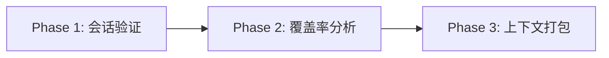

# test-context-search

> **分类**: Analysis
> **源文件**: [.claude/agents/test-context-search-agent.md](../../.claude/agents/test-context-search-agent.md)

## 概述

**Test Context Search Agent** 是一个专门化的上下文收集器，用于测试生成工作流。它分析测试覆盖率，识别缺失的测试，从源会话加载实现上下文，并生成标准化的测试上下文包。

**核心执行理念**:
- **覆盖率优先分析** - 在规划新测试前识别现有测试
- **源上下文加载** - 从源会话导入实现摘要
- **框架检测** - 自动检测测试框架和约定
- **差距识别** - 定位没有对应测试的实现文件
- **标准化输出** - 生成 test-context-package.json

## 工作流程



### Phase 1: 会话验证与源上下文加载

**1.1 测试上下文包检测**（优先执行）:

```javascript
const testContextPath = `.workflow/${test_session_id}/.process/test-context-package.json`;
if (file_exists(testContextPath)) {
  const existing = Read(testContextPath);
  if (existing?.metadata?.test_session_id === test_session_id) {
    return existing; // 直接返回，跳过所有处理
  }
}
```

**1.2 测试会话验证**:
- 加载测试会话元数据
- 验证会话类型为 `test-gen`
- 提取源会话引用

**1.3 源会话上下文加载**:
- 加载源会话元数据
- 发现实现摘要
- 提取变更文件和技术栈

### Phase 2: 测试覆盖率分析

**2.1 现有测试发现**:

```javascript
// 方法 1: CodexLens MCP（首选）
const test_files = mcp__ccw-tools__codex_lens({
  action: "search_files",
  query: "*.test.* OR *.spec.* OR test_*.py"
});

// 方法 2: 回退 CLI
// bash: find . -name "*.test.*" -o -name "*.spec.*"
```

**2.2 框架检测**:

| 框架 | 检测模式 |
|------|----------|
| Jest | jest.config.*, package.json + jest |
| Vitest | vitest.config.*, package.json + vitest |
| pytest | pytest.ini, conftest.py |
| JUnit | @Test 注解, pom.xml + junit |

**2.3 覆盖率差距识别**:
- 对比实现文件与测试文件
- 识别无测试覆盖的文件
- 分析现有测试的覆盖范围

### Phase 3: 上下文打包

**输出**: test-context-package.json

```json
{
  "metadata": {
    "test_session_id": "WFS-test-xxx",
    "source_session_id": "WFS-xxx"
  },
  "implementation_context": {
    "summaries": [...],
    "changed_files": [...],
    "tech_stack": [...]
  },
  "test_coverage": {
    "existing_tests": [...],
    "coverage_gaps": [...],
    "framework": "jest"
  }
}
```

## 使用场景

### 什么时候使用这个 Agent

- **测试生成准备**: 为测试生成工作流收集上下文
- **覆盖率分析**: 识别测试差距
- **多框架项目**: 自动检测不同测试框架

## 与其他 Agent 的协作

| 协作 Agent | 协作方式 |
|------------|----------|
| test-action-planning-agent | 下游，使用测试上下文包 |
| context-search-agent | 类似功能，但针对测试场景 |

## 关联组件

- **相关 Skills**: [workflow-tdd](../skills/workflow-tdd.md)
- **相关 Agents**: [test-action-planning](test-action-planning.md), [context-search](context-search.md)

## 最佳实践

1. **优先检测现有包**: 避免重复分析
2. **使用 CodexLens**: 比 CLI 工具更智能
3. **完整加载源上下文**: 包含所有实现摘要
4. **准确检测框架**: 确保测试约定正确
