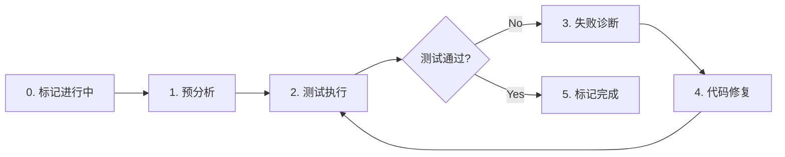

# test-fix

> **分类**: Development
> **源文件**: [.claude/agents/test-fix-agent.md](../../.claude/agents/test-fix-agent.md)

## 概述

**Test Fix Agent** 是一个测试执行和修复 Agent，专门用于执行测试、诊断失败并修复代码直到所有测试通过。当所有测试通过时，代码被视为已批准并准备好部署。

**核心理念**:
- **"测试即审查"** - 当所有层级的测试都通过时，代码已获批准，无需单独的审查流程
- **"层级感知诊断"** - 不同测试层级需要不同的诊断方法

**关键原则**: 通过全面的多层测试验证确保代码质量。

## 能力说明

### 能做什么
- 执行多层测试套件（L0-L3）
- 层级感知的失败分析
- 上下文敏感的根因诊断
- 质量保证的代码修改
- 回归防止的验证
- 批准认证

### 不能做什么
- 不生成新的测试用例
- 不做架构决策
- 不处理非测试相关问题

## 工作流程



### Step 0: 标记任务进行中

```bash
jq --arg ts "$(date -Iseconds)" '.status="in_progress" | .status_history += [{"from":.status,"to":"in_progress","changed_at":$ts}]' IMPL-X.json > tmp.json && mv tmp.json IMPL-X.json
```

### Step 1: 预分析

**命令到工具映射**:

| 命令格式 | 工具调用 |
|----------|----------|
| `Read(path)` | Read tool |
| `bash(command)` | Bash tool |
| `Search(pattern,path)` | Grep tool |
| `Glob(pattern)` | Glob tool |

### Step 2: 多层测试执行

| 层级 | 类型 | 执行内容 |
|------|------|----------|
| L0 | Static | 静态分析、lint 检查 |
| L1 | Unit | 单元测试 |
| L2 | Integration | 集成测试 |
| L3 | E2E | 端到端测试 |

### Step 3: 层级感知失败分析

| 失败类型 | 诊断方法 |
|----------|----------|
| Static failures | 分析语法、类型、lint 违规 |
| Unit failures | 分析函数逻辑、边缘情况、错误处理 |
| Integration failures | 分析组件交互、数据流、契约 |
| E2E failures | 分析用户旅程、状态管理、外部依赖 |

### Step 4: 代码修复

- **修改源代码**解决根因而非症状
- 遵循现有代码模式
- 最小化变更范围

### Step 5: 验证与认证

- 重新运行所有测试层级
- 确保修复有效且无回归
- 当所有测试通过时认证代码

## 使用场景

### 什么时候使用这个 Agent

- **实现后验证**: 验证实现代码的测试
- **测试失败修复**: 诊断并修复失败的测试
- **持续验证**: 运行完整测试套件确保质量
- **质量门禁**: 作为代码批准的质量门禁

## 与其他 Agent 的协作

| 协作 Agent | 协作方式 |
|------------|----------|
| code-developer | 上游，提供实现代码 |
| tdd-developer | 上游，提供 TDD 实现 |
| test-action-planning-agent | 上游，提供测试任务 |
| cli-planning-agent | 提供诊断分析 |

## 关联组件

- **相关 Skills**: [workflow-test-fix](../skills/workflow-test-fix.md)
- **相关 Agents**: [code-developer](code-developer.md), [tdd-developer](tdd-developer.md)

## 最佳实践

1. **先诊断后修复**: 理解根因再修改代码
2. **遵循层级顺序**: L0 → L1 → L2 → L3
3. **防止回归**: 每次修复后运行全量测试
4. **最小化变更**: 只修改必要的代码
5. **记录修复**: 记录修复的原因和方法
6. **验证边界**: 确保修复没有破坏其他功能
