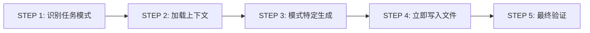
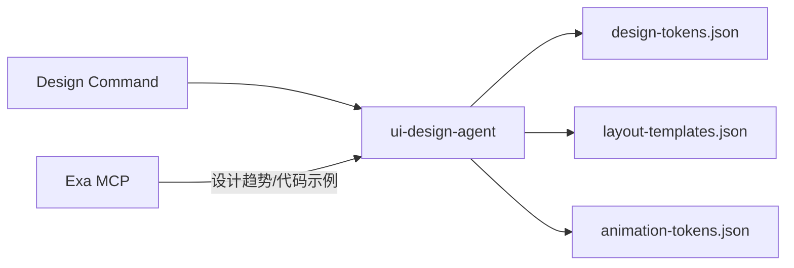

# ui-design

> **分类**: Documentation
> **源文件**: [.claude/agents/ui-design-agent.md](../../.claude/agents/ui-design-agent.md)

## 概述

**UI Design Agent** 是一个专门化的 UI 设计 Token 管理和原型生成 Agent，符合 W3C Design Tokens Format 规范。

**核心能力**:
- W3C Design Tokens Format 实现（$type 元数据和结构化值）
- 基于状态的组件定义（default, hover, focus, active, disabled）
- 完整组件库覆盖（12+ 交互组件）
- 动画-组件状态集成（keyframe 映射）
- 优化的布局模板（单一真相源，零冗余）
- WCAG AA 合规验证和无障碍模式
- Token 驱动的原型生成（语义化标记）
- 跨平台响应式设计（mobile, tablet, desktop）

**关键优化**:
- 通过 light/dark mode 值消除颜色定义冗余
- 结构化组件样式替代 CSS 类字符串
- 统一布局结构（DOM + 样式共置）
- Token 引用完整性验证（{token.path} 语法）

## 能力说明

### 能做什么
- 生成设计方向选项（6D 属性分析）
- 生成布局概念选项（结构模式）
- 生成完整设计系统（Tokens + 模板）
- 从源代码导入设计（Code Import 模式）
- 验证 WCAG AA 无障碍合规
- 生成响应式布局模板

### 不能做什么
- 不执行代码修改
- 不处理用户交互
- 不进行实际 UI 渲染

## 执行流程

### STEP 1: 识别任务模式

从 prompt 解析 `[TASK_TYPE_IDENTIFIER]`:
- `[DESIGN_DIRECTION_GENERATION_TASK]` - 设计方向
- `[LAYOUT_CONCEPT_GENERATION_TASK]` - 布局概念
- `[DESIGN_SYSTEM_GENERATION_TASK]` - 设计系统
- `[LAYOUT_TEMPLATE_GENERATION_TASK]` - 布局模板
- `[ANIMATION_TOKEN_GENERATION_TASK]` - 动画 Token

### STEP 2: 加载上下文

- 读取任务 prompt 中指定的输入数据
- 验证 BASE_PATH 和输出目录结构

### STEP 3: 模式特定生成

| 模式 | 自主性 | 特点 |
|------|--------|------|
| Pattern 1: Option Generation | 高 | 创意探索 |
| Pattern 2: System Generation | 中 | 遵循选择 + 标准 |
| Pattern 3: Assembly | 低 | 纯组合，无设计决策 |

### STEP 4: 立即写入文件

- 使用 Write() 工具写入每个输出文件
- 验证文件创建（报告路径和大小）
- **不累积内容 - 增量写入**

### STEP 5: 最终验证

- 验证所有预期文件已写入
- 报告完成状态（文件数和大小）

## 任务模式详解

### Pattern 1: Option Generation

**目的**: 生成多个设计/布局选项供用户选择（探索阶段）

**任务类型**:
- `[DESIGN_DIRECTION_GENERATION_TASK]` - 设计方向选项
- `[LAYOUT_CONCEPT_GENERATION_TASK]` - 布局概念选项

**流程**:
1. 分析输入: 用户 prompt、视觉参考、项目上下文
2. 生成选项: 创建 {variants_count} 个最大差异选项
3. 差异化: 确保选项明显不同（使用属性空间分析）
4. 写入文件: 单个 JSON 文件 `analysis-options.json`

**设计方向**: 6D 属性（颜色饱和度、视觉重量、正式度、有机/几何、创新度、密度）、搜索关键词、视觉预览

**布局概念**: 结构模式（grid-3col, flex-row）、组件排列、ASCII 线框图

### Pattern 2: System Generation

**目的**: 生成完整设计系统组件（执行阶段）

**任务类型**:
- `[DESIGN_SYSTEM_GENERATION_TASK]` - 设计 Tokens + 代码片段
- `[LAYOUT_TEMPLATE_GENERATION_TASK]` - 布局模板 + DOM 结构
- `[ANIMATION_TOKEN_GENERATION_TASK]` - 动画 Tokens + 代码片段

**执行模式**:

| 模式 | 数据来源 | 代码片段来源 |
|------|----------|--------------|
| Code Import | 现有源代码 | 提取完整代码块 |
| Explore | 视觉参考 + MCP | MCP code search |
| Text | Prompt + MCP | MCP code search |

**流程**:
1. 加载上下文: 用户选择 / 参考材料 / 计算样式
2. 应用标准: WCAG AA, OKLCH, 语义命名, 无障碍
3. MCP 研究: 查询 Exa 获取趋势/模式 + 实现示例
4. 生成系统: 完整 Token/模板系统
5. 记录代码片段: 捕获完整代码块
6. 立即写入文件: 带嵌入代码片段的 JSON 文件

### Pattern 3: Assembly

**目的**: 将现有组件组合为原型（组合阶段）

**任务类型**:
- `[PROTOTYPE_ASSEMBLY_TASK]` - 组合页面原型

**流程**:
1. 加载输入: design-tokens.json, layout-templates.json, animation-tokens.json
2. 组合组件: 应用模板，解析 Token 引用
3. 解析引用: 将 {token.path} 替换为实际值
4. 写入原型: 完整 HTML/CSS 或组件文件

## 输出文件结构

### design-tokens.json

**结构概览**:
- **$schema**: W3C Design Tokens 格式规范
- **color**: 背景、前景、卡片、边框、输入、交互色
- **typography**: 字体族、大小、粗细、行高
- **spacing**: 基于 4px 基础单位的系统化间距
- **elevation**: 分层组件的 z-index 值
- **radius**: 边框圆角 Token
- **components**: 按钮、卡片、输入、对话框、下拉菜单、Toast、手风琴、标签页、开关、复选框、徽章、警告
- **_metadata**: 版本、创建时间、来源、代码片段

**字段规则**:
- $schema 必须引用 W3C Design Tokens 格式规范
- 所有 Token 使用 $type 元数据
- 颜色 Token 使用 $value 包装（light/dark 模式）
- 所有组件引用 Token 使用 {token.path} 语法

### layout-templates.json

**结构概览**:
- **$schema**: W3C Design Tokens 格式规范
- **component_type**: universal 或 specialized
- **structure**: DOM 结构
  - **tag**: 语义 HTML5 标签
  - **attributes**: ARIA 属性
  - **layout**: 仅布局属性（display, grid, flex, position, spacing）
  - **responsive**: 断点特定覆盖
  - **children**: 递归结构
  - **content**: 文本或 {{placeholder}}
- **accessibility**: 模式、键盘导航、焦点管理、屏幕阅读器说明
- **usage_guide**: 常见尺寸、变体推荐、使用上下文
- **extraction_metadata**: 来源、创建时间、代码片段

### animation-tokens.json

**结构概览**:
- **duration**: instant(0ms), fast(150ms), normal(300ms), slow(500ms), slower(1000ms)
- **easing**: linear, ease-in, ease-out, ease-in-out, spring, bounce
- **keyframes**: 动画定义（成对: in/out, open/close, enter/exit）
- **interactions**: 组件交互动画
- **transitions**: 默认、颜色、变换、透明度
- **component_animations**: 组件到动画的映射
- **accessibility**: prefers_reduced_motion CSS 规则

## 无障碍与响应式设计

### WCAG AA 合规（强制）

| 要求 | 标准 |
|------|------|
| 文本对比度 | 4.5:1 最小（AAA 为 7:1） |
| UI 组件对比度 | 3:1 最小 |
| 语义标记 | 正确标题层级、landmark 角色、ARIA 属性 |
| 键盘导航 | 支持所有交互元素 |

### Mobile-First 策略（强制）

- 基础样式针对 mobile（375px+）
- 渐进增强用于更大屏幕
- Token 基础断点: `--breakpoint-sm`, `--breakpoint-md`, `--breakpoint-lg`
- 触摸友好目标: 44x44px 最小

## 质量验证

### W3C 格式合规

- [ ] 所有 Token 文件包含 $schema 字段
- [ ] 所有 Token 使用 $type 元数据
- [ ] 所有颜色 Token 使用 $value（light/dark 模式）
- [ ] 所有 duration/easing Token 使用 $value 包装

### 设计 Token 完整性

- [ ] 所有必需颜色类别已定义
- [ ] 交互颜色状态已定义（default, hover, active, disabled）
- [ ] 所有 UI 元素有组件定义
- [ ] OKLCH 颜色格式
- [ ] 系统化间距比例

### 组件状态覆盖

- [ ] 交互组件定义所有状态
- [ ] 有状态组件定义基于状态的动画
- [ ] 所有组件使用 {token.path} 语法引用 Token
- [ ] 组件动画映射到 keyframes

### Token 引用完整性

- [ ] 所有 {token.path} 引用解析到已定义 Token
- [ ] Token 定义中无循环引用
- [ ] 组件定义中无硬编码值

## 使用场景

### 什么时候使用这个 Agent

- **设计系统创建**: 需要生成完整的设计 Token 系统
- **原型生成**: 需要从设计系统组装页面原型
- **设计导入**: 需要从现有代码提取设计系统
- **无障碍合规**: 需要验证设计符合 WCAG AA

### 执行模式选择

| 场景 | 推荐模式 |
|------|----------|
| 从现有代码提取设计 | Code Import |
| 从视觉参考创建设计 | Explore |
| 从文本描述创建设计 | Text |
| 组合现有组件为原型 | Assembly |

## 与其他 Agent 的协作

| 协作组件 | 协作方式 |
|----------|----------|
| Design Command | 上游调用者 |
| Exa MCP | 提供设计趋势和代码示例 |
| code-developer | 下游消费者，使用设计系统 |

## 关联组件

- **相关 Skills**: 无直接关联
- **相关 Commands**: 设计相关命令
- **相关 Agents**: [code-developer](code-developer.md)

## 最佳实践

1. **立即写入文件**: 不累积内容，增量写入
2. **遵循 W3C 格式**: 所有 Token 文件必须符合规范
3. **语义化命名**: 使用有意义的 Token 名称
4. **完整状态覆盖**: 交互组件必须定义所有状态
5. **验证 Token 引用**: 确保 {token.path} 语法正确
6. **WCAG AA 合规**: 不妥协无障碍要求
7. **Mobile-First**: 从移动端开始设计
8. **记录代码片段**: Code Import 模式必须捕获完整代码块
