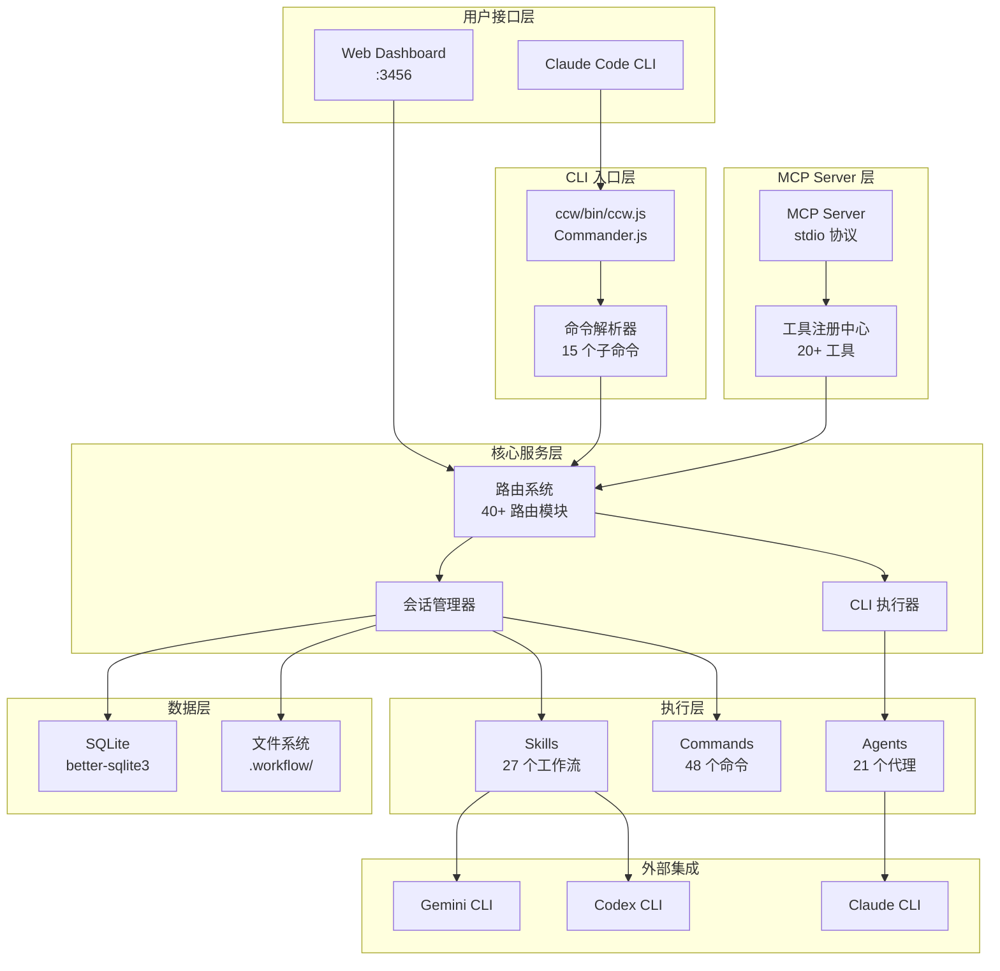
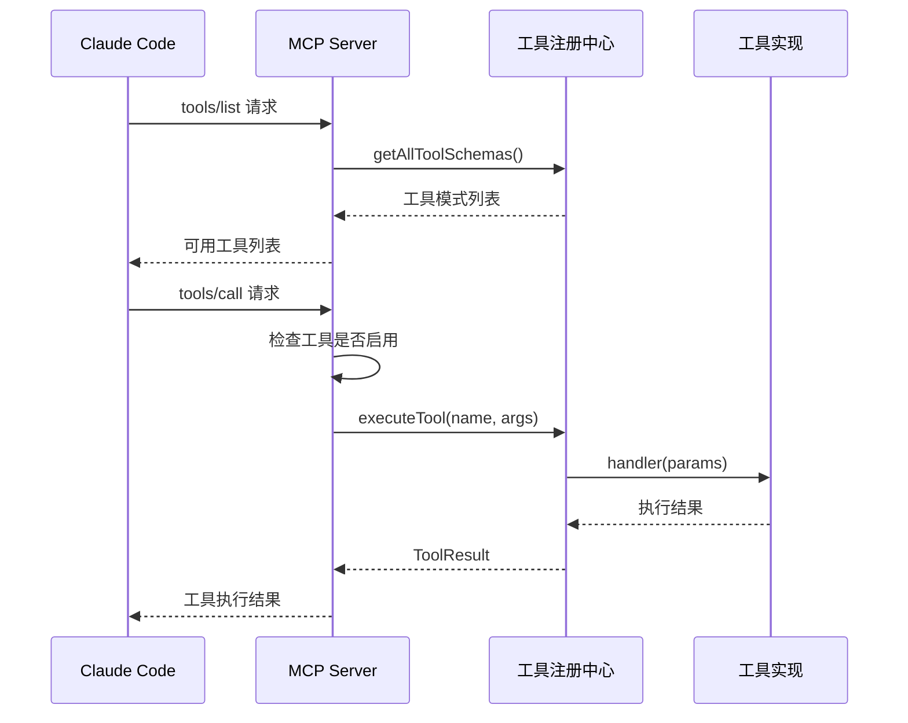
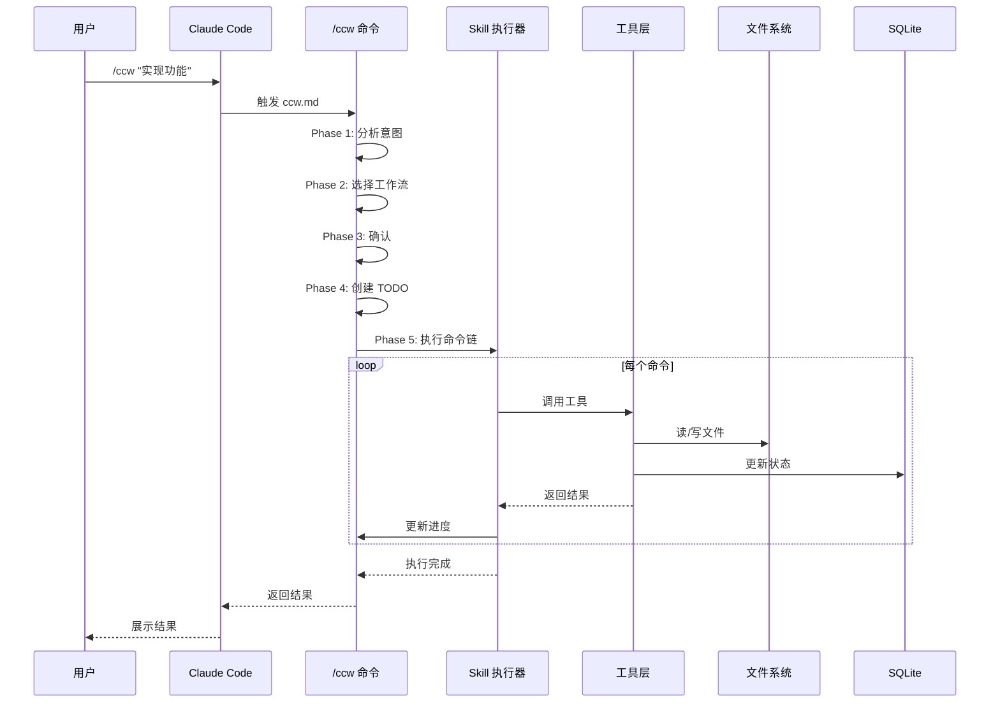
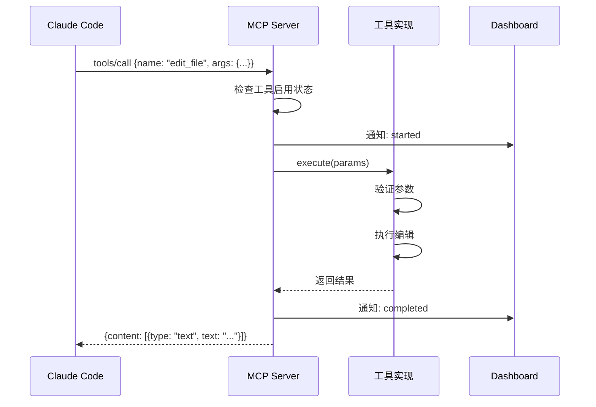

# CCW 系统架构

> **最后更新**: 2025-02-15
> **源码版本**: v6.3.54

---

## 架构总览

CCW 采用分层架构设计，从用户交互到数据存储共分为 5 层：



---

## CLI 入口层

### 主入口

**位置**: `ccw/bin/ccw.js` → `ccw/dist/cli.ts`

**框架**: Commander.js

**命令列表**:

| 命令 | 描述 | 实现文件 |
|------|------|----------|
| `view/serve` | 启动 Dashboard 服务器 | `commands/view.ts` |
| `stop` | 停止运行中的服务器 | `commands/stop.ts` |
| `install` | 安装 CCW 到系统 | `commands/install.ts` |
| `uninstall` | 卸载 CCW | `commands/uninstall.ts` |
| `upgrade` | 升级 CCW | `commands/upgrade.ts` |
| `list` | 列出所有安装实例 | `commands/list.ts` |
| `tool` | 直接执行 CCW 工具 | `commands/tool.ts` |
| `session` | 工作流会话管理 | `commands/session.ts` |
| `cli` | 统一 CLI 工具执行器 | `commands/cli.ts` |
| `memory` | 上下文追踪内存模块 | `commands/memory.ts` |
| `core-memory` | 战略上下文管理 | `commands/core-memory.ts` |
| `hook` | Claude Code 钩子端点 | `commands/hook.ts` |
| `issue` | Issue 生命周期管理 | `commands/issue.ts` |
| `loop` | 多 CLI 编排循环 | `commands/loop.ts` |
| `team` | 团队消息总线 | `commands/team.ts` |
| `workflow` | 工作流安装管理 | `commands/workflow.ts` |

### 命令执行流程

```
用户输入 → Commander.js 解析 → 命令处理函数 → 调用核心服务 → 返回结果
```

---

## MCP Server 层

### 概述

**位置**: `ccw/src/mcp-server/index.ts`

**协议**: Model Context Protocol (MCP) - stdio 传输

**版本**: 6.2.0

### 默认工具集

| 工具 | 描述 | 类型 |
|------|------|------|
| `write_file` | 创建/覆盖文件 | 文件操作 |
| `edit_file` | 修改文件（更新/行模式） | 文件操作 |
| `read_file` | 读取单个文件（支持分页） | 文件操作 |
| `read_many_files` | 批量读取文件 | 文件操作 |
| `read_outline` | 读取文件大纲 | 文件操作 |
| `core_memory` | 战略上下文管理 | 内存管理 |
| `smart_search` | 混合代码搜索 | 搜索 |

### 环境变量配置

| 变量 | 描述 | 默认值 |
|------|------|--------|
| `CCW_PROJECT_ROOT` | 项目根目录 | `process.cwd()` |
| `CCW_ALLOWED_DIRS` | 沙箱允许的目录 | - |
| `CCW_ENABLED_TOOLS` | 启用的工具列表（或 'all'） | 默认 7 个工具 |
| `CCW_ENABLE_SANDBOX` | 启用沙箱模式 | `false` |

### MCP 请求处理流程



---

## Tool Registry 层

### 概述

**位置**: `ccw/src/tools/index.ts`

**设计模式**: 注册表模式 + 策略模式

### 工具分类

| 类别 | 工具 | 描述 |
|------|------|------|
| **文件操作** | `read_file`, `write_file`, `edit_file`, `read_many_files`, `read_outline` | 文件 CRUD 操作 |
| **搜索** | `smart_search` | 混合语义+关键词搜索 |
| **内存** | `core_memory` | 战略上下文存储 |
| **代码分析** | `get_modules_by_depth`, `classify_folders`, `detect_changed_modules` | 模块依赖分析 |
| **CLI 执行** | `cli_executor` | 外部 CLI 工具调用 |
| **会话** | `session_manager` | 工作流会话状态管理 |
| **通信** | `ask_question`, `team_msg` | 用户交互与团队消息 |

### 工具注册机制

```typescript
// 工具接口定义
interface LegacyTool {
  name: string;
  description: string;
  parameters: {
    type: string;
    properties: Record<string, unknown>;
    required?: string[];
  };
  execute: (params: Record<string, unknown>) => Promise<unknown>;
}

// 注册工具
function registerTool(tool: LegacyTool): void {
  if (!tool.name || !tool.execute) {
    throw new Error('Tool must have name and execute function');
  }
  tools.set(tool.name, tool);
}

// 执行工具
async function executeTool(name: string, params: Record<string, unknown>): Promise<ToolResult> {
  const tool = tools.get(name);
  if (!tool) return { success: false, error: `Tool not found: ${name}` };
  
  // 参数验证
  const validation = validateParams(tool, params);
  if (!validation.valid) return { success: false, error: validation.errors.join(', ') };
  
  // 执行并通知 Dashboard
  notifyDashboard({ toolName: name, status: 'started' });
  try {
    const result = await tool.execute(params);
    notifyDashboard({ toolName: name, status: 'completed' });
    return { success: true, result };
  } catch (error) {
    notifyDashboard({ toolName: name, status: 'failed', error: error.message });
    return { success: false, error: error.message };
  }
}
```

### Dashboard 通知

工具执行时自动向 Dashboard 发送事件通知：

- `started` - 工具开始执行
- `completed` - 执行成功
- `failed` - 执行失败

---

## Routes 系统

### 概述

**位置**: `ccw/src/core/routes/`

**路由数量**: 40+

**框架**: Express.js

### 路由分类

| 类别 | 路由文件 | 功能 |
|------|----------|------|
| **认证** | `auth-routes.ts` | CSRF 令牌、Token 管理 |
| **CLI** | `cli-routes.ts`, `cli-sessions-routes.ts`, `cli-settings-routes.ts` | CLI 执行与配置 |
| **CodexLens** | `codexlens-routes.ts` | 代码智能服务 |
| **发现** | `discovery-routes.ts` | 项目结构发现 |
| **文件** | `files-routes.ts` | 文件浏览器 API |
| **图** | `graph-routes.ts` | 依赖图可视化 |
| **钩子** | `hooks-routes.ts` | Claude Code 钩子端点 |
| **Issue** | `issue-routes.ts` | Issue 管理 API |
| **LiteLLM** | `litellm-routes.ts`, `litellm-api-routes.ts` | LLM 代理配置 |
| **Loop** | `loop-routes.ts`, `loop-v2-routes.ts` | 多 CLI 循环执行 |
| **内存** | `memory-routes.ts`, `core-memory-routes.ts` | 上下文存储 |
| **MCP** | `mcp-routes.ts`, `mcp-templates-db.ts` | MCP 模板管理 |
| **编排** | `orchestrator-routes.ts` | 工作流编排 |
| **提供者** | `provider-routes.ts` | LLM 提供者配置 |
| **规则** | `rules-routes.ts` | 规则模板管理 |
| **会话** | `session-routes.ts` | 工作流会话 API |
| **Skills** | `skills-routes.ts` | Skills 发现与执行 |
| **状态** | `status-routes.ts` | 系统状态监控 |
| **系统** | `system-routes.ts` | 系统配置 API |
| **任务** | `task-routes.ts` | 任务管理 |
| **团队** | `team-routes.ts` | 团队消息总线 |
| **测试** | `test-loop-routes.ts` | 测试循环执行 |
| **工作流** | `commands-routes.ts`, `dashboard-routes.ts`, `help-routes.ts`, `nav-status-routes.ts` | Dashboard 核心路由 |

### 路由示例

```typescript
// session-routes.ts 示例
router.get('/api/sessions', async (req, res) => {
  const sessions = await sessionManager.listSessions();
  res.json(sessions);
});

router.post('/api/sessions/:id/complete', async (req, res) => {
  await sessionManager.completeSession(req.params.id);
  res.json({ success: true });
});
```

---

## 数据流图

### 主工作流执行



### MCP 工具调用



---

## 核心设计决策 (ADR)

### ADR-001: 同步主进程执行

**决策**: CCW 主命令在 Claude Code 主进程中同步执行，而非后台任务。

**原因**:
- 简化错误处理和状态管理
- 避免进程间通信复杂性
- 提供即时反馈

**替代方案**: 使用 `ccw-coordinator` 进行后台执行。

### ADR-002: 最小执行单元

**决策**: 将相关命令分组为原子单元，必须一起执行。

**示例**: `lite-plan` → `lite-execute` 是一个原子单元。

**原因**:
- 防止中间状态不一致
- 简化错误恢复逻辑
- 提升用户体验

### ADR-003: 多级工作流

**决策**: 提供 4 级工作流复杂度，根据任务意图自动选择。

**原因**:
- 匹配任务复杂度
- 避免过度工程
- 支持渐进式复杂度

### ADR-004: MCP 工具注册中心

**决策**: 使用注册表模式管理工具，支持动态发现和执行。

**原因**:
- 解耦工具定义与使用
- 支持运行时扩展
- 简化 MCP 协议集成

### ADR-005: 会话状态持久化

**决策**: 使用 SQLite + 文件系统双重存储会话状态。

**原因**:
- SQLite: 结构化查询、事务支持
- 文件系统: 人类可读、版本控制友好

---

## 相关文档

- [Commands 索引](commands/_index.md)
- [Skills 索引](skills/_index.md)
- [Agents 索引](agents/_index.md)
- [MCP 集成](../mcp/mcp-tools.md)
- [CLI 工具](../cli/cli-tools.md)
