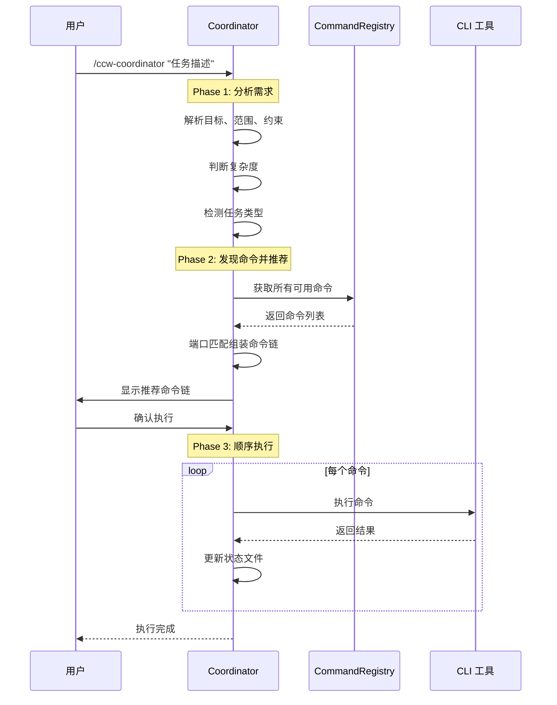

# /ccw-coordinator

> **分类**: 核心 (Core)
> **源文件**: [.claude/commands/ccw-coordinator.md](../../.claude/commands/ccw-coordinator.md)

## 概述

`/ccw-coordinator` 是 Claude-Code-Workflow (CCW) 的核心命令编排工具。它通过智能分析任务需求，自动发现可用命令，推荐最佳命令链，并按顺序执行这些命令，同时追踪整个执行过程的状态。

**核心能力**:
- **智能任务分析**: 解析任务描述，提取目标、范围、约束和复杂度
- **动态命令发现**: 通过 CommandRegistry 获取所有可用命令
- **智能命令链推荐**: 基于端口匹配算法组装最优命令链
- **顺序执行**: 串行执行命令链，支持断点恢复
- **状态持久化**: 完整的执行状态追踪和恢复能力

## 命令语法

```bash
/ccw-coordinator "[任务描述]"
```

### 参数说明

| 参数 | 类型 | 必填 | 默认值 | 说明 |
|------|------|------|--------|------|
| 任务描述 | string | 是 | - | 描述你要完成的任务目标 |

## 核心概念: 最小执行单元

### 什么是最小执行单元?

**定义**: 最小执行单元是一组必须作为原子组一起执行的命令集合，用于实现有意义的工作流里程碑。拆分这些命令会破坏逻辑流程并产生不完整状态。

**为什么重要**:
- **防止不完整状态**: 避免生成任务后停止而不执行
- **用户体验**: 用户获得完整结果，而非需要手动跟进的中间产物
- **工作流完整性**: 维护多步操作的逻辑连贯性

### 规划+执行单元

| 单元名称 | 命令链 | 用途 | 输出 |
|---------|--------|------|------|
| **快速实现** | lite-plan → lite-execute | 轻量级规划并立即执行 | 可运行代码 |
| **多 CLI 规划** | multi-cli-plan → lite-execute | 多视角分析并执行 | 可运行代码 |
| **Bug 修复** | lite-fix → lite-execute | 快速 Bug 诊断和修复执行 | 修复后的代码 |
| **完整规划+执行** | plan → execute | 详细规划并执行 | 可运行代码 |
| **验证规划+执行** | plan → plan-verify → execute | 带验证的规划和执行 | 可运行代码 |
| **重规划+执行** | replan → execute | 更新计划并执行变更 | 可运行代码 |
| **TDD 规划+执行** | tdd-plan → execute | 测试驱动开发规划和执行 | 可运行代码 |
| **测试生成+执行** | test-gen → execute | 生成测试套件并执行 | 生成的测试 |

### 测试单元

| 单元名称 | 命令链 | 用途 | 输出 |
|---------|--------|------|------|
| **测试验证** | test-fix-gen → test-cycle-execute | 生成测试任务并执行修复循环 | 测试通过 |

### 审查单元

| 单元名称 | 命令链 | 用途 | 输出 |
|---------|--------|------|------|
| **代码审查 (会话)** | review-session-cycle → review-cycle-fix | 完整审查循环并应用修复 | 修复后的代码 |
| **代码审查 (模块)** | review-module-cycle → review-cycle-fix | 模块审查循环并应用修复 | 修复后的代码 |

### Issue 单元

| 单元名称 | 命令链 | 用途 | 输出 |
|---------|--------|------|------|
| **Issue 工作流** | discover → plan → queue → execute | 完整 Issue 生命周期 | 已完成的 Issues |
| **快速转 Issue** | lite-plan → convert-to-plan → queue → execute | 轻量工作流转 Issue 工作流 | 已完成的 Issues |
| **头脑风暴转 Issue** | from-brainstorm → queue → execute | 头脑风暴会话转 Issue 工作流 | 已完成的 Issues |

### With-File 单元

| 单元名称 | 命令链 | 用途 | 输出 |
|---------|--------|------|------|
| **头脑风暴文档化** | brainstorm-with-file | 多视角创意并文档化 | brainstorm.md |
| **调试文档化** | debug-with-file | 假设驱动调试并文档化 | understanding.md |
| **分析文档化** | analyze-with-file | 协作分析并文档化 | discussion.md |

## 使用场景

### 什么时候使用

- **不确定使用哪个命令**: 当你有一个任务但不确定应该用哪个具体命令时
- **复杂多步骤任务**: 需要多个命令配合完成的复杂任务
- **工作流编排**: 需要将规划、执行、测试等多个阶段串联
- **任务类型识别**: 让 Coordinator 自动识别任务类型并选择最佳路径

### 什么时候不使用

- **明确知道要用的命令**: 如果你清楚知道需要执行的具体命令
- **单步简单操作**: 只需要执行一个简单命令的场景
- **调试特定问题**: 已知问题根源，直接使用 lite-fix 等命令

## 工作流程

### 三阶段工作流



### Phase 1: 分析需求

解析任务描述，提取以下信息:

```javascript
{
  goal: "实现用户注册功能",           // 主要目标
  scope: ["auth", "user_management"], // 涉及范围
  constraints: ["无破坏性变更"],       // 约束条件
  complexity: "medium",              // 复杂度: simple/medium/complex
  task_type: "feature"               // 任务类型
}
```

**任务类型检测规则** (按优先级匹配):

| 模式 | 任务类型 |
|------|---------|
| fix/bug/error/crash/fail/debug/diagnose | bugfix |
| tdd/test-driven/先写测试 | tdd |
| 测试失败/test fail/fix test | test-fix |
| generate test/写测试/补充测试 | test-gen |
| review/审查/code review | review |
| issue.*batch/批量.*issue | issue-batch |
| issue workflow/queue/multi-stage | issue-transition |
| brainstorm/头脑风暴/创意 | brainstorm-file |
| debug.*document/深度调试 | debug-file |
| 不确定/explore/研究 | brainstorm |
| 多视角/比较方案/multi-cli | multi-cli |
| (默认) | feature |

### Phase 2: 发现命令并推荐链

使用基于端口的匹配算法组装命令链:


**命令端口定义**:

每个命令有输入/输出端口用于管道组合:

| 命令 | 输入端口 | 输出端口 | 标签 |
|------|---------|---------|------|
| lite-plan | requirement | plan | planning |
| lite-execute | plan, multi-cli-plan, lite-fix | code | execution |
| plan | requirement | detailed-plan | planning |
| execute | detailed-plan, verified-plan, replan, test-tasks, tdd-tasks | code | execution |
| lite-fix | bug-report | lite-fix | bugfix |
| test-gen | code, session | test-tasks | testing |
| test-fix-gen | failing-tests, session | test-tasks | testing |
| test-cycle-execute | test-tasks | test-passed | testing |

### Phase 3: 顺序执行

```javascript
// 执行模式
async function executeCommandChain(chain, analysis) {
  // 1. 创建状态目录
  const stateDir = `.workflow/.ccw-coordinator/${sessionId}`;
  
  // 2. 初始化状态
  const state = {
    session_id: sessionId,
    status: 'running',
    command_chain: chain,
    execution_results: []
  };
  
  // 3. 逐个执行命令
  for (const cmd of chain) {
    // 组装提示词
    const prompt = formatCommand(cmd, previousResults, analysis);
    
    // 后台执行 CLI
    const taskId = Bash(`ccw cli -p "${prompt}" --tool claude --mode write`, 
      { run_in_background: true });
    
    // 保存检查点并等待 hook 回调
    break;
  }
}
```

## 状态文件结构

**位置**: `.workflow/.ccw-coordinator/{session_id}/state.json`

```json
{
  "session_id": "ccw-coord-20250124-143025",
  "status": "running|waiting|completed|failed",
  "created_at": "2025-01-24T14:30:25Z",
  "updated_at": "2025-01-24T14:35:45Z",
  "analysis": {
    "goal": "实现用户注册",
    "scope": ["authentication", "user_management"],
    "constraints": ["无破坏性变更"],
    "complexity": "medium"
  },
  "command_chain": [
    {
      "index": 0,
      "command": "/workflow:plan",
      "name": "plan",
      "status": "completed"
    }
  ],
  "execution_results": [
    {
      "index": 0,
      "command": "/workflow:plan",
      "status": "completed",
      "session_id": "WFS-plan-20250124",
      "artifacts": ["IMPL_PLAN.md"]
    }
  ]
}
```

### 状态值说明

| 状态 | 说明 |
|------|------|
| `running` | Coordinator 正在主动执行 |
| `waiting` | 暂停，等待 hook 回调继续 |
| `completed` | 所有命令成功完成 |
| `failed` | 用户中止或不可恢复错误 |

## 使用示例

### 示例 1: 简单功能实现

```bash
/ccw-coordinator "实现用户登录功能"
```

**预期输出**:
```
Analysis Complete:
  Goal: 实现用户登录功能
  Scope: ["auth"]
  Complexity: simple
  Task Type: feature

Recommended Command Chain:

Pipeline (管道视图):
需求 → 【lite-plan → lite-execute】→ 代码 → 【test-fix-gen → test-cycle-execute】→ 测试通过

Commands (命令列表):
1. /workflow:lite-plan
2. /workflow:lite-execute
3. /workflow:test-fix-gen
4. /workflow:test-cycle-execute

Proceed? [Confirm / Show Details / Adjust / Cancel]
```

### 示例 2: Bug 修复

```bash
/ccw-coordinator "修复登录页面的超时问题"
```

**预期输出**:
```
Analysis Complete:
  Goal: 修复登录页面超时问题
  Task Type: bugfix

Recommended Command Chain:

Pipeline:
Bug报告 → lite-fix → 修复代码 → 【test-fix-gen → test-cycle-execute】→ 测试通过
```

### 示例 3: 复杂功能规划

```bash
/ccw-coordinator "重构支付系统支持多网关，包括 Stripe 和 PayPal"
```

**预期输出**:
```
Analysis Complete:
  Goal: 重构支付系统支持多网关
  Scope: ["payments", "stripe", "paypal"]
  Complexity: complex
  Task Type: feature

Recommended Command Chain:

Pipeline:
需求 → 【plan → plan-verify】→ validate → execute → 代码 → review → fix
```

### 示例 4: 批量 Issue 处理

```bash
/ccw-coordinator "批量处理所有待办 issues"
```

**预期输出**:
```
Analysis Complete:
  Task Type: issue-batch

Recommended Command Chain:

Pipeline:
代码库 → 【discover → plan → queue → execute】→ 完成 issues
```

## 关联组件

- **相关 Skills**: 
  - [workflow-planning](../skills/workflow-planning.md)
  - [issue-lifecycle](../skills/issue-lifecycle.md)
- **相关 Commands**: 
  - [lite-plan](workflow/lite-plan.md)
  - [lite-execute](workflow/lite-execute.md)
  - [plan](workflow/plan.md)
  - [execute](workflow/execute.md)
- **相关 Agents**: 
  - [planner](../agents/planner.md)
  - [implementer](../agents/implementer.md)

## 错误处理

| 错误信息 | 原因 | 解决方案 |
|---------|------|---------|
| `Unknown task_id` | Hook 回调的任务 ID 不存在于状态中 | 检查状态文件完整性 |
| `Command failed to start` | CLI 启动失败 | 检查 ccw CLI 配置和工具可用性 |
| `Session not found` | 恢复会话时找不到状态文件 | 确认 session_id 正确 |
| `Port mismatch` | 命令端口不匹配 | 检查命令链组装逻辑 |

### 执行失败时的用户选择

当命令执行失败时，Coordinator 会询问用户:

1. **Retry**: 重试当前命令
2. **Skip**: 跳过当前命令，继续下一个
3. **Abort**: 终止整个工作流

## 最佳实践

1. **描述清晰**: 任务描述越详细，Coordinator 的分析越准确
2. **包含上下文**: 提及涉及的模块、技术栈、约束条件
3. **信任推荐**: Coordinator 会选择最优路径，除非有特殊需求
4. **检查状态**: 如需恢复中断的工作流，检查 `.workflow/.ccw-coordinator/` 目录

## 设计原则

1. **无固定逻辑** - Claude 基于分析智能决策
2. **动态发现** - CommandRegistry 动态获取可用命令
3. **智能参数** - 根据前置结果自动组装命令参数
4. **完整状态追踪** - 所有执行记录到 state.json
5. **用户控制** - 确认 + 错误处理提供用户选择
6. **上下文传递** - 每个 prompt 包含前置结果
7. **可恢复** - 可加载 state.json 继续
8. **串行阻塞** - 命令逐个执行，基于 hook 继续机制

---

*最后更新: 2025-02*
