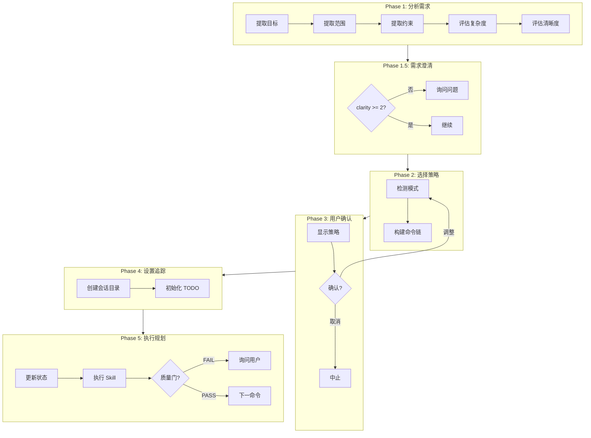

# /ccw-plan

> **分类**: 核心 (Core)
> **源文件**: [.claude/commands/ccw-plan.md](../../.claude/commands/ccw-plan.md)

## 概述

`/ccw-plan` 是规划协调器，在主进程中执行需求分析、策略选择和规划工作流。

**核心能力**:
- **规划聚焦**: 纯规划协调，无执行
- **模式驱动**: 10 种规划模式适应不同需求
- **CLI 集成**: 快速分析获取即时建议
- **With-File 支持**: 多 CLI 协作和文档化产物
- **质量门**: 生产功能强制验证

## 命令语法

```bash
/ccw-plan [options] "任务描述"
```

### 参数说明

| 参数 | 类型 | 必填 | 默认值 | 说明 |
|------|------|------|--------|------|
| 任务描述 | string | 是 | - | 要规划的任务 |
| --mode | string | 否 | 自动检测 | 规划模式 |
| -y, --yes | flag | 否 | - | 跳过确认 |

## 核心概念: 规划单元

**定义**: 规划命令根据验证需求和协作策略分组为逻辑单元。

**规划单元**:

| 单元类型 | 模式 | 示例 |
|---------|------|------|
| **快速规划** | plan-cmd (无验证) | lite-plan |
| **验证规划** | plan-cmd → verify-cmd | plan → plan-verify |
| **协作规划** | multi-cli-plan (隐式验证) | multi-cli-plan |
| **With-File 规划** | brainstorm-with-file 或 analyze-with-file | 头脑风暴 + 规划选项 |
| **CLI 辅助规划** | ccw cli (analysis) → recommendations | 快速分析 + 决策 |
| **Issue 工作流规划** | plan → issue workflow | rapid-to-issue 桥接 |

**原子规则**:
1. Lite 模式: 无验证（快速迭代）
2. Plan-verify 模式: 强制质量门
3. Multi-cli/Full 模式: 可选验证（通过 --skip-verify 标志）
4. With-File 模式: 自包含迭代，内置后续选项
5. CLI 模式: 快速分析，用户驱动决策
6. Issue 模式: 规划集成到 Issue 工作流生命周期

## 五阶段工作流



### Phase 1: 分析需求

**输出字段**:

| 字段 | 值 |
|------|---|
| complexity | low | medium | high |
| clarity | 0-3 (≥2 = clear) |
| criticality | normal | high | critical |
| scope | single-module | cross-module | system | batch-issues |

### Phase 2: 模式检测

**模式检测关键词** (优先级顺序):

| 关键词 | 模式 |
|--------|------|
| quick, fast, immediate, recommendation | cli |
| issues, batch, queue | issue |
| issue transition, rapid.*issue | rapid-to-issue |
| 头脑风暴, 创意, brainstorm | brainstorm-with-file |
| 协作分析, analyze.*document | analyze-with-file |
| production, critical, payment, auth | plan-verify |
| adjust, modify, change plan | replan |
| uncertain, explore | full |
| complex, multiple module, integrate | multi-cli |
| (default) | lite |

**命令链映射**:

| 模式 | 命令链 | 验证 | 用例 |
|------|--------|------|------|
| **cli** | ccw cli --mode analysis | 无 | 快速规划建议 |
| **issue** | discover → plan → queue → execute | 可选 | 批量 Issue 规划 |
| **rapid-to-issue** | lite-plan → convert-to-plan → queue → execute | 可选 | 快速规划 → Issue 桥接 |
| **brainstorm-with-file** | brainstorm-with-file | 自包含 | 多视角创意 |
| **analyze-with-file** | analyze-with-file | 自包含 | 协作架构分析 |
| **lite** | lite-plan | 无 | 快速简单规划 |
| **multi-cli** | multi-cli-plan → [plan-verify] | 可选 | 多模型协作规划 |
| **full** | brainstorm → plan → [plan-verify] | 可选 | 全面头脑风暴 + 规划 |
| **plan-verify** | plan → **plan-verify** | **强制** | 生产/关键功能 |
| **replan** | replan | 无 | 规划精炼/调整 |

### Phase 5: 质量门

**Plan-Verify 模式**:
```
Quality Gate → PASS → 标记完成 → 下一命令
             ↓ FAIL (plan-verify 模式)
             询问用户 → Refined: replan + re-verify
                     → Override: 继续执行
                     → Abort: 停止规划
```

## 状态管理

### 双追踪系统

**1. TodoWrite 追踪** (UI 显示):

```
// Plan-verify 模式 (强制质量门)
CCWP:plan-verify: [1/2] /workflow:plan          [in_progress]
CCWP:plan-verify: [2/2] /workflow:plan-verify   [pending]

// CLI 模式 (快速建议)
CCWP:cli: [1/1] ccw cli --mode analysis         [in_progress]

// Issue 模式 (批量规划)
CCWP:issue: [1/4] /issue:discover               [in_progress]
CCWP:issue: [2/4] /issue:plan                   [pending]
...

// With-File 模式 (自包含)
CCWP:brainstorm-with-file: [1/1] /workflow:brainstorm-with-file [in_progress]
```

**2. status.json 追踪**:

**位置**: `.workflow/.ccw-plan/{session_id}/status.json`

```json
{
  "session_id": "CCWP-oauth-auth-2025-02-02",
  "mode": "plan-verify",
  "status": "running|completed|failed",
  "analysis": {
    "goal": "Implement OAuth2 authentication",
    "complexity": "high",
    "criticality": "high"
  },
  "command_chain": [...],
  "quality_gate": "pending|PASS|FAIL"
}
```

## 扩展规划模式

### CLI 辅助规划 (cli 模式)

```
Quick Input → ccw cli --mode analysis → Recommendations → User Decision:
- ✓ Accept → 从建议创建 lite-plan
- ↗ Escalate → 切换到 multi-cli 或 full 模式
- ✗ Done → 停止（仅建议）
```

**用例**:
- 快速架构决策问题
- 规划方法建议
- 模式/库选择建议

### With-File 规划工作流

| 模式 | 目的 | 关键特性 | 输出目录 |
|------|------|---------|---------|
| **brainstorm-with-file** | 多视角创意 | Gemini/Codex/Claude 视角 | `.workflow/.brainstorm/` |
| **analyze-with-file** | 协作架构分析 | 多轮问答、CLI 探索 | `.workflow/.analysis/` |

**特性**:
1. **自包含**: 每个工作流处理自己的迭代循环
2. **文档化过程**: 创建演进文档
3. **多 CLI**: 使用不同视角
4. **内置后续选项**: 创建计划、Issue、深入分析

### Issue 工作流集成

| 模式 | 目的 | 命令链 |
|------|------|--------|
| **issue** | 批量 Issue 规划 | discover → plan → queue → execute |
| **rapid-to-issue** | 快速规划 → Issue | lite-plan → convert-to-plan → queue → execute |

**Issue 工作流桥接**:
```
lite-plan (in-memory) → /issue:convert-to-plan → Creates issue JSON
                                                      ↓
                                        /issue:queue → Form execution queue
                                                      ↓
                                        /issue:execute → DAG-based parallel execution
```

## 使用示例

### 示例 1: 自动选择模式

```bash
/ccw-plan "添加用户认证"
```

### 示例 2: 标准规划模式

```bash
/ccw-plan --mode lite "添加登出端点"
/ccw-plan --mode multi-cli "实现 OAuth2"
/ccw-plan --mode full "设计通知系统"
/ccw-plan --mode plan-verify "支付处理（生产环境）"
/ccw-plan --mode replan --session WFS-auth-2025-01-28
```

### 示例 3: CLI 辅助规划

```bash
/ccw-plan --mode cli "快速: 应该用 OAuth2 还是 JWT?"
/ccw-plan --mode cli "React 应用用哪种状态管理模式?"
```

### 示例 4: With-File 工作流

```bash
/ccw-plan --mode brainstorm-with-file "头脑风暴: 用户通知系统重新设计"
/ccw-plan --mode analyze-with-file "协作分析: 认证架构的设计决策"
```

### 示例 5: Issue 工作流集成

```bash
/ccw-plan --mode issue "批量规划: 处理所有待办安全问题"
/ccw-plan --mode rapid-to-issue "规划用户资料功能并创建 Issue"
```

### 示例 6: 自动模式

```bash
/ccw-plan --yes "快速功能: 用户资料端点"
```

## 模式选择决策树

```
User calls: /ccw-plan "task description"

├─ Keywords: "quick", "fast", "recommendation"
│  └─ Mode: CLI (quick analysis → recommendations)
│
├─ Keywords: "issue", "batch", "queue"
│  └─ Mode: Issue (batch planning → execution queue)
│
├─ Keywords: "plan.*issue", "rapid.*issue"
│  └─ Mode: Rapid-to-Issue (lite-plan → issue bridge)
│
├─ Keywords: "头脑风暴", "brainstorm", "ideation"
│  └─ Mode: Brainstorm-with-file (multi-CLI ideation)
│
├─ Keywords: "协作分析", "analyze.*document"
│  └─ Mode: Analyze-with-file (collaborative analysis)
│
├─ Keywords: "production", "critical", "payment"
│  └─ Mode: Plan-Verify (mandatory quality gate)
│
├─ Keywords: "adjust", "modify", "change plan"
│  └─ Mode: Replan (refine existing plan)
│
├─ Keywords: "uncertain", "explore"
│  └─ Mode: Full (brainstorm → plan → [verify])
│
├─ Keywords: "complex", "multiple module"
│  └─ Mode: Multi-CLI (collaborative planning)
│
└─ Default → Lite (fast simple planning)
```

## 关联组件

- **相关 Commands**: 
  - [ccw](ccw.md) - 主工作流编排器
  - [ccw-coordinator](ccw-coordinator.md) - 外部 CLI 协调器
  - [lite-plan](workflow/lite-plan.md) - 轻量规划
  - [plan](workflow/plan.md) - 标准规划
- **相关 Skills**: workflow-planning

## 设计原则

1. **规划聚焦** - 纯规划协调，无执行
2. **模式驱动** - 10 种规划模式
3. **CLI 集成** - 快速分析获取即时建议
4. **With-File 支持** - 多 CLI 协作和文档化产物
5. **Issue 工作流桥接** - 无缝从规划到结构化执行
6. **质量门** - 生产功能强制验证
7. **灵活验证** - 探索可选，关键功能强制
8. **渐进澄清** - 低清晰度触发需求问题
9. **TODO 追踪** - 使用 CCWP 前缀隔离规划 TODO
10. **移交就绪** - 生成准备用于执行阶段的产物

---

*最后更新: 2025-02*
