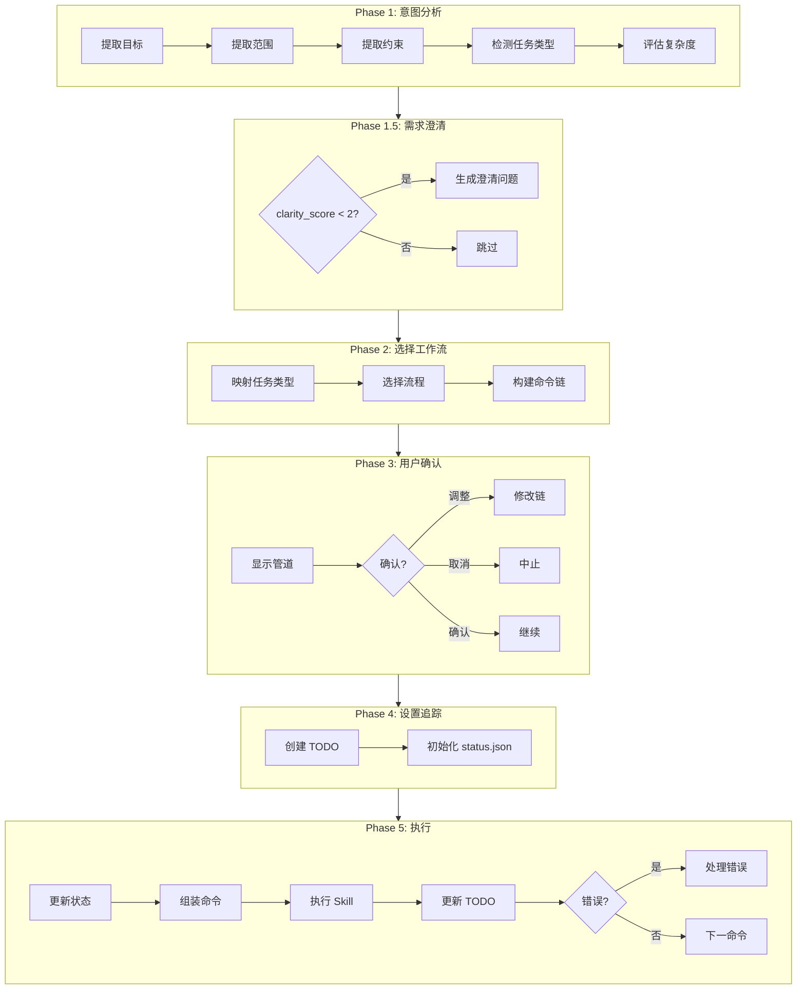

# /ccw

> **分类**: 核心 (Core)
> **源文件**: [.claude/commands/ccw.md](../../.claude/commands/ccw.md)

## 概述

`/ccw` 是 Claude-Code-Workflow 的主工作流编排器。它在主进程中执行意图分析、工作流选择和命令链执行。

**核心能力**:
- **意图驱动**: 基于任务意图自动选择工作流
- **端口链接**: 使用端口匹配构建命令链
- **最小执行单元**: 命令分组为原子单元，永不拆分
- **同步执行**: 使用 Skill 在主进程阻塞执行

## 命令语法

```bash
/ccw "任务描述"
```

### 参数说明

| 参数 | 类型 | 必填 | 默认值 | 说明 |
|------|------|------|--------|------|
| 任务描述 | string | 是 | - | 描述你要完成的任务 |

## 核心概念: 最小执行单元

### 定义

最小执行单元是一组必须作为原子组一起执行的命令集合，用于实现有意义的工作流里程碑。

### 为什么重要

- **防止不完整状态**: 避免生成任务后停止而不执行
- **用户体验**: 用户获得完整结果，而非需要手动跟进的中间产物
- **工作流完整性**: 维护多步操作的逻辑连贯性

### 关键单元

| 单元类型 | 模式 | 示例 |
|---------|------|------|
| **规划+执行** | plan-cmd → execute-cmd | lite-plan → lite-execute |
| **测试** | test-gen-cmd → test-exec-cmd | test-fix-gen → test-cycle-execute |
| **审查** | review-cmd → fix-cmd | review-session-cycle → review-cycle-fix |

### 原子规则

1. CCW 自动将命令分组为最小单元 - 永不拆分
2. 管道可视化用 `【 】` 标记显示单元
3. 错误处理保留单元边界（重试/跳过影响整个单元）

## 五阶段工作流



### Phase 1: 意图分析

**任务类型检测** (优先级顺序):

| 类型 | 关键词模式 |
|------|-----------|
| bugfix-hotfix | urgent, production, critical + fix/bug |
| brainstorm | 头脑风暴, 创意, 发散思维, multi-perspective |
| debug-file | 深度调试, 假设验证, systematic debug |
| analyze-file | 协作分析, 深度理解, collaborative analysis |
| bugfix | fix, bug, error, crash, fail, debug |
| issue-batch | issues/batch + fix/resolve |
| issue-transition | issue workflow, queue, multi-stage |
| exploration | uncertain, explore, research, what if |
| quick-task | quick/simple + feature/function |
| tdd | tdd, test-driven, test first |
| test-fix | test fail, fix test, failing test |
| review | review, code review |
| feature | (默认) |

**输出**: `Type: [task_type] | Goal: [goal] | Complexity: [complexity] | Clarity: [clarity_score]/3`

### Phase 1.5: 需求澄清

当 `clarity_score < 2` 时触发:

- **Goal**: Create/Fix/Optimize/Analyze
- **Scope**: Single file/Module/Cross-module/System
- **Constraints**: Backward compat/Skip tests/Urgent hotfix

### Phase 2: 选择工作流 & 构建命令链

**工作流级别映射**:

| 级别 | 流程 | 适用场景 |
|------|------|---------|
| Level 1 | lite-lite-lite | 极速任务 |
| Level 2 | rapid | 轻量级功能/修复 |
| Level 2.5 | rapid-to-issue | 桥接到 Issue 工作流 |
| Level 3 | coupled/tdd/review | 标准开发流程 |
| Level 4 | full/brainstorm | 探索性任务 |
| Issue | issue | Issue 工作流 |

**命令链示例**:

```javascript
// Level 2 - Rapid (轻量实现)
'rapid': [
  // Unit: Quick Implementation【lite-plan → lite-execute】
  { cmd: '/workflow:lite-plan', args: `"${goal}"`, unit: 'quick-impl' },
  { cmd: '/workflow:lite-execute', args: '--in-memory', unit: 'quick-impl' },
  // Unit: Test Validation【test-fix-gen → test-cycle-execute】
  { cmd: '/workflow:test-fix-gen', args: '', unit: 'test-validation' },
  { cmd: '/workflow:test-cycle-execute', args: '', unit: 'test-validation' }
]

// Level 3 - Coupled (验证规划)
'coupled': [
  // Unit: Verified Planning【plan → plan-verify】
  { cmd: '/workflow:plan', args: `"${goal}"`, unit: 'verified-planning' },
  { cmd: '/workflow:plan-verify', args: '', unit: 'verified-planning' },
  { cmd: '/workflow:execute', args: '' },
  // Unit: Code Review【review-session-cycle → review-cycle-fix】
  { cmd: '/workflow:review-session-cycle', args: '', unit: 'code-review' },
  { cmd: '/workflow:review-cycle-fix', args: '', unit: 'code-review' },
  // Unit: Test Validation
  { cmd: '/workflow:test-fix-gen', args: '', unit: 'test-validation' },
  { cmd: '/workflow:test-cycle-execute', args: '', unit: 'test-validation' }
]

// Issue Workflow
'issue': [
  { cmd: '/issue:discover', args: '' },
  { cmd: '/issue:plan', args: '--all-pending' },
  { cmd: '/issue:queue', args: '' },
  { cmd: '/issue:execute', args: '' }
]
```

### Phase 3: 用户确认

```javascript
AskUserQuestion({
  question: "Execute this command chain?",
  options: [
    { label: "Confirm", description: "Start" },
    { label: "Adjust", description: "Modify" },
    { label: "Cancel", description: "Abort" }
  ]
});
```

### Phase 4: 设置追踪

**双追踪系统**:

1. **TodoWrite 追踪** (UI 显示):
   ```
   CCW:rapid: [1/3] /workflow:lite-plan | in_progress
   CCW:rapid: [2/3] /workflow:lite-execute | pending
   CCW:rapid: [3/3] /workflow:test-cycle-execute | pending
   ```

2. **status.json 追踪** (持久化):
   - 位置: `.workflow/.ccw/{session_id}/status.json`
   - 状态: running | completed | failed | error

### Phase 5: 执行命令链

```javascript
for (const step of chain) {
  // 更新状态
  state.command_chain[i].status = 'running';
  
  // 组装并执行
  const result = await Skill(assembleCommand(step, previousResult));
  
  // 更新 TODO
  updateTodoStatus(i, chain.length, workflow, 'completed');
  
  // 错误处理
  if (error) {
    const action = await handleError(step, error);
    // Retry | Skip | Abort
  }
}
```

## With-File 工作流

**With-File 工作流**提供文档化探索和多 CLI 协作。

| 工作流 | 目的 | 关键特性 | 输出目录 |
|--------|------|---------|---------|
| **brainstorm-with-file** | 多视角创意 | Gemini/Codex/Claude 视角 | `.workflow/.brainstorm/` |
| **debug-with-file** | 假设驱动调试 | Gemini 验证、理解演进 | `.workflow/.debug/` |
| **analyze-with-file** | 协作分析 | 多轮问答、CLI 探索 | `.workflow/.analysis/` |

**检测关键词**:
- **brainstorm**: 头脑风暴, 创意, 发散思维, multi-perspective
- **debug-file**: 深度调试, 假设验证, systematic debug
- **analyze-file**: 协作分析, 深度理解, collaborative analysis

## 管道示例

| 输入 | 类型 | 级别 | 管道 (带单元) |
|------|------|------|--------------|
| "Add API endpoint" | feature (low) | 2 | 【lite-plan → lite-execute】→【test-fix-gen → test-cycle-execute】 |
| "Fix login timeout" | bugfix | 2 | 【lite-fix → lite-execute】→【test-fix-gen → test-cycle-execute】 |
| "Use issue workflow" | issue-transition | 2.5 | 【lite-plan → convert-to-plan】→ queue → execute |
| "头脑风暴: 通知系统" | brainstorm | 4 | brainstorm-with-file |
| "深度调试: 崩溃问题" | debug-file | 3 | debug-with-file |
| "OAuth2 system" | feature (high) | 3 | 【plan → plan-verify】→ execute →【review】→【test】 |
| "Implement with TDD" | tdd | 3 | 【tdd-plan → execute】→ tdd-verify |

## 使用示例

### 示例 1: 自动选择工作流

```bash
/ccw "Add user authentication"
```

**预期输出**:
```
Type: feature | Goal: Add user authentication | Complexity: medium | Clarity: 2/3

Level 2 - rapid | Pipeline: 【lite-plan → lite-execute】→【test-fix-gen → test-cycle-execute】

Commands:
1. /workflow:lite-plan "Add user authentication"
2. /workflow:lite-execute --in-memory
3. /workflow:test-fix-gen
4. /workflow:test-cycle-execute

Execute this command chain? [Confirm / Adjust / Cancel]
```

### 示例 2: 复杂需求 (触发澄清)

```bash
/ccw "Optimize system performance"
```

### 示例 3: Bug 修复

```bash
/ccw "Fix memory leak in WebSocket handler"
```

### 示例 4: TDD 开发

```bash
/ccw "Implement user registration with TDD"
```

### 示例 5: With-File 工作流

```bash
/ccw "头脑风暴: 用户通知系统重新设计"     # → brainstorm-with-file
/ccw "深度调试: 系统随机崩溃问题"          # → debug-with-file
/ccw "协作分析: 理解认证架构设计决策"      # → analyze-with-file
```

## 与 ccw-coordinator 的区别

| 特性 | /ccw | /ccw-coordinator |
|------|------|-----------------|
| 执行模式 | 主进程同步 (Skill) | 外部 CLI 异步 |
| 任务编排 | 主进程直接执行 | 后台任务 + Hook 回调 |
| 适用场景 | 简单到中等任务 | 复杂多命令链 |
| 状态追踪 | TodoWrite + status.json | 完整会话持久化 |

## 关联组件

- **相关 Commands**: 
  - [ccw-coordinator](ccw-coordinator.md) - 外部 CLI 协调器
  - [lite-plan](workflow/lite-plan.md) - 轻量规划
  - [lite-execute](workflow/lite-execute.md) - 轻量执行
- **相关 Skills**: workflow-planning

## 设计原则

1. **主进程执行** - 使用 Skill 在主进程，无外部 CLI
2. **意图驱动** - 基于任务意图自动选择工作流
3. **端口链接** - 使用端口匹配构建命令链
4. **最小执行单元** - 命令分组为原子单元
5. **渐进澄清** - 低清晰度触发澄清阶段
6. **TODO 追踪** - 使用 CCW 前缀隔离工作流 TODO
7. **单元感知错误处理** - 重试/跳过/中止影响整个单元
8. **用户控制** - 每阶段可选用户确认

---

*最后更新: 2025-02*
