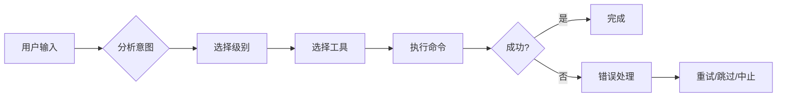

# CCW Commands Reference

---
id: CMD-cli-reference
version: 1.0.0
status: active
---

> **Total Commands**: 48
> **Categories**: Core, Workflow, Issue, Memory, Team
> **Last Updated**: 2026-02-16

---

## 概述

CCW 命令参考是所有可用命令的完整索引，包括 CLI 命令和 Slash 命令。命令按复杂度分为 4 个级别，支持从快速修复到复杂架构设计的各种场景。

```mermaid
graph TB
    subgraph "CLI Commands"
        A[ccw install] --> B[ccw view]
        B --> C[ccw cli]
        C --> D[ccw team]
    end

    subgraph "Slash Commands"
        E[/ccw] --> F[Level 1-4]
        F --> G[workflow:*]
        F --> H[issue:*]
        F --> I[memory:*]
    end
```

---

## 核心能力

### 多级工作流

| 级别 | 名称 | 适用场景 | 典型命令 |
|------|------|----------|----------|
| **1** | lite-lite-lite | 快速修复、配置更改 | `/workflow:lite-lite-lite` |
| **2** | lite-plan | 单模块功能、Bug 修复 | `/workflow:lite-plan` |
| **3** | plan | 多模块开发、TDD | `/workflow:plan` |
| **4** | brainstorm | 架构设计、新功能探索 | `/workflow:brainstorm` |

### 智能工具选择

| 工具 | 主要用途 | 超时 |
|------|----------|------|
| `gemini` | 分析、架构、探索 | 1h |
| `codex` | 自主编码、审查 | 2h |
| `qwen` | 代码生成 | 1h |
| `claude` | 通用、审查 | 1h |

---

## 工作流程

### 命令执行流程



### CLI 命令流程

1. **Install**: 安装工作流文件到项目
2. **View**: 打开 Dashboard UI
3. **CLI**: 执行 CLI 工具（核心命令）
4. **Team**: 团队协作命令

### Slash 命令流程

1. **检测**: 分析用户输入意图
2. **路由**: 选择工作流级别
3. **执行**: 调用对应 Skill
4. **确认**: 验证结果

---

## CLI Commands

### Core Commands

#### `ccw install`
Install workflow files to the project.

```bash
ccw install           # Install to current project
ccw install -m Global # Install globally
```

#### `ccw view`
Open the dashboard UI.

```bash
ccw view              # Open dashboard in browser
```

#### `ccw cli`
Execute CLI tools with intelligent orchestration.

```bash
ccw cli -p "Analyze authentication module" --tool gemini --mode analysis
ccw cli -p "Implement rate limiting" --tool codex --mode write
```

**Options**:
- `-p, --prompt` - Task prompt
- `--tool` - CLI tool (gemini, codex, qwen, claude)
- `--mode` - Execution mode (analysis, write, review)
- `--cd` - Working directory
- `--resume` - Resume previous session
- `--rule` - Load template rules

#### `ccw upgrade`
Upgrade installed workflow files.

```bash
ccw upgrade -a        # Upgrade all
```

#### `ccw team`
Team collaboration commands.

```bash
ccw team create       # Create team session
ccw team join         # Join team session
```

## Slash Commands

### Primary Commands

#### `/ccw`
Auto workflow orchestrator - analyzes intent and selects workflow level.

```bash
/ccw "Add user authentication"
/ccw "Fix memory leak in WebSocket"
/ccw "Implement with TDD"
```

#### `/ccw-coordinator`
Smart orchestrator with manual chain adjustment.

```bash
/ccw-coordinator "Implement OAuth2 system"
```

### Workflow Commands

#### Level 1: Rapid Execution

```bash
/workflow:lite-lite-lite "Fix typo in README"
```
- Instant execution
- No artifacts
- Auto CLI selection

#### Level 2: Lightweight Planning

```bash
/workflow:lite-plan "Add JWT authentication"
/workflow:lite-fix "User upload fails with 413 error"
/workflow:multi-cli-plan "Analyze security from multiple perspectives"
```

#### Level 3: Standard Planning

```bash
/workflow:plan "Implement payment gateway"
/workflow:tdd-plan "Create user service with tests"
/workflow:test-fix-gen "Generate tests and fixes"
```

#### Level 4: Brainstorm

```bash
/workflow:brainstorm:auto-parallel "Design real-time collaboration" --count 5
```

### Issue Workflow Commands

```bash
/issue:discover       # Discover issues from codebase
/issue:plan           # Plan issue resolution
/issue:queue          # Queue issues for execution
/issue:execute        # Execute queued issues
```

### Memory Commands

```bash
/memory:capture       # Capture current context
/memory:manage        # Manage memory store
```

### Team Commands

```bash
/team-lifecycle       # Team session lifecycle
/team-skill-designer  # Design team skills
/team-issue           # Team issue management
```

## Command Options Reference

### Mode Options

| Mode | Description | Permissions |
|------|-------------|-------------|
| `analysis` | Read-only analysis | Safe for auto-execution |
| `write` | Create/Modify/Delete | Requires explicit flag |
| `review` | Git-aware code review | Read-only output |

### Tool Selection

| Tool | Primary Use |
|------|-------------|
| `gemini` | General analysis, architecture |
| `codex` | Autonomous coding, review |
| `qwen` | Code generation |
| `claude` | General purpose, review |

### Rule Templates

| Template | Use Case |
|----------|----------|
| `analysis-diagnose-bug-root-cause` | Bug diagnosis |
| `analysis-review-architecture` | Architecture review |
| `development-implement-feature` | Feature implementation |
| `planning-plan-architecture-design` | Architecture design |

## 使用场景

### 快速任务 (Level 1)

```bash
# 修复拼写错误
/workflow:lite-lite-lite "Fix typo in README"

# 简单配置更改
ccw cli -p "Update port to 8080" --tool gemini --mode write
```

### 功能开发 (Level 2-3)

```bash
# 添加 API 端点
/workflow:lite-plan "Add /api/users endpoint"

# 实现认证系统
/workflow:plan "Implement JWT authentication with refresh tokens"

# TDD 开发
/workflow:tdd-plan "Create user service with full test coverage"
```

### 架构设计 (Level 4)

```bash
# 系统重构
/workflow:brainstorm:auto-parallel "Design microservices architecture" --count 5

# 多角度分析
/workflow:multi-cli-plan "Analyze security from multiple perspectives"
```

### Issue 工作流

```bash
# 完整 Issue 流程
/issue:discover          # 发现问题
/issue:plan --all        # 规划解决方案
/issue:queue             # 加入队列
/issue:execute           # 执行
```

## 最佳实践

### 1. 选择正确的级别

- **Level 1**: < 10 行代码变更
- **Level 2**: 单文件或简单功能
- **Level 3**: 多文件或需要测试
- **Level 4**: 架构决策或新系统

### 2. 使用正确的模式

| 场景 | 模式 | 说明 |
|------|------|------|
| 只读分析 | `--mode analysis` | 安全，自动执行 |
| 代码修改 | `--mode write` | 需要显式确认 |
| 代码审查 | `--mode review` | Git 感知 |

### 3. 利用 Session Resume

```bash
# 继续之前的工作
ccw cli -p "Continue implementation" --resume

# 合并多个会话
ccw cli -p "Merge findings" --resume session1,session2
```

### 4. 使用 Rule Templates

```bash
# 使用预定义模板
ccw cli -p "..." --rule analysis-diagnose-bug-root-cause
ccw cli -p "..." --rule development-implement-feature
```

---

## CLI Execution Modes

### Background Execution (Default)
```bash
ccw cli -p "..." --tool gemini  # Runs in background
```

### Synchronous Execution
For agent calls, use `run_in_background: false`.

## Session Resume

```bash
ccw cli -p "Continue..." --resume           # Resume last
ccw cli -p "Continue..." --resume <id>      # Resume specific
ccw cli -p "Merge..." --resume <id1>,<id2>  # Merge sessions
```
