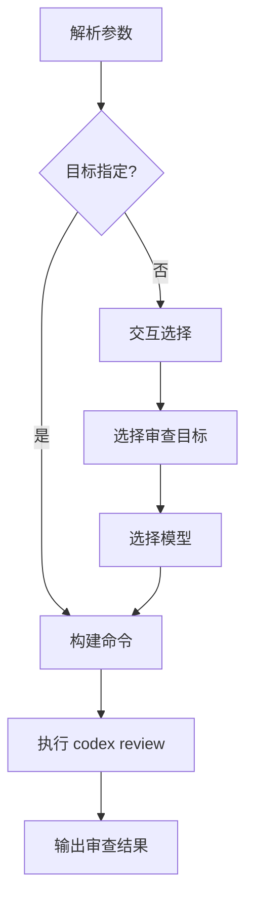

# /cli:codex-review

---
id: CMD-codex-review
version: 1.0.0
status: active
source_path: ../../../.claude/commands/cli/codex-review.md
---

> **Category**: CLI
> **Arguments**: `[--uncommitted|--base <branch>|--commit <sha>] [--model <model>] [prompt]`

---

## 概述

交互式代码审查命令，通过 ccw cli 端点调用 `codex review`，支持可配置的审查目标、模型和自定义指令。提供 Git 感知的差异分析，自动识别 staged、unstaged 和特定提交的变更。

**核心功能**:
- Git 感知的差异审查
- 支持未提交、分支对比、特定提交三种模式
- 可选模型和自定义焦点

---

## 核心能力

### 审查模式

| 模式 | 参数 | 说明 |
|------|------|------|
| **未提交** | `--uncommitted` | 审查 staged、unstaged、untracked 变更 |
| **分支对比** | `--base <branch>` | 与基础分支对比 |
| **特定提交** | `--commit <sha>` | 审查指定提交的变更 |

### 审查参数

| 参数 | 说明 |
|------|------|
| `[PROMPT]` | 自定义审查指令 |
| `--model <model>` | 覆盖默认模型 |
| `--title <TITLE>` | 审查摘要标题 |

---

## 工作流程



### 执行步骤

1. **解析参数**: 检查 --uncommitted, --base, --commit, --model
2. **交互选择**: 如无目标，提示用户选择
3. **构建命令**: 组装 codex review 命令
4. **执行审查**: 通过 ccw cli 调用
5. **输出结果**: 结构化审查报告

---

## 使用场景

### 审查未提交变更

```bash
# 审查当前所有变更
/cli:codex-review --uncommitted

# 带焦点审查
/cli:codex-review --uncommitted "Focus on security issues"
```

### 对比分支

```bash
# 与 main 分支对比
/cli:codex-review --base main

# 与 develop 分支对比
/cli:codex-review --base develop "Check for breaking changes"
```

### 审查特定提交

```bash
# 审查指定提交
/cli:codex-review --commit abc123

# 带标题审查
/cli:codex-review --commit abc123 --title "Auth refactor"
```

---

## 最佳实践

### 1. 提交前审查

```bash
# 在 commit 前运行
/cli:codex-review --uncommitted
git commit -m "..."
```

### 2. PR 前审查

```bash
# 在创建 PR 前与主分支对比
/cli:codex-review --base main
```

### 3. 聚焦审查

```bash
# 专注特定方面
/cli:codex-review --uncommitted "Focus on performance and memory"
/cli:codex-review --base main "Check API compatibility"
```

---

## 参数说明

| 参数 | 类型 | 必需 | 默认值 | 说明 |
|------|------|------|--------|------|
| `--uncommitted` | flag | 否 | - | 审查未提交变更 |
| `--base` | string | 否 | - | 基础分支名 |
| `--commit` | string | 否 | - | 提交 SHA |
| `--model` | string | 否 | gpt-5.2 | 模型选择 |
| `--title` | string | 否 | - | 审查标题 |
| `prompt` | string | 否 | - | 自定义焦点 |

---

## 相关文档

- [CLI 命令索引](../_index.md)
- [CLI Reference](../cli-reference.md)

---

*本文档由 CCW 知识系统维护*
