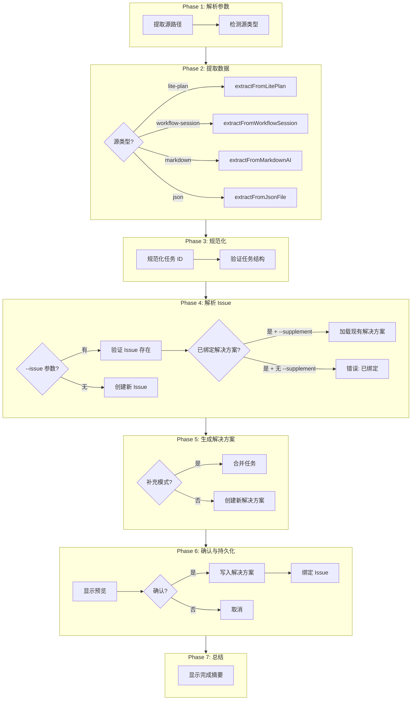

# /issue:convert-to-plan

> **分类**: Issue
> **源文件**: [.claude/commands/issue/convert-to-plan.md](../../../.claude/commands/issue/convert-to-plan.md)

## 概述

`/issue:convert-to-plan` 将各种规划产物格式转换为 Issue 工作流解决方案，支持智能检测和自动绑定。

**核心能力**:
- **多源支持**: lite-plan、workflow-session、markdown、JSON
- **自动检测**: 智能识别源格式
- **自动绑定**: 创建 Issue 并绑定解决方案
- **补充模式**: 向现有解决方案添加任务

## 命令语法

```bash
/issue:convert-to-plan [options] <SOURCE>
```

### 参数说明

| 参数 | 类型 | 必填 | 默认值 | 说明 |
|------|------|------|--------|------|
| SOURCE | string | 是 | - | 规划产物路径或 WFS-xxx ID |
| --issue | string | 否 | 自动创建 | 绑定到现有 Issue |
| --supplement | flag | 否 | false | 添加任务到现有解决方案（需要 --issue） |
| -y, --yes | flag | 否 | false | 跳过所有确认 |

## 支持的源格式

| 格式 | 检测方式 | 示例 |
|------|---------|------|
| **lite-plan** | 目录含 plan.json | `.workflow/.lite-plan/{slug}/` |
| **workflow-session** | 目录含 workflow-session.json | `.workflow/active/WFS-xxx/` |
| **WFS ID** | 匹配 WFS-xxx 模式 | `WFS-auth-impl` |
| **markdown** | .md 文件扩展名 | `./docs/plan.md` |
| **json** | .json 文件扩展名 | `./plan.json` |

## 使用场景

### 什么时候使用

- **转换规划输出**: 将 lite-plan 或 workflow 会话转换为 Issue
- **绑定现有 Issue**: 将规划绑定到特定 Issue ID
- **补充任务**: 向现有解决方案添加更多任务
- **批量转换**: 处理多种格式的规划文件

### 什么时候不使用

- **直接生成解决方案**: 使用 `/issue:plan`
- **创建新 Issue**: 使用 `/issue:new`

## 工作流程

### 七阶段转换流程



### Phase 1: 解析参数与检测源类型

```javascript
function detectSourceType(source) {
  // 检查 WFS-xxx 模式
  if (source.match(/^WFS-[\w-]+$/)) {
    return { type: 'workflow-session-id', path: `.workflow/active/${source}` };
  }
  
  // 检查目录
  if (isDirectory(source)) {
    if (hasPlanJson(source)) return { type: 'lite-plan', path: source };
    if (hasSession(source)) return { type: 'workflow-session', path: source };
  }
  
  // 检查文件扩展名
  if (source.endsWith('.json')) return { type: 'json-file', path: source };
  if (source.endsWith('.md')) return { type: 'markdown-file', path: source };
}
```

### Phase 2: 格式特定提取器

#### Lite-Plan 提取器

```javascript
function extractFromLitePlan(folderPath) {
  const plan = JSON.parse(Read(`${folderPath}/plan.json`));
  
  return {
    title: plan.summary?.split('.')[0] || 'Untitled Plan',
    description: plan.summary,
    approach: plan.approach,
    tasks: plan.tasks.map(t => ({
      id: t.id,
      title: t.title,
      scope: t.scope || '',
      action: t.action || 'Implement',
      files: (t.modification_points || []).map(mp => ({
        path: mp.file, target: mp.target, change: mp.change
      })),
      implementation: Array.isArray(t.implementation) 
        ? t.implementation 
        : [t.implementation || ''],
      convergence: {
        criteria: Array.isArray(t.acceptance) ? t.acceptance : [t.acceptance || ''],
        verification: t.verification?.manual_checks || []
      }
    }))
  };
}
```

#### Markdown 提取器 (AI 辅助)

```javascript
async function extractFromMarkdownAI(filePath) {
  const fileContent = Read(filePath);
  
  // 使用 Gemini CLI 进行智能提取
  const cliPrompt = `
PURPOSE: Extract implementation plan from markdown document for issue solution conversion.
TASK: • Analyze document structure • Identify title/summary • Parse tasks from any format
EXPECTED: Valid JSON object with title, approach, tasks array
CONSTRAINTS: Output ONLY valid JSON | Tasks must have id, title, scope, action, implementation, acceptance

DOCUMENT CONTENT:
${fileContent}`;

  const result = Bash(`ccw cli -p '${cliPrompt}' --tool gemini --mode analysis`);
  
  return parseExtractedJson(result);
}
```

### Phase 3: 规范化任务 ID

```javascript
function normalizeTaskIds(tasks) {
  return tasks.map((t, i) => ({
    ...t,
    id: `T${i + 1}`,
    depends_on: (t.depends_on || []).map(d => {
      // 处理各种 ID 格式: IMPL-001, T1, 1 等
      const num = d.match(/\d+/)?.[0];
      return num ? `T${parseInt(num)}` : d;
    })
  }));
}
```

### Phase 4: 解析 Issue

**创建新 Issue**:
```javascript
const createResult = Bash(`ccw issue create << 'EOF'
{
  "title": "${title}",
  "context": "${context}",
  "priority": ${priority},
  "source": "converted"
}
EOF`);
```

**绑定现有 Issue**:
```javascript
// 验证 Issue 存在
const issue = JSON.parse(Bash(`ccw issue status ${issueId} --json`));

// 检查是否已绑定
if (issue.bound_solution_id && !flags.supplement) {
  throw new Error(`Issue ${issueId} already has bound solution. Use --supplement to add tasks.`);
}
```

### Phase 5: 生成解决方案

**Solution Schema**:

```typescript
interface Solution {
  id: string;                    // SOL-{issue-id}-{4-char-uid}
  description?: string;          // 高层摘要
  approach?: string;             // 技术策略
  tasks: Task[];                 // 必需: 至少 1 个任务
  analysis?: { risk, impact, complexity };
  score?: number;                // 0.0-1.0
  is_bound: boolean;
  created_at: string;
}

interface Task {
  id: string;                    // T1, T2, T3...
  title: string;                 // 动词 + 目标
  scope: string;                 // 模块路径或功能区域
  action: Action;                // Create|Update|Implement|...
  implementation: string[];      // 步骤指南
  convergence: { criteria: string[], verification: string[] };
}
```

### Phase 6: 确认与持久化

**预览显示**:
```
## Conversion Summary

**Issue**: ISS-001
**Solution**: SOL-ISS-001-a1b2
**Tasks**: 5
**Mode**: New

### Tasks:
- T1: Implement user authentication [Implement]
- T2: Add password validation [Update]
- T3: Create session management [Create]
```

**持久化**:
```javascript
// 写入解决方案
Write({ file_path: solutionFile, content: JSON.stringify(solution) });

// 绑定到 Issue
Bash(`ccw issue bind ${issueId} ${solutionId}`);

// 更新 Issue 状态
Bash(`ccw issue update ${issueId} --status planned`);
```

## 使用示例

### 示例 1: 转换 lite-plan 到新 Issue

```bash
/issue:convert-to-plan ".workflow/.lite-plan/implement-auth-2026-01-25"
```

**预期输出**:
```
Detected source type: lite-plan
Extracted: 5 tasks
Created issue: ISS-001 (priority: 3)
✓ Created solution: SOL-ISS-001-a1b2
✓ Bound solution to issue
✓ Updated issue status to planned

## Done

**Issue**: ISS-001
**Solution**: SOL-ISS-001-a1b2
**Tasks**: 5
**Status**: planned
```

### 示例 2: 转换 workflow 会话到现有 Issue

```bash
/issue:convert-to-plan WFS-auth-impl --issue GH-123
```

### 示例 3: 补充现有解决方案

```bash
/issue:convert-to-plan "./docs/additional-tasks.md" --issue ISS-001 --supplement
```

### 示例 4: 自动模式

```bash
/issue:convert-to-plan ".workflow/.lite-plan/my-plan" -y
```

## 错误处理

| 错误 | 代码 | 解决方案 |
|------|------|---------|
| 源未找到 | E001 | 检查路径是否存在 |
| 无效源格式 | E002 | 验证文件包含有效计划结构 |
| Issue 未找到 | E003 | 检查 Issue ID 或省略 --issue 创建新的 |
| 解决方案已绑定 | E004 | 使用 --supplement 添加任务 |
| AI 提取失败 | E005 | 检查 markdown 结构，尝试更简单格式 |
| 无任务提取 | E006 | 源必须包含至少 1 个任务 |

## 核心数据访问原则

**重要**: 所有 Issue/解决方案操作使用 CLI 命令。

| 操作 | 正确 | 错误 |
|------|------|------|
| 获取 Issue | `ccw issue status <id> --json` | 直接读取 issues.jsonl |
| 创建 Issue | `ccw issue init <id> --title "..."` | 写入 issues.jsonl |
| 绑定解决方案 | `ccw issue bind <id> <sol-id>` | 编辑 issues.jsonl |
| 列出解决方案 | `ccw issue solutions --issue <id> --brief` | 读取 solutions/*.jsonl |

## 关联组件

- **相关 Commands**: 
  - [plan](plan.md) - 从 Issue 探索生成解决方案
  - [queue](queue.md) - 从绑定解决方案形成执行队列
  - [execute](execute.md) - 执行队列
- **相关 Skills**: issue-lifecycle

---

*最后更新: 2025-02*
