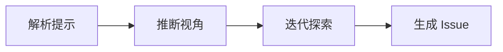

# /issue:discover-by-prompt

---
id: CMD-issue-discover-by-prompt
version: 1.0.0
status: active
---

> **Category**: Issue
> **Arguments**: `"<prompt>" [--scope <path>]`

---

## 概述

使用自然语言提示发现 Issue，通过 Gemini CLI 进行智能分析和迭代多角度探索。

---

## 核心能力

### 提示驱动发现

- 自然语言描述发现目标
- Gemini 智能规划迭代探索
- 多角度自动分析

### 与 /issue:discover 区别

| 特性 | discover | discover-by-prompt |
|------|----------|-------------------|
| 输入 | 路径模式 | 自然语言 |
| 视角 | 预定义列表 | 智能推断 |
| 控制度 | 高 | 中 |

---

## 工作流程



---

## 使用场景

### 自然语言发现

```bash
/issue:discover-by-prompt "Find security issues in authentication"
```

### 指定范围

```bash
/issue:discover-by-prompt "Find performance bottlenecks" --scope src/api/**
```

---

## 最佳实践

1. **明确目标**: 清晰描述发现目标
2. **限定范围**: 使用 --scope 提高效率
3. **验证结果**: 检查发现的相关性

---

## 相关文档

- [Issue Discover](discover.md)
- [Issue Plan](plan.md)

---

*本文档由 CCW 知识系统维护*
