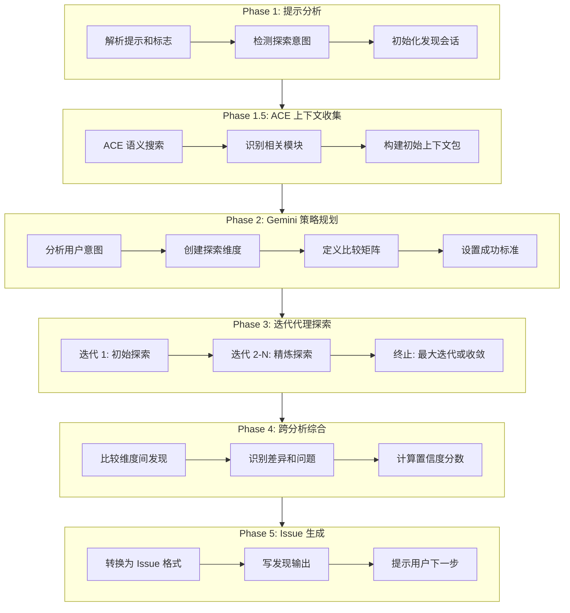

# /issue:discover-by-prompt

> **分类**: Issue
> **源文件**: [.claude/commands/issue/discover-by-prompt.md](../../../.claude/commands/issue/discover-by-prompt.md)

## 概述

`/issue:discover-by-prompt` 是基于用户提示的 Issue 发现命令。它使用 Gemini 规划的迭代多代理探索，通过 ACE 语义搜索收集上下文，支持跨模块比较（如前端与后端 API 契约检查）。

**核心能力**:
- **自然语言输入**: 描述你想找什么，而不是怎么找
- **智能规划**: Gemini 设计最优探索策略
- **迭代精炼**: 每轮建立在之前的发现上
- **跨模块分析**: 比较前端/后端、移动/Web、旧/新实现
- **自适应探索**: 根据发现调整方向

## 命令语法

```bash
/issue:discover-by-prompt [options] <prompt>
```

### 参数说明

| 参数 | 类型 | 必填 | 默认值 | 说明 |
|------|------|------|--------|------|
| prompt | string | 是 | - | 发现目标描述 |
| -y, --yes | flag | 否 | - | 自动继续所有迭代，跳过确认 |
| --scope | string | 否 | **/* | 探索的文件模式 |
| --depth | string | 否 | standard | 深度: standard/deep |
| --max-iterations | number | 否 | 5 | 最大探索迭代次数 |

## 使用场景

### 什么时候使用

| 场景 | 示例提示 |
|------|---------|
| API 契约 | "检查前端调用是否匹配后端端点" |
| 错误处理 | "查找不一致的错误处理模式" |
| 迁移差距 | "比较旧认证与新认证实现" |
| 功能对等 | "验证移动端是否有所有 Web 功能" |
| Schema 漂移 | "检查 TypeScript 类型是否匹配 API 响应" |
| 集成问题 | "查找服务 A 和服务 B 之间的不匹配" |

### 与 `/issue:discover` 的区别

| 特性 | discover | discover-by-prompt |
|------|----------|-------------------|
| 视角 | 预定义视角（bug, security 等） | 用户驱动的提示 |
| 执行 | 并行执行 | Gemini 规划策略，迭代探索 |
| 适用 | 通用审计 | 特定意图的发现 |

## 工作流程

### 五阶段执行流程



### Phase 1: 提示分析与初始化

**意图类型检测**:

| 意图类型 | 描述 |
|---------|------|
| comparison | 比较两个模块/实现 |
| search | 搜索特定模式 |
| verification | 验证预期行为 |
| audit | 审计特定类别 |

### Phase 1.5: ACE 上下文收集

**目的**: 使用 ACE 语义搜索在 Gemini 规划前收集代码库上下文。

```javascript
// 从提示中提取关键词进行语义搜索
const keywords = extractKeywords(prompt);

// 使用 ACE 理解代码库结构
const aceQueries = [
  `Project architecture and module structure for ${keywords.join(', ')}`,
  `Where are ${keywords[0]} implementations located?`
];

// 为 Gemini 构建上下文包
const aceContext = {
  prompt_keywords: keywords,
  codebase_structure: aceResults[0].result,
  relevant_modules: aceResults.slice(1).map(r => r.result)
};
```

### Phase 2: Gemini 策略规划

**Gemini 规划职责**:

| 职责 | 输入 | 输出 |
|------|------|------|
| 意图分析 | 用户提示 | type, primary_question, sub_questions |
| 维度设计 | ACE 上下文 + 提示 | 带搜索目标的维度 |
| 比较矩阵 | 意图类型 + 模块 | 比较点（如适用） |
| 迭代策略 | 深度设置 | estimated_iterations, termination_conditions |

**探索维度示例**:

| 提示 | 生成的维度 |
|------|-----------|
| "检查 API 契约" | frontend-calls, backend-handlers |
| "查找认证问题" | auth-module (单一维度) |
| "比较旧/新实现" | legacy-code, new-code |
| "审计支付流程" | payment-service, validation, logging |

### Phase 3: 迭代代理探索

**迭代循环**:

```
1. Plan: 本迭代探索什么
   └─ 基于前置发现 + 未探索区域

2. Execute: 为本迭代启动代理
   └─ 每个代理: 探索 → 收集 → 返回摘要

3. Analyze: 处理迭代结果
   └─ 新发现？差距？矛盾？

4. Decide: 继续或终止
   └─ 终止条件: 最大迭代 或 收敛 或 对所有问题高置信度
```

**ACE 在迭代中使用**:
- 迭代开始时: ACE 搜索相关代码
- 代理接收: 维度目标 + ACE 建议
- 代理可以: 调用 ACE 进行更深入搜索

### Phase 4: 跨分析与综合

**比较分析** (比较意图):
- 比较维度间发现
- 识别差异
- 计算匹配率

**发现优先级排序**:
- 按 confidence 和 priority 排序
- 筛选 issue 值得项

### Phase 5: Issue 生成与总结

- 转换高置信度发现为 issue
- 写入 discovery-issues.jsonl
- 提供后续选项

## 输出结构

```
.workflow/issues/discoveries/
└── {DBP-YYYYMMDD-HHmmss}/
    ├── discovery-state.json          # 会话状态与迭代追踪
    ├── iterations/
    │   ├── 1/
    │   │   └── {dimension}.json      # 维度发现
    │   └── 2/
    │       └── {dimension}.json
    ├── comparison-analysis.json      # 跨维度比较（如适用）
    └── discovery-issues.jsonl        # 生成的 issue 候选
```

## 使用示例

### 示例 1: API 契约比较

```bash
/issue:discover-by-prompt "检查前端 API 调用是否匹配后端实现"
```

**Gemini 规划** (比较):
- 维度 1: api-consumers (fetch 调用, hooks, services)
- 维度 2: api-providers (handlers, routes, controllers)
- 比较矩阵: endpoints, methods, payloads, responses

### 示例 2: 单模块深入

```bash
/issue:discover-by-prompt "查找认证模块中所有潜在问题" --scope=src/auth/**
```

**Gemini 规划** (单一维度):
- 维度: auth-module
- 焦点: 安全漏洞, 边缘情况, 错误处理, 测试缺口

### 示例 3: 深度探索

```bash
/issue:discover-by-prompt "查找不一致的错误处理模式" --depth=deep --max-iterations=8
```

### 示例 4: 仅规划模式

```bash
/issue:discover-by-prompt "查找不一致模式" --plan-only
```

**预期输出**:
```
Gemini Plan:
- Intent: search
- Dimensions: 2 (pattern-definitions, pattern-usages)
- Estimated iterations: 3

Continue with exploration? [Y/n]
```

## 配置选项

| 标志 | 默认值 | 说明 |
|------|--------|------|
| `--scope` | `**/*` | 探索的文件模式 |
| `--depth` | standard | standard (3 次迭代) 或 deep (5+ 次迭代) |
| `--max-iterations` | 5 | 最大探索迭代次数 |
| `--plan-only` | false | Phase 2 后停止，显示计划供用户审查 |

## 关联组件

- **相关 Commands**: 
  - [discover](discover.md) - 标准视角发现
  - [plan](../workflow/plan.md) - Issue 规划
  - [queue](queue.md) - 执行队列
- **相关 Tools**: ACE 语义搜索, Gemini CLI

## 最佳实践

1. **提示要具体**: 更具体的提示 → 更好的 Gemini 规划
2. **适当范围**: 窄范围用于聚焦比较，宽范围用于审计
3. **审查探索计划**: 长时间探索前检查 exploration-plan.json
4. **先用标准深度**: 从 standard 开始，需要时再 deep
5. **结合 `/issue:discover`**: 提示用于比较，视角用于审计

---

*最后更新: 2025-02*
