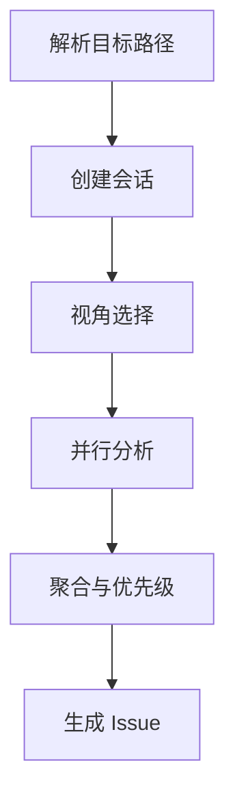

# /issue:discover

---
id: CMD-issue-discover
version: 1.0.0
status: active
source_path: ../../../.claude/commands/issue/discover.md
---

> **Category**: Issue
> **Arguments**: `[-y|--yes] <path-pattern> [--perspectives=bug,ux,...] [--external]`

---

## 概述

多视角问题发现器，从不同角度探索代码以识别潜在 Bug、UX 改进、测试缺口和其他可操作项。与代码审查不同，发现专注于**找到改进机会和潜在问题**。

**输出目录**: `.workflow/issues/discoveries/{discovery-id}/`

---

## 核心能力

### 可用视角

| 视角 | 说明 | 外部研究 |
|------|------|----------|
| `bug` | 潜在 Bug 和错误 | 否 |
| `ux` | 用户体验问题 | 否 |
| `test` | 测试覆盖缺口 | 否 |
| `quality` | 代码质量问题 | 否 |
| `security` | 安全漏洞 | Exa 自动启用 |
| `performance` | 性能瓶颈 | 否 |
| `maintainability` | 可维护性 | 否 |
| `best-practices` | 最佳实践偏离 | Exa 自动启用 |

### CLI 工具链

`Gemini → Qwen → Codex`（后备链）

---

## 工作流程



### 执行阶段

1. **Phase 1**: 解析目标模式，创建会话
2. **Phase 2**: 交互式视角选择
3. **Phase 3**: 并行视角分析（每个视角一个 Agent）
4. **Phase 4**: 聚合与去重
5. **Phase 5**: 生成 Issue 和摘要

---

## 使用场景

### 发现特定模块问题

```bash
# 交互式视角选择
/issue:discover src/auth/**
```

### 指定视角

```bash
# 只检查 bug、安全和测试
/issue:discover src/payment/** --perspectives=bug,security,test
```

### 外部研究

```bash
# 启用 Exa 外部研究
/issue:discover src/api/** --external
```

### 多模块发现

```bash
# 多个模块
/issue:discover src/auth/**,src/payment/**
```

### 自动模式

```bash
# 跳过确认
/issue:discover src/** -y
```

---

## 最佳实践

### 1. 按模块发现

```bash
# 每次聚焦一个模块
/issue:discover src/auth/**
/issue:discover src/payment/**
```

### 2. 使用安全视角

```bash
# 认证相关模块必用安全视角
/issue:discover src/auth/** --perspectives=bug,security
```

### 3. 定期发现

```bash
# Sprint 结束时全面发现
/issue:discover src/** -y
```

---

## 参数说明

| 参数 | 类型 | 必需 | 默认值 | 说明 |
|------|------|------|--------|------|
| `<path-pattern>` | string | 是 | - | 目标路径模式 |
| `--perspectives` | string | 否 | all | 视角列表 |
| `--external` | flag | 否 | - | 启用外部研究 |
| `-y, --yes` | flag | 否 | - | 自动模式 |

---

## 相关文档

- [Issue Plan](plan.md)
- [Issue Queue](queue.md)
- [Issue Execute](execute.md)

---

*本文档由 CCW 知识系统维护*
