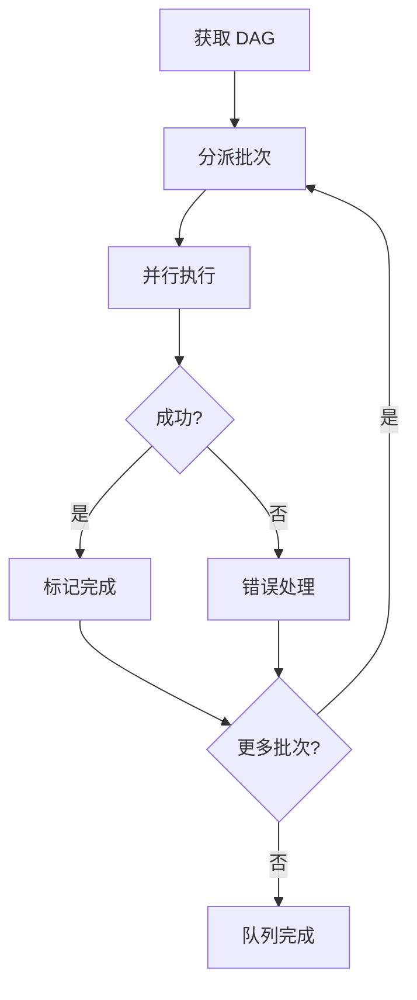

# /issue:execute

---
id: CMD-issue-execute
version: 1.0.0
status: active
---

> **Category**: Issue
> **Arguments**: `--queue <queue-id> [--worktree] [--tool codex|gemini|agent]`

---

## 概述

执行队列中的解决方案，使用 DAG 驱动的并行编排。每个解决方案由执行器完整处理所有任务，一次提交。

---

## 核心能力

### 执行特性

| 特性 | 说明 |
|------|------|
| **DAG 驱动** | 按依赖关系自动排序 |
| **并行执行** | 无冲突批次并行处理 |
| **单次提交** | 每个方案一次提交 |
| **进度追踪** | 实时更新队列状态 |

### 执行器选择

| 执行器 | 超时 | 适用场景 |
|--------|------|----------|
| `codex` | 2h | 长时间自主工作 |
| `gemini` | 1h | 大上下文分析 |
| `agent` | - | 复杂任务 |

---

## 工作流程



---

## 使用场景

### 执行指定队列

```bash
/issue:execute --queue QUE-20260216-001
```

### 使用 Worktree 隔离

```bash
# 在独立 worktree 中执行
/issue:execute --queue QUE-xxx --worktree
```

### 选择执行器

```bash
# 使用 Codex
/issue:execute --queue QUE-xxx --tool codex
```

---

## 最佳实践

1. **使用 Worktree**: 保护主工作区
2. **选择 Codex**: 长时间任务首选
3. **监控进度**: 定期检查执行状态

---

## 参数说明

| 参数 | 类型 | 必需 | 默认值 | 说明 |
|------|------|------|--------|------|
| `--queue` | string | 是 | - | 队列 ID |
| `--worktree` | flag | 否 | - | 使用 worktree |
| `--tool` | string | 否 | codex | 执行器类型 |

---

## 相关文档

- [Issue Queue](queue.md)
- [Issue Plan](plan.md)

---

*本文档由 CCW 知识系统维护*
